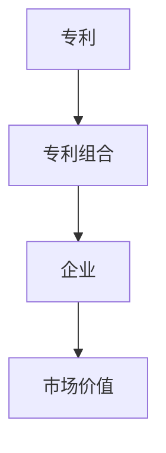
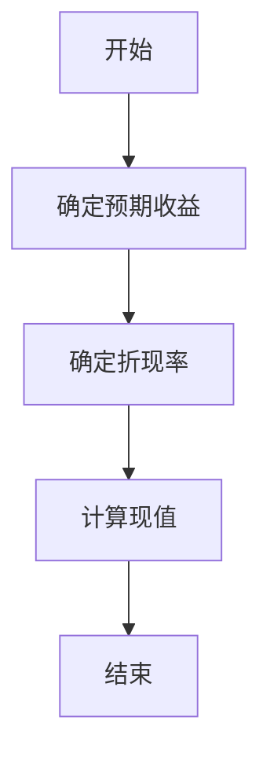
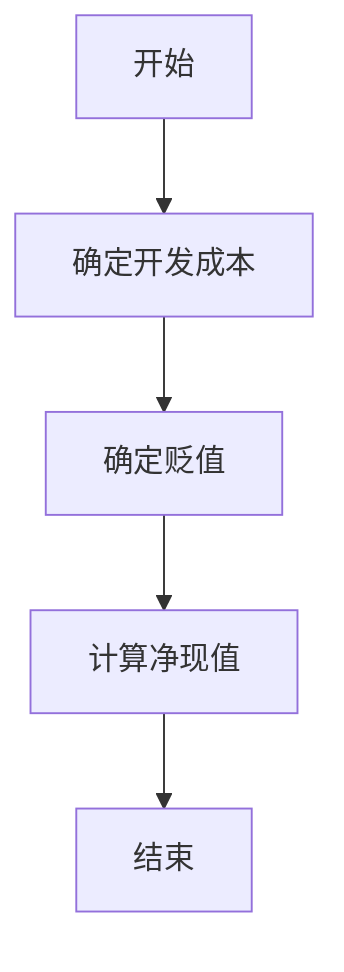
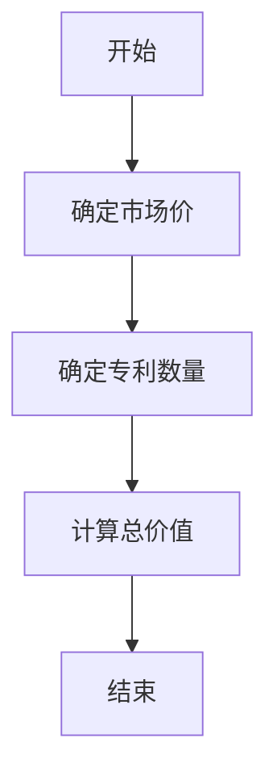
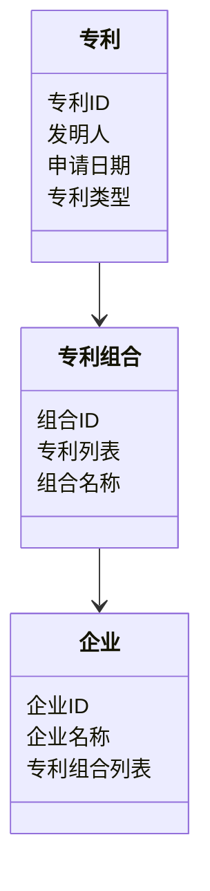
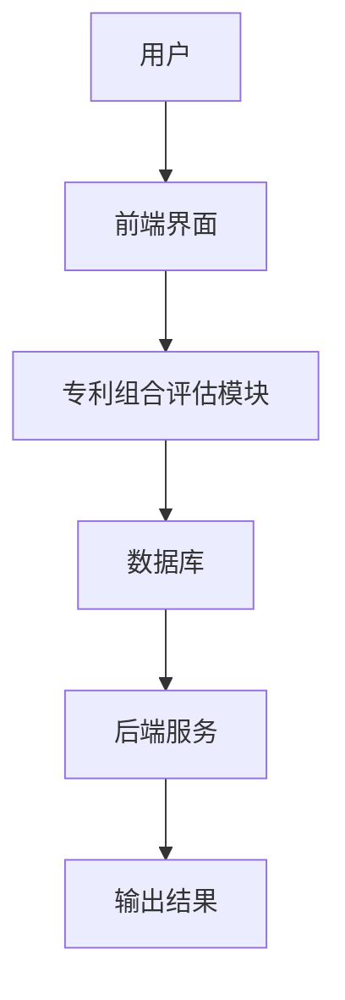
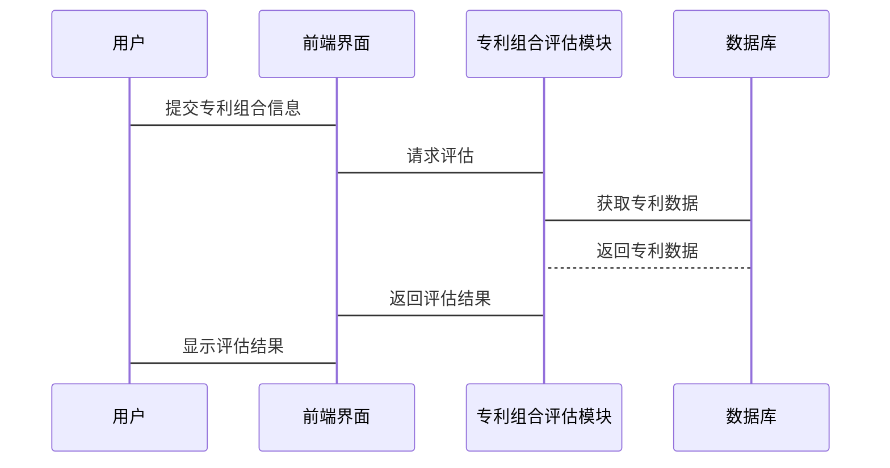

                 


# 企业估值中的专利组合价值评估

> 关键词：企业估值、专利组合、价值评估、收益法、成本法、市场法

> 摘要：本文系统地探讨了企业在专利组合价值评估中的核心问题，从理论基础到实际应用，详细分析了专利组合的价值评估方法。通过构建数学模型、算法原理和系统架构，本文深入揭示了专利组合如何影响企业估值，并通过实际案例分析展示了评估过程和结果。文章最后总结了专利组合价值评估的关键要点，并展望了未来的研究方向。

---

# 第1章: 专利与企业估值的概述

## 1.1 专利的基本概念与特点

### 1.1.1 专利的定义与分类
专利是一种法律保护的知识产权，通常授予发明人对其发明的独占使用权。专利可以分为发明专利、实用新型专利和外观设计专利三种类型。发明专利是技术方案的保护，实用新型专利是针对产品的形状、构造或其结合的新方案，外观设计专利是针对产品的装饰性设计。

### 1.1.2 专利的法律保护与经济价值
专利的法律保护赋予发明人在一定期限内独占其发明的市场使用权。这种独占性使其具有较高的经济价值，尤其是在技术密集型行业，专利可以成为企业核心竞争力的象征。

### 1.1.3 专利在企业中的作用与意义
专利不仅是技术保护的工具，更是企业的一项重要资产。它可以通过技术授权、侵权诉讼等方式为企业创造经济价值，同时也能提升企业的市场地位和品牌形象。

## 1.2 专利组合的概念与形成

### 1.2.1 专利组合的定义
专利组合是指一组相互关联的专利，通常围绕同一技术领域或产品线形成，旨在通过协同效应最大化专利的价值。

### 1.2.2 专利组合的形成过程
专利组合的形成通常需要对企业拥有的专利进行分类、整合和优化，确保专利之间能够互补，覆盖更广泛的市场和技术领域。

### 1.2.3 专利组合与单一专利的对比
与单一专利相比，专利组合具有更强的协同效应和防御能力，能够更有效地保护企业的技术优势。

## 1.3 专利组合在企业估值中的重要性

### 1.3.1 专利组合对企业核心竞争力的影响
专利组合可以增强企业的技术壁垒，降低竞争对手的进入门槛，从而提升企业的市场地位。

### 1.3.2 专利组合对市场价值的贡献
专利组合的价值通常高于单一专利的总和，因为它们可以通过协同效应创造更大的市场价值。

### 1.3.3 专利组合在企业并购中的作用
在企业并购中，专利组合是评估企业价值的重要组成部分，通常会直接影响并购价格。

## 1.4 本章小结
本章介绍了专利的基本概念、专利组合的形成及其在企业估值中的重要性，为后续的理论分析和实践应用奠定了基础。

---

# 第2章: 专利组合价值评估的理论基础

## 2.1 专利组合价值评估的基本原理

### 2.1.1 专利的经济价值来源
专利的经济价值来源于其市场应用和商业化潜力。一项专利的价值取决于其技术先进性、市场前景以及法律保护的力度。

### 2.1.2 专利组合的价值叠加与协同效应
专利组合的价值不仅来源于单个专利的价值，还来源于专利之间的协同效应。例如，一项专利可以作为另一项专利的技术基础，从而增强整体专利组合的价值。

### 2.1.3 专利组合的市场风险与收益平衡
专利组合的价值评估需要考虑市场风险，例如专利被侵权的风险、技术过时的风险等。通过合理配置专利组合，可以实现风险与收益的平衡。

## 2.2 专利组合价值评估的理论框架

### 2.2.1 专利价值评估的主要方法
专利价值评估的主要方法包括收益法、成本法和市场法。收益法基于专利的未来收益进行评估，成本法基于专利的开发成本进行评估，市场法基于市场交易数据进行评估。

### 2.2.2 专利组合价值评估的特殊性
专利组合的价值评估需要考虑专利之间的协同效应和互补性，这使得专利组合的价值评估比单一专利更为复杂。

### 2.2.3 理论框架的构建与应用
通过构建专利组合价值评估的理论框架，可以为实际应用提供指导。例如，可以通过构建专利组合的收益模型来评估其市场价值。

## 2.3 核心概念与联系

### 2.3.1 专利组合的ER实体关系图


## 2.4 本章小结
本章从理论角度分析了专利组合价值评估的基本原理和理论框架，为后续的算法设计和实践应用提供了理论支持。

---

# 第3章: 专利组合价值评估的核心算法与数学模型

## 3.1 专利组合价值评估的算法原理

### 3.1.1 收益法的数学模型
收益法是基于专利组合的未来收益进行评估的方法。其数学模型如下：
$$ V = \sum_{i=1}^{n} \frac{C_i}{(1 + r)^i} $$
其中，\( V \) 表示专利组合的总价值，\( C_i \) 表示第 \( i \) 年的预期收益，\( r \) 表示折现率。

### 3.1.2 成本法的数学模型
成本法是基于专利组合的开发成本进行评估的方法。其数学模型如下：
$$ V = \sum_{i=1}^{n} (C_i - D_i) $$
其中，\( C_i \) 表示第 \( i \) 项专利的开发成本，\( D_i \) 表示第 \( i \) 项专利的贬值。

### 3.1.3 市场法的数学模型
市场法是基于市场交易数据进行评估的方法。其数学模型如下：
$$ V = \sum_{i=1}^{n} (P_i \times Q_i) $$
其中，\( P_i \) 表示第 \( i \) 项专利的市场价，\( Q_i \) 表示专利数量。

## 3.2 算法原理的流程图

### 3.2.1 收益法的流程图


### 3.2.2 成本法的流程图


### 3.2.3 市场法的流程图


## 3.3 本章小结
本章详细介绍了专利组合价值评估的三种主要方法及其数学模型，并通过流程图展示了每种方法的具体步骤。

---

# 第4章: 专利组合价值评估的系统分析与架构设计

## 4.1 问题场景介绍
在企业估值中，专利组合价值评估是一个复杂的过程，需要综合考虑技术、法律和市场等多个因素。

## 4.2 系统功能设计

### 4.2.1 领域模型


### 4.2.2 系统架构设计


### 4.2.3 系统接口设计
系统接口设计需要考虑数据输入、处理和输出的流程。例如，用户输入专利组合信息，系统通过算法计算出专利组合的价值，并将结果返回给用户。

### 4.2.4 系统交互序列图


## 4.3 本章小结
本章从系统设计的角度分析了专利组合价值评估的实现过程，为后续的项目实施提供了指导。

---

# 第5章: 专利组合价值评估的项目实战

## 5.1 项目背景介绍
假设我们是一家科技公司，拥有一系列与人工智能相关的专利。我们需要评估这些专利的组合价值，以便进行企业估值。

## 5.2 项目目标
通过专利组合价值评估，确定公司专利组合的市场价值，为企业的估值提供依据。

## 5.3 项目实施步骤

### 5.3.1 数据收集
收集公司所有与人工智能相关的专利信息，包括专利类型、申请日期、发明人等。

### 5.3.2 数据处理
对收集到的专利数据进行清洗和整理，确保数据的准确性和完整性。

### 5.3.3 模型选择
根据实际情况选择合适的评估方法，例如收益法。

### 5.3.4 模型实现
使用Python编写代码，实现收益法的评估模型。

### 5.3.5 结果分析
分析评估结果，确定专利组合的市场价值。

## 5.4 项目核心代码实现

### 5.4.1 收益法的Python代码
```python
def calculate_value(years, revenues, costs, discount_rate):
    value = 0
    for i in range(years):
        net_cash_flow = revenues[i] - costs[i]
        present_value = net_cash_flow / (1 + discount_rate) ** (i + 1)
        value += present_value
    return value

# 示例数据
years = 5
revenues = [100, 200, 300, 400, 500]
costs = [50, 50, 50, 50, 50]
discount_rate = 0.1

value = calculate_value(years, revenues, costs, discount_rate)
print(f"专利组合的总价值为：{value}")
```

### 5.4.2 成本法的Python代码
```python
def calculate_cost_value(costs, deprecations):
    total_cost = sum(costs)
    total_depreciation = sum(deprecations)
    net_value = total_cost - total_depreciation
    return net_value

# 示例数据
costs = [100, 200, 300]
deprecations = [50, 50, 50]

value = calculate_cost_value(costs, deprecations)
print(f"专利组合的净现值为：{value}")
```

## 5.5 项目结果分析
通过实际案例分析，我们可以看到专利组合价值评估的实际应用价值。例如，在上述收益法的示例中，专利组合的总价值为计算得出的值。

## 5.6 本章小结
本章通过一个实际案例展示了专利组合价值评估的实施过程，包括数据收集、模型选择、代码实现和结果分析。

---

# 第6章: 结论与展望

## 6.1 本章总结
本文系统地探讨了企业估值中的专利组合价值评估问题，从理论到实践，详细分析了专利组合的价值评估方法，并通过实际案例展示了评估过程和结果。

## 6.2 未来研究方向
未来的研究可以进一步探索专利组合的动态价值评估方法，以及如何将人工智能技术应用于专利组合的价值评估中。

## 6.3 本章小结
专利组合价值评估是企业估值中的重要组成部分，未来需要进一步研究和实践。

---

# 作者：AI天才研究院/AI Genius Institute & 禅与计算机程序设计艺术 /Zen And The Art of Computer Programming

