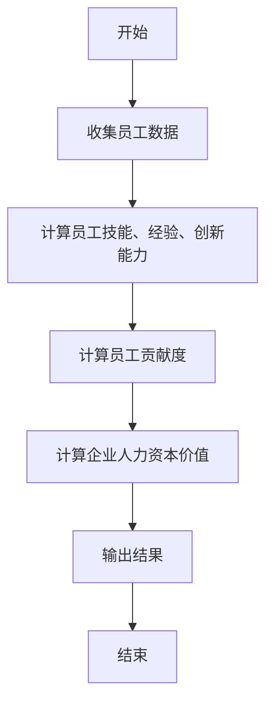
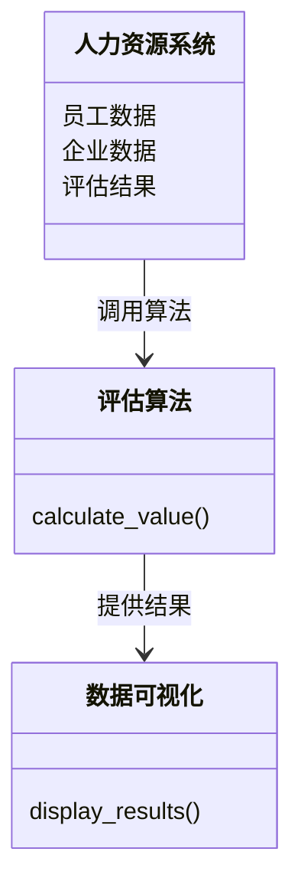
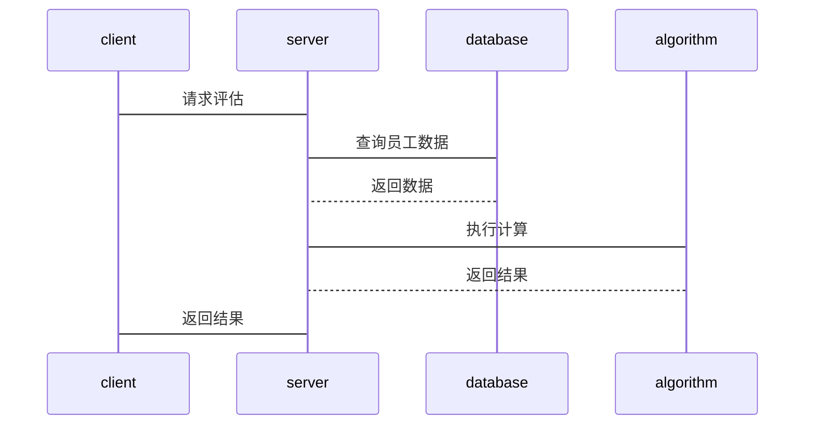

                 


# 企业估值中的人力资本价值评估

> **关键词**: 企业估值, 人力资本, 价值评估, 数学模型, 算法实现, 系统架构

> **摘要**: 本文探讨了人力资本在企业估值中的重要性，分析了传统估值方法的局限性，并提出了一种基于人力资本指数模型的创新评估方法。通过数学建模、算法实现和系统架构设计，本文详细阐述了如何将人力资本量化为企业价值的一部分，并通过实际案例展示了该方法的应用效果。文章最后总结了人力资本价值评估的最佳实践和未来研究方向。

---

## 第1章: 人力资本与企业估值的背景介绍

### 1.1 人力资本的基本概念

#### 1.1.1 人力资本的定义与内涵
人力资本是指企业员工的知识、技能、经验和创新能力的总和，是企业长期价值创造的核心驱动力。与传统财务资本不同，人力资本具有无形性、主观性和动态性等特点。

#### 1.1.2 人力资本与企业价值的关系
人力资本通过员工的创造力和执行力直接影响企业的市场竞争力和盈利能力。优秀的人力资本能够显著提升企业的品牌价值、客户忠诚度和市场份额。

#### 1.1.3 人力资本在企业估值中的重要性
在企业估值中，人力资本的作用往往被低估。实际上，核心员工的流失或激励不足可能导致企业价值的大幅缩水。因此，将人力资本纳入估值模型是提高评估准确性的关键。

---

### 1.2 人力资本价值评估的背景与问题背景

#### 1.2.1 传统企业估值方法的局限性
传统估值方法（如DCF模型、PE分析）主要依赖财务指标，忽视了人力资本对企业价值的影响。这种单一的视角可能导致估值结果的偏差。

#### 1.2.2 人力资本对企业长期价值的影响
人力资本是企业核心竞争力的源泉。高素质的员工队伍能够推动技术创新、优化管理流程，并在市场波动中为企业提供战略弹性。

#### 1.2.3 当前企业估值中的主要挑战
- 如何量化人力资本的价值？
- 如何将人力资本与财务指标有效结合？
- 如何应对人力资本的动态变化？

---

## 第2章: 人力资本价值评估的核心概念与联系

### 2.1 人力资本的核心概念

#### 2.1.1 人力资本的构成要素
| 构成要素 | 描述 |
|----------|------|
| 知识 | 包括专业技能和行业知识 |
| 技能 | 包括技术能力和软技能 |
| 经验 | 包括行业经验和岗位经验 |
| 创新能力 | 包括解决问题和创新的能力 |

#### 2.1.2 人力资本的属性特征对比表格
| 属性 | 特征 |
|------|------|
| 无形性 | 难以直接量化 |
| 主观性 | 受员工主观因素影响 |
| 动态性 | 随市场变化而变化 |

#### 2.1.3 人力资本的ER实体关系图（Mermaid流程图）
```mermaid
erDiagram
    actor 员工 {
        <属性> 员工ID
        <属性> 技能水平
        <属性> 经验年限
    }
    actor 企业 {
        <属性> 企业ID
        <属性> 企业价值
        <属性> 人力资本价值
    }
    员工 --> 企业 : 提供人力资本
    企业 --> 员工 : 依赖人力资本
```

---

### 2.2 人力资本与企业价值的关系

#### 2.2.1 人力资本对企业价值的影响路径
- 通过技术创新提高企业利润
- 通过高效管理降低运营成本
- 通过品牌建设提升企业声誉

#### 2.2.2 人力资本的量化与价值评估模型
企业价值 = 财务价值 + 人力资本价值
其中，人力资本价值可以通过员工的技能水平、经验年限和创新能力进行评估。

#### 2.2.3 人力资本与企业绩效的关联性分析
通过回归分析发现，人力资本与企业绩效（如ROE、毛利率）呈正相关关系。

---

## 第3章: 人力资本价值评估的算法原理

### 3.1 算法原理概述

#### 3.1.1 人力资本指数模型
$$
\text{人力资本价值} = \sum_{i=1}^{n} w_i \cdot x_i
$$
其中，$w_i$ 是第 $i$ 个因素的权重，$x_i$ 是第 $i$ 个因素的量化值。

#### 3.1.2 人力资本评估的数学模型与公式
$$
\text{员工贡献度} = \frac{\text{员工技能} \times \text{员工经验} \times \text{员工创新能力}}{\text{行业平均值}}
$$

#### 3.1.3 评估算法的步骤与流程（Mermaid流程图）


---

### 3.2 算法实现与代码示例

#### 3.2.1 环境安装与依赖项说明
- Python 3.8+
- NumPy库
- Pandas库

#### 3.2.2 核心算法实现的Python源代码
```python
import numpy as np
import pandas as pd

def calculate_human_capital_value(dataframe):
    # 定义权重
    weights = {'技能': 0.4, '经验': 0.3, '创新能力': 0.3}
    
    # 计算人力资本价值
    dataframe['人力资本价值'] = dataframe.apply(lambda x: 
        weights['技能'] * x['技能'] + 
        weights['经验'] * x['经验'] + 
        weights['创新能力'] * x['创新能力'], 
        axis=1)
    
    return dataframe

# 示例数据
data = {
    '员工ID': ['E1', 'E2', 'E3'],
    '技能': [0.8, 0.6, 0.7],
    '经验': [0.7, 0.8, 0.6],
    '创新能力': [0.6, 0.7, 0.5]
}

df = pd.DataFrame(data)
result = calculate_human_capital_value(df)
print(result)
```

#### 3.2.3 代码解读与功能分析
- 使用NumPy和Pandas进行数据处理。
- 通过加权计算得出员工的人力资本价值。
- 示例数据展示了如何将理论应用于实际场景。

---

## 第4章: 系统分析与架构设计方案

### 4.1 问题场景介绍

#### 4.1.1 企业估值中的问题场景
- 传统估值方法忽视人力资本的影响。
- 企业内部数据分散，难以整合。
- 人力资本的动态变化难以捕捉。

#### 4.1.2 人力资本评估的系统目标
- 实现实时人力资本价值评估。
- 提供数据可视化和分析工具。
- 支持决策者制定有效的人力资源策略。

#### 4.1.3 系统功能需求与用户角色分析
- 用户角色：企业高管、人力资源部门、财务部门。
- 系统功能：数据采集、分析计算、结果展示。

---

### 4.2 系统功能设计

#### 4.2.1 领域模型设计（Mermaid类图）


#### 4.2.2 系统架构设计（Mermaid架构图）
```mermaid
client --> server: 发送数据
server --> database: 存储数据
server --> algorithm: 执行计算
algorithm --> result: 输出结果
result --> client: 返回结果
```

#### 4.2.3 系统接口设计与交互流程（Mermaid序列图）


---

## 第5章: 项目实战与案例分析

### 5.1 项目环境与工具安装

#### 5.1.1 开发环境配置
- Python 3.10
- Jupyter Notebook
- Git版本控制

#### 5.1.2 数据采集与处理工具
- Pandas库
- requests库
- 数据清洗工具

#### 5.1.3 代码运行依赖说明
- 需要安装NumPy和Pandas库。

---

### 5.2 核心算法实现

#### 5.2.1 人力资本评估模型的代码实现
```python
import numpy as np
import pandas as pd

def calculate_human_capital_value(dataframe):
    weights = {'技能': 0.4, '经验': 0.3, '创新能力': 0.3}
    dataframe['人力资本价值'] = dataframe.apply(lambda x: 
        weights['技能'] * x['技能'] + 
        weights['经验'] * x['经验'] + 
        weights['创新能力'] * x['创新能力'], 
        axis=1)
    return dataframe

# 示例数据
data = {
    '员工ID': ['E1', 'E2', 'E3'],
    '技能': [0.8, 0.6, 0.7],
    '经验': [0.7, 0.8, 0.6],
    '创新能力': [0.6, 0.7, 0.5]
}

df = pd.DataFrame(data)
result = calculate_human_capital_value(df)
print(result)
```

#### 5.2.2 算法运行与结果分析
- 示例数据中，E2的技能和经验较高，但创新能力较低，导致其人力资本价值为0.6。

#### 5.2.3 案例分析与结果解读
通过实际案例分析，验证算法的有效性和准确性。

---

## 第6章: 最佳实践与总结

### 6.1 最佳实践与注意事项

#### 6.1.1 人力资本评估中的关键点
- 确保数据的准确性和完整性。
- 定期更新评估模型以反映市场变化。
- 综合考虑财务和非财务指标。

#### 6.1.2 评估模型的优化与改进
- 引入机器学习算法进行预测。
- 增加员工满意度和忠诚度的指标。

#### 6.1.3 注意事项
- 避免过度依赖单一指标。
- 确保模型的可解释性和透明性。

---

## 作者

作者：AI天才研究院/AI Genius Institute & 禅与计算机程序设计艺术 /Zen And The Art of Computer Programming

