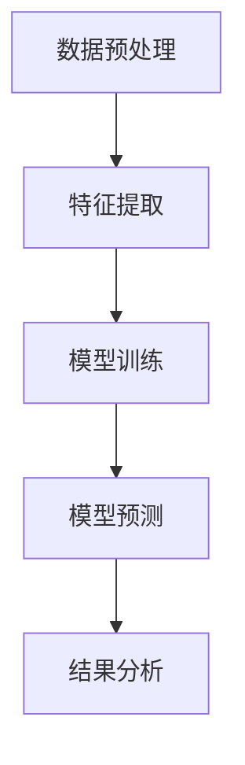
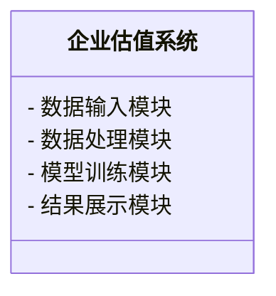
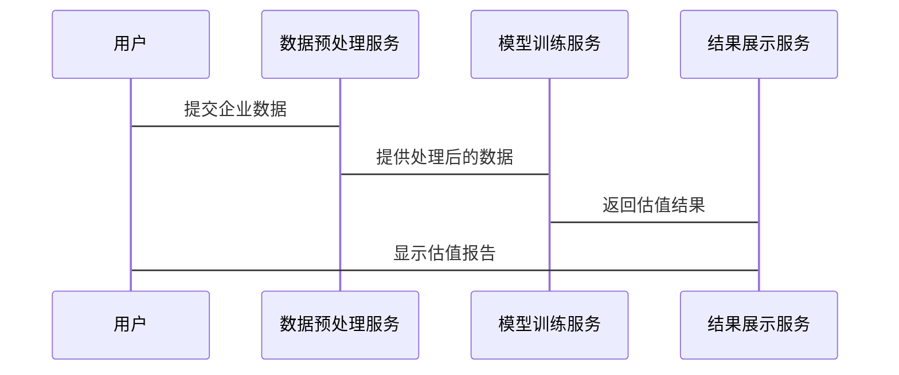

                 


# 文章标题：企业估值中的人工智能应用价值评估

---

## 关键词：
- 企业估值
- 人工智能
- 机器学习
- 数据分析
- 投资决策

---

## 摘要：
企业估值是投资决策中的核心环节，传统估值方法依赖于经验与主观判断，存在效率低、误差大的问题。随着人工智能技术的快速发展，AI在企业估值中的应用价值日益凸显。本文从企业估值的核心概念出发，深入分析人工智能算法原理与数学模型，探讨AI在企业估值中的应用场景与优势，并通过实际案例展示如何利用AI技术提升企业估值的效率与准确性。文章还对系统架构设计、项目实战与最佳实践进行了详细阐述，为读者提供全面的技术指导与实践参考。

---

## 正文

### 第一部分：企业估值与人工智能概述

#### 第1章：企业估值的背景与问题背景

##### 1.1 企业估值的核心概念
企业估值是通过对企业的财务状况、市场地位、发展潜力等多维度因素的综合分析，评估企业价值的过程。传统估值方法包括DCF模型、可比公司分析等，但这些方法依赖于大量人工计算与经验判断，存在主观性强、效率低下的问题。

##### 1.2 人工智能在企业估值中的应用价值
人工智能通过大数据分析与机器学习算法，能够快速处理海量数据，发现传统方法难以捕捉的隐性关联，从而提高估值的准确性和效率。AI在企业估值中的应用场景包括财务预测、市场趋势分析、风险评估等。

##### 1.3 问题背景与问题描述
企业在不同生命周期阶段的估值需求不同，传统方法难以灵活应对复杂场景。此外，市场波动、信息不对称等因素增加了估值的难度。人工智能的应用能够有效解决这些问题，但其技术实现与实际应用仍面临诸多挑战。

---

#### 第2章：企业估值与人工智能的核心概念

##### 2.1 企业估值的核心要素
- **财务指标**：收入、利润、现金流等。
- **市场分析**：行业趋势、竞争格局等。
- **管理团队**：战略规划与执行力。

##### 2.2 人工智能在企业估值中的应用原理
- **数据驱动模型**：利用历史数据训练机器学习模型，预测企业价值。
- **自然语言处理**：分析企业年报、新闻等非结构化数据，提取关键信息。

##### 2.3 核心概念对比分析
| 对比维度       | 传统估值方法             | 人工智能估值方法           |
|----------------|--------------------------|---------------------------|
| 数据依赖       | 主要依赖财务数据         | 财务数据 + 非结构化数据    |
| 计算效率       | 人工计算，效率低          | 自动化计算，效率高         |
| 结果准确性       | 受主观判断影响较大        | 数据驱动，结果更客观        |

---

### 第二部分：人工智能算法原理与数学模型

#### 第3章：人工智能算法原理

##### 3.1 机器学习算法在企业估值中的应用
- **线性回归**：用于预测企业收入、利润等线性关系较强的指标。
- **随机森林**：通过多棵树的集成模型，提高预测的准确性和鲁棒性。

##### 3.2 算法流程图


##### 3.3 代码实现
```python
import pandas as pd
from sklearn.linear_model import LinearRegression
from sklearn.ensemble import RandomForestRegressor

# 数据加载与预处理
data = pd.read_csv('enterprise_data.csv')
X = data[['revenue', 'profit', 'market_share']]
y = data['enterprise_value']

# 模型训练
model_lr = LinearRegression()
model_lr.fit(X, y)

model_rf = RandomForestRegressor(n_estimators=100)
model_rf.fit(X, y)

# 模型预测
predictions_lr = model_lr.predict(X)
predictions_rf = model_rf.predict(X)
```

#### 第4章：数学模型与公式

##### 4.1 线性回归模型
$$ y = \beta_0 + \beta_1x + \epsilon $$

##### 4.2 机器学习模型
- 损失函数：$$ L = \frac{1}{2m} \sum_{i=1}^{m} (y_i - \hat{y_i})^2 $$
- 优化算法：$$ \theta := \theta - \alpha \frac{\partial L}{\partial \theta} $$

---

### 第三部分：系统分析与架构设计方案

#### 第5章：系统功能设计

##### 5.1 领域模型（Mermaid 类图）


##### 5.2 系统架构设计（Mermaid 架构图）
```mermaid
container 企业估值系统 {
    service 数据预处理服务
    service 模型训练服务
    service 结果展示服务
}
```

##### 5.3 系统交互（Mermaid 序列图）


---

### 第四部分：项目实战

#### 第6章：项目实战

##### 6.1 环境安装与数据准备
```bash
pip install pandas scikit-learn
```

##### 6.2 系统核心实现（Python 代码）
```python
import pandas as pd
from sklearn.model_selection import train_test_split
from sklearn.metrics import mean_squared_error

# 数据加载
data = pd.read_csv('enterprise_data.csv')

# 数据分割
X_train, X_test, y_train, y_test = train_test_split(X, y, test_size=0.2)

# 模型训练与评估
model = RandomForestRegressor(n_estimators=100)
model.fit(X_train, y_train)

# 模型评估
y_pred = model.predict(X_test)
print(mean_squared_error(y_test, y_pred))
```

##### 6.3 案例分析与解读
以某科技公司为例，利用随机森林模型进行估值，预测其企业价值并对比实际值，分析模型的准确性和适用性。

---

### 第五部分：总结与展望

#### 第7章：总结与展望

##### 7.1 核心成果
- 成功构建了基于人工智能的企业估值系统。
- 提高了估值的效率与准确性。

##### 7.2 未来展望
- 探索更复杂的机器学习模型，如深度学习。
- 结合实时数据，提升估值的动态性与及时性。

---

## 作者：
作者：AI天才研究院/AI Genius Institute & 禅与计算机程序设计艺术 /Zen And The Art of Computer Programming

