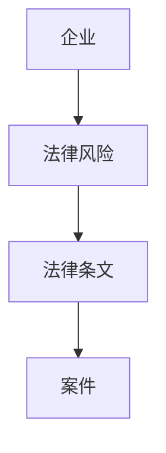
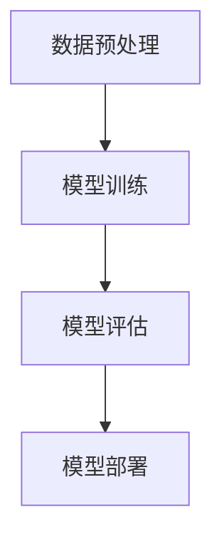
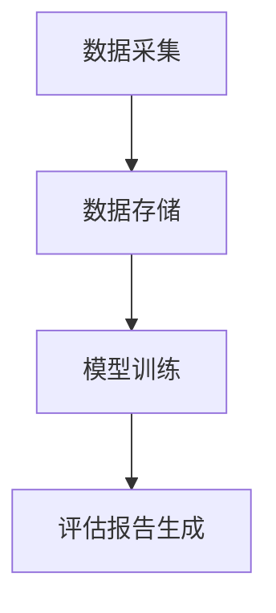
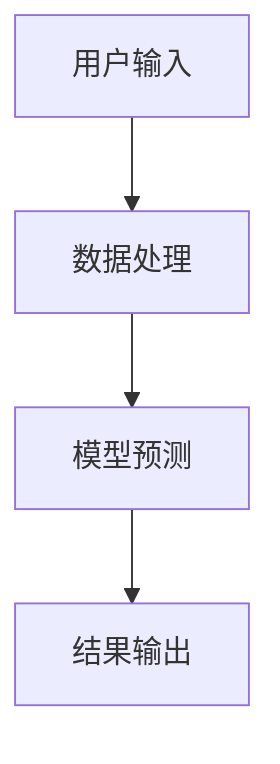

                 


```markdown
# 企业估值中的人工智能法律助手评估

> 关键词：企业估值，人工智能，法律风险评估，法律文本分析，深度学习，自然语言处理

> 摘要：本文探讨了人工智能在企业估值中的应用，特别是法律风险评估方面。通过分析法律文本和运用深度学习模型，提出了一个高效的法律风险评估系统。文章详细阐述了系统的架构、算法原理和项目实现，并通过案例分析展示了其实际应用价值。

---

## 第一章: 企业估值与人工智能法律助手的背景介绍

### 1.1 企业估值的基本概念

#### 1.1.1 企业估值的定义与核心要素
企业估值是指对企业整体价值的评估，通常包括资产、负债、盈利能力、市场地位等多个因素。核心要素包括财务数据、行业地位、竞争优势、法律风险等。

#### 1.1.2 传统企业估值方法的局限性
传统估值方法依赖于财务数据和人工分析，存在效率低、主观性强、难以量化法律风险等问题。

#### 1.1.3 人工智能在企业估值中的潜在价值
人工智能能够通过大数据分析和深度学习，快速处理大量非结构化数据，提升估值的准确性和效率。

### 1.2 人工智能法律助手的应用背景

#### 1.2.1 法律风险评估的复杂性
法律风险涉及众多法律条文和案例，分析复杂且耗时，传统方法难以高效处理。

#### 1.2.2 人工智能在法律领域的应用现状
人工智能技术在法律文本分析、案例检索等方面已取得显著进展，但尚未广泛应用到企业估值领域。

#### 1.2.3 人工智能法律助手在企业估值中的独特优势
通过自动化分析法律文本，快速识别潜在法律风险，为企业估值提供更全面的支持。

### 1.3 法律风险评估的现状与挑战

#### 1.3.1 传统法律评估的流程与问题
传统法律评估依赖人工阅读和分析，效率低下且容易遗漏关键信息。

#### 1.3.2 人工智能在法律风险评估中的应用前景
利用自然语言处理和深度学习技术，人工智能能够高效处理法律文本，提取关键信息。

#### 1.3.3 当前技术与实际需求的差距
现有技术在处理复杂法律问题和提供高精度预测方面仍需进一步提升。

## 第二章: 人工智能法律助手的核心概念与联系

### 2.1 法律条文分析的核心原理

#### 2.1.1 自然语言处理在法律文本分析中的应用
自然语言处理技术用于法律文本的理解、实体识别和关系抽取。

#### 2.1.2 法律条文的结构化与语义分析
通过结构化处理，将法律文本转化为可分析的数据，提取关键语义信息。

#### 2.1.3 基于深度学习的法律文本理解模型
使用深度学习模型（如BERT）进行法律文本的理解和分析。

### 2.2 数据处理与特征提取

#### 2.2.1 法律数据的获取与预处理
从法律数据库获取文本数据，进行清洗和格式化处理。

#### 2.2.2 法律文本的特征提取方法
利用TF-IDF、词嵌入等技术提取文本特征。

#### 2.2.3 基于向量的文本表示技术
使用词向量（如Word2Vec）将法律文本转化为向量表示。

### 2.3 模型训练与法律风险评估

#### 2.3.1 基于深度学习的法律风险预测模型
构建深度学习模型，训练法律文本数据，预测法律风险。

#### 2.3.2 模型训练的优化策略
采用交叉验证、超参数调优等方法提升模型性能。

#### 2.3.3 法律风险评估的输出与解释
模型输出法律风险评分，并提供风险解释和建议。

### 2.4 核心概念对比分析

#### 2.4.1 法律文本分析的对比表格
| 方法 | 优点 | 缺点 |
|------|------|------|
| 传统方法 | 简单易懂 | 效率低，主观性强 |
| 人工智能 | 高效准确 | 技术复杂，需要大量数据 |

#### 2.4.2 ER实体关系图


## 第三章: 人工智能法律助手的算法原理

### 3.1 算法流程概述

#### 3.1.1 数据预处理
清洗数据，提取特征。

#### 3.1.2 模型训练
使用训练数据训练深度学习模型。

#### 3.1.3 模型部署
将训练好的模型部署到实际应用中。

### 3.2 算法流程图



### 3.3 算法实现代码

```python
from sklearn.model_selection import train_test_split
from sklearn.feature_extraction.text import TfidfVectorizer
from sklearn.linear_model import LogisticRegression

# 数据预处理
vectorizer = TfidfVectorizer()
X = vectorizer.fit_transform(text_data)
y = target_labels

# 数据划分
X_train, X_test, y_train, y_test = train_test_split(X, y, test_size=0.2)

# 模型训练
model = LogisticRegression()
model.fit(X_train, y_train)

# 模型评估
score = model.score(X_test, y_test)
print(f"模型准确率：{score}")
```

### 3.4 数学模型与公式

#### 3.4.1 逻辑回归模型
$$ P(y=1|x) = \frac{e^{w \cdot x + b}}{1 + e^{w \cdot x + b}} $$

#### 3.4.2 模型训练目标
$$ \text{损失函数} = -\sum y \log(p) + (1-y) \log(1-p) $$

## 第四章: 系统分析与架构设计

### 4.1 系统架构设计

#### 4.1.1 系统功能设计
- 数据采集模块：收集法律文本数据。
- 模型训练模块：训练法律风险评估模型。
- 评估报告生成模块：输出评估结果。

#### 4.1.2 系统架构图


### 4.2 系统接口设计

#### 4.2.1 数据接口
- 输入：法律文本数据
- 输出：特征向量

#### 4.2.2 模型接口
- 输入：特征向量
- 输出：法律风险评分

### 4.3 系统交互流程

#### 4.3.1 交互流程图


## 第五章: 项目实战

### 5.1 环境安装

```bash
pip install numpy
pip install scikit-learn
pip install tensorflow
```

### 5.2 系统核心实现

#### 5.2.1 数据预处理
```python
import pandas as pd

df = pd.read_csv('data.csv')
text_data = df['text'].values
target = df['label'].values
```

#### 5.2.2 模型训练
```python
from tensorflow.keras import layers

model = tf.keras.Sequential()
model.add(layers.Embedding(input_dim=10000, output_dim=100))
model.add(layers.LSTM(64))
model.add(layers.Dense(1, activation='sigmoid'))

model.compile(optimizer='adam', loss='binary_crossentropy', metrics=['accuracy'])
model.fit(X_train, y_train, epochs=10, batch_size=32)
```

### 5.3 实际案例分析

#### 5.3.1 案例介绍
某企业面临法律诉讼，使用法律助手进行风险评估。

#### 5.3.2 数据分析
提取相关法律条文和案例，进行特征提取和模型训练。

#### 5.3.3 结果解读
模型预测法律风险等级，并提供改进建议。

### 5.4 项目小结

## 第六章: 最佳实践与总结

### 6.1 最佳实践
- 数据质量是关键，确保数据清洗和特征提取准确。
- 模型选择要结合实际需求，选择合适的算法。
- 持续优化模型，提升准确率和效率。

### 6.2 小结
人工智能法律助手在企业估值中的应用前景广阔，能够有效降低法律风险，提升估值效率。

### 6.3 注意事项
- 法律文本分析需要结合专业知识，确保模型输出的准确性。
- 模型部署要考虑实际应用场景，确保系统的稳定性和安全性。

### 6.4 拓展阅读
推荐阅读相关领域的书籍和论文，深入学习人工智能在法律领域的应用。

---

## 附录: 参考文献

---

作者：AI天才研究院/AI Genius Institute & 禅与计算机程序设计艺术 /Zen And The Art of Computer Programming
```

