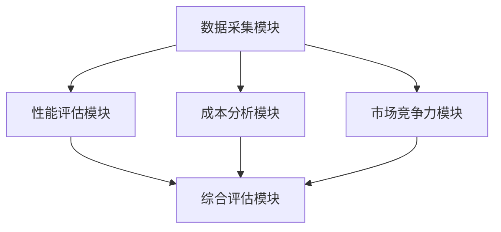

                 


# 企业估值中的人工智能芯片设计评估

## 关键词
企业估值、人工智能芯片、设计评估、技术分析、经济模型

## 摘要
在企业估值过程中，人工智能芯片的设计评估起着至关重要的作用。随着AI技术的快速发展，芯片设计的优劣直接影响企业的市场竞争力和长期发展潜力。本文从AI芯片设计的核心要素出发，结合企业估值的关键指标，系统分析了AI芯片设计评估的方法及其对企业价值的影响。通过详细阐述评估框架、算法原理、系统架构和实际案例，本文旨在为企业估值提供科学依据和技术支持。

---

# 正文

## 第一部分: 企业估值中的AI芯片设计评估背景介绍

### 第1章: 问题背景与描述

#### 1.1 问题背景
随着人工智能技术的迅速发展，AI芯片作为支撑AI应用的核心硬件，其设计质量直接影响企业的技术竞争力和市场价值。传统的企业估值方法主要依赖财务指标和市场表现，而忽视了技术创新对企业长期价值的影响。AI芯片的设计复杂性高、技术门槛高，其性能优劣直接关系到企业的技术创新能力和市场地位。

#### 1.2 问题描述
AI芯片设计涉及多个关键因素，如计算能力、能效比、功耗控制等，这些因素直接影响企业的研发成本和市场表现。然而，在企业估值过程中，这些技术指标往往未得到充分考虑，导致估值结果与实际价值存在偏差。因此，如何将AI芯片设计的评估纳入企业估值体系，成为一个亟待解决的问题。

#### 1.3 问题解决方法
通过建立AI芯片设计评估的指标体系，结合企业估值的传统方法，构建一个综合评估框架。该框架应包含技术性能评估、经济成本分析和市场竞争力评价等多个维度。

#### 1.4 边界与外延
本研究聚焦于AI芯片设计对企业估值的影响，不考虑外部市场波动和宏观经济因素。同时，评估框架适用于成长期科技企业，尤其是那些依赖AI技术的企业。

#### 1.5 核心概念与组成
- **技术性能评估**：包括计算能力、能效比、延迟等指标。
- **经济成本分析**：包括研发成本、生产成本和运营成本。
- **市场竞争力评价**：包括市场占有率、技术领先性和客户满意度。

---

## 第二部分: AI芯片设计评估的核心概念与联系

### 第2章: 核心概念原理

#### 2.1 AI芯片设计评估的基本原理
AI芯片设计评估需要从技术性能、经济成本和市场竞争力三个维度进行综合分析。技术性能决定了芯片的计算能力，经济成本影响企业的盈利能力和研发投入，市场竞争力则反映了企业在市场中的地位和客户认可度。

#### 2.2 企业估值中的评估方法
企业估值通常采用DCF模型（现金流贴现法）和可比公司分析法。然而，这些方法未能充分考虑AI芯片设计的特殊性。通过将AI芯片设计评估纳入估值模型，可以更准确地反映企业的技术优势和市场潜力。

---

### 第3章: 核心概念对比分析

#### 3.1 AI芯片设计评估的特征对比
| 评估维度 | 技术性能 | 经济成本 | 市场竞争力 |
|----------|----------|----------|------------|
| 关注点    | 计算能力、能效比 | 研发成本、生产成本 | 市场占有率、客户满意度 |
| 评估指标 | FLOPS、功耗 | R&D成本、单位生产成本 | 市场份额、技术领先性 |

#### 3.2 企业估值方法的特征对比
| 方法类型 | DCF模型 | 可比公司分析 | AI芯片设计评估 |
|----------|----------|--------------|--------------|
| 关注点    | 现金流、折现率 | 市场可比公司 | 技术性能、经济成本 |
| 评估指标 | 自由现金流、贴现率 | 市盈率、市净率 | FLOPS、R&D成本 |

---

## 第三部分: AI芯片设计评估的算法原理

### 第4章: 算法原理

#### 4.1 算法流程
以下是一个简化的AI芯片设计评估算法流程：

1. **数据收集**：收集芯片的技术参数和企业的财务数据。
2. **性能评估**：计算芯片的计算能力、能效比等指标。
3. **成本分析**：评估研发和生产成本。
4. **市场竞争力评价**：分析市场占有率和技术领先性。
5. **综合评估**：将技术、经济和市场指标综合起来，得出评估结果。

#### 4.2 算法实现
以下是一个简单的Python代码示例：

```python
# 示例代码：计算AI芯片的性能指标

def calculate_performance(flops, power_consumption):
    performance_score = (flops / 1000) - (power_consumption / 100)
    return performance_score

# 示例数据
flops = 10000
power_consumption = 10

# 计算性能得分
performance_score = calculate_performance(flops, power_consumption)
print(f"性能得分: {performance_score}")
```

---

## 第四部分: 系统分析与架构设计

### 第5章: 系统分析与架构设计方案

#### 5.1 问题场景介绍
某科技企业计划推出一款新型AI芯片，希望通过评估芯片的设计质量来优化企业估值。

#### 5.2 系统功能设计
- **数据采集模块**：收集芯片的技术参数和企业的财务数据。
- **性能评估模块**：计算芯片的计算能力和能效比。
- **成本分析模块**：评估研发和生产成本。
- **市场竞争力模块**：分析市场占有率和技术领先性。

#### 5.3 系统架构设计
以下是系统架构的Mermaid图：



---

## 第五部分: 项目实战

### 第6章: 项目实战

#### 6.1 环境安装
需要安装以下工具：
- Python 3.8+
- Mermaid图生成工具
- 数据分析库（如Pandas、NumPy）

#### 6.2 核心代码实现
以下是一个AI芯片设计评估的核心代码示例：

```python
import pandas as pd

# 示例数据
data = {
    '芯片型号': ['A1', 'B1', 'C1'],
    'FLOPS': [10000, 15000, 12000],
    '功耗': [10, 15, 12]
}

df = pd.DataFrame(data)

# 计算性能得分
df['性能得分'] = df['FLOPS'] / 1000 - df['功耗'] / 10

print(df)
```

---

## 第六部分: 最佳实践

### 第7章: 最佳实践

#### 7.1 小结
AI芯片设计评估是企业估值的重要组成部分。通过综合考虑技术性能、经济成本和市场竞争力，可以更准确地评估企业的市场价值。

#### 7.2 注意事项
- 数据的准确性和完整性是评估的关键。
- 需要结合企业的实际情况进行调整。
- 定期更新评估模型以反映技术发展和市场变化。

#### 7.3 拓展阅读
- 《人工智能芯片设计与优化》
- 《企业估值模型与方法》

---

# 作者
作者：AI天才研究院 & 禅与计算机程序设计艺术

