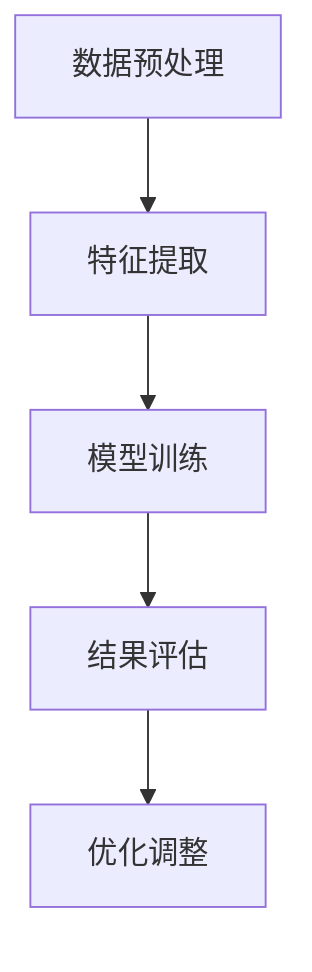
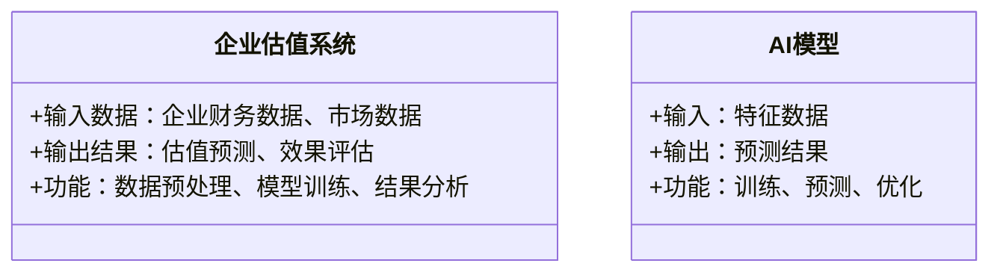

                 


# 企业估值中的人工智能赋能效果评估

## 关键词：
- 企业估值
- 人工智能
- 赋能效果
- AI评估
- 数据分析
- 智能决策

## 摘要：
本文深入探讨了人工智能在企业估值中的应用，重点分析了如何评估AI赋能的效果。通过理论与实践结合，系统介绍了AI赋能企业估值的核心概念、算法原理、系统架构以及实际案例，为企业智能化决策提供参考。

---

# 第一部分: 企业估值与AI赋能概述

## 第1章: 企业估值的基本概念与AI的潜力

### 1.1 企业估值的定义与作用
- 企业估值的定义
- 传统企业估值方法的局限性
- AI技术在企业估值中的潜力

### 1.2 AI赋能企业估值的核心问题
- 什么是AI赋能效果评估
- AI赋能与企业估值的关系
- 问题背景与问题描述

### 1.3 AI赋能效果评估的核心要素
- 数据驱动的特征分析
- 模型的可解释性要求
- 评估的动态性与实时性

## 第2章: AI赋能效果评估的核心概念

### 2.1 AI赋能效果评估的原理
- 数据处理与特征提取
- 模型训练与优化
- 结果分析与反馈

### 2.2 核心概念属性对比表
- 传统估值方法 vs AI赋能方法
- 数据驱动 vs 专家经验驱动
- 单点评估 vs 全局优化

### 2.3 ER实体关系图


---

# 第二部分: AI赋能效果评估的算法原理

## 第3章: 算法原理与流程

### 3.1 算法选择与流程图


### 3.2 算法实现代码
```python
# 示例代码：企业估值预测模型
import pandas as pd
from sklearn.model_selection import train_test_split
from sklearn.ensemble import RandomForestRegressor

# 数据加载与预处理
data = pd.read_csv('enterprise_data.csv')
X = data.drop('valuation', axis=1)
y = data['valuation']

# 数据分割
X_train, X_test, y_train, y_test = train_test_split(X, y, test_size=0.2, random_state=42)

# 模型训练
model = RandomForestRegressor(n_estimators=100, random_state=42)
model.fit(X_train, y_train)

# 模型预测与评估
val = model.predict(X_test)
print('预测结果:', val)
```

### 3.3 数学模型与公式
- 线性回归模型
$$ y = \beta_0 + \beta_1x_1 + \beta_2x_2 + \epsilon $$

---

# 第三部分: 系统分析与架构设计

## 第4章: 系统功能设计

### 4.1 项目场景介绍
- 企业估值的典型场景
- AI赋能的具体需求

### 4.2 系统功能设计


### 4.3 系统架构设计


---

# 第四部分: 项目实战与案例分析

## 第5章: 项目实战

### 5.1 环境安装与配置
- 安装Python与相关库
- 数据集准备

### 5.2 系统核心实现
- 数据预处理代码
- 模型训练代码
- 结果分析代码

### 5.3 案例分析
- 实际案例：某企业估值分析
- 结果解读与优化建议

## 第6章: 最佳实践与总结

### 6.1 最佳实践
- 数据质量的重要性
- 模型可解释性的优化
- 动态调整与实时监控

### 6.2 小结
- 本文总结
- 未来研究方向

---

## 注意事项：
- 数据隐私与安全问题
- 模型的泛化能力
- 实际应用中的边界条件

## 拓展阅读：
- 推荐书籍：《人工智能：一种现代方法》
- 推荐博客：AI在金融领域的应用

---

作者：AI天才研究院 & 禅与计算机程序设计艺术

---

通过以上目录结构，文章将从理论到实践，系统性地讲解企业估值中的人工智能赋能效果评估的核心内容，为企业智能化决策提供深度参考。

