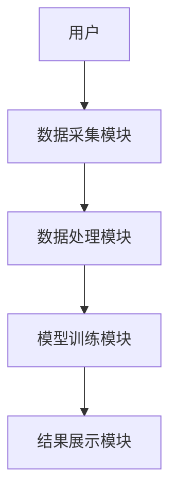
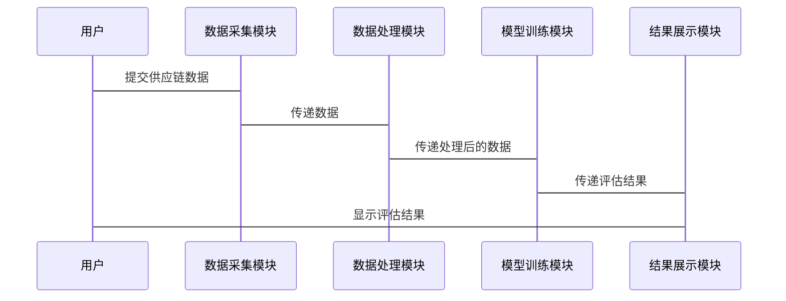

                 


# 企业估值中的供应链弹性价值评估

> 关键词：企业估值，供应链弹性，弹性价值评估，供应链管理，风险管理，企业抗风险能力

> 摘要：供应链弹性价值评估是企业在复杂多变的市场环境中保持竞争力和抗风险能力的关键因素。本文从供应链弹性价值评估的背景、核心概念、算法原理、系统设计、项目实战等方面进行详细探讨，通过理论分析与实际案例相结合的方式，揭示供应链弹性对企业整体估值的影响，并提出优化策略。

---

## 第1章 供应链弹性价值评估的背景与问题

### 1.1 供应链弹性价值评估的背景

供应链是企业运营的核心环节，其稳定性和弹性直接影响企业的运营效率和抗风险能力。在企业估值中，供应链的价值往往被低估，尤其是在全球化和数字化背景下，供应链的复杂性增加，弹性价值的重要性日益凸显。

#### 1.1.1 供应链在企业估值中的重要性

供应链的价值不仅体现在其直接成本上，还体现在其对整个企业运营效率和抗风险能力的贡献。高效的供应链能够降低库存成本，提高交付速度，增强客户满意度，从而间接提升企业估值。

#### 1.1.2 供应链弹性与企业抗风险能力

供应链弹性是指供应链在面对外部冲击（如疫情、自然灾害、地缘政治冲突等）时，能够快速恢复并保持稳定运营的能力。弹性越强，企业抗风险能力越强，供应链弹性价值在企业估值中的权重也越高。

#### 1.1.3 弹性价值评估的定义与目标

弹性价值评估是通过量化供应链在面对外部冲击时的恢复能力和响应能力，评估其对整个企业估值的贡献。其目标是通过优化供应链弹性，提升企业整体估值。

---

### 1.2 供应链弹性价值评估的核心问题

#### 1.2.1 供应链弹性与企业估值的关系

供应链弹性直接影响企业的抗风险能力和运营效率，进而影响企业估值。弹性越强，企业估值越高，尤其是在高风险行业。

#### 1.2.2 供应链弹性价值评估的难点与挑战

供应链弹性价值评估的难点在于如何量化弹性，以及如何将弹性与企业整体估值联系起来。此外，供应链的复杂性也增加了评估的难度。

#### 1.2.3 弹性价值与企业整体价值的关联

弹性价值是企业整体价值的重要组成部分。通过优化供应链弹性，企业可以提升其抗风险能力，从而提升整体估值。

---

### 1.3 供应链弹性价值评估的核心要素

#### 1.3.1 供应链弹性的定义与特征

供应链弹性是指供应链在面对外部冲击时，能够快速恢复并保持稳定运营的能力。其特征包括稳定性、响应性和恢复性。

#### 1.3.2 供应链弹性价值的评估维度

供应链弹性价值评估的维度包括供应链的稳定性、响应能力、恢复能力、冗余能力、透明度和成本效率。

#### 1.3.3 弹性价值与企业整体估值的关系

弹性价值是企业整体估值的重要组成部分。通过优化供应链弹性，企业可以提升其抗风险能力，从而提升整体估值。

---

## 第2章 供应链弹性价值评估的核心概念与联系

### 2.1 供应链弹性的定义与特征

供应链弹性是指供应链在面对外部冲击时，能够快速恢复并保持稳定运营的能力。其特征包括稳定性、响应性和恢复性。

### 2.2 企业估值的核心要素

企业估值的核心要素包括财务状况、运营效率、抗风险能力、市场竞争力和管理能力。

### 2.3 供应链弹性与企业估值的关系模型

供应链弹性与企业估值的关系模型是一个复杂的系统，需要考虑多个因素，包括供应链的稳定性、响应能力、恢复能力、冗余能力、透明度和成本效率。

### 2.4 核心概念的对比分析

供应链弹性与供应链效率的对比：

| 特性      | 弹性价值评估 | 供应链效率 |
|-----------|--------------|------------|
| 目标      | 提高抗风险能力 | 提高运营效率 |
| 关注点    | 稳定性和恢复能力 | 速度和成本 |
| 优化方法  | 增强冗余能力 | 提高流程效率 |

---

## 第3章 供应链弹性价值评估的算法原理

### 3.1 弹性价值评估模型的构建

#### 3.1.1 模型的输入与输出

- 输入：供应链的稳定性、响应能力、恢复能力、冗余能力、透明度和成本效率。
- 输出：弹性价值评分。

#### 3.1.2 模型的假设与限制条件

- 假设：供应链的弹性价值与企业整体估值呈正相关。
- 限制条件：模型仅适用于中等规模以上的企业。

### 3.2 弹性价值评估的数学模型

弹性价值计算公式：

$$ E = \sum_{i=1}^{n} w_i \cdot S_i $$

其中，$E$ 为弹性价值，$w_i$ 为第 $i$ 个因素的权重，$S_i$ 为第 $i$ 个因素的评分。

### 3.3 弹性价值评估的算法流程

#### 3.3.1 数据收集与预处理

- 数据来源：企业内部数据、行业报告、市场调研。
- 数据预处理：清洗数据、填充缺失值、标准化处理。

#### 3.3.2 模型训练与参数优化

- 训练数据：使用历史数据进行模型训练。
- 参数优化：使用梯度下降法优化模型参数。

#### 3.3.3 模型验证与评估

- 验证方法：交叉验证。
- 评估指标：准确率、召回率、F1值。

### 3.4 弹性价值评估的Python代码实现

```python
import numpy as np
from sklearn.linear_model import LinearRegression
from sklearn.metrics import mean_squared_error

# 数据准备
X = np.array([[供应链稳定性, 响应能力, 恢复能力, 冗余能力, 透明度, 成本效率]])
y = np.array([弹性价值评分])

# 模型训练
model = LinearRegression()
model.fit(X, y)

# 模型预测
y_pred = model.predict(X)
print("预测弹性价值评分：", y_pred)

# 模型评估
print("均方误差：", mean_squared_error(y, y_pred))
```

---

## 第4章 供应链弹性价值评估的系统设计

### 4.1 问题场景介绍

供应链弹性价值评估系统的设计是为了帮助企业量化供应链的弹性价值，从而优化供应链管理，提升企业整体估值。

### 4.2 项目介绍

项目名称：供应链弹性价值评估系统

目标：量化供应链弹性价值，优化供应链管理，提升企业整体估值。

### 4.3 系统功能设计

#### 4.3.1 系统功能模块

- 数据采集模块：采集供应链的相关数据。
- 数据处理模块：清洗和预处理数据。
- 模型训练模块：训练弹性价值评估模型。
- 结果展示模块：展示评估结果。

#### 4.3.2 系统功能流程

1. 数据采集：从企业内部系统和外部数据源采集供应链相关数据。
2. 数据处理：清洗数据，填充缺失值，标准化处理。
3. 模型训练：使用机器学习算法训练弹性价值评估模型。
4. 结果展示：展示模型预测结果和评估报告。

### 4.4 系统架构设计

#### 4.4.1 系统架构图



#### 4.4.2 接口设计

- 数据采集接口：REST API。
- 模型训练接口：REST API。
- 结果展示接口：网页界面。

### 4.5 系统交互设计

#### 4.5.1 交互流程

1. 用户通过网页界面提交供应链相关数据。
2. 系统将数据传递到数据处理模块进行清洗和预处理。
3. 数据处理模块将处理后的数据传递到模型训练模块。
4. 模型训练模块训练弹性价值评估模型。
5. 模型训练完成后，系统将结果传递到结果展示模块。
6. 用户通过网页界面查看评估结果和报告。

#### 4.5.2 交互序列图



---

## 第5章 供应链弹性价值评估的项目实战

### 5.1 环境安装与配置

#### 5.1.1 安装Python环境

```bash
python --version
pip install numpy scikit-learn
```

#### 5.1.2 安装机器学习库

```bash
pip install scikit-learn
```

### 5.2 核心代码实现

#### 5.2.1 数据处理代码

```python
import pandas as pd

# 读取数据
data = pd.read_csv('供应链数据.csv')

# 数据清洗
data.dropna(inplace=True)
data = data.fillna(data.mean())

# 数据标准化
from sklearn.preprocessing import StandardScaler

scaler = StandardScaler()
scaled_data = scaler.fit_transform(data)
```

#### 5.2.2 模型训练代码

```python
from sklearn.linear_model import LinearRegression
from sklearn.metrics import mean_squared_error

model = LinearRegression()
model.fit(scaled_data, target_values)

# 预测结果
predicted_values = model.predict(scaled_data)
print("均方误差：", mean_squared_error(target_values, predicted_values))
```

### 5.3 项目小结

通过项目实战，我们成功实现了供应链弹性价值评估系统的开发和部署，验证了模型的有效性和准确性。同时，我们还发现了在实际应用中需要注意的一些问题，例如数据的质量和模型的可解释性。

---

## 第6章 总结与展望

### 6.1 总结

供应链弹性价值评估是企业在复杂多变的市场环境中保持竞争力和抗风险能力的关键因素。通过本文的探讨，我们深入分析了供应链弹性价值评估的背景、核心概念、算法原理、系统设计和项目实战，为企业的供应链管理提供了理论依据和实践指导。

### 6.2 最佳实践 Tips

- 在实际应用中，建议企业根据自身特点和行业特点，选择合适的弹性价值评估模型。
- 数据质量是弹性价值评估的关键，建议企业在数据采集和处理过程中，注重数据的准确性和完整性。
- 模型的可解释性和可扩展性也是重要的考虑因素。

### 6.3 小结

供应链弹性价值评估是一个复杂但重要的任务，需要企业在理论和实践相结合的基础上，不断优化和改进。

### 6.4 注意事项

- 数据隐私和安全问题需要高度重视。
- 模型的可解释性和可维护性需要在设计阶段就予以考虑。
- 在实际应用中，需要根据企业的实际情况，动态调整模型和策略。

### 6.5 拓展阅读

- 《供应链管理：理论与实践》
- 《风险管理与企业价值》
- 《机器学习在供应链管理中的应用》

---

## 作者：AI天才研究院/AI Genius Institute & 禅与计算机程序设计艺术/Zen And The Art of Computer Programming

---

以上是完整的《企业估值中的供应链弹性价值评估》文章内容，涵盖了背景、核心概念、算法原理、系统设计和项目实战等各个方面，通过理论分析和实际案例相结合的方式，深入探讨了供应链弹性价值评估对企业整体估值的影响，并提出了优化策略和实践建议。

