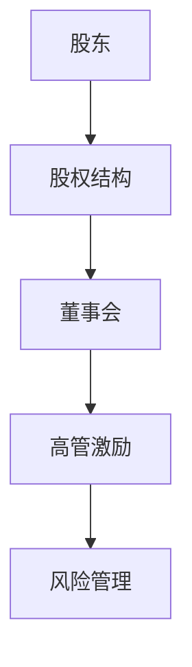
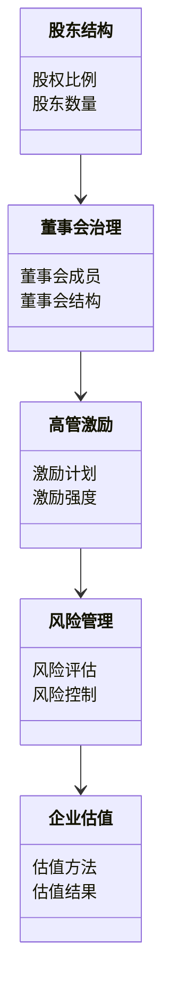
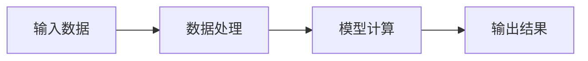
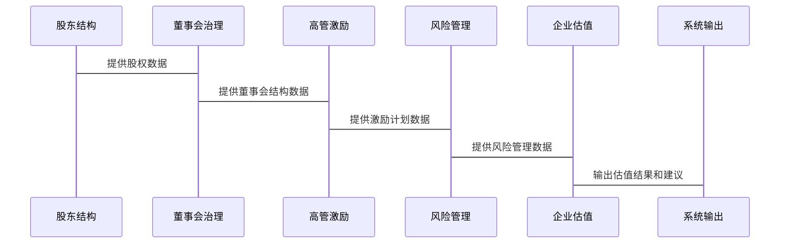

                 


# 企业估值中的公司治理因素

> **关键词**：企业估值、公司治理、股权结构、董事会治理、高管激励、风险管理

> **摘要**：企业估值不仅是财务评估的核心问题，也是公司治理的重要组成部分。本文系统分析公司治理因素对企业估值的影响，涵盖股东结构、董事会治理、高管激励和风险管理等方面，探讨其对企业发展和价值创造的具体影响。通过数学模型和案例分析，阐述如何将公司治理因素整合到企业估值过程中，以帮助投资者和企业管理者更好地理解公司治理与企业价值之间的关系。

---

## 第1章 公司治理与企业估值的背景介绍

### 1.1 公司治理的基本概念

#### 1.1.1 公司治理的定义
公司治理是指通过一系列制度、机制和流程，确保公司战略目标的实现，平衡股东、管理层和利益相关者的利益。它是公司内部管理和外部监督的综合体系。

#### 1.1.2 公司治理的结构与目标
公司治理结构包括股东、董事会、高管和利益相关者。其目标是实现公司价值最大化，同时确保透明度和合规性。

#### 1.1.3 公司治理与企业价值的关系
良好的公司治理能够提升企业透明度和信任度，进而提高企业估值。反之，治理不善可能导致企业价值下降。

---

### 1.2 企业估值的基本原理

#### 1.2.1 企业估值的定义
企业估值是通过财务指标和市场数据，估算企业整体价值的过程。

#### 1.2.2 企业估值的核心方法
常用方法包括DCF模型、可比公司法和 precedent transactions 法。

#### 1.2.3 公司治理在企业估值中的作用
公司治理影响企业的运营效率和风险管理，进而影响估值。

---

### 1.3 公司治理与企业估值的关联性

#### 1.3.1 公司治理对企业价值的影响
治理结构优化可以提升企业绩效和降低风险。

#### 1.3.2 企业估值中的公司治理因素
股权结构、董事会治理、高管激励和风险管理是关键因素。

#### 1.3.3 公司治理与企业估值的边界与外延
公司治理影响企业估值，但估值还受市场环境和行业趋势的影响。

---

## 第2章 公司治理的核心概念与联系

### 2.1 公司治理的核心要素

#### 2.1.1 股东结构
股权分散可能导致治理混乱，而集中股权有助于高效决策。

#### 2.1.2 董事会结构
董事会的独立性和专业性影响企业治理和决策质量。

#### 2.1.3 高管激励机制
激励机制可以激发管理层的积极性，但也可能引发道德风险。

#### 2.1.4 内部控制与风险管理
有效的内部控制和风险管理可以降低企业经营风险，提升估值。

---

### 2.2 公司治理与企业估值的核心要素对比

#### 2.2.1 股权结构对估值的影响
集中股权结构通常带来更高的估值，而分散股权可能增加治理成本。

#### 2.2.2 董事会治理对估值的影响
高效的董事会能够提升企业战略制定和执行能力，进而提高估值。

#### 2.2.3 高管激励对估值的影响
合理的激励机制可以提升高管积极性，但过度激励可能导致短期行为。

#### 2.2.4 风险管理对估值的影响
良好的风险管理可以降低企业经营风险，提升市场对企业的信任，从而提高估值。

---

### 2.3 公司治理与企业估值的ER实体关系图



---

### 2.4 本章小结

本章分析了公司治理的核心要素，包括股东结构、董事会治理、高管激励和风险管理，并探讨了这些因素如何影响企业估值。通过ER实体关系图，我们展示了公司治理各要素之间的相互联系。

---

## 第3章 公司治理因素对估值的影响机制

### 3.1 公司治理与企业绩效的关系

#### 3.1.1 股东结构与企业绩效
集中股权结构通常与更高的企业绩效相关，而分散股权可能因治理不善而影响绩效。

#### 3.1.2 董事会治理与企业绩效
高效的董事会能够制定更好的战略，提升企业绩效。

#### 3.1.3 高管激励与企业绩效
合理的激励机制可以激发高管的积极性，提升企业绩效。

---

### 3.2 公司治理与企业风险的关系

#### 3.2.1 内部控制与企业风险
有效的内部控制可以降低企业经营风险。

#### 3.2.2 风险管理与企业风险
良好的风险管理可以降低企业面临的风险。

#### 3.2.3 公司治理与企业信用评级
良好的公司治理可以提升企业的信用评级，进而影响估值。

---

### 3.3 公司治理对估值的直接影响

#### 3.3.1 股权结构对估值的影响
集中股权结构通常带来更高的估值，而分散股权可能因治理不善而影响估值。

#### 3.3.2 董事会治理对估值的影响
高效的董事会治理可以提升企业价值，进而提高估值。

#### 3.3.3 高管激励对估值的影响
合理的高管激励机制可以提升企业绩效，进而提高估值。

#### 3.3.4 风险管理对估值的影响
良好的风险管理可以降低企业经营风险，提升市场对企业的信任，进而提高估值。

---

## 第4章 公司治理因素对估值的数学模型与公式

### 4.1 公司治理与企业价值的数学模型

#### 4.1.1 企业价值的加权平均法
$$ V = \sum_{i=1}^{n} w_i \times v_i $$
其中，$w_i$ 是第 $i$ 个治理因素的权重，$v_i$ 是第 $i$ 个治理因素对价值的影响值。

---

### 4.2 公司治理与企业风险的数学模型

#### 4.2.1 风险调整后的价值模型
$$ V_{\text{调整}} = V \times (1 - R) $$
其中，$R$ 是风险调整系数。

---

### 4.3 公司治理与企业绩效的数学模型

#### 4.3.1 绩效驱动的估值模型
$$ V = P \times r $$
其中，$P$ 是企业绩效，$r$ 是绩效对估值的权重。

---

## 第5章 系统分析与架构设计方案

### 5.1 项目介绍

企业治理与估值系统旨在通过分析公司治理因素，优化企业估值模型。

---

### 5.2 系统功能设计

#### 5.2.1 领域模型设计


---

### 5.3 系统架构设计



---

### 5.4 系统接口设计

- 输入接口：接收公司治理数据和财务数据。
- 输出接口：输出企业估值结果和治理改进建议。

---

### 5.5 系统交互设计



---

## 第6章 项目实战

### 6.1 环境安装

- 安装Python和相关库（如Pandas、NumPy、Matplotlib）。

---

### 6.2 核心实现源代码

```python
import pandas as pd
import numpy as np

def calculate_value(governance_factors):
    weights = [0.4, 0.3, 0.2, 0.1]
    values = [governance_factors['股权结构'], governance_factors['董事会治理'], 
              governance_factors['高管激励'], governance_factors['风险管理']]
    value = sum(w * v for w, v in zip(weights, values))
    return value

# 示例数据
data = {
    '股权结构': 0.8,
    '董事会治理': 0.7,
    '高管激励': 0.6,
    '风险管理': 0.5
}

print(calculate_value(data))
```

---

### 6.3 实际案例分析

假设某公司股权结构为80%，董事会治理得分为70%，高管激励得分为60%，风险管理得分为50%。根据上述模型，其企业估值为：

$$ V = 0.4 \times 0.8 + 0.3 \times 0.7 + 0.2 \times 0.6 + 0.1 \times 0.5 = 0.32 + 0.21 + 0.12 + 0.05 = 0.70 $$

---

## 第7章 最佳实践与总结

### 7.1 小结

公司治理是企业估值的重要组成部分，股权结构、董事会治理、高管激励和风险管理等因素直接影响企业价值。

---

### 7.2 注意事项

- 企业治理因素是多方面的，需综合考虑。
- 模型的应用需结合具体行业和企业特点。

---

### 7.3 拓展阅读

建议阅读《公司治理与企业价值》《企业估值方法论》等书籍。

---

## 作者：AI天才研究院/AI Genius Institute & 禅与计算机程序设计艺术 /Zen And The Art of Computer Programming

---

以上是《企业估值中的公司治理因素》的技术博客文章的完整内容。文章从背景介绍、核心概念、影响机制、数学模型、系统设计到项目实战，全面分析了公司治理对企业估值的影响。希望本文能为读者提供有价值的见解和实践指导。

