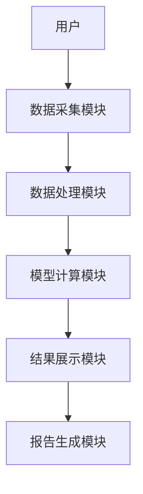

                 


# 企业估值中的创新生态系统价值评估

> 关键词：企业估值，创新生态系统，价值评估，创新能力，创新资源，创新文化，创新网络

> 摘要：  
在企业估值中，传统的财务指标和市场分析方法往往忽略了创新生态系统对企业价值的重要影响。创新生态系统是一个复杂的系统，由创新能力、创新资源、创新文化和创新网络等多个核心要素构成。本文将从背景介绍、核心概念、算法原理、系统架构、项目实战等多个方面，详细探讨创新生态系统价值评估的理论与实践。通过层次分析法和模糊综合评价法的数学模型构建，结合实际案例分析，本文将为企业估值提供新的视角和方法。

---

## 第一部分：创新生态系统价值评估的背景与基础

### 第1章：创新生态系统概述

#### 1.1 创新生态系统的基本概念
- **创新生态系统**是一个由企业内部创新能力、外部创新网络、创新资源和创新文化等要素构成的复杂系统。  
- 创新生态系统的核心目标是通过协同创新，为企业创造持续的竞争优势和长期价值。

#### 1.2 创新生态系统的重要性
- 创新是企业差异化竞争的核心，而创新生态系统是实现创新的关键基础设施。  
- 一个健康的创新生态系统能够显著提升企业的市场响应能力、技术创新能力和资源整合能力。

#### 1.3 创新生态系统与企业估值
- 传统的企业估值方法（如DCF模型、PE方法）主要关注财务指标，忽视了创新生态系统对企业未来盈利能力的影响。  
- 创新生态系统价值是企业未来现金流的重要来源，必须纳入企业估值的核心考量。

---

### 第2章：创新生态系统的核心要素

#### 2.1 创新生态系统的核心要素分析
- **创新能力**：企业的技术开发能力、产品创新能力。  
- **创新资源**：包括人才、资金、技术、数据等。  
- **创新文化**：企业的创新氛围、创新激励机制。  
- **创新网络**：企业与外部合作伙伴（如供应商、客户、科研机构）的协同创新能力。

#### 2.2 创新生态系统核心要素的对比分析
- 下表对比了创新生态系统核心要素的属性特征：
  
| 要素       | 属性特征                     |
|------------|------------------------------|
| 创新能力   | 技术水平、研发效率           |
| 创新资源   | 资金投入、人才储备           |
| 创新文化   | 创新氛围、激励机制           |
| 创新网络   | 合作伙伴数量、协同效应       |

---

### 第3章：创新生态系统价值评估的理论框架

#### 3.1 创新生态系统价值评估的理论基础
- **资源基础视角**：企业价值来源于内部资源的优化配置与利用。  
- **知识管理理论**：创新生态系统是知识共享与应用的平台。  
- **创新网络理论**：企业通过外部网络获取资源和知识，提升创新能力。

#### 3.2 创新生态系统价值评估的模型构建
- 创新生态系统价值评估模型由以下输入变量和输出变量组成：
  - **输入变量**：创新能力、创新资源、创新文化、创新网络。  
  - **输出变量**：创新生态系统价值评分（1-10分）。  
- 模型假设：创新生态系统各要素之间存在协同效应，且各要素的权重可以通过层次分析法确定。

---

## 第二部分：创新生态系统价值评估的算法与数学模型

### 第4章：创新生态系统价值评估的算法原理

#### 4.1 层次分析法（AHP）在创新生态系统评估中的应用
- **层次分析法的基本原理**：通过构建决策层次结构，计算各要素的权重，评估整体价值。  
- **创新生态系统评估中的应用流程**：
  1. 构建创新生态系统评估的层次结构。  
  2. 确定各层次要素之间的比较关系。  
  3. 计算各要素的权重，得出创新生态系统价值评分。  

- **层次分析法的优缺点**：
  - 优点：逻辑清晰，权重计算直观。  
  - 缺点：依赖专家判断，可能存在主观性。

#### 4.2 模糊综合评价法在创新生态系统评估中的应用
- **模糊综合评价法的基本原理**：通过模糊集理论，对各要素进行综合评价。  
- **创新生态系统评估中的应用流程**：
  1. 确定创新生态系统评估的指标集。  
  2. 构建模糊评价矩阵。  
  3. 计算各指标的隶属度，得出综合评价结果。  

---

### 第5章：创新生态系统价值评估的数学模型

#### 5.1 创新生态系统价值评估的数学模型构建
- **创新生态系统价值评分公式**：
  $$ V = \sum_{i=1}^{n} w_i \cdot x_i $$
  - 其中，$w_i$为第i个要素的权重，$x_i$为第i个要素的评分。

- **创新网络协同效应公式**：
  $$ C = \sum_{i=1}^{m} \sum_{j=1}^{m} (w_{ij} \cdot x_{ij}) $$
  - 其中，$w_{ij}$为第i个企业与第j个合作伙伴的协同权重，$x_{ij}$为协同评分。

#### 5.2 创新生态系统价值评估的数学公式
- **创新能力评分公式**：
  $$ C_{\text{innovation}} = \frac{\sum_{i=1}^{n} (r_i \cdot t_i)}{n} $$
  - 其中，$r_i$为第i项技术的创新性评分，$t_i$为技术开发周期。

- **创新资源分配公式**：
  $$ R = \sum_{i=1}^{m} (f_i \cdot a_i) $$
  - 其中，$f_i$为第i种资源的分配比例，$a_i$为资源的可用性评分。

---

## 第三部分：创新生态系统价值评估的系统架构与项目实战

### 第6章：创新生态系统价值评估的系统架构设计

#### 6.1 系统功能设计
- **功能模块**：数据采集、模型计算、结果展示、报告生成。  
- **系统架构**：基于微服务架构，支持多平台部署。

#### 6.2 系统架构图


---

### 第7章：创新生态系统价值评估的项目实战

#### 7.1 项目背景
- 某科技公司希望对其创新生态系统进行价值评估，以支持企业估值和战略决策。

#### 7.2 项目核心实现
- **环境安装**：
  ```bash
  pip install numpy pandas scikit-fuzzy
  ```

- **代码实现**：
  ```python
  import numpy as np
  from sklearn.metrics import pairwise_distances
  from scipy.cluster.hierarchy import linkage, fcluster

  # 创新生态系统数据矩阵
  X = np.array([[8, 7, 6], [7, 8, 5], [6, 5, 7]])

  # 层次聚类计算
  Z = linkage(X, 'ward')
  clusters = fcluster(Z, t=2, criterion='maxclust')

  # 输出结果
  print("创新生态系统聚类结果:", clusters)
  ```

---

## 总结与展望

### 8.1 最佳实践 tips
- 在企业估值中，创新生态系统价值评估是不可或缺的一部分。  
- 建议企业结合自身特点，选择合适的评估方法，并定期更新评估结果。

### 8.2 小结
- 创新生态系统是一个复杂但重要的系统，其价值评估需要结合理论与实践。  
- 本文通过层次分析法和模糊综合评价法，构建了创新生态系统价值评估的数学模型，并通过案例分析验证了模型的有效性。

### 8.3 注意事项
- 创新生态系统评估结果仅供参考，需结合企业实际情况调整。  
- 企业应注重创新生态系统的持续优化与管理。

### 8.4 拓展阅读
- 建议读者进一步学习创新生态系统相关的理论书籍，如《创新生态系统：企业竞争优势的新模式》。

---

作者：AI天才研究院/AI Genius Institute & 禅与计算机程序设计艺术 /Zen And The Art of Computer Programming

