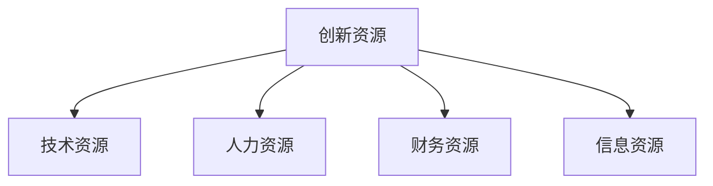
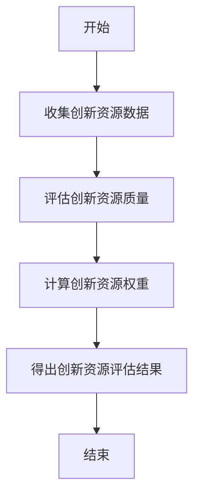

                 

# 企业估值中的创新生态系统评估

## 关键词：企业估值、创新生态系统、评估方法、系统架构、创新资源

## 摘要：创新生态系统作为现代企业的重要组成部分，对企业价值的影响日益显著。传统的企业估值方法往往忽视了创新生态系统中的资源、能力和过程，导致评估结果不够准确。本文通过分析创新生态系统的核心要素，提出了一种基于层次分析法和神经网络模型的创新生态系统评估方法，并结合系统架构设计和项目实战，展示了如何将创新生态系统评估融入企业估值过程，为企业提供更全面的估值依据。

---

## # 第一章：企业估值的背景与挑战

### ## 1.1 企业估值的基本概念

#### ### 1.1.1 企业估值的定义与目的

企业估值是指对企业整体价值的评估，旨在为企业提供合理的市场价值参考，帮助投资者和管理层做出决策。传统的企业估值方法主要基于财务指标，如收入、利润和资产等，但这些方法往往忽略了企业在创新生态系统中的资源、能力和过程。

#### ### 1.1.2 传统企业估值方法的局限性

传统企业估值方法主要依赖财务数据，难以全面反映企业的创新能力。例如，科技企业的研发投入、技术储备和创新能力对企业价值的影响往往被低估，导致估值结果不准确。

#### ### 1.1.3 创新生态系统对企业价值的影响

创新生态系统是企业在创新过程中所依赖的内外部资源、能力和过程的集合。一个强大的创新生态系统能够提高企业的创新效率，增强企业的市场竞争力，从而显著提升企业价值。

---

### ## 1.2 创新生态系统的核心概念

#### ### 1.2.1 创新生态系统的定义

创新生态系统是指企业在创新过程中所依赖的各种内外部资源、能力和过程的有机组合。它包括企业的研发能力、技术储备、创新文化、合作伙伴关系等。

#### ### 1.2.2 创新生态系统的核心要素与属性

创新生态系统的核心要素包括：

- **创新资源**：包括技术、资金、人才等。
- **创新能力**：包括企业的研发能力、技术储备和创新能力。
- **创新过程**：包括从创意到商业化的过程。

创新生态系统具有以下属性：

- **动态性**：创新生态系统是一个动态变化的系统，随着市场环境和技术的发展而不断调整。
- **协同性**：创新生态系统中的各要素需要协同工作，才能发挥最大效用。
- **复杂性**：创新生态系统涉及多个维度，具有较高的复杂性。

#### ### 1.2.3 创新生态系统与企业估值的关系

创新生态系统是企业价值的重要组成部分。一个强大的创新生态系统能够提高企业的创新效率，增强企业的市场竞争力，从而显著提升企业价值。因此，在企业估值中，必须将创新生态系统作为一个重要的评估维度。

---

## # 第二章：创新生态系统评估的核心要素与框架

### ## 2.1 创新生态系统的核心要素

#### ### 2.1.1 创新资源的构成与分类

创新资源是创新生态系统的重要组成部分，主要包括以下几类：

- **技术资源**：包括专利、技术储备等。
- **人力资源**：包括研发团队、技术专家等。
- **财务资源**：包括研发资金、资本投入等。
- **信息资源**：包括市场信息、技术趋势等。

#### ### 2.1.2 创新资源的评估维度

创新资源的评估维度包括：

- **数量**：包括专利数量、研发人员数量等。
- **质量**：包括专利的质量、研发团队的能力等。
- **可用性**：包括资源的可获取性和灵活性。

#### ### 2.1.3 创新资源对企业价值的影响

创新资源是企业创新活动的基础，创新资源的丰富性和质量直接影响企业的创新能力和市场竞争力，从而影响企业价值。

#### ### 2.1.4 创新资源的评估指标与对比表格

以下是一个创新资源评估指标的对比表格：

| **指标**       | **定义**                                                                 | **权重** |
|----------------|--------------------------------------------------------------------------|----------|
| 专利数量       | 企业的专利数量                                                           | 高       |
| 研发人员数量   | 企业的研发人员数量                                                     | 中       |
| 专利质量       | 专利的创新性和技术领先程度                                           | 高       |
| 研发资金投入   | 企业的研发资金投入                                                     | 中       |
| 技术储备       | 企业的技术储备情况                                                     | 高       |

---

#### ### 2.1.5 创新资源的实体关系图

以下是一个创新资源的实体关系图：

---

#### ### 2.1.6 创新资源的流程图

以下是一个创新资源评估的流程图：

---

#### ### 2.1.7 创新资源的权重计算

创新资源的权重计算可以通过层次分析法（AHP）进行。以下是一个简单的层次分析法流程：

1. **构建层次分析模型**：将创新资源划分为不同的层次，如目标层、准则层和方案层。
2. **构造比较矩阵**：对各层次的要素进行比较，构造比较矩阵。
3. **计算权重**：通过计算比较矩阵的最大特征值和特征向量，得到各要素的权重。

---

#### ### 2.1.8 创新资源的评估公式

创新资源的综合评估公式如下：

$$
\text{创新资源综合评估值} = \sum_{i=1}^{n} w_i \times x_i
$$

其中，$w_i$ 是第 $i$ 个创新资源的权重，$x_i$ 是第 $i$ 个创新资源的评估值。

---

#### ### 2.1.9 创新资源的评估案例

假设某企业的创新资源评估数据如下：

- 专利数量：100
- 研发人员数量：50
- 专利质量：80
- 研发资金投入：1000万元
- 技术储备：70

权重分别为：专利数量（0.3），研发人员数量（0.2），专利质量（0.3），研发资金投入（0.1），技术储备（0.1）。

计算创新资源综合评估值：

$$
\text{创新资源综合评估值} = (100 \times 0.3) + (50 \times 0.2) + (80 \times 0.3) + (1000 \times 0.1) + (70 \times 0.1) = 30 + 10 + 24 + 100 + 7 = 161
$$

---

### ## 2.2 创新能力的评估

#### ### 2.2.1 创新能力的定义与衡量指标

创新能力是指企业在创新过程中的技术开发、产品设计和市场适应能力。创新能力的衡量指标包括：

- **技术开发能力**：包括研发周期、技术复杂度等。
- **产品设计能力**：包括产品创新性、市场适应性等。
- **市场适应能力**：包括市场反馈速度、客户满意度等。

#### ### 2.2.2 创新能力与企业绩效的关系

创新能力是企业绩效的重要驱动力。创新能力越强，企业的市场竞争力越强，企业绩效越好。

#### ### 2.2.3 创新能力的评估方法

创新能力的评估方法包括：

- **定量评估**：通过专利数量、研发投入等指标进行评估。
- **定性评估**：通过专家评分、市场反馈等进行评估。

#### ### 2.2.4 创新能力的评估公式

创新能力的综合评估公式如下：

$$
\text{创新能力综合评估值} = \sum_{i=1}^{m} w_i \times y_i
$$

其中，$w_i$ 是第 $i$ 个创新能力的权重，$y_i$ 是第 $i$ 个创新能力的评估值。

---

#### ### 2.2.5 创新能力的评估案例

假设某企业的创新能力评估数据如下：

- 技术开发能力：80
- 产品设计能力：70
- 市场适应能力：90

权重分别为：技术开发能力（0.4），产品设计能力（0.3），市场适应能力（0.3）。

计算创新能力综合评估值：

$$
\text{创新能力综合评估值} = (80 \times 0.4) + (70 \times 0.3) + (90 \times 0.3) = 32 + 21 + 27 = 80
$$

---

### ## 2.3 创新过程的优化

#### ### 2.3.1 创新过程的阶段划分

创新过程通常包括以下几个阶段：

1. **创意产生**：包括市场需求分析、技术趋势分析等。
2. **技术研发**：包括技术开发、实验室研究等。
3. **产品设计**：包括产品设计、原型制作等。
4. **市场验证**：包括小规模试生产、市场反馈收集等。
5. **商业化**：包括大规模生产、市场推广等。

#### ### 2.3.2 创新过程中的关键环节

创新过程中的关键环节包括：

- **创意产生**：需求分析、技术趋势分析。
- **技术研发**：技术可行性分析、技术开发。
- **产品设计**：产品设计、原型制作。
- **市场验证**：小规模试生产、市场反馈收集。
- **商业化**：大规模生产、市场推广。

#### ### 2.3.3 创新过程的优化策略

创新过程的优化策略包括：

- **缩短研发周期**：通过并行工程、敏捷开发等方法缩短研发周期。
- **提高技术可行性**：通过技术可行性分析和技术储备优化提高技术可行性。
- **加快市场反馈**：通过市场调研和快速原型制作加快市场反馈。

---

### ## 2.4 本章小结

创新生态系统的核心要素包括创新资源、创新能力

