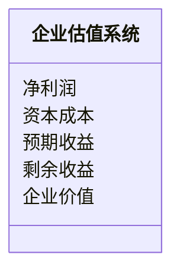
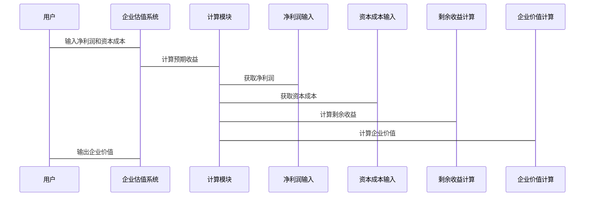

                 


# 企业估值中的剩余收益法

> 关键词：企业估值，剩余收益法，DCF模型，资本成本，企业价值

> 摘要：本文深入探讨了企业估值中的剩余收益法，从基本概念到实际应用，详细分析了其原理、算法、系统架构和实战案例，帮助读者全面理解并掌握这一重要的企业估值方法。

---

# 第1章: 企业估值与剩余收益法的背景介绍

## 1.1 企业估值的基本概念

### 1.1.1 企业估值的定义与目的
企业估值是通过对企业的财务状况、市场地位和未来盈利能力进行评估，确定其市场价值的过程。其目的是为企业提供合理的定价依据，帮助投资者和管理层做出决策。

### 1.1.2 企业估值的主要方法
企业估值的主要方法包括：
1. **DCF模型（ discounted cash flow model）**：基于未来现金流的现值计算企业价值。
2. **市盈率法（Price-to-Earnings Ratio）**：通过市盈率和净利润计算企业价值。
3. **剩余收益法（Residual Income Method）**：基于净利润与预期收益的差异计算企业价值。

### 1.1.3 剩余收益法在企业估值中的地位
剩余收益法是一种基于会计数据的企业估值方法，尤其适用于那些财务数据较为稳健的企业。它通过计算净利润与预期收益的差额（剩余收益），再将这些剩余收益进行现值计算，得出企业价值。

---

## 1.2 剩余收益法的起源与发展

### 1.2.1 剩余收益法的起源
剩余收益法的起源可以追溯到20世纪70年代，由美国会计学家提出，作为一种基于会计数据的企业估值方法。

### 1.2.2 剩余收益法的发展历程
随着金融理论的发展，剩余收益法不断完善，尤其是在资本成本估算和数据处理方面有了显著进步。

### 1.2.3 剩余收益法的现状与趋势
目前，剩余收益法在企业估值领域中得到了广泛应用，尤其是在那些财务数据较为稳健的企业中。未来，随着人工智能和大数据技术的发展，剩余收益法可能会与这些技术结合，进一步提升其应用价值。

---

## 1.3 剩余收益法与其他估值方法的比较

### 1.3.1 剩余收益法与DCF模型的异同
- **相同点**：两者都基于未来现金流的现值计算企业价值。
- **不同点**：剩余收益法使用净利润和预期收益，而DCF模型使用自由现金流。

### 1.3.2 剩余收益法与市盈率法的对比
- **剩余收益法**：基于净利润和预期收益，计算剩余收益。
- **市盈率法**：基于市盈率和净利润。

### 1.3.3 剩余收益法的优缺点分析
- **优点**：数据来源容易，计算简便。
- **缺点**：依赖于准确的财务数据和合理的资本成本假设。

---

## 1.4 本章小结
本章介绍了企业估值的基本概念和剩余收益法的背景，分析了剩余收益法与其他估值方法的异同，并总结了其优缺点。下一章将深入探讨剩余收益法的核心概念和原理。

---

# 第2章: 剩余收益法的核心概念

## 2.1 剩余收益法的基本原理

### 2.1.1 剩余收益法的定义
剩余收益法是通过计算净利润与预期收益的差额（剩余收益），再将其现值化，得出企业价值的方法。

### 2.1.2 剩余收益法的公式推导
剩余收益法的公式为：
$$ \text{企业价值} = \sum_{t=1}^{n} \frac{\text{剩余收益}_t}{(1 + r)^t} $$
其中，$r$为资本成本，$n$为预测期限。

### 2.1.3 剩余收益法的核心要素
- 净利润
- 预期收益
- 资本成本

---

## 2.2 剩余收益法的关键参数

### 2.2.1 净利润的计算
净利润是企业税后利润，计算公式为：
$$ \text{净利润} = \text{营业收入} - \text{营业成本} - \text{税金及附加} - \text{期间费用} $$

### 2.2.2 预期收益的确定
预期收益是基于资本成本和无风险利率计算得出的，通常使用WACC（加权平均资本成本）作为资本成本。

### 2.2.3 资本成本的估算
资本成本的估算方法包括：
1. **无风险利率加风险溢价法**
2. **CAPM模型**：使用CAPM模型计算加权平均资本成本。

---

## 2.3 剩余收益法的应用条件

### 2.3.1 适用企业的类型
- 财务数据稳健的企业
- 利润稳定的成熟企业

### 2.3.2 数据要求与假设
- 准确的财务数据
- 合理的资本成本假设
- 稳定的经营环境

### 2.3.3 方法的局限性
- 依赖于财务数据的准确性
- 忽略了企业非财务因素的影响

---

## 2.4 本章小结
本章详细介绍了剩余收益法的核心概念和关键参数，并分析了其应用条件和局限性。下一章将探讨剩余收益法的算法原理和数学模型。

---

# 第3章: 剩余收益法的算法原理与数学模型

## 3.1 剩余收益法的计算步骤

### 3.1.1 确定企业的净利润
假设某企业2023年的净利润为$100$万元。

### 3.1.2 计算企业的预期收益
预期收益的计算公式为：
$$ \text{预期收益}_t = \text{净利润}_t - \text{预期收益}_t \times (1 + r)^t $$

### 3.1.3 估算企业的资本成本
假设资本成本$r$为10%。

### 3.1.4 计算剩余收益
$$ \text{剩余收益}_t = \text{净利润}_t - \text{预期收益}_t $$

### 3.1.5 将剩余收益现值化
$$ \text{企业价值} = \sum_{t=1}^{n} \frac{\text{剩余收益}_t}{(1 + r)^t} $$

---

## 3.2 剩余收益法的数学模型

### 3.2.1 净利润公式
$$ \text{净利润} = \text{营业收入} - \text{营业成本} - \text{税金及附加} - \text{期间费用} $$

### 3.2.2 预期收益公式
$$ \text{预期收益}_t = \text{净利润}_t \times (1 + r)^t $$

### 3.2.3 企业价值公式
$$ \text{企业价值} = \sum_{t=1}^{n} \frac{\text{净利润}_t - \text{预期收益}_t}{(1 + r)^t} $$

---

## 3.3 剩余收益法的Python实现

```python
def residual_income_value(net_income, capital_cost, periods):
    value = 0
    for t in range(periods):
        residual_income = net_income * (1 + capital_cost) ** t
        discounted_income = residual_income / (1 + capital_cost) ** t
        value += discounted_income
    return value

net_income = 100  # 万元
capital_cost = 0.10
periods = 5

enterprise_value = residual_income_value(net_income, capital_cost, periods)
print(f"企业价值为：{enterprise_value} 万元")
```

---

## 3.4 本章小结
本章通过公式推导和Python代码，详细讲解了剩余收益法的计算过程和数学模型。下一章将探讨剩余收益法的系统分析与架构设计。

---

# 第4章: 剩余收益法的系统分析与架构设计

## 4.1 问题场景介绍
假设我们需要构建一个企业估值系统，使用剩余收益法对某制造企业进行估值。

## 4.2 系统功能设计

### 4.2.1 领域模型（Mermaid 类图）


### 4.2.2 系统架构设计（Mermaid 架构图）


### 4.2.3 系统接口设计
- 输入接口：净利润、资本成本
- 输出接口：企业价值

### 4.2.4 系统交互设计（Mermaid 序列图）


---

## 4.3 本章小结
本章通过系统架构设计和交互流程图，详细展示了剩余收益法在企业估值系统中的应用。下一章将通过具体案例分析，展示剩余收益法的实际应用。

---

# 第5章: 剩余收益法的项目实战

## 5.1 环境安装与准备

### 5.1.1 安装Python
```bash
python --version
pip install numpy pandas matplotlib
```

### 5.1.2 安装其他工具
- Excel或Python数据分析工具

## 5.2 核心代码实现

### 5.2.1 计算净利润
```python
net_income = 100  # 万元
```

### 5.2.2 计算预期收益
```python
capital_cost = 0.10
expected_income = net_income * (1 + capital_cost)
```

### 5.2.3 计算剩余收益
```python
residual_income = net_income - expected_income
```

### 5.2.4 计算企业价值
```python
enterprise_value = residual_income / (1 + capital_cost)
```

## 5.3 案例分析与结果解读
假设某制造企业2023年的净利润为100万元，资本成本为10%，计算其企业价值。

## 5.4 项目小结
通过本案例，我们详细展示了剩余收益法的实际应用过程，包括数据输入、计算和结果输出。

---

# 第6章: 剩余收益法的最佳实践与小结

## 6.1 最佳实践 tips
- 确保财务数据的准确性
- 合理估算资本成本
- 考虑企业非财务因素的影响

## 6.2 小结
本文通过理论分析和案例实践，全面介绍了剩余收益法在企业估值中的应用。剩余收益法是一种简单有效的估值方法，但在实际应用中需要结合企业的实际情况进行调整。

---

# 作者

作者：AI天才研究院/AI Genius Institute & 禅与计算机程序设计艺术 /Zen And The Art of Computer Programming

