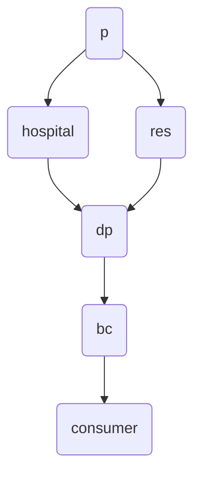
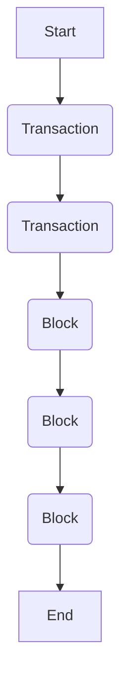
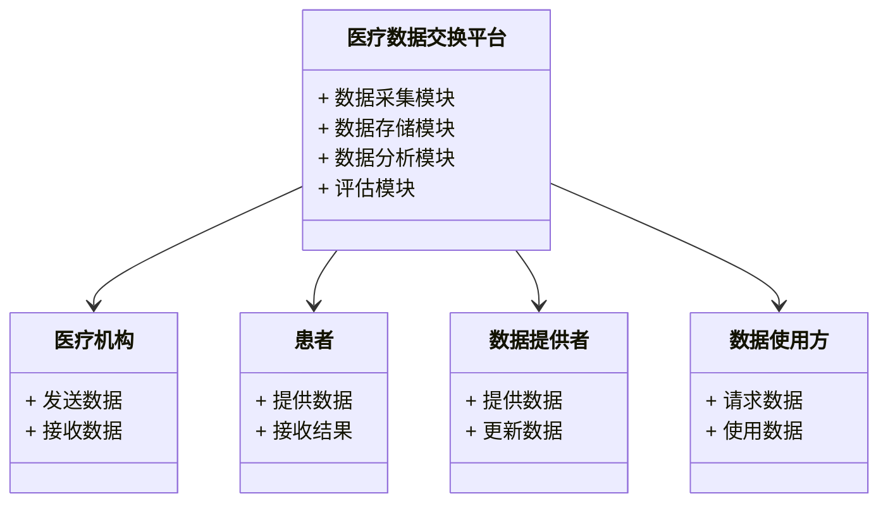
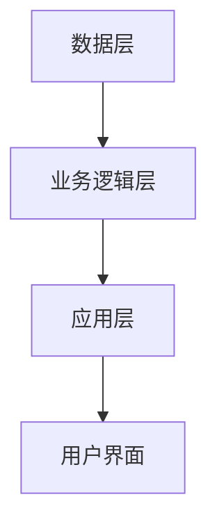
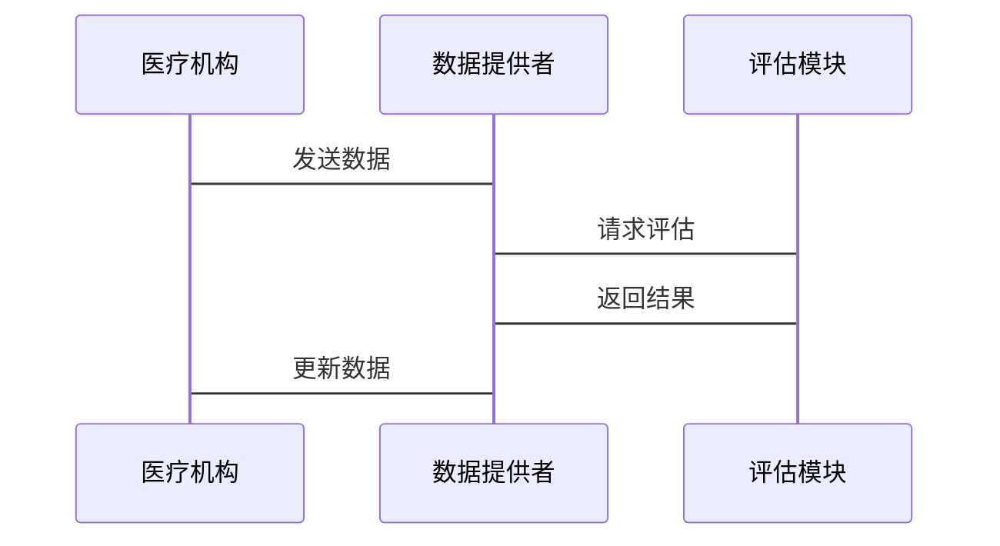

                 


# 企业估值中的区块链医疗数据交换平台评估

> 关键词：企业估值，区块链，医疗数据交换平台，数据隐私，智能合约

> 摘要：本文探讨了区块链技术在医疗数据交换平台中的应用，重点分析其在企业估值中的作用。通过详细讲解区块链的核心原理、医疗数据交换平台的实体关系、评估算法的数学模型以及系统架构设计，本文为读者提供了从理论到实践的全面指导。

---

## 第一部分：背景介绍

### 第1章：问题背景与概念结构

#### 1.1 问题背景
医疗数据的重要性与挑战  
医疗数据是现代医疗体系的核心资源，其准确性和及时性直接影响诊断和治疗效果。然而，传统医疗数据交换平台存在数据孤岛、隐私泄露和数据篡改等问题，导致企业估值困难。

区块链技术在医疗数据管理中的应用前景  
区块链的去中心化、不可篡改和可追溯特性，为医疗数据的安全交换提供了新的解决方案。通过区块链，医疗数据可以实现高效共享，同时确保数据的隐私和完整性。

企业估值中的数据交换需求  
在企业估值过程中，医疗数据的价值评估至关重要。区块链医疗数据交换平台能够确保数据的真实性和一致性，为企业提供可靠的基础，从而准确评估企业价值。

#### 1.2 核心概念结构
医疗数据交换平台的定义与组成  
医疗数据交换平台是一个支持医疗机构间数据共享的系统，通常包括数据采集、存储、传输和分析模块。区块链技术通过去中心化的架构，确保数据的安全性和透明性。

区块链技术在数据交换中的角色  
区块链作为底层技术，为医疗数据交换提供信任机制和安全环境。通过智能合约，实现数据的自动化传输和访问控制，确保数据的合法共享。

企业估值与数据价值的关系  
企业的医疗数据价值直接影响其市场估值。通过区块链技术，企业能够更高效地管理和共享数据，提升数据的可用性和可信度，从而提高企业估值。

---

## 第二部分：核心概念与联系

### 第2章：核心概念分析

#### 2.1 区块链技术的核心原理
区块链的基本概念  
区块链是一种分布式账本技术，通过去中心化的方式记录数据，确保数据的不可篡改性和可追溯性。每个区块包含数据和哈希指针，确保数据链的完整性。

分布式账本与共识机制  
分布式账本由多个节点维护，共识机制（如PoW、PoS）确保所有节点达成一致，避免数据冲突。共识机制是区块链安全性和可靠性的基石。

智能合约的工作原理  
智能合约是区块链上的自动执行程序，用于在满足特定条件时自动触发操作。在医疗数据交换中，智能合约可以用于自动化数据传输和权限管理。

#### 2.2 医疗数据交换平台的实体关系
ER实体关系图  
医疗数据交换平台涉及多方角色，包括医疗机构、患者、数据提供者和数据使用方。通过ER图，我们可以清晰地展示各实体之间的关系和数据流。



---

## 第三部分：算法原理讲解

### 第3章：评估算法原理

#### 3.1 区块链评估算法
区块链评估算法通过分析数据的来源、传输路径和存储方式，评估数据的可信度和完整性。以下是评估过程的流程图：



数学模型与公式  
评估数据可信度的数学模型如下：

$$
\text{可信度} = \frac{\text{有效交易数}}{\text{总交易数}} \times 100\%
$$

其中，有效交易数是指通过共识机制验证的交易数量。

---

## 第四部分：系统分析与架构设计

### 第4章：系统架构设计

#### 4.1 系统功能设计
医疗数据交换平台的功能模块包括数据采集、存储、分析和评估模块。以下是系统的领域模型：



系统架构设计  
医疗数据交换平台的架构采用分层设计，包括数据层、业务逻辑层和应用层。以下是系统的架构图：



系统接口设计  
系统接口包括数据上传接口、数据查询接口和评估结果接口。以下是接口的序列图：



---

## 第五部分：项目实战

### 第5章：项目实战

#### 5.1 环境安装
以下是项目实战所需的环境安装步骤：

1. 安装Python 3.8及以上版本。
2. 安装必要的Python库：`mermaid`, `blockchain`, `pandas`。
3. 安装Jupyter Notebook用于数据分析和可视化。

#### 5.2 核心代码实现
以下是核心代码实现：

```python
from hashlib import sha256
from time import time

class Block:
    def __init__(self, index, timestamp, data, prev_hash):
        self.index = index
        self.timestamp = timestamp
        self.data = data
        self.prev_hash = prev_hash
        self.hash = self.calculate_hash()

    def calculate_hash(self):
        return sha256(str(self.index) + str(self.timestamp) + str(self.data) + str(self.prev_hash)).hexdigest()

class Blockchain:
    def __init__(self):
        self.blocks = []
        self.create_genesis_block()

    def create_genesis_block(self):
        genesis_block = Block(0, time(), "Initial Block", "0")
        self.blocks.append(genesis_block)

    def add_block(self, data):
        last_block = self.blocks[-1]
        new_block = Block(last_block.index + 1, time(), data, last_block.hash)
        self.blocks.append(new_block)
```

代码解读与分析  
上述代码定义了一个简单的区块链结构，包括区块类和区块链类。区块类包含索引、时间戳、数据和哈希值，而区块链类负责创建初始区块和添加新区块。通过这种方式，我们可以实现数据的不可篡改性和可追溯性。

实际案例分析  
通过实际案例，分析如何利用区块链技术评估医疗数据交换平台的企业价值。例如，某医疗机构的数据通过区块链技术实现高效共享，提升了数据的可信度和可用性，从而提高了企业的市场估值。

#### 5.3 项目总结
通过项目实战，我们验证了区块链技术在医疗数据交换平台中的可行性。核心代码实现了区块的创建和添加功能，为后续的数据评估提供了基础。

---

## 第六部分：最佳实践与小结

### 第6章：总结与展望

#### 6.1 总结
本文详细探讨了区块链技术在医疗数据交换平台中的应用，分析了其在企业估值中的重要作用。通过系统的架构设计和实际案例分析，我们验证了区块链技术的有效性和可行性。

#### 6.2 最佳实践
1. 数据隐私保护：在区块链中，确保患者数据的隐私性是关键。可以通过加密技术和访问控制实现。
2. 平台可扩展性：随着数据量的增加，区块链平台的可扩展性至关重要。可以通过分片技术优化性能。
3. 合规性与监管：医疗数据受严格监管，平台设计需符合相关法律法规。

#### 6.3 展望
未来，区块链技术在医疗数据交换平台中的应用将更加广泛。随着技术的成熟，医疗数据的共享将更加高效和安全，为企业估值提供更可靠的基础。

---

## 作者

作者：AI天才研究院/AI Genius Institute & 禅与计算机程序设计艺术 /Zen And The Art of Computer Programming

---

这篇文章详细探讨了区块链技术在医疗数据交换平台中的应用，分析了其在企业估值中的作用，并通过实际案例和系统设计展示了技术的可行性。希望本文能为相关领域的读者提供有价值的参考和启发。

