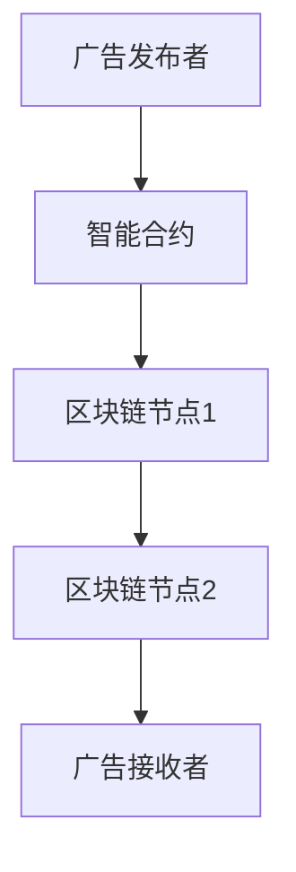
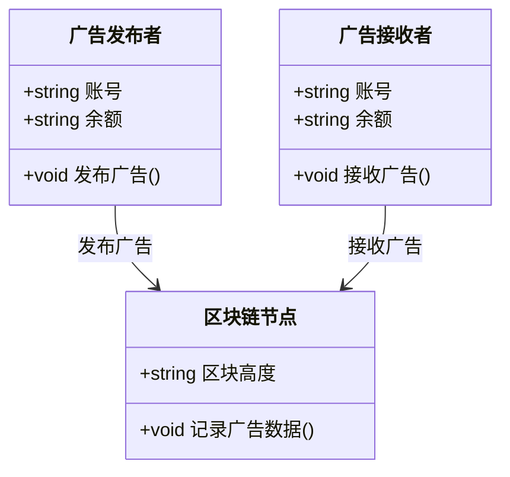
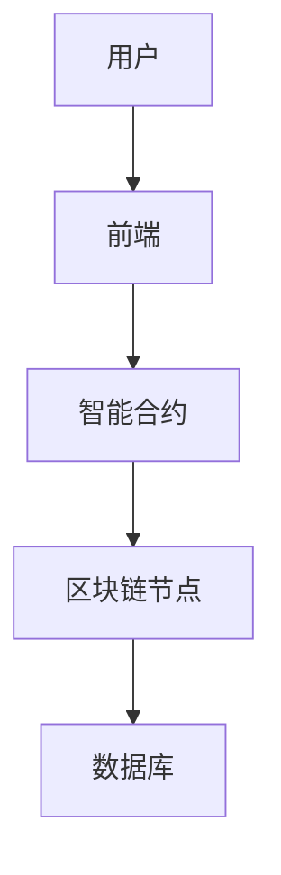
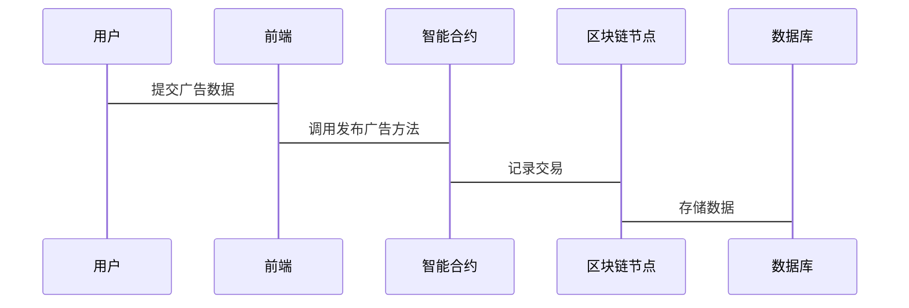

                 


# 企业估值中的区块链数字广告追踪平台评估

## 关键词：区块链，数字广告，企业估值，平台评估，智能合约

## 摘要：本文详细探讨了区块链技术在数字广告追踪平台中的应用，分析了如何利用区块链技术提高广告追踪的透明度和准确性，并基于此提出了企业估值的新方法。文章从背景介绍、核心概念、算法原理、系统架构到项目实战，全面解析了区块链数字广告追踪平台的实现细节及其对企业估值的重要意义。

---

# 第一部分: 企业估值中的区块链数字广告追踪平台概述

## 第1章: 区块链与数字广告追踪平台的背景介绍

### 1.1 问题背景与描述
#### 1.1.1 传统数字广告追踪的痛点
传统数字广告追踪系统存在以下痛点：
- 数据不透明：广告发布者和接收者之间可能存在数据造假，导致广告点击量和展示量无法准确统计。
- 中间商环节多：广告产业链中涉及多个中间商，数据传递过程中容易出现信息丢失或篡改。
- 成本高：传统广告监测公司需要投入大量资源进行数据收集和分析，成本较高。

#### 1.1.2 区块链技术如何解决广告追踪问题
区块链技术具有以下特点，能够有效解决广告追踪问题：
- 去中心化：区块链不依赖中心化机构，数据存储在多个节点上，难以篡改。
- 可追溯性：区块链上的数据可以追溯到源头，确保广告数据的真实性。
- 高透明度：所有交易记录在区块链上公开透明，广告数据可实时查询。

#### 1.1.3 平台评估对企业估值的重要性
企业估值需要依赖广告数据的质量和准确性。通过区块链数字广告追踪平台，可以确保广告数据的真实性和透明性，从而提高企业估值的准确性。

---

## 第2章: 区块链数字广告追踪平台的核心概念与联系

### 2.1 核心概念原理
#### 2.1.1 区块链技术的基本原理
区块链是一种分布式账本技术，通过去中心化的方式记录交易数据，确保数据不可篡改和可追溯。

#### 2.1.2 数字广告追踪的实现机制
数字广告追踪通过区块链记录广告的每一次展示和点击，确保数据不可篡改。

#### 2.1.3 平台评估的数学模型
平台评估需要基于广告数据的真实性和透明性，构建数学模型进行企业估值。

---

## 第3章: 区块链数字广告追踪平台的算法原理

### 3.1 算法原理概述
#### 3.1.1 区块链共识机制的实现
通过共识机制（如PoW、PoS）确保区块链网络中的数据一致性和安全性。

#### 3.1.2 智能合约的工作原理
智能合约自动执行广告数据的记录和验证，确保广告追踪的自动化和不可篡改。

#### 3.1.3 广告数据的哈希计算与存储
广告数据通过哈希函数计算后存储在区块链上，确保数据的唯一性和不可篡改性。

### 3.2 算法流程图


### 3.3 算法实现代码
```python
def calculate_hash(data):
    import hashlib
    return hashlib.sha256(data.encode()).hexdigest()

# 示例广告数据
advertising_data = "banner1.jpg"
hash_value = calculate_hash(advertising_data)
print(f"广告数据哈希值为：{hash_value}")
```

---

# 第二部分: 区块链数字广告追踪平台的系统分析与架构设计

## 第4章: 系统功能设计

### 4.1 领域模型类图


### 4.2 系统架构设计


### 4.3 系统接口设计
- 用户接口：通过前端页面提交广告数据。
- 区块链接口：通过智能合约与区块链节点交互。
- 数据库接口：存储区块链交易记录和广告数据。

### 4.4 系统交互序列图


---

## 第5章: 项目实战

### 5.1 环境安装
- 安装Python和相关库：
  ```bash
  pip install hashlib web3
  ```

### 5.2 核心代码实现
```python
from web3 import Web3
import json

# 初始化区块链节点
web3 = Web3(Web3.HTTPProvider("http://localhost:8545"))

# 智能合约地址和ABI
contract_address = "0x..."
contract_abi = json.loads('...')
contract = web3.eth.contract(address=contract_address, abi=contract_abi)

# 发布广告
def publish_advertiser(data):
    tx_hash = contract.functions.publishAdvertisement(data).transact()
    receipt = web3.eth.waitForTransactionReceipt(tx_hash)
    return receipt

# 接收广告
def receive_advertiser(data):
    tx_hash = contract.functions.receiveAdvertisement(data).transact()
    receipt = web3.eth.waitForTransactionReceipt(tx_hash)
    return receipt
```

### 5.3 实际案例分析
假设我们有一个广告数据“banner1.jpg”，通过区块链平台进行追踪：
1. 广告发布者调用智能合约发布广告。
2. 区块链节点记录交易并存储广告数据。
3. 广告接收者确认广告数据，确保数据真实有效。

### 5.4 项目小结
通过区块链数字广告追踪平台，可以实现广告数据的实时追踪和记录，确保数据的透明性和不可篡改性，从而提高企业估值的准确性。

---

## 第6章: 最佳实践与注意事项

### 6.1 最佳实践
- 定期进行链上数据的备份和归档。
- 使用多重签名钱包提高安全性。
- 定期更新智能合约，修复潜在漏洞。

### 6.2 注意事项
- 确保智能合约的逻辑正确，避免漏洞。
- 定期进行性能优化，提高区块链网络的处理能力。
- 注意数据隐私保护，避免用户数据泄露。

### 6.3 拓展阅读
- 区块链技术入门与应用
- 智能合约开发指南
- 企业估值方法论

---

## 第7章: 小结与展望

### 7.1 本章小结
本文详细探讨了区块链技术在数字广告追踪中的应用，分析了如何通过区块链技术提高广告数据的透明性和准确性，并提出了基于区块链的平台评估方法，为企业估值提供了新的思路。

### 7.2 未来展望
未来，区块链技术在数字广告追踪中的应用将更加广泛，可能涉及更多领域，如广告效果评估、精准营销等。同时，随着技术的进步，区块链数字广告追踪平台的性能和安全性将不断提升，为企业估值提供更准确的数据支持。

---

## 作者：AI天才研究院/AI Genius Institute & 禅与计算机程序设计艺术 /Zen And The Art of Computer Programming

---

以上是关于“企业估值中的区块链数字广告追踪平台评估”的完整文章结构和内容。希望对您有所帮助！

