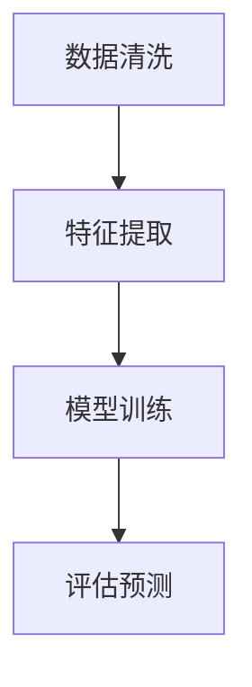
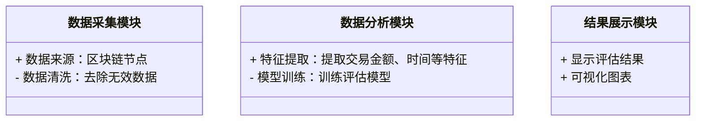
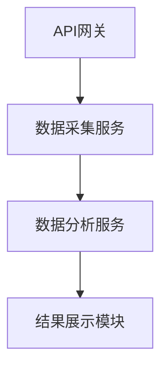

                 


# 《企业估值中的区块链数字资产交易平台评估》

---

## 关键词：
区块链、数字资产、交易平台、企业估值、评估方法

---

## 摘要：
区块链技术的兴起为企业估值中的数字资产交易平台评估提供了新的可能性。本文从区块链技术的基本原理出发，分析数字资产交易平台的运作机制，并提出一套基于区块链的评估指标和数学模型。通过实际案例分析和系统设计，展示了如何利用区块链技术提高企业估值的准确性和透明度。

---

# 第1章：问题背景与重要性

## 1.1 企业估值中的区块链数字资产交易平台评估的重要性

### 1.1.1 区块链技术对企业估值的影响
区块链技术通过去中心化和不可篡改的特性，提高了企业估值中数据的透明度和可信度。例如，区块链可以实时追踪数字资产的交易记录，为企业提供更准确的市场流动性分析。

### 1.1.2 数字资产交易的兴起与挑战
数字资产交易的兴起为企业估值带来了新的机遇，但也带来了数据不透明、交易不合规等挑战。传统估值方法难以满足数字资产交易的实时性和动态性要求。

### 1.1.3 区块链交易平台在企业估值中的作用
区块链交易平台可以提供实时的交易数据和完整的交易历史，帮助企业更准确地评估数字资产的价值和风险。

---

## 1.2 问题背景与现状分析

### 1.2.1 当前企业估值中的痛点
传统估值方法依赖于历史数据和市场分析，难以实时追踪数字资产的动态变化。此外，数据来源的不透明性和交易的匿名性增加了估值的难度。

### 1.2.2 区块链技术在企业估值中的应用现状
目前，区块链技术在企业估值中的应用还处于起步阶段，主要集中在数据采集和初步分析阶段。缺乏系统化的评估方法和工具。

### 1.2.3 传统评估方法的局限性
传统评估方法依赖于历史数据和市场分析，难以捕捉数字资产的实时波动和市场情绪变化。

---

## 1.3 问题解决与目标设定

### 1.3.1 区块链技术如何解决传统估值问题
区块链技术通过提供实时的交易数据和完整的交易历史，解决了传统估值方法中数据不透明和难以实时追踪的问题。

### 1.3.2 本研究的目标与范围
本文的目标是提出一套基于区块链技术的数字资产交易平台评估方法，包括指标体系、算法模型和系统设计。研究范围涵盖区块链技术基础、评估方法、算法实现和系统架构。

---

## 1.4 本章小结
本章从区块链技术对企业估值的影响入手，分析了数字资产交易平台的兴起与挑战，并提出了本文的研究目标和范围。接下来，将详细介绍区块链技术的基本原理和数字资产交易平台的运作机制。

---

# 第2章：区块链技术基础

## 2.1 区块链的基本概念与核心原理

### 2.1.1 区块链的定义与特点
区块链是一种去中心化的分布式账本技术，具有不可篡改、透明性和去信任化的特点。

### 2.1.2 区块链的核心技术
- **分布式账本**：记录所有交易的详细信息，确保数据的完整性和一致性。
- **共识机制**：通过共识算法（如PoW、PoS）确保所有节点达成一致。
- **智能合约**：自动执行预定义的交易规则和条件。

### 2.1.3 区块链的分类与应用场景
区块链可以分为公链、私链和联盟链，广泛应用于金融、供应链管理、数字版权等领域。

---

## 2.2 数字资产的定义与分类

### 2.2.1 数字资产的定义
数字资产是基于区块链技术的虚拟资产，包括加密货币（比特币、以太坊）、代币（ERC-20）、NFT（非同质化代币）等。

### 2.2.2 数字资产的主要分类
- **加密货币**：用于价值存储和支付的数字资产，如比特币、以太坊。
- **代币**：代表特定权益的数字资产，如ERC-20代币。
- **NFT**：非同质化代币，用于表示独特的数字资产，如数字艺术品。

### 2.2.3 数字资产与传统资产的对比
数字资产具有高流动性、匿名性和去中心化的特点，而传统资产则具有较高的稳定性和监管性。

---

## 2.3 区块链数字资产交易平台的运作机制

### 2.3.1 交易流程概述
- 用户通过钱包地址发起交易。
- 交易信息被广播到区块链网络。
- 矿工/验证节点通过共识机制确认交易。
- 交易被打包进区块，生成交易哈希。

### 2.3.2 交易中的关键技术
- **钱包**：用于存储和管理数字资产的工具，分为热钱包和冷钱包。
- **交易哈希**：交易的唯一标识符，用于查询交易状态。
- **区块高度**：区块链中区块的数量，表示交易的时间戳。

### 2.3.3 交易的安全性与透明性
区块链通过密码学技术和共识机制确保交易的安全性和不可篡改性，同时所有交易记录公开透明。

---

## 2.4 本章小结
本章详细介绍了区块链技术的基本原理、数字资产的分类以及交易平台的运作机制。接下来，将探讨如何基于区块链技术构建数字资产交易平台的评估方法。

---

# 第3章：评估指标与模型构建

## 3.1 评估指标的选择与权重分配

### 3.1.1 市场流动性指标
- **交易量**：一定时间内的交易总额，反映市场的活跃度。
- **换手率**：一定时间内的交易次数，反映市场的交易频率。

### 3.1.2 交易活跃度指标
- **交易笔数**：一定时间内的交易次数，反映市场的活跃程度。
- **平均交易价值**：单笔交易的平均金额，反映交易规模。

### 3.1.3 平台安全性指标
- **漏洞数量**：平台历史上发现的安全漏洞数量，反映平台的安全性。
- **攻击事件次数**：平台遭受的网络攻击次数，反映平台的抗风险能力。

### 3.1.4 团队与项目背景指标
- **团队背景**：开发团队的经验和背景，反映平台的可信度。
- **项目白皮书**：项目的详细描述，包括目标、技术架构和 roadmap。

---

## 3.2 评估模型的构建与实现

### 3.2.1 指标权重的确定
使用层次分析法（AHP）确定各指标的权重，权重反映了各指标对企业估值的重要程度。

### 3.2.2 综合评估模型
构建一个加权平均模型，将各指标的权重与其评估结果相乘，求和得到最终评估值。

$$
\text{综合评估值} = \sum_{i=1}^{n} w_i \times s_i
$$

其中，\( w_i \) 为指标 \( i \) 的权重，\( s_i \) 为指标 \( i \) 的评估结果。

---

## 3.3 本章小结
本章提出了基于区块链的数字资产交易平台评估指标体系，并构建了综合评估模型。接下来，将详细讲解评估算法与数学模型。

---

# 第4章：评估算法与数学模型

## 4.1 评估算法的设计与实现

### 4.1.1 数据采集与预处理
- 数据来源：从区块链节点获取交易数据，清洗无效数据。
- 数据特征提取：提取交易时间、交易金额、交易地址等特征。

### 4.1.2 算法流程
1. 数据清洗：去除无效交易记录。
2. 特征提取：提取交易金额、交易时间等特征。
3. 模型训练：使用历史数据训练评估模型。
4. 评估预测：基于实时数据预测平台的评估值。

### 4.1.3 算法流程图


---

## 4.2 数学模型的建立与优化

### 4.2.1 线性回归模型
使用线性回归模型预测交易量：

$$
y = \beta_0 + \beta_1 x + \epsilon
$$

其中，\( y \) 为交易量，\( x \) 为时间变量，\( \beta_0 \) 和 \( \beta_1 \) 为模型参数。

### 4.2.2 模型优化
使用最小二乘法优化模型参数：

$$
\hat{\beta_1} = \frac{\sum_{i=1}^{n} (x_i - \bar{x})(y_i - \bar{y})}{\sum_{i=1}^{n} (x_i - \bar{x})^2}
$$

---

## 4.3 本章小结
本章详细讲解了评估算法的设计与实现，并建立了线性回归模型。接下来，将讨论系统分析与架构设计方案。

---

# 第5章：系统分析与架构设计方案

## 5.1 系统功能设计

### 5.1.1 功能模块划分
- 数据采集模块：从区块链节点获取交易数据。
- 数据分析模块：对交易数据进行清洗和特征提取。
- 结果展示模块：显示评估结果和可视化图表。

### 5.1.2 功能模块类图


---

## 5.2 系统架构设计

### 5.2.1 微服务架构
采用微服务架构设计系统，包括API网关、数据采集服务、数据分析服务等。

### 5.2.2 系统架构图


---

## 5.3 本章小结
本章详细设计了系统功能模块和架构，为后续的项目实现奠定了基础。接下来，将进行项目实战，展示具体的实现过程。

---

# 第6章：项目实战

## 6.1 环境安装与配置

### 6.1.1 环境搭建
- 安装Python 3.8及以上版本。
- 安装必要的库：pandas、numpy、scikit-learn、web3.py。

### 6.1.2 区块链节点部署
部署一个本地的以太坊节点，用于获取交易数据。

---

## 6.2 核心代码实现

### 6.2.1 数据采集模块
```python
from web3 import Web3

# 连接本地节点
w3 = Web3(Web3.HTTPProvider('http://localhost:8545'))

# 获取交易数据
def get_transaction_data(block_number):
    tx_hash = w3.eth.get_transaction_receipt(block_number)['transactionHash']
    return tx_hash.hex()

# 示例：获取指定区块的交易数据
print(get_transaction_data(100))
```

### 6.2.2 数据分析模块
```python
import pandas as pd
import numpy as np

# 数据清洗
data = pd.read_csv('transaction_data.csv')
data.dropna(inplace=True)

# 特征提取
data['交易时间'] = pd.to_datetime(data['区块时间戳'])
data['交易金额'] = data['交易价值'].astype(float)
```

---

## 6.3 项目实战案例分析

### 6.3.1 案例分析
以某数字资产交易平台为例，分析其交易数据，计算市场流动性指标和交易活跃度指标。

### 6.3.2 评估结果展示
使用可视化工具（如Matplotlib）绘制交易量和交易活跃度的对比图。

---

## 6.4 本章小结
本章通过实际案例展示了如何利用区块链技术和数据分析工具进行交易平台评估。接下来，将总结最佳实践和注意事项。

---

# 第7章：最佳实践与总结

## 7.1 实施中的注意事项

### 7.1.1 数据来源的可靠性
确保数据来源的可靠性和完整性，避免数据偏差。

### 7.1.2 模型的可解释性
选择可解释性较强的模型，便于用户理解和信任。

### 7.1.3 系统的安全性
确保系统的安全性，防止数据泄露和网络攻击。

---

## 7.2 未来的发展方向

### 7.2.1 结合人工智能技术
未来可以结合机器学习和深度学习技术，进一步优化评估模型。

### 7.2.2 应用场景扩展
将区块链技术应用到更多领域，如供应链金融、智能合约评估等。

---

## 7.3 拓展阅读

### 7.3.1 区块链技术的最新进展
建议阅读《精通区块链》和《比特币白皮书》。

### 7.3.2 数字资产评估的前沿研究
建议阅读《数字资产评估方法研究》和《区块链技术在金融领域的应用》。

---

## 作者信息

作者：AI天才研究院/AI Genius Institute & 禅与计算机程序设计艺术/Zen And The Art of Computer Programming

---

感谢您的耐心阅读，如需进一步讨论或获取完整文章，请随时联系。

