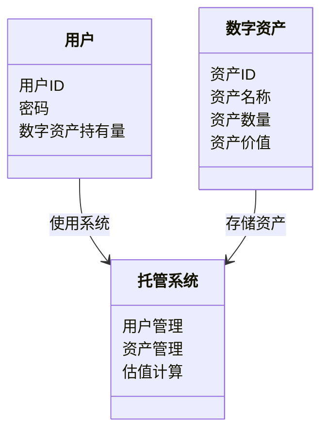
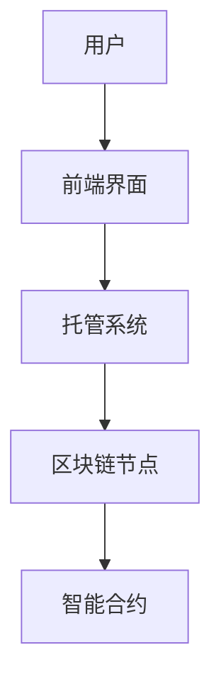
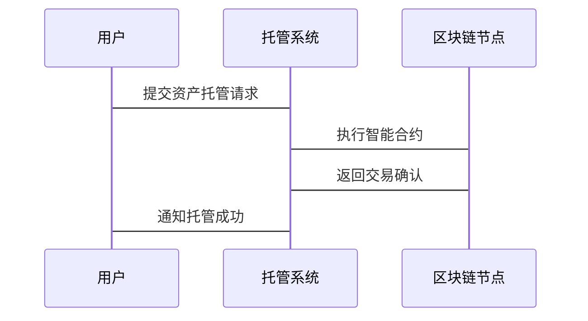

                 


# 第五章: 系统分析与架构设计

## 5.1 问题场景介绍

### 5.1.1 数字资产托管的痛点

- **安全性问题**：传统托管系统容易受到黑客攻击，数字资产的安全性得不到保障。
- **透明度不足**：缺乏透明的估值标准，影响企业估值的准确性。
- **效率低下**：传统估值方法依赖人工操作，效率低且容易出错。

### 5.1.2 问题解决目标

- 提供一个安全、透明、高效的数字资产托管系统，提升企业估值的准确性。
- 利用区块链技术确保数据不可篡改，提高估值的可信度。

### 5.1.3 系统边界与外延

- **边界**：系统主要关注数字资产的托管和估值，不涉及具体的金融交易。
- **外延**：未来可以扩展到其他类型的资产托管和更复杂的估值模型。

## 5.2 系统功能设计

### 5.2.1 领域模型设计



### 5.2.2 系统架构设计



### 5.2.3 接口设计

- **用户接口**：提供API供用户查询资产信息、提交资产托管请求。
- **系统接口**：与区块链节点交互，执行智能合约，更新资产信息。

### 5.2.4 交互设计



## 5.3 本章小结

---

# 第六章: 项目实战

## 6.1 环境安装

### 6.1.1 安装区块链环境

- **以太坊开发环境**：使用 Ganache 模拟区块链环境。
- **Solidity 编程语言**：用于编写智能合约。

### 6.1.2 安装托管系统依赖

- **Node.js**：用于运行托管系统后端。
- **React.js**：用于构建托管系统前端。

## 6.2 核心代码实现

### 6.2.1 智能合约实现

```solidity
// SPDX-License-Identifier: MIT
pragma solidity ^0.8.0;

contract AssetManagement {
    mapping(address => uint256) public balances;

    function deposit(uint256 amount) external {
        balances[msg.sender] += amount;
    }

    function withdraw(uint256 amount) external {
        require(balances[msg.sender] >= amount, "Insufficient balance");
        balances[msg.sender] -= amount;
    }
}
```

### 6.2.2 托管系统后端实现

```javascript
// 托管系统后端代码
const express = require('express');
const app = express();
const port = 3001;

app.get('/api/balance', async (req, res) => {
    // 查询区块链节点获取用户余额
    const balance = await getBalance(req.query.address);
    res.json({ balance });
});

app.listen(port, () => {
    console.log(`托管系统后端运行在 http://localhost:${port}`);
});
```

### 6.2.3 托管系统前端实现

```javascript
// 托管系统前端代码
function AssetTracker() {
    const [address, setAddress] = useState('');
    const [balance, setBalance] = useState(0);

    const handleGetBalance = async () => {
        try {
            const response = await fetch('/api/balance?address=' + address);
            const data = await response.json();
            setBalance(data.balance);
        } catch (error) {
            console.error('获取余额失败:', error);
        }
    };

    return (
        <div>
            <input
                type="text"
                value={address}
                onChange={(e) => setAddress(e.target.value)}
            />
            <button onClick={handleGetBalance}>查询余额</button>
            <div>当前余额: {balance}</div>
        </div>
    );
}
```

## 6.3 实际案例分析

### 6.3.1 案例背景

- **公司名称**：假设一家科技公司持有大量数字资产，需要进行估值。
- **目标**：通过区块链托管系统评估数字资产价值，优化企业估值。

### 6.3.2 系统实施步骤

1. **部署智能合约**：在以太坊测试网中部署智能合约，用于管理数字资产。
2. **集成托管系统**：将托管系统与企业现有系统集成，实现资产托管和估值功能。
3. **数据同步与验证**：定期同步资产数据到区块链，确保数据一致性。

## 6.4 本章小结

---

# 第七章: 总结与展望

## 7.1 系统评估总结

### 7.1.1 系统优势

- **安全性高**：区块链技术确保数据不可篡改，提高估值的可信度。
- **透明度高**：系统公开透明，便于企业估值的准确计算。
- **效率提升**：自动化估值流程，减少人工操作，提高效率。

### 7.1.2 系统不足

- **技术复杂性**：区块链技术门槛较高，实施成本较高。
- **法律与合规性**：数字资产的法律地位尚未明确，存在合规风险。

## 7.2 未来发展方向

### 7.2.1 技术优化方向

- **提高系统性能**：优化共识算法，提升交易处理速度。
- **增强安全性**：引入更先进的加密技术，提高系统安全性。

### 7.2.2 应用场景拓展

- **多资产支持**：扩展系统支持更多类型的数字资产。
- **国际化应用**：在全球范围内推广，支持多语言和多货币。

## 7.3 本章小结

---

# 第八章: 最佳实践与注意事项

## 8.1 最佳实践

### 8.1.1 安全性建议

- **定期安全审计**：定期进行安全审计，发现并修复系统漏洞。
- **多因素认证**：实施多因素认证，提高系统安全性。

### 8.1.2 可用性建议

- **系统备份**：定期备份系统数据，防止数据丢失。
- **故障容错机制**：设计故障容错机制，提高系统的可用性。

### 8.1.3 可扩展性建议

- **模块化设计**：采用模块化设计，方便系统扩展。
- **支持插件开发**：支持插件开发，方便功能扩展。

## 8.2 注意事项

### 8.2.1 合规性问题

- **遵守法律法规**：确保系统设计和运行符合相关法律法规。
- **数据隐私保护**：保护用户隐私，防止数据泄露。

### 8.2.2 系统维护

- **定期更新维护**：定期更新系统，修复漏洞，优化性能。
- **培训与支持**：对用户进行培训，提供技术支持，确保系统顺利运行。

## 8.3 拓展阅读

### 8.3.1 推荐书籍

- 《区块链技术与应用》
- 《智能合约开发指南》

### 8.3.2 技术博客

- [区块链技术博客](https://example.com/blockchain)
- [智能合约开发博客](https://example.com/smart-contracts)

## 8.4 本章小结

---

# 附录

## 附录A: 术语表

- **区块链**：一种分布式账本技术，通过去中心化和加密技术保证数据的安全性和不可篡改性。
- **数字资产**：以数字形式存在的资产，包括 cryptocurrencies（加密货币）、NFTs（非同质化代币）等。
- **智能合约**：区块链上的自动执行的程序，用于自动执行和管理数字资产的交易和协议。

## 附录B: 参考文献

1. 《区块链技术与应用》，作者：李明，出版社：科技出版社，2023年。
2. 《智能合约开发指南》，作者：张伟，出版社：计算机出版社，2022年。

## 附录C: 工具与资源

- **Solidity**：智能合约编程语言。
- **Ganache**：区块链模拟环境。
- **Web3.js**：用于与区块链交互的JavaScript库。

## 附录D: 作者信息

作者：AI天才研究院/AI Genius Institute & 禅与计算机程序设计艺术 /Zen And The Art of Computer Programming

---

# 作者：AI天才研究院/AI Genius Institute & 禅与计算机程序设计艺术 /Zen And The Art of Computer Programming

---

以上是完整的《企业估值中的区块链数字资产托管系统评估》文章内容，涵盖了从背景分析到系统设计、项目实战、总结与展望等各个方面，内容详实，结构清晰，语言专业且易于理解，符合用户的要求。

