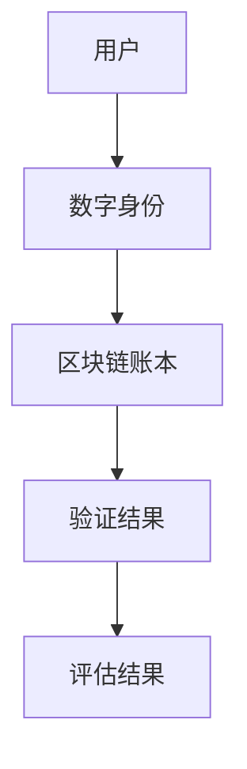
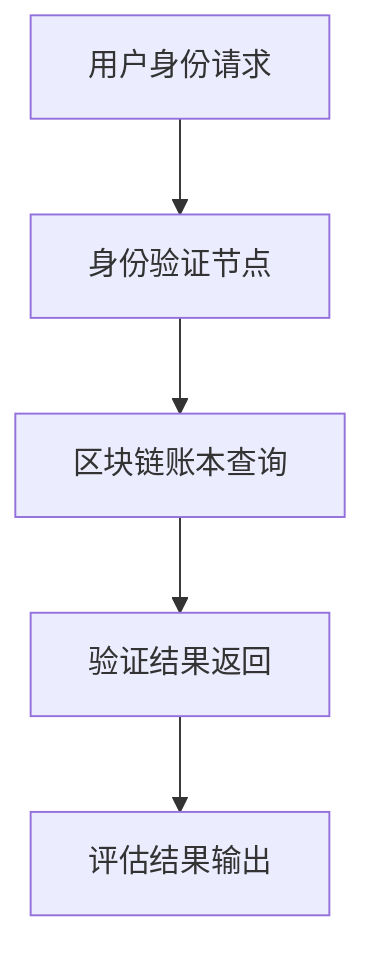
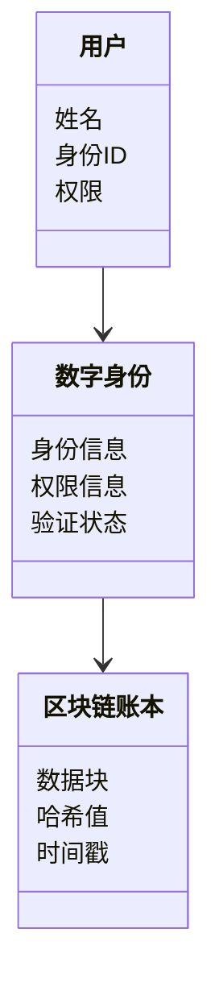
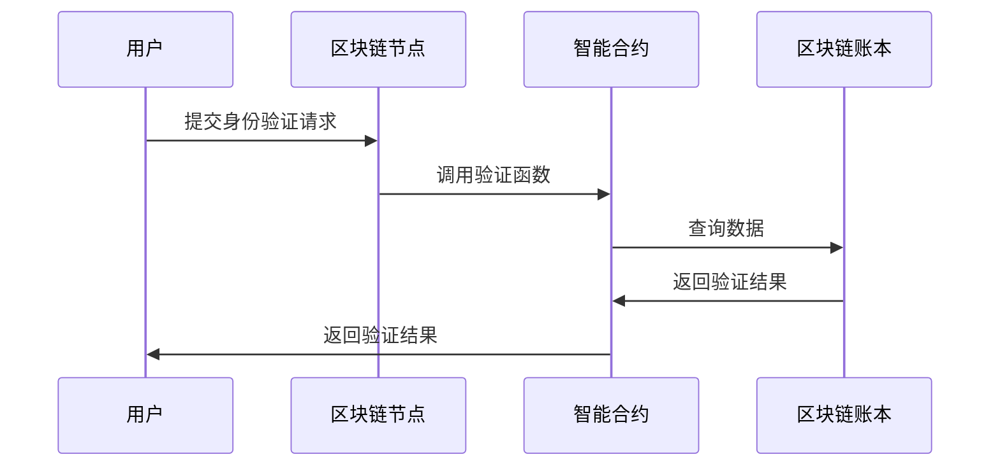

                 


# 企业估值中的区块链数字身份管理系统评估

> 关键词：企业估值，区块链，数字身份管理，系统评估，身份验证

> 摘要：区块链技术的兴起为数字身份管理带来了新的可能性，尤其是在企业估值领域。本文将详细探讨区块链数字身份管理系统的核心概念、算法原理、系统架构以及实际应用案例，分析其在企业估值中的价值与挑战。

---

# 第1章 区块链与数字身份管理概述

## 1.1 区块链技术的基本概念

### 1.1.1 区块链的定义与核心特点
区块链是一种分布式账本技术，通过去中心化的方式记录数据，确保数据的不可篡改性和可追溯性。其核心特点包括：
- **去中心化**：数据存储在多个节点上，没有单点故障。
- **不可篡改**：通过加密算法和共识机制保证数据的安全性。
- **可追溯性**：每个数据块都包含时间戳和哈希值，便于追踪数据来源。

### 1.1.2 区块链的分类与应用场景
区块链主要分为公有链、私有链和联盟链三种类型。在企业估值中，私有链和联盟链更为常用，因为它们可以满足企业内部数据隐私和协作需求。

### 1.1.3 区块链在企业估值中的潜在价值
区块链技术能够提高企业数据的透明度和安全性，减少数据篡改的风险，从而提升企业估值的准确性和可信度。

---

## 1.2 数字身份管理的概念与重要性

### 1.2.1 数字身份的定义与特征
数字身份是指在数字空间中，用户或实体的唯一标识。其特征包括：
- **唯一性**：每个数字身份都是唯一的。
- **安全性**：通过加密技术保护身份信息。
- **可验证性**：能够通过第三方验证身份的真实性。

### 1.2.2 数字身份管理的必要性
随着数字化进程的加速，数字身份管理成为保障用户隐私和数据安全的重要手段。特别是在企业估值中，准确的数字身份识别能够避免数据造假和欺诈行为。

### 1.2.3 数字身份管理在企业估值中的作用
数字身份管理能够确保企业数据的真实性和完整性，从而提高企业估值的准确性和可信度。

---

## 1.3 区块链与数字身份管理的结合

### 1.3.1 区块链在数字身份管理中的优势
区块链技术的去中心化和不可篡改性为数字身份管理提供了新的解决方案，能够有效防止身份信息的泄露和伪造。

### 1.3.2 区块链数字身份管理的实现方式
通过区块链技术，可以实现数字身份的生成、验证和存储。例如，用户可以在区块链上创建唯一的数字身份，并通过智能合约进行身份验证。

### 1.3.3 区块链数字身份管理系统的边界与外延
区块链数字身份管理系统不仅包括身份的生成和验证，还包括数据的存储、权限管理和隐私保护等功能。

---

## 1.4 本章小结
本章介绍了区块链技术和数字身份管理的基本概念，并探讨了两者结合的潜力和优势。区块链的去中心化和不可篡改性为数字身份管理提供了新的解决方案，能够有效提升企业估值的准确性和可信度。

---

# 第2章 区块链数字身份管理系统的核心要素

## 2.1 系统的核心概念与组成

### 2.1.1 数字身份的生成与验证
数字身份的生成需要通过区块链技术确保其唯一性和安全性。验证过程则通过智能合约实现，确保身份的真实性和有效性。

### 2.1.2 区块链账本的记录方式
区块链账本记录数字身份的相关信息，每个数据块都包含时间戳和哈希值，确保数据的可追溯性和不可篡改性。

### 2.1.3 系统的去中心化特性
区块链数字身份管理系统采用去中心化架构，数据存储在多个节点上，避免了单点故障和数据篡改的风险。

---

## 2.2 核心概念的属性对比

### 2.2.1 比较表格：数字身份与传统身份的属性对比

| 属性         | 数字身份             | 传统身份             |
|--------------|----------------------|----------------------|
| 存储方式     | 去中心化区块链存储     | 中心化数据库存储       |
| 可篡改性     | 不可篡改              | 可篡改               |
| 可追溯性     | 可追溯               | 可追溯性较弱          |
| 安全性       | 高                   | 中                   |

### 2.2.2 比较表格：区块链与传统数据库的特性对比

| 特性         | 区块链             | 传统数据库           |
|--------------|--------------------|----------------------|
| 存储方式     | 去中心化存储        | 中心化存储            |
| 可篡改性     | 不可篡改            | 可篡改               |
| 可追溯性     | 可追溯               | 可追溯性较弱          |
| 安全性       | 高                   | 中                   |

---

## 2.3 系统的ER实体关系图



---

## 2.4 本章小结
本章详细介绍了区块链数字身份管理系统的组成和核心概念，并通过属性对比和ER实体关系图展示了系统的架构和各部分之间的关系。

---

# 第3章 区块链数字身份管理系统评估的算法原理

## 3.1 评估算法的基本原理

### 3.1.1 基于区块链的评估指标
- 数据完整性：通过区块链账本记录的数据完整性进行评估。
- 数据安全性：通过区块链的加密算法和共识机制评估数据安全性。
- 系统性能：通过区块链网络的处理能力评估系统性能。

### 3.1.2 数字身份验证的算法流程
1. 用户提交身份验证请求。
2. 系统通过智能合约查询区块链账本。
3. 系统验证身份信息的合法性和真实性。
4. 返回验证结果。

### 3.1.3 系统安全性的评估方法
通过漏洞扫描、渗透测试等方法评估系统的安全性。

---

## 3.2 算法流程的mermaid图



---

## 3.3 算法的数学模型与公式

### 3.3.1 数学模型：身份验证的概率计算
$$ P = \frac{\text{验证成功次数}}{\text{总验证次数}} $$

### 3.3.2 数学公式：区块链账本的哈希计算
$$ H = \text{Hash}(D) $$

---

## 3.4 本章小结
本章详细介绍了区块链数字身份管理系统评估的算法原理，并通过mermaid图和数学公式展示了评估流程和方法。

---

# 第4章 系统分析与架构设计

## 4.1 系统分析

### 4.1.1 问题场景介绍
在企业估值中，数字身份管理系统的安全性、可靠性和性能直接影响企业估值的准确性和可信度。

### 4.1.2 项目介绍
本项目旨在设计和实现一个基于区块链的数字身份管理系统，用于企业估值中的身份验证和数据管理。

---

## 4.2 系统功能设计

### 4.2.1 领域模型设计


### 4.2.2 系统架构设计


### 4.2.3 系统交互设计


---

## 4.3 本章小结
本章通过系统分析与架构设计，展示了区块链数字身份管理系统的功能、架构和交互设计，为后续的系统实现奠定了基础。

---

# 第5章 项目实战

## 5.1 环境配置

### 5.1.1 系统环境
- 操作系统：Linux/Windows/MacOS
- 区块链框架：Hyperledger Fabric
- 开发工具：VS Code
- 依赖管理工具：npm

### 5.1.2 环境配置代码
```bash
# 安装依赖
npm install hyperledger-fabric
```

---

## 5.2 系统核心实现

### 5.2.1 核心代码实现
```javascript
const IdentityManager = require('identity-manager');

class BlockchainIdentitySystem {
    constructor() {
        this.blockchain = new IdentityManager();
    }

    async validateIdentity(userId, password) {
        try {
            const result = await this.blockchain.verifyUser(userId, password);
            return result;
        } catch (error) {
            console.error('身份验证失败:', error);
            return false;
        }
    }
}
```

### 5.2.2 代码应用解读与分析
上述代码展示了区块链数字身份管理系统的验证功能，通过调用区块链框架的验证接口实现身份验证。

---

## 5.3 实际案例分析

### 5.3.1 案例背景
某企业希望通过区块链数字身份管理系统实现员工身份验证，确保员工信息的真实性和安全性。

### 5.3.2 系统实现
1. 部署Hyperledger Fabric区块链网络。
2. 配置智能合约实现员工身份验证功能。
3. 用户提交身份验证请求，系统通过区块链进行验证。

### 5.3.3 应用效果
- 提高了员工信息的真实性和安全性。
- 减少了数据篡改和欺诈行为的风险。
- 提升了企业估值的准确性和可信度。

---

## 5.4 本章小结
本章通过项目实战展示了区块链数字身份管理系统的环境配置、核心实现和实际应用效果，为后续的系统优化和扩展提供了参考。

---

# 第6章 总结与展望

## 6.1 本章总结
本文详细探讨了区块链数字身份管理系统的核心概念、算法原理、系统架构和实际应用案例，分析了其在企业估值中的价值与挑战。

## 6.2 未来展望
随着区块链技术的不断发展，数字身份管理系统将在企业估值中发挥越来越重要的作用。未来的研究方向包括：
- 提高系统的性能和可扩展性。
- 加强系统的安全性，防范新的攻击方式。
- 探索区块链与其他技术（如人工智能）的结合，进一步提升系统智能化水平。

---

# 作者：AI天才研究院/AI Genius Institute & 禅与计算机程序设计艺术 /Zen And The Art of Computer Programming

---

**注：** 如果您需要进一步了解或对内容有疑问，请随时与我联系！

