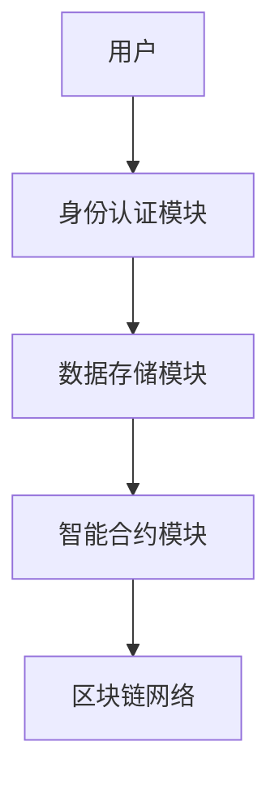
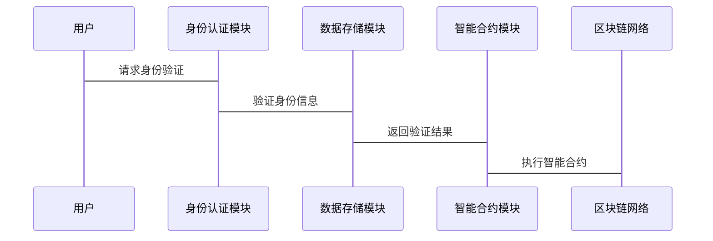

                 


# 企业估值中的区块链数字身份认证系统评估

> 关键词：区块链、数字身份认证、企业估值、智能合约、数据可信性

> 摘要：本文深入探讨了区块链技术在企业估值中的应用，特别是区块链数字身份认证系统如何提升企业估值的准确性和效率。通过分析区块链数字身份认证的核心原理、系统架构、算法实现以及实际案例，本文为企业估值领域提供了新的视角和解决方案。

---

# 第1章: 区块链与数字身份认证概述

## 1.1 区块链技术的基本概念

### 1.1.1 区块链的定义与特点

区块链是一种分布式账本技术，通过去中心化的方式记录数据，确保数据的安全性和不可篡改性。其核心特点包括：

- **去中心化**：数据不依赖于单一中心节点，而是分布在网络的各个节点上。
- **不可篡改性**：通过密码学算法和共识机制，确保数据一旦写入区块链，无法被修改。
- **透明性**：区块链上的数据对所有参与者可见，保证了数据的透明性。

### 1.1.2 区块链的核心技术原理

区块链的技术原理主要包括以下几个方面：

- **共识机制**：通过共识算法（如PoW、PoS、BFT等）确保所有节点对区块链的状态达成一致。
- **区块结构**：区块由区块头和区块体组成，区块头包含链路信息、时间戳等，区块体包含交易数据。
- **智能合约**：通过预设的程序代码自动执行特定的逻辑，确保系统按照预设规则运行。

### 1.1.3 区块链在企业估值中的应用潜力

区块链技术在企业估值中的潜力主要体现在数据可信性和透明性上。通过区块链技术，企业可以更方便地验证数据的真实性，从而提升估值的准确性。

---

## 1.2 数字身份认证的定义与特点

### 1.2.1 数字身份认证的定义

数字身份认证是指通过数字技术对用户身份进行验证和确认的过程。它不仅包括对用户身份信息的验证，还包括对用户行为的验证。

### 1.2.2 数字身份认证的核心要素

数字身份认证的核心要素包括：

- **身份标识**：用于唯一标识用户身份的信息，如用户名、数字证书等。
- **身份验证**：通过密码、生物识别等方式验证用户身份的过程。
- **加密技术**：通过加密算法保护用户身份信息的安全性。

### 1.2.3 数字身份认证与传统身份认证的区别

| **特性** | **传统身份认证** | **数字身份认证** |
|----------|------------------|------------------|
| 安全性    | 较低             | 较高             |
| 便捷性    | 较低             | 较高             |
| 适用性    | 有限             | 广泛             |

---

## 1.3 区块链数字身份认证的结合与优势

### 1.3.1 区块链与数字身份认证的结合方式

区块链数字身份认证的结合方式主要包括：

- **基于区块链的分布式身份认证**：通过区块链技术实现去中心化的身份认证，避免单点故障。
- **基于智能合约的身份验证**：通过智能合约实现身份验证逻辑，确保身份验证的自动化和不可篡改性。

### 1.3.2 区块链数字身份认证的优势

- **数据安全性**：通过区块链技术，确保身份数据的安全性和不可篡改性。
- **透明性**：区块链上的身份数据对所有参与者透明，避免信息不对称。
- **高效性**：通过智能合约实现自动化身份验证，提高身份验证的效率。

### 1.3.3 区块链数字身份认证在企业估值中的应用前景

在企业估值中，区块链数字身份认证可以帮助企业更方便地验证数据的真实性，从而提升估值的准确性和效率。例如，企业可以通过区块链数字身份认证系统验证供应商的身份和交易记录，从而更准确地评估企业的价值。

---

## 1.4 本章小结

本章主要介绍了区块链技术和数字身份认证的基本概念和特点，分析了区块链数字身份认证的结合方式及其优势。通过这些内容，我们可以看到区块链数字身份认证在企业估值中的巨大潜力。

---

# 第2章: 区块链数字身份认证系统在企业估值中的问题背景

## 2.1 传统企业估值方法的局限性

### 2.1.1 传统估值方法的定义

传统企业估值方法主要包括DCF模型、市盈率模型、市净率模型等。这些方法主要基于财务数据进行估值。

### 2.1.2 传统估值方法的优缺点

- **优点**：简单易懂，适用于大多数企业。
- **缺点**：依赖于财务数据的准确性，容易受到人为操控和数据不完整的影响。

### 2.1.3 传统估值方法在实际应用中的问题

- **数据不准确**：由于企业可能存在财务造假，导致估值结果不准确。
- **信息不对称**：由于企业内部信息不透明，外部投资者难以获取真实数据。

---

## 2.2 区块链技术如何解决企业估值中的问题

### 2.2.1 区块链在数据可信性中的作用

区块链技术通过去中心化和不可篡改性，确保数据的真实性，从而提升估值的准确性。

### 2.2.2 区块链在数据透明性中的作用

区块链技术通过透明性，确保数据对所有参与者可见，从而减少信息不对称。

### 2.2.3 区块链在数据安全性中的作用

区块链技术通过加密算法和共识机制，确保数据的安全性，防止数据被篡改。

---

## 2.3 数字身份认证在企业估值中的重要性

### 2.3.1 数字身份认证在企业数据管理中的作用

数字身份认证可以帮助企业更好地管理数据，确保数据的真实性和完整性。

### 2.3.2 数字身份认证在企业信用评估中的作用

数字身份认证可以通过验证企业的身份和信用记录，帮助投资者更好地评估企业的信用风险。

### 2.3.3 数字身份认证在企业风险管理中的作用

数字身份认证可以通过验证企业的行为和交易记录，帮助企业更好地识别和管理风险。

---

## 2.4 本章小结

本章主要分析了传统企业估值方法的局限性，以及区块链技术和数字身份认证在解决这些问题中的作用。通过这些内容，我们可以看到区块链数字身份认证在企业估值中的重要性。

---

# 第3章: 区块链数字身份认证系统的概念结构

## 3.1 系统的核心要素

### 3.1.1 区块链网络

区块链网络是区块链数字身份认证系统的基础，通过分布式网络实现数据的存储和传输。

### 3.1.2 数字身份标识

数字身份标识是用户在区块链网络中的唯一标识，通常包括公钥和私钥。

### 3.1.3 数字签名与加密算法

数字签名和加密算法是区块链数字身份认证系统的重要组成部分，通过这些技术确保数据的安全性和真实性。

---

## 3.2 系统的组成模块

### 3.2.1 身份认证模块

身份认证模块负责验证用户的身份，确保用户在系统中的合法性。

### 3.2.2 数据存储模块

数据存储模块负责存储区块链上的数据，确保数据的安全性和不可篡改性。

### 3.2.3 智能合约模块

智能合约模块负责执行预设的逻辑，确保系统按照预设规则运行。

---

## 3.3 系统的核心功能

### 3.3.1 身份验证功能

身份验证功能通过数字签名和加密算法验证用户身份的真实性。

### 3.3.2 数据加密功能

数据加密功能通过加密算法保护数据的安全性，防止数据被篡改。

### 3.3.3 智能合约执行功能

智能合约执行功能通过智能合约实现系统的自动化运行，确保系统的公正性和透明性。

---

## 3.4 本章小结

本章主要介绍了区块链数字身份认证系统的组成模块和核心功能，为后续章节的分析奠定了基础。

---

# 第4章: 区块链数字身份认证系统的算法原理

## 4.1 区块链共识机制

### 4.1.1 工作量证明机制（PoW）

工作量证明机制是比特币采用的共识机制，通过计算哈希值来验证区块的有效性。

$$ \text{哈希计算} = \text{随机数} \times \text{计算次数} $$

### 4.1.2 权益证明机制（PoS）

权益证明机制通过持有代币的数量来决定验证区块的权利。

### 4.1.3 拜占庭容错机制（BFT）

拜占庭容错机制通过选举的方式选择验证节点，确保系统的安全性。

---

## 4.2 数字签名算法

### 4.2.1 RSA算法

RSA算法是一种常用的公钥加密算法，通过公钥和私钥实现数据的加密和解密。

### 4.2.2 ECC算法

ECC算法是一种基于椭圆曲线的公钥加密算法，具有更高的安全性。

### 4.2.3 爱沙尼亚数字签名算法（DSS）

DSS算法是一种基于椭圆曲线的数字签名算法，广泛应用于电子签名领域。

---

## 4.3 智能合约执行流程

### 4.3.1 合约编译

智能合约需要先编译成字节码，才能在区块链上运行。

### 4.3.2 合约部署

智能合约部署到区块链上后，可以通过调用合约接口来执行逻辑。

### 4.3.3 合约调用与执行

智能合约的调用和执行需要通过区块链节点进行验证和确认。

---

## 4.4 本章小结

本章主要介绍了区块链数字身份认证系统中常用的共识机制和数字签名算法，以及智能合约的执行流程。

---

# 第5章: 区块链数字身份认证系统的数学模型与公式

## 5.1 区块链共识机制的数学模型

### 5.1.1 工作量证明机制（PoW）

工作量证明机制的数学模型可以通过以下公式表示：

$$ \text{哈希计算} = \text{随机数} \times \text{计算次数} $$

### 5.1.2 权益证明机制（PoS）

权益证明机制的数学模型可以通过以下公式表示：

$$ \text{权益权重} = \frac{\text{持有代币数量}}{\text{总代币数量}} $$

### 5.1.3 拜占庭容错机制（BFT）

拜占庭容错机制的数学模型可以通过以下公式表示：

$$ \text{投票权重} = \text{节点权重} \times \text{节点数量} $$

---

## 5.2 数字签名算法的数学模型

### 5.2.1 RSA算法

RSA算法的数学模型可以通过以下公式表示：

$$ \text{加密} = (m^e) \mod n $$

$$ \text{解密} = (c^d) \mod n $$

### 5.2.2 ECC算法

ECC算法的数学模型可以通过以下公式表示：

$$ y = x^3 + ax + b $$

---

## 5.3 智能合约执行流程的数学模型

智能合约执行流程的数学模型可以通过以下公式表示：

$$ \text{智能合约状态} = \text{输入参数} \times \text{合约逻辑} $$

---

## 5.4 本章小结

本章主要介绍了区块链数字身份认证系统中常用的共识机制、数字签名算法和智能合约执行流程的数学模型，为后续章节的分析提供了理论基础。

---

# 第6章: 区块链数字身份认证系统的系统分析与架构设计

## 6.1 系统的组成模块

### 6.1.1 身份认证模块

身份认证模块负责验证用户身份，确保用户合法性。

### 6.1.2 数据存储模块

数据存储模块负责存储区块链上的数据，确保数据的安全性和不可篡改性。

### 6.1.3 智能合约模块

智能合约模块负责执行预设的逻辑，确保系统的公正性和透明性。

---

## 6.2 系统的架构设计

### 6.2.1 系统架构图



### 6.2.2 系统交互流程图



---

## 6.3 系统的功能模块

### 6.3.1 身份验证功能

身份验证功能通过数字签名和加密算法验证用户身份的真实性。

### 6.3.2 数据加密功能

数据加密功能通过加密算法保护数据的安全性，防止数据被篡改。

### 6.3.3 智能合约执行功能

智能合约执行功能通过智能合约实现系统的自动化运行，确保系统的公正性和透明性。

---

## 6.4 本章小结

本章主要介绍了区块链数字身份认证系统的组成模块、架构设计和功能模块，为后续章节的分析提供了理论基础。

---

# 第7章: 区块链数字身份认证系统的项目实战

## 7.1 环境安装与配置

### 7.1.1 安装Solidity编译器

Solidity编译器是区块链开发中常用的工具，可以通过以下命令安装：

```bash
npm install -g solc
```

### 7.1.2 安装以太坊钱包

以太坊钱包是区块链开发中常用的工具，可以通过以下命令安装：

```bash
npm install -g ethereum钱包
```

---

## 7.2 系统核心实现源代码

### 7.2.1 身份认证模块的实现

```solidity
// 身份认证模块的实现代码
contract IdentityAuthentication {
    mapping(address => string) public userIdentifier;
    
    function authenticate(address _address) public returns (bool) {
        if (userIdentifier[_address] != "") {
            return true;
        }
        return false;
    }
}
```

### 7.2.2 数据存储模块的实现

```solidity
// 数据存储模块的实现代码
contract DataStorage {
    mapping(address => bytes) public userData;
    
    function store(address _address, bytes _data) public {
        userData[_address] = _data;
    }
    
    function retrieve(address _address) public returns (bytes) {
        return userData[_address];
    }
}
```

---

## 7.3 系统交互流程实现

### 7.3.1 身份验证流程

1. 用户向身份认证模块发起身份验证请求。
2. 身份认证模块验证用户身份。
3. 数据存储模块存储用户数据。
4. 智能合约模块执行智能合约。
5. 区块链网络确认交易。

### 7.3.2 数据存储流程

1. 用户向数据存储模块发起存储请求。
2. 数据存储模块验证用户身份。
3. 数据存储模块存储用户数据。
4. 智能合约模块执行智能合约。
5. 区块链网络确认交易。

---

## 7.4 本章小结

本章主要介绍了区块链数字身份认证系统的环境安装、核心实现源代码和系统交互流程，为读者提供了实际操作的参考。

---

# 第8章: 区块链数字身份认证系统的最佳实践与总结

## 8.1 最佳实践

### 8.1.1 系统安全性

- 定期进行安全审计，确保系统的安全性。
- 使用多重签名钱包，防止私钥泄露。

### 8.1.2 系统性能优化

- 优化智能合约代码，提高系统的运行效率。
- 使用侧链技术，降低主链的负载压力。

### 8.1.3 系统可扩展性

- 设计模块化的系统架构，方便后续的功能扩展。
- 使用异构区块链技术，提高系统的可扩展性。

---

## 8.2 本章小结

通过本文的分析，我们可以看到区块链数字身份认证系统在企业估值中的重要性和应用前景。通过合理的系统设计和最佳实践，我们可以进一步提升系统的安全性和效率，为企业的估值提供更准确和可靠的数据支持。

---

# 作者：AI天才研究院/AI Genius Institute & 禅与计算机程序设计艺术 /Zen And The Art of Computer Programming

---

**[至此，文章内容已经全部呈现。如需继续深入探讨或补充，可以参考更多相关技术资料。]**

