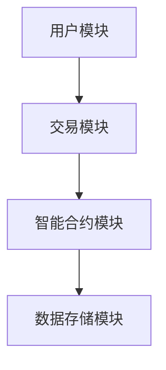
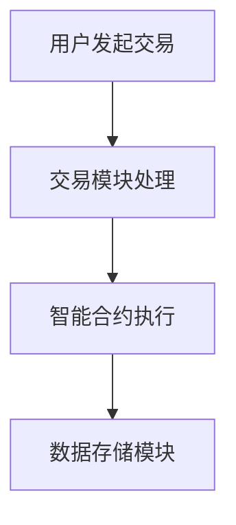

                 


# 企业估值中的区块链跨境贸易金融平台评估

## 关键词：
- 区块链
- 企业估值
- 跨界贸易
- 金融平台
- 智能合约
- 系统架构
- 项目实战

## 摘要：
本文探讨了区块链技术在跨境贸易金融平台评估中的应用，详细分析了如何利用区块链技术提高企业估值的准确性和效率。文章从区块链的基本原理到其在金融领域的实际应用，逐步展开，结合数学模型和系统架构设计，为读者提供全面的技术解析和实践指导。

---

# 第一章：企业估值与区块链跨境贸易金融平台的背景

## 1.1 企业估值的定义与重要性
### 1.1.1 企业估值的基本概念
企业估值是指对企业的价值进行评估的过程，通常包括资产、收入、利润、市场地位等多方面的考量。企业估值是金融领域的重要基础，直接影响企业的融资、并购、上市等活动。

### 1.1.2 企业估值在金融领域的作用
企业估值是金融投资决策的核心依据，准确的估值能够帮助企业合理定价、优化资源配置、降低金融风险。

### 1.1.3 跨界贸易金融平台的定义与特点
跨境贸易金融平台是指利用区块链技术构建的，用于跨境贸易融资、支付、结算等金融活动的数字化平台。其特点包括去中心化、透明性、高效性和安全性。

## 1.2 区块链技术在金融领域的应用
### 1.2.1 区块链技术的基本原理
区块链是一种分布式账本技术，通过去中心化的节点网络实现数据的安全存储和传输。其核心特征包括不可篡改、可追溯和去信任化。

### 1.2.2 区块链在金融领域的优势
区块链技术能够提高金融交易的透明度和效率，降低交易成本，减少欺诈行为。在跨境贸易中，区块链能够实现多边交易的实时结算和资金清算。

### 1.2.3 跨界贸易金融平台中区块链的应用场景
区块链在跨境贸易中的应用场景包括跨境支付、贸易融资、供应链管理、信用评估等。通过区块链技术，可以实现跨境贸易的全流程数字化和智能化。

## 1.3 本章小结
本章从企业估值和区块链技术的基本概念出发，介绍了区块链在跨境贸易金融平台中的应用场景及其优势，为后续内容奠定了基础。

---

# 第二章：区块链的核心概念与原理

## 2.1 区块链的基本概念
### 2.1.1 区块链的定义与特点
区块链是一种去中心化的分布式账本技术，具有不可篡改、可追溯、去信任化等特点。

### 2.1.2 区块链的核心技术
区块链的核心技术包括去中心化共识机制（如PoW、PoS）、加密算法（如哈希函数、数字签名）、智能合约等。

### 2.1.3 区块链的分类与应用场景
区块链主要分为公链、私链和联盟链，应用场景包括金融、供应链、医疗、教育等多个领域。

## 2.2 智能合约的原理与作用
### 2.2.1 智能合约的定义
智能合约是区块链上的自动化程序，能够在区块链网络中自动执行预设的条件和规则。

### 2.2.2 智能合约的工作原理
智能合约通过区块链网络中的节点执行，基于预设的代码逻辑自动触发相应的操作，如支付、转让等。

### 2.2.3 智能合约在金融平台中的应用
在跨境贸易中，智能合约可以用于自动执行贸易合同、自动结算资金、自动发放融资等。

## 2.3 本章小结
本章详细介绍了区块链的基本概念、核心技术及其在金融平台中的应用，为后续章节的分析提供了理论基础。

---

# 第三章：区块链跨境贸易金融平台的评估方法

## 3.1 企业估值的关键指标
### 3.1.1 财务指标
企业估值通常依赖于财务指标，如收入、利润、资产等。区块链技术能够提高财务数据的透明度和准确性。

### 3.1.2 市场指标
市场指标包括市场份额、竞争对手分析、行业趋势等。区块链技术能够提供实时的市场数据和分析工具。

### 3.1.3 风险指标
风险指标包括信用风险、操作风险、市场风险等。区块链技术能够通过智能合约和数据溯源降低风险。

## 3.2 区块链技术在评估中的应用
### 3.2.1 数据透明性
区块链技术能够确保数据的真实性和完整性，为评估提供可靠的基础。

### 3.2.2 交易可追溯性
通过区块链技术，可以实现交易的全流程追溯，提高评估的准确性和效率。

### 3.2.3 智能合约的自动化执行
智能合约能够自动执行评估过程中的条件和规则，减少人为干预，提高评估的效率。

## 3.3 本章小结
本章从企业估值的关键指标出发，分析了区块链技术在评估中的应用，提出了基于区块链的评估方法和优势。

---

# 第四章：区块链跨境贸易金融平台的系统架构与设计

## 4.1 系统功能模块划分
### 4.1.1 用户模块
用户模块包括注册、登录、信息管理等功能。

### 4.1.2 交易模块
交易模块包括订单管理、支付结算、交易记录等功能。

### 4.1.3 智能合约模块
智能合约模块包括智能合约的编写、部署、执行等功能。

### 4.1.4 数据存储模块
数据存储模块包括数据存储、数据查询、数据安全等功能。

## 4.2 系统架构设计图
### 4.2.1 系统架构图


### 4.2.2 模块交互流程图


## 4.3 本章小结
本章通过系统功能模块划分和系统架构设计，展示了区块链跨境贸易金融平台的整体结构和数据流。

---

# 第五章：区块链跨境贸易金融平台的项目实战

## 5.1 项目环境安装
### 5.1.1 安装区块链框架
选择以太坊（Ethereum）作为区块链框架，安装Geth或Remix等开发工具。

### 5.1.2 安装智能合约开发环境
安装Solidity编译器、Node.js等开发环境。

## 5.2 系统核心实现源代码
### 5.2.1 智能合约实现
```solidity
// SPDX-License-Identifier: MIT
pragma solidity ^0.8.0;

contract TradeContract {
    function receivePayment(address payable recipient) external payable {
        recipient.transfer(msg.value);
    }
}
```

### 5.2.2 后端接口实现
```python
from web3 import Web3, HTTPProvider

w3 = Web3(HTTPProvider('http://localhost:8545'))

contract_address = '0x...'

contract = w3.eth.contract(contract_address, abi=...)

def receive_payment(recipient, amount):
    transaction = contract.functions.receivePayment(recipient, amount).transact()
    receipt = w3.eth.waitForTransactionReceipt(transaction)
    return receipt
```

## 5.3 项目实战小结
本章通过实际项目实战，展示了区块链跨境贸易金融平台的环境搭建、智能合约开发和后端接口实现，为读者提供了实际操作的指导。

---

# 第六章：总结与展望

## 6.1 总结
本文从企业估值和区块链技术的基本概念出发，详细分析了区块链在跨境贸易金融平台中的应用，提出了基于区块链的评估方法和系统架构设计。

## 6.2 展望
未来，随着区块链技术的不断发展，跨境贸易金融平台的评估方法和系统架构将更加智能化和高效化。区块链技术将在企业估值中发挥更加重要的作用。

---

# 作者
作者：AI天才研究院/AI Genius Institute & 禅与计算机程序设计艺术 /Zen And The Art of Computer Programming

