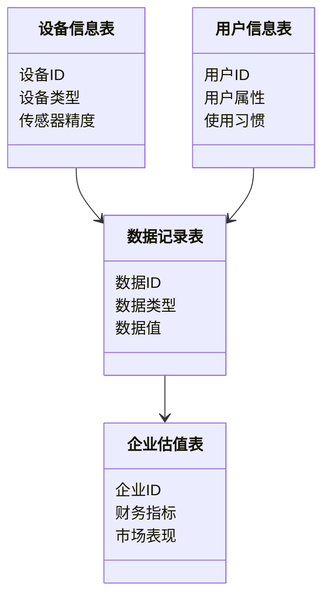
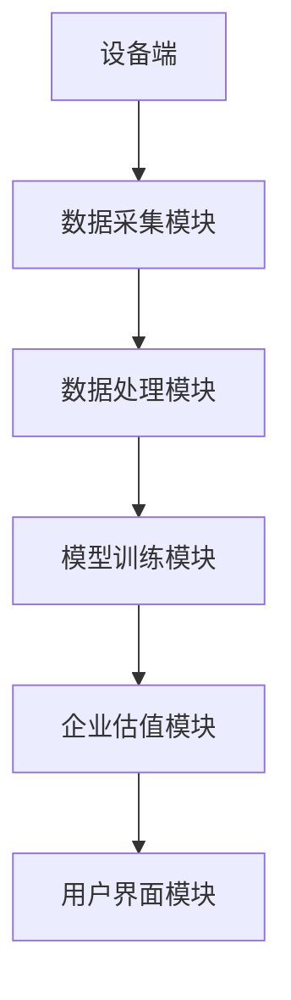
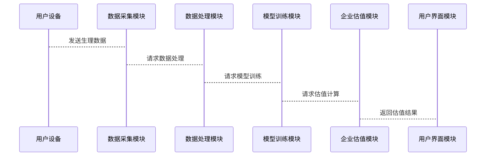

                 


# 企业估值中的可穿戴医疗设备评估

## 关键词：可穿戴医疗设备、企业估值、数据分析、算法原理、系统架构

## 摘要：  
随着可穿戴医疗设备的普及，其在企业估值中的作用日益重要。本文从背景介绍、核心概念、算法原理、系统架构、项目实战等多个维度，详细分析了可穿戴医疗设备如何影响企业估值。通过数据采集与预处理、评估模型构建、企业估值模型设计等步骤，结合实际案例，展示了如何利用可穿戴医疗设备的数据提升企业估值的准确性与科学性。

---

# 第1章: 背景介绍与问题背景

## 1.1 可穿戴医疗设备的定义与特点

### 1.1.1 可穿戴医疗设备的定义  
可穿戴医疗设备是指能够佩戴在人体或附着在身体表面，用于监测、记录和分析生理数据的智能设备。它们通常具备实时数据采集、无线传输和用户交互功能。

### 1.1.2 可穿戴医疗设备的核心特点  
1. **实时监测**：能够持续采集生理数据，如心率、血压、体温等。
2. **便捷性**：用户可以随时随地使用，无需固定设备。
3. **智能化**：通过传感器和算法，设备能够自动分析数据并提供反馈。
4. **多样性**：涵盖健康监测、疾病管理、运动辅助等多种应用场景。

### 1.1.3 可穿戴医疗设备的分类与应用场景  
- **健康监测类**：如智能手表、健康手环，用于监测心率、步数、睡眠质量等。
- **疾病管理类**：如血糖仪、心电图监测设备，用于慢性病患者的日常管理。
- **运动辅助类**：如运动追踪器，用于运动员的运动数据分析。

---

## 1.2 企业估值的基本概念与方法

### 1.2.1 企业估值的定义与重要性  
企业估值是指对企业的整体价值进行评估的过程，通常用于投资决策、并购交易等领域。准确的企业估值能够帮助投资者和企业管理者做出科学的决策。

### 1.2.2 企业估值的主要方法与模型  
1. **财务指标法**：通过分析企业的财务报表，如利润、收入、资产负债率等指标进行估值。
2. **市场比较法**：通过比较同类企业的市场表现，推导目标企业的价值。
3. **DCF模型**：通过现金流折现法（Discounted Cash Flow, DCF）评估企业未来现金流的现值。

### 1.2.3 可穿戴医疗设备对企业估值的影响  
随着可穿戴医疗设备的普及，企业能够通过这些设备收集用户的健康数据，从而更好地了解用户需求、优化产品和服务，进而影响企业的市场竞争力和估值。

---

## 1.3 问题背景与研究意义

### 1.3.1 可穿戴医疗设备在企业中的应用现状  
目前，可穿戴医疗设备在健康管理、疾病预防、医疗辅助等领域得到了广泛应用，但其在企业估值中的应用仍处于起步阶段。

### 1.3.2 当前企业估值中的痛点与挑战  
1. **数据不足**：传统企业估值主要依赖财务数据，难以全面反映企业的市场潜力和用户价值。
2. **数据孤岛**：企业内部和外部数据分散，缺乏有效整合和分析。
3. **技术局限**：传统估值方法难以应对复杂市场环境下的动态变化。

### 1.3.3 研究可穿戴医疗设备评估的必要性与意义  
通过可穿戴医疗设备的数据，企业可以更全面地了解用户需求和市场趋势，从而为估值提供更准确的支持。这不仅能够提升估值的准确性，还能为企业制定战略决策提供数据依据。

---

# 第2章: 核心概念与联系

## 2.1 可穿戴医疗设备评估的核心概念

### 2.1.1 数据采集与处理  
可穿戴医疗设备通过传感器采集用户的生理数据，如心率、血压、体温等，并通过无线传输将数据发送到云端或本地系统进行处理。

### 2.1.2 设备性能与质量评估  
通过对设备的性能指标（如传感器精度、数据传输稳定性等）进行评估，确保设备数据的准确性和可靠性。

### 2.1.3 用户行为与偏好分析  
分析用户的使用习惯、偏好和行为模式，为企业的产品优化和市场定位提供依据。

## 2.2 企业估值模型中的关键因素

### 2.2.1 财务指标与市场表现  
包括企业的收入、利润、市场份额等财务指标，以及市场趋势、竞争环境等外部因素。

### 2.2.2 技术创新与竞争优势  
企业的技术创新能力、专利持有情况以及竞争优势是影响估值的重要因素。

### 2.2.3 用户数据与市场潜力  
通过可穿戴设备获取的用户数据，能够帮助企业更好地理解市场需求，挖掘潜在的市场机会。

## 2.3 核心概念的联系与对比

### 2.3.1 核心概念属性对比表  
| 概念         | 特性                     | 描述                                   |
|--------------|--------------------------|----------------------------------------|
| 数据采集     | 实时性、准确性           | 通过传感器采集用户生理数据             |
| 设备性能     | 精度、稳定性             | 设备的传感器精度和数据传输的稳定性       |
| 用户行为     | 使用频率、偏好         | 用户对设备的使用习惯和偏好             |
| 企业估值     | 财务指标、市场表现       | 企业的财务状况和市场环境               |

### 2.3.2 ER实体关系图架构  
```mermaid
erd
    简化模式
    有
    设备信息表
    用户信息表
    数据记录表
    企业估值表
    关系：设备-用户、数据-估值
```

---

# 第3章: 可穿戴医疗设备评估的算法原理

## 3.1 数据采集与预处理

### 3.1.1 数据采集方法  
通过传感器采集用户的生理数据，如心率、血压等，并通过无线传输将数据发送到云端。

### 3.1.2 数据清洗与特征提取  
对采集到的数据进行去噪、归一化处理，并提取关键特征，如心率变异度（HRV）、步频等。

### 3.1.3 数据标注与标准化  
根据用户行为和健康状况对数据进行标注，并将其标准化，以便后续分析。

## 3.2 评估模型的构建与训练

### 3.2.1 算法选择与原理  
常用的算法包括支持向量机（SVM）、随机森林（Random Forest）和神经网络（ANN）。通过训练模型，可以预测设备的性能指标和用户健康状况。

### 3.2.2 模型训练流程  
1. 数据预处理：清洗、特征提取、标准化。
2. 模型选择：根据数据特点选择合适的算法。
3. 模型训练：使用训练数据对模型进行训练。
4. 模型评估：通过测试数据评估模型的准确性和稳定性。

### 3.2.3 模型评估与优化  
通过交叉验证、混淆矩阵等方法评估模型性能，并通过调整参数优化模型。

## 3.3 算法原理的数学模型与公式

### 3.3.1 数据处理公式  
$$
\text{归一化公式} = \frac{x - \min(x)}{\max(x) - \min(x)}
$$

### 3.3.2 模型训练公式  
$$
\text{损失函数} = \sum_{i=1}^{n} (y_i - \hat{y}_i)^2
$$

### 3.3.3 评估指标与优化目标  
- **准确率**：正确预测的比例。
- **召回率**：模型识别出的正例比例。
- **F1分数**：综合准确率和召回率的指标。

---

# 第4章: 企业估值模型的系统分析与架构设计

## 4.1 问题场景介绍

### 4.1.1 可穿戴医疗设备的市场现状  
当前市场中，可穿戴医疗设备的应用主要集中在健康监测和疾病管理领域。

### 4.1.2 企业估值中的关键问题  
企业估值依赖于财务数据和市场表现，但缺乏用户行为和健康数据的支持，导致估值不够全面。

### 4.1.3 系统设计的目标与范围  
设计一个基于可穿戴医疗设备数据的企业估值系统，通过整合用户数据和财务数据，提升估值的准确性和科学性。

## 4.2 系统功能设计

### 4.2.1 领域模型  


## 4.3 系统架构设计

### 4.3.1 系统架构图  


### 4.3.2 系统交互设计  


---

# 第5章: 项目实战

## 5.1 环境安装与配置

### 5.1.1 开发环境  
- 操作系统：Windows 10 或 macOS 10.15+
- 开发工具：Python 3.8+，Jupyter Notebook
- 依赖库：numpy、pandas、scikit-learn、mermaid、matplotlib

## 5.2 系统核心实现源代码

### 5.2.1 数据采集与处理  
```python
import numpy as np
import pandas as pd

# 示例数据
data = {
    '时间': [1, 2, 3, 4, 5],
    '心率': [70, 72, 68, 75, 70],
    '血压': [120, 125, 118, 130, 122],
    '体温': [36.5, 36.7, 36.6, 36.4, 36.5]
}
df = pd.DataFrame(data)
```

### 5.2.2 模型训练与评估  
```python
from sklearn.model

