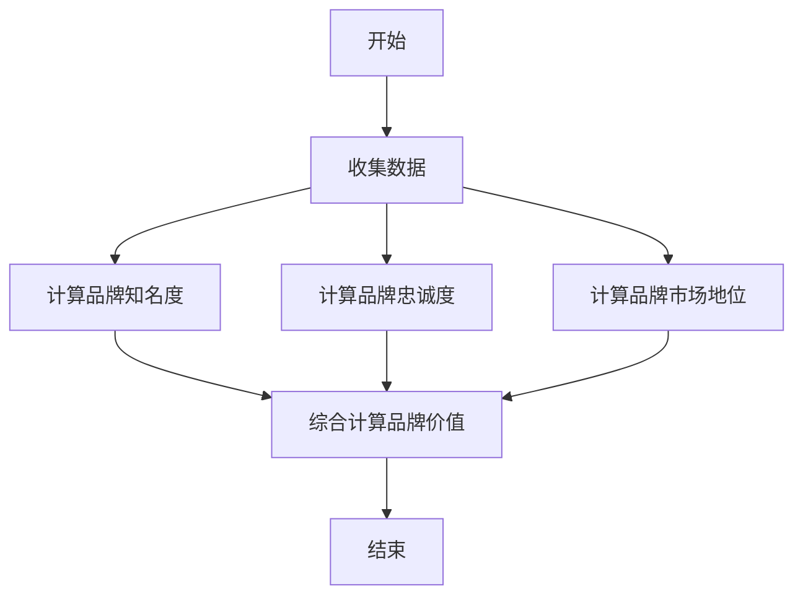
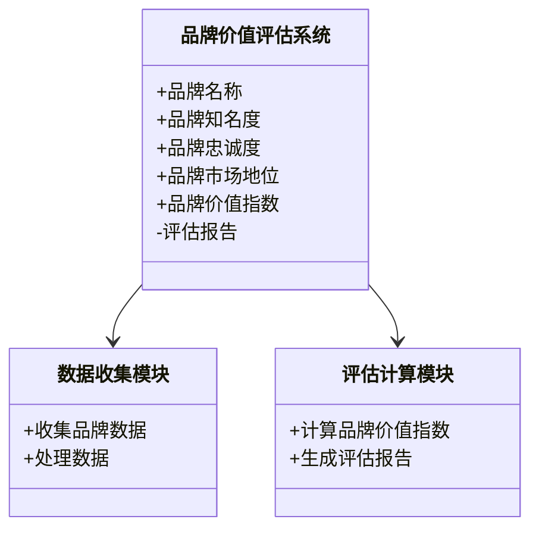

                 


# 企业估值中的品牌价值量化方法

> 关键词：企业估值、品牌价值、量化方法、财务数据、市场调研、品牌影响力、品牌忠诚度

> 摘要：  
本文详细探讨了在企业估值过程中如何量化品牌价值的方法。首先，从品牌价值的定义和重要性入手，分析其对企业整体估值的影响。接着，介绍了品牌价值的构成要素及其量化的核心模型，包括品牌知名度、忠诚度和市场地位等关键指标。随后，详细讲解了品牌价值量化的主要方法，如基于财务数据和市场调研的量化策略，并通过数学模型和算法原理进行深入剖析。最后，结合实际案例，分析了品牌价值量化在企业并购和融资中的应用，并提出了最佳实践建议。

---

## 第1章：品牌价值的背景与重要性

### 1.1 品牌价值的定义与内涵

#### 1.1.1 品牌价值的定义  
品牌价值是指品牌在市场中所代表的市场地位、客户忠诚度和品牌认知度的综合体现。它是企业在市场中区别于竞争对手的核心资产之一。

#### 1.1.2 品牌价值的核心内涵  
品牌价值不仅体现在企业的收入和利润上，还包括品牌所蕴含的长期价值和客户信任度。它是企业市场竞争力的重要组成部分。

#### 1.1.3 品牌价值与企业估值的关系  
品牌价值是企业整体估值的重要组成部分，尤其是在高科技企业和消费领域，品牌价值往往占据估值的较大比重。

### 1.2 品牌价值的重要性

#### 1.2.1 品牌价值对企业整体估值的影响  
品牌价值直接影响企业的市场估值，尤其是在企业并购和融资活动中，品牌价值是评估企业价值的重要指标。

#### 1.2.2 品牌价值与企业市场竞争力的关系  
强大的品牌价值能够提升企业的市场竞争力，增强客户忠诚度和市场份额。

#### 1.2.3 品牌价值在企业战略决策中的作用  
品牌价值是企业在制定市场策略、产品定位和研发投入等战略决策时的重要参考。

---

## 第2章：品牌价值量化的核心概念

### 2.1 品牌价值的构成要素

#### 2.1.1 品牌知名度  
品牌知名度是衡量品牌价值的重要指标之一，通常通过市场调研和消费者调查来评估。

#### 2.1.2 品牌忠诚度  
品牌忠诚度反映了消费者对品牌的偏好程度，是品牌价值的重要体现。

#### 2.1.3 品牌市场地位  
品牌市场地位是指品牌在市场中的排名和影响力，通常通过市场份额和竞争对手分析来评估。

### 2.2 品牌价值量化的核心模型

#### 2.2.1 品牌价值量化模型的定义  
品牌价值量化模型是一种通过综合评估品牌知名度、忠诚度和市场地位等指标来计算品牌价值的工具。

#### 2.2.2 品牌价值量化模型的属性特征对比表格  

| 指标                | 品牌知名度 | 品牌忠诚度 | 品牌市场地位 |
|---------------------|------------|-------------|--------------|
| 定义                | 品牌在市场中的认知度 | 消费者对品牌的偏好程度 | 品牌在市场中的排名 |
| 评估方法            | 市场调研、媒体分析 | 消费者调查、忠诚度问卷 | 市场份额分析 |
| 重要性              | 高          | 高           | 高            |

#### 2.2.3 品牌价值量化模型的ER实体关系图  

```mermaid
erDiagram
    customer[消费者]
    brand[品牌]
    brand GetValue "价值"
    customer ~{ brand
    brand ~{ competitor[竞争对手]
```

---

## 第3章：品牌价值量化的方法与算法

### 3.1 品牌价值量化的主要方法

#### 3.1.1 基于财务数据的量化方法  
基于财务数据的品牌价值量化方法通常包括资产基础法和收入法。  

##### 3.1.1.1 资产基础法  
资产基础法是通过评估企业的有形资产和无形资产来计算品牌价值。公式如下：  

$$ \text{品牌价值} = \text{企业总价值} - \text{有形资产价值} $$  

##### 3.1.1.2 收入法  
收入法是通过估算品牌对企业未来收入的贡献来计算品牌价值。公式如下：  

$$ \text{品牌价值} = \text{品牌收入} \times \text{品牌贡献率} $$  

#### 3.1.2 基于市场调研的量化方法  
基于市场调研的量化方法通常包括消费者调查和专家评估。  

##### 3.1.2.1 消费者调查  
通过问卷调查和访谈收集消费者对品牌认知度和忠诚度的数据，进而计算品牌价值。  

##### 3.1.2.2 专家评估  
通过邀请行业专家对品牌进行评估，综合考虑品牌影响力和市场地位。  

#### 3.1.3 基于市场交易的量化方法  
基于市场交易的量化方法通常包括可比交易法和并购案例法。  

##### 3.1.3.1 可比交易法  
通过分析类似企业的并购案例，估算品牌价值。  

##### 3.1.3.2 并购案例法  
通过分析企业并购案例中的品牌价值，估算目标企业的品牌价值。  

### 3.2 品牌价值量化算法的实现

#### 3.2.1 品牌价值量化算法的流程图  



#### 3.2.2 品牌价值指数的计算公式  

$$ \text{品牌价值指数} = \frac{\text{品牌知名度} + \text{品牌忠诚度} + \text{品牌市场地位}}{3} $$  

#### 3.2.3 品牌价值量化算法的实现代码  

```python
def calculate_brand_value(brand_name):
    # 假设brand_name为品牌名称
    # 假设数据已经收集好
   知名度 = get_brand_popularity(brand_name)
    忠诚度 = get_brandloyalty(brand_name)
    市场地位 = get_brand_market_position(brand_name)
    
    品牌价值指数 = (知名度 + 忠诚度 + 市场地位) / 3
    return 品牌价值指数

# 示例
brand_value = calculate_brand_value("Apple")
print(f"品牌价值指数为：{brand_value}")
```

---

## 第4章：品牌价值的数学模型与公式

### 4.1 品牌价值指数的计算公式  

$$ \text{品牌价值指数} = \sum_{i=1}^{n} w_i \times v_i $$  

其中，$w_i$ 是指标 $i$ 的权重，$v_i$ 是指标 $i$ 的值。

### 4.2 品牌价值的回归分析模型  

$$ \text{品牌价值} = \beta_0 + \beta_1 \times \text{收入} + \beta_2 \times \text{利润} + \epsilon $$  

---

## 第5章：品牌价值量化系统架构设计

### 5.1 系统功能设计  



### 5.2 系统接口设计  
系统接口包括数据输入接口、数据处理接口和结果输出接口。  

---

## 第6章：项目实战与案例分析

### 6.1 项目背景  
假设我们是一家科技公司，需要评估自身品牌价值以进行融资。  

### 6.2 数据收集与处理  
收集品牌知名度、忠诚度和市场地位的数据，进行清洗和预处理。  

### 6.3 算法实现  
使用加权评分法计算品牌价值指数。  

### 6.4 结果分析  
根据计算结果，得出品牌价值指数，并与行业平均水平进行对比。  

---

## 第7章：总结与展望

### 7.1 关键点回顾  
品牌价值是企业估值的重要组成部分，品牌价值量化需要综合考虑多种因素。  

### 7.2 注意事项  
数据质量、模型适用性和结果解读是品牌价值量化过程中需要注意的关键点。  

### 7.3 未来研究方向  
未来可以研究动态品牌价值评估模型，结合实时数据和市场反馈进行品牌价值的动态调整。

---

作者：AI天才研究院/AI Genius Institute & 禅与计算机程序设计艺术 /Zen And The Art of Computer Programming

