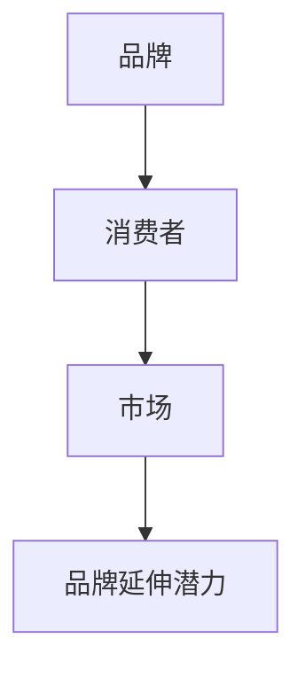
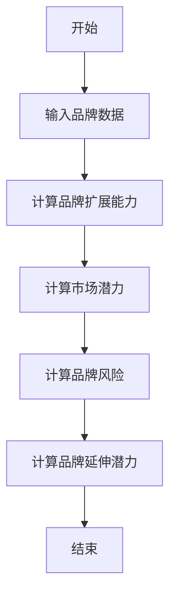
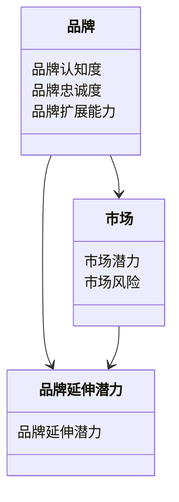
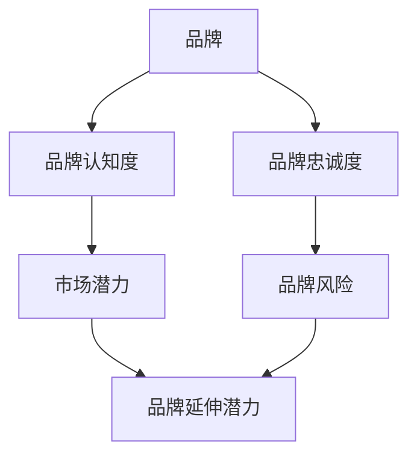

                 


# 企业估值中的品牌延伸潜力分析

## 关键词
品牌延伸潜力、企业估值、品牌扩展能力、市场潜力、品牌风险

## 摘要
本文深入探讨了品牌延伸潜力在企业估值中的重要性。通过分析品牌延伸的定义、核心要素、数学模型和实际案例，结合技术语言和逻辑推理，为读者提供了一个全面理解品牌延伸潜力与企业估值关系的框架。文章还通过Mermaid图和Python代码示例，详细讲解了品牌延伸潜力的算法原理和系统架构设计。

---

# 第1章: 背景介绍

## 1.1 什么是品牌延伸潜力
### 1.1.1 品牌延伸的定义
品牌延伸潜力是指企业在现有品牌的基础上，将其扩展到新市场、新产品的可能性和能力。这种能力通常与品牌知名度、忠诚度和市场扩展能力密切相关。

### 1.1.2 品牌延伸的类型
- **横向延伸**：在同一市场中扩展到新的产品类别。
- **纵向延伸**：在现有产品的基础上，向高端或低端市场扩展。
- **区域延伸**：将品牌从本地市场扩展到其他区域或国家。

### 1.1.3 品牌延伸与企业估值的关系
品牌延伸潜力直接影响企业的市场扩展能力和盈利能力，从而影响企业的整体估值。一个具有强大品牌延伸潜力的企业通常具有更高的市场价值。

## 1.2 问题背景与问题描述
### 1.2.1 企业估值中的关键问题
企业在估值过程中需要考虑品牌的核心价值、市场潜力和风险因素。

### 1.2.2 品牌延伸对估值的影响
品牌延伸潜力是企业估值的重要组成部分，它决定了企业未来扩展的可能空间和盈利能力。

### 1.2.3 品牌延伸潜力的边界与外延
品牌延伸潜力的边界包括市场容量、品牌认知度和企业资源限制。外延则包括品牌扩展的具体策略和实施路径。

## 1.3 核心概念与联系
### 1.3.1 品牌延伸潜力的核心要素
- 品牌认知度
- 品牌忠诚度
- 市场扩展能力

### 1.3.2 品牌延伸潜力与企业估值的关系
品牌延伸潜力是企业估值的重要组成部分，它决定了企业的未来增长潜力和市场竞争力。

### 1.3.3 品牌延伸潜力的实体关系图（Mermaid流程图）


---

# 第2章: 品牌延伸潜力的核心概念与联系

## 2.1 核心概念原理
### 2.1.1 品牌延伸潜力的数学模型
$$ \text{品牌延伸潜力} = \frac{\text{品牌扩展能力} \times \text{市场潜力}}{\text{品牌风险}} $$

### 2.1.2 品牌延伸潜力的评估方法
- 品牌价值评估
- 市场潜力分析
- 品牌风险评估

### 2.1.3 品牌延伸潜力与企业价值的关系
品牌延伸潜力直接影响企业的市场扩展能力和盈利能力，从而影响企业的整体估值。

## 2.2 品牌延伸潜力的核心要素对比表
| 要素 | 描述 | 特性 |
|------|------|------|
| 品牌认知度 | 品牌在消费者中的知名度 | 高度相关性 |
| 品牌忠诚度 | 消费者对品牌的忠诚度 | 高稳定性 |
| 品牌扩展性 | 品牌扩展到新市场的潜力 | 高灵活性 |

## 2.3 品牌延伸潜力的ER实体关系图（Mermaid流程图）


---

# 第3章: 品牌延伸潜力的算法原理

## 3.1 算法原理概述
### 3.1.1 品牌延伸潜力的计算公式
$$ \text{品牌延伸潜力} = \frac{\text{品牌扩展能力} \times \text{市场潜力}}{\text{品牌风险}} $$

### 3.1.2 品牌延伸潜力的评估方法
- 品牌价值评估
- 市场潜力分析
- 品牌风险评估

## 3.2 品牌延伸潜力的算法流程图（Mermaid）


## 3.3 品牌延伸潜力的Python代码实现
```python
def calculate_brand_extension_potential(brand_expansion_capability, market_potential, brand_risk):
    return (brand_expansion_capability * market_potential) / brand_risk

# 示例数据
brand_expansion_capability = 0.8
market_potential = 0.9
brand_risk = 0.5

# 计算品牌延伸潜力
potential = calculate_brand_extension_potential(brand_expansion_capability, market_potential, brand_risk)
print(f"品牌延伸潜力: {potential}")
```

---

# 第4章: 品牌延伸潜力的系统分析与架构设计

## 4.1 问题场景介绍
品牌延伸潜力的评估需要考虑多个因素，包括品牌认知度、市场潜力和品牌风险。

## 4.2 系统功能设计（领域模型Mermaid类图）


## 4.3 系统架构设计（Mermaid架构图）


---

# 第5章: 品牌延伸潜力的项目实战

## 5.1 环境安装
需要安装Python和相关数据分析库（如Pandas、NumPy）。

## 5.2 核心实现代码
```python
import pandas as pd
import numpy as np

def calculate_brand_extension_potential(brand_expansion_capability, market_potential, brand_risk):
    return (brand_expansion_capability * market_potential) / brand_risk

# 示例数据
data = {
    '品牌': ['A', 'B', 'C'],
    '品牌扩展能力': [0.8, 0.6, 0.7],
    '市场潜力': [0.9, 0.8, 0.7],
    '品牌风险': [0.5, 0.4, 0.6]
}

df = pd.DataFrame(data)

# 计算品牌延伸潜力
df['品牌延伸潜力'] = df.apply(lambda x: calculate_brand_extension_potential(x['品牌扩展能力'], x['市场潜力'], x['品牌风险']), axis=1)

print(df)
```

## 5.3 实际案例分析
以某品牌为例，分析其品牌延伸潜力，并解释计算结果。

---

# 第6章: 最佳实践与小结

## 6.1 最佳实践
- 定期评估品牌延伸潜力
- 优化品牌扩展策略
- 控制品牌风险

## 6.2 小结
品牌延伸潜力是企业估值的重要组成部分，通过科学的评估和优化，企业可以更好地实现市场扩展和价值增长。

## 6.3 注意事项
- 品牌延伸潜力的评估需要结合实际市场情况
- 风险控制是品牌延伸的重要环节

## 6.4 拓展阅读
- 品牌管理相关书籍
- 市场分析与预测技术

---

# 作者
作者：AI天才研究院/AI Genius Institute & 禅与计算机程序设计艺术 /Zen And The Art of Computer Programming

