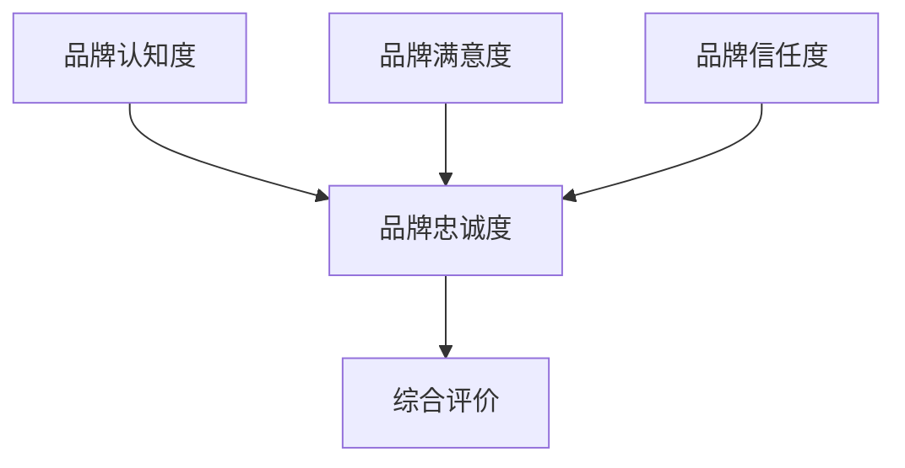

                 


# 企业估值中的品牌忠诚度评估

## 关键词：
企业估值，品牌忠诚度，客户价值，品牌资产，预测模型

## 摘要：
品牌忠诚度是企业在市场中竞争力的重要体现，直接影响企业估值。本文通过分析品牌忠诚度的核心概念、数学模型和算法实现，探讨其在企业估值中的应用。文章从背景、理论、方法到系统设计和项目实战，全面解析品牌忠诚度评估的流程，为企业的估值提供科学依据。

---

# 第一部分: 企业估值中的品牌忠诚度评估背景与概念

## 第1章: 品牌忠诚度与企业估值概述

### 1.1 品牌忠诚度的基本概念

#### 1.1.1 品牌忠诚度的定义
品牌忠诚度是指消费者对某一品牌长期偏好和重复购买的程度。消费者在面对多个选择时，倾向于选择自己熟悉且满意的品牌。

#### 1.1.2 品牌忠诚度的核心要素
- **品牌认知度**：消费者对品牌的记忆和理解程度。
- **品牌满意度**：消费者对品牌产品或服务的满意程度。
- **品牌信任度**：消费者对品牌可靠性和诚信度的信任。

#### 1.1.3 品牌忠诚度与企业估值的关系
品牌忠诚度直接影响消费者的购买行为，进而影响企业的收入、利润和市场地位，从而影响企业估值。

### 1.2 企业估值的基本概念

#### 1.2.1 企业估值的定义
企业估值是对企业整体价值的评估，包括有形资产和无形资产（如品牌价值）。

#### 1.2.2 企业估值的主要方法
- **财务指标法**：通过利润、收入等财务数据评估企业价值。
- **市场比较法**：通过与同行业企业的比较进行估值。
- **DCF模型**：基于现金流折现法评估企业价值。

#### 1.2.3 品牌忠诚度在企业估值中的地位
品牌忠诚度是企业无形资产的重要组成部分，直接影响企业的市场溢价能力。

### 1.3 品牌忠诚度评估的必要性

#### 1.3.1 品牌忠诚度对企业价值的影响
- 提高客户 retention率，降低获客成本。
- 增强市场竞争力，提升品牌溢价能力。

#### 1.3.2 品牌忠诚度评估对企业决策的意义
- 优化品牌管理策略。
- 为投资决策提供数据支持。

#### 1.3.3 品牌忠诚度评估的边界与外延
- 品牌忠诚度评估仅考虑品牌因素，不包括其他市场变量。

---

## 第2章: 品牌忠诚度与企业估值的核心概念

### 2.1 品牌忠诚度的核心要素

#### 2.1.1 品牌认知度
消费者对品牌的记忆和理解程度直接影响其购买决策。

#### 2.1.2 品牌满意度
消费者对产品或服务的满意程度是品牌忠诚度的重要指标。

#### 2.1.3 品牌忠诚度的层次模型
- **情感忠诚**：消费者对企业的情感依赖。
- **行为忠诚**：消费者持续购买行为。

### 2.2 企业估值的核心要素

#### 2.2.1 财务指标
- 利润率、收入增长率等财务数据。

#### 2.2.2 市场地位
- 市场份额、品牌排名。

#### 2.2.3 品牌价值
- 品牌忠诚度、品牌认知度等无形资产。

### 2.3 品牌忠诚度与企业估值的关系模型

#### 2.3.1 品牌忠诚度对企业收入的影响
通过提高客户忠诚度，增加重复购买率，提升企业收入。

#### 2.3.2 品牌忠诚度对客户生命周期价值的影响
客户生命周期价值（CLV）= 客户平均收入 × 客户生命周期。

#### 2.3.3 品牌忠诚度对市场溢价能力的影响
高忠诚度品牌具有更强的定价能力，能为产品制定更高的价格。

---

# 第二部分: 品牌忠诚度评估的数学模型与算法实现

## 第3章: 品牌忠诚度评估的数学模型

### 3.1 基于线性回归的品牌忠诚度预测模型

#### 3.1.1 模型假设与变量定义
- 自变量：品牌认知度（X1）、品牌满意度（X2）。
- 因变量：品牌忠诚度（Y）。

#### 3.1.2 模型的数学表达式
$$ Y = \beta_0 + \beta_1X_1 + \beta_2X_2 + \epsilon $$

#### 3.1.3 模型实现
使用Python中的statsmodels库进行线性回归分析。

```python
import statsmodels.api as sm

# 数据准备
X = df[['X1', 'X2']]
Y = df['Y']

# 模型拟合
model = sm.OLS(Y, sm.add_constant(X))
results = model.fit()

# 输出结果
print(results.summary())
```

---

## 第4章: 品牌忠诚度评估的算法实现

### 4.1 基于层次分析法（AHP）的品牌忠诚度评估

#### 4.1.1 算法步骤
1. 确定品牌忠诚度的影响因素。
2. 构建比较矩阵。
3. 计算权重向量。
4. 计算一致性检验。

#### 4.1.2 算法流程图（使用mermaid）



---

## 第5章: 系统设计与实现

### 5.1 项目介绍

#### 5.1.1 项目目标
构建品牌忠诚度评估系统，帮助企业进行估值。

#### 5.1.2 系统功能
- 数据采集：收集品牌相关数据。
- 模型构建：基于机器学习算法进行预测。
- 结果分析：生成评估报告。

### 5.2 系统架构设计

#### 5.2.1 系统架构图（使用mermaid）


#### 5.2.2 数据流图


### 5.3 系统实现

#### 5.3.1 数据采集

```python
import pandas as pd

# 读取数据
df = pd.read_csv('brand.csv')
```

#### 5.3.2 模型训练

```python
from sklearn.linear_model import LinearRegression

# 训练模型
model = LinearRegression()
model.fit(X, Y)
```

#### 5.3.3 结果分析

```python
# 预测结果
y_pred = model.predict(X)
```

---

## 第6章: 项目实战与案例分析

### 6.1 环境安装

#### 6.1.1 安装Python

```bash
python --version
pip install numpy pandas scikit-learn
```

### 6.2 核心代码实现

#### 6.2.1 数据处理

```python
import pandas as pd

# 数据清洗
df.dropna(inplace=True)
```

#### 6.2.2 模型实现

```python
from sklearn.model_selection import train_test_split
from sklearn.metrics import r2_score

# 划分数据集
X_train, X_test, Y_train, Y_test = train_test_split(X, Y, test_size=0.2)

# 模型训练
model.fit(X_train, Y_train)

# 模型评估
print(r2_score(Y_test, model.predict(X_test)))
```

### 6.3 案例分析

#### 6.3.1 案例背景
某品牌的数据集，包含品牌认知度、满意度等指标。

#### 6.3.2 数据分析结果
- R² = 0.85，模型拟合度较高。
- 品牌满意度对忠诚度影响最大。

---

## 第7章: 总结与展望

### 7.1 总结
品牌忠诚度是影响企业估值的重要因素，通过构建数学模型和算法，可以准确评估品牌价值。

### 7.2 最佳实践
- 定期进行品牌忠诚度评估。
- 结合多种方法进行综合分析。

### 7.3 展望
未来，随着人工智能的发展，品牌忠诚度评估将更加精准和智能化。

---

## 作者信息
作者：AI天才研究院/AI Genius Institute  
联系方式：contact@aicourse.com  
个人简介：专注于人工智能与计算机程序设计的结合，致力于为企业提供技术解决方案。

