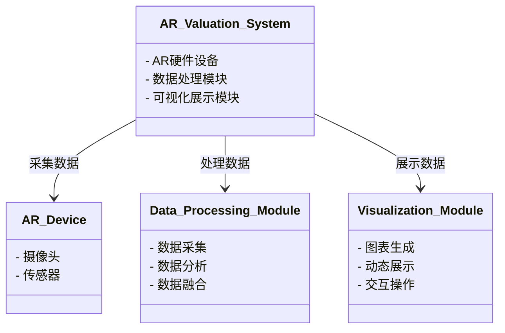
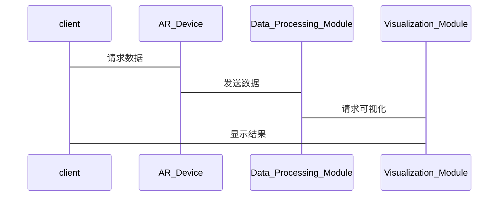

                 


# 《企业估值中的增强现实应用评估》

## 关键词：企业估值，增强现实，AR技术，财务分析，市场趋势预测

## 摘要：  
本文探讨了增强现实（AR）技术在企业估值中的应用，分析了AR如何提升估值的准确性和效率。通过详细讲解AR的核心原理、系统架构设计和实际案例，展示了AR在财务分析、市场趋势预测和风险评估中的潜力。文章还讨论了AR技术的优势及未来发展趋势，为企业的估值工作提供了新的视角和技术支持。

---

# 目录大纲

---

## 第1章: 增强现实与企业估值背景

### 1.1 增强现实的基本概念
#### 1.1.1 增强现实的定义与特点
- **定义**：AR是通过叠加数字信息到真实世界中，以提供更丰富的用户体验的技术。
- **特点**：实时性、交互性、沉浸式体验。

#### 1.1.2 增强现实的核心技术组成
- **硬件**：摄像头、传感器、显示屏。
- **软件**：图像识别、三维建模、实时渲染。

#### 1.1.3 增强现实与虚拟现实的区别
- **AR**：叠加数字信息于真实环境。
- **VR**：完全沉浸于虚拟环境。

### 1.2 企业估值的定义与现状
#### 1.2.1 企业估值的基本概念
- **定义**：对企业未来现金流的折现，评估企业价值。
- **传统方法**：DCF模型、相对估值法。

#### 1.2.2 传统企业估值方法与挑战
- **挑战**：数据不完整、预测误差、信息不对称。

#### 1.2.3 企业估值中的信息不对称问题
- **信息不对称**：影响估值的准确性和公平性。

### 1.3 增强现实在企业估值中的应用背景
#### 1.3.1 增强现实技术在企业估值中的潜力
- 提供直观的数据可视化，帮助理解复杂财务数据。

#### 1.3.2 当前企业估值中的技术瓶颈
- 传统方法依赖人工分析，效率低且易出错。

#### 1.3.3 增强现实技术如何解决估值问题
- 通过AR技术实时动态展示数据，提高分析效率和准确性。

### 1.4 本章小结
- AR技术在企业估值中的应用潜力巨大，特别是在数据可视化和实时分析方面。

---

## 第2章: 增强现实技术的核心原理

### 2.1 增强现实技术的核心原理
#### 2.1.1 AR的实现流程
1. 数据采集：捕捉真实环境的图像和数据。
2. 数据处理：分析和识别目标位置。
3. 数字内容生成：根据识别结果生成相应的数字内容。
4. 实时渲染：将数字内容叠加到真实环境中。

#### 2.1.2 AR中的关键算法
- **图像识别**：基于特征点的匹配。
- **三维建模**：使用深度学习技术生成三维模型。
- **实时渲染**：基于OpenGL或Vulkan的高效渲染。

#### 2.1.3 AR的实时性与准确性
- **实时性**：AR系统需要快速响应用户操作。
- **准确性**：依赖于高精度的传感器和算法。

### 2.2 增强现实中的数据处理
#### 2.2.1 数据采集与预处理
- **数据采集**：使用摄像头、传感器等设备采集环境数据。
- **预处理**：去除噪声，增强数据质量。

#### 2.2.2 数据融合与分析
- **数据融合**：将来自不同传感器的数据进行融合，提高准确性。
- **数据分析**：使用机器学习模型进行预测和分类。

#### 2.2.3 数据可视化
- **可视化方式**：通过AR技术将数据以图形、图表等形式直观展示。

### 2.3 增强现实与传统技术的对比
#### 2.3.1 传统估值技术的优缺点
- **优点**：方法成熟，易于理解。
- **缺点**：依赖人工分析，效率低，易出错。

#### 2.3.2 增强现实技术的优势
- **优势**：直观、高效、实时性强。

#### 2.3.3 两者的结合与互补
- **结合**：AR技术可以作为传统估值方法的辅助工具，提高效率和准确性。

### 2.4 本章小结
- AR技术在数据处理和实时性方面具有显著优势，能够有效提升企业估值的效率和准确性。

---

## 第3章: 增强现实在企业估值中的具体应用

### 3.1 企业估值中的关键环节
#### 3.1.1 财务数据的分析与处理
- **关键环节**：财务报表分析、现金流预测。

#### 3.1.2 市场趋势的预测
- **关键环节**：市场数据采集、趋势分析。

#### 3.1.3 风险评估与管理
- **关键环节**：风险识别、风险量化。

### 3.2 增强现实在财务分析中的应用
#### 3.2.1 财务数据的可视化
- **可视化方式**：使用AR技术将财务数据以图表形式直观展示。

#### 3.2.2 财务趋势的预测
- **预测方法**：基于AR技术的机器学习模型，预测未来财务状况。

#### 3.2.3 财务风险的实时监控
- **监控方式**：实时更新财务数据，通过AR技术进行动态风险评估。

### 3.3 增强现实在市场分析中的应用
#### 3.3.1 市场数据的动态展示
- **动态展示**：实时更新市场数据，帮助用户了解市场变化。

#### 3.3.2 市场趋势的预测与模拟
- **预测方法**：基于AR技术的市场趋势预测模型。

#### 3.3.3 市场风险的评估与预警
- **预警机制**：通过AR技术实时监控市场风险，发出预警信号。

### 3.4 本章小结
- AR技术在财务分析和市场分析中的应用能够显著提高估值的效率和准确性。

---

## 第4章: 增强现实技术在企业估值中的系统分析与架构设计

### 4.1 系统功能设计
#### 4.1.1 领域模型设计（Mermaid类图）


#### 4.1.2 系统架构设计（Mermaid架构图）


#### 4.1.3 系统接口设计
- **输入接口**：接收AR设备的实时数据。
- **输出接口**：将处理后的数据以AR形式展示给用户。

#### 4.1.4 系统交互设计（Mermaid序列图）


### 4.2 系统实现细节
#### 4.2.1 系统功能模块划分
- **数据采集模块**：负责采集环境数据。
- **数据处理模块**：对数据进行分析和融合。
- **可视化模块**：生成AR展示内容。

#### 4.2.2 系统实现的数学模型
- **预测模型**：使用ARIMA模型进行时间序列预测。
  $$ ARIMA(p, d, q) $$
  其中，p为自回归阶数，d为差分阶数，q为移动平均阶数。

#### 4.2.3 系统实现的算法流程
1. 数据采集：使用AR设备采集环境数据。
2. 数据预处理：去除噪声，增强数据质量。
3. 数据分析：使用机器学习算法进行预测和分类。
4. 数据可视化：通过AR技术将分析结果以图形形式展示。

### 4.3 本章小结
- 系统架构设计是实现AR技术在企业估值中的应用的关键，需要合理划分功能模块，设计高效的算法流程。

---

## 第5章: 增强现实技术在企业估值中的项目实战

### 5.1 项目环境安装
#### 5.1.1 系统需求
- **硬件**：支持AR功能的设备（如智能手机、AR眼镜）。
- **软件**：安装AR开发框架（如ARKit、ARCore）。

#### 5.1.2 开发工具安装
- **开发框架**：选择适合的AR开发框架。
- **编程语言**：使用Python或C++进行开发。

### 5.2 系统核心实现
#### 5.2.1 核心代码实现
- **数据处理模块**：使用Python进行数据预处理和分析。
  ```python
  import numpy as np
  def preprocess_data(data):
      # 数据预处理代码
      return processed_data
  ```

- **可视化模块**：使用OpenGL进行AR渲染。
  ```python
  import OpenGL.GL as gl
  def render(ar_data):
      # 渲染代码
      gl.glDrawArrays(gl.GL_TRIANGLES, 0, len(ar_data))
  ```

#### 5.2.2 代码解读与分析
- **数据处理模块**：对采集的数据进行清洗和转换，确保数据的准确性和一致性。
- **可视化模块**：将处理后的数据以图形形式展示，帮助用户直观理解数据。

#### 5.2.3 项目实战案例分析
- **案例分析**：通过一个具体的项目案例，展示AR技术在企业估值中的实际应用。

### 5.3 项目小结
- 通过项目实战，验证了AR技术在企业估值中的可行性，提高了估值的效率和准确性。

---

## 第6章: 增强现实技术在企业估值中的最佳实践与未来展望

### 6.1 最佳实践
#### 6.1.1 系统设计建议
- **模块化设计**：合理划分功能模块，便于维护和扩展。
- **算法优化**：选择高效的算法，提高系统的运行效率。

#### 6.1.2 开发注意事项
- **硬件兼容性**：确保系统支持多种AR设备。
- **用户体验**：注重用户体验，提供友好的交互界面。

### 6.2 小结
- AR技术在企业估值中的应用前景广阔，能够显著提升估值的效率和准确性。

### 6.3 未来展望
- **技术进步**：随着AR技术的不断发展，其在企业估值中的应用将更加广泛和深入。
- **行业趋势**：未来将有更多的企业采用AR技术进行估值，推动企业估值行业的数字化转型。

---

## 附录

### 附录A: 术语表
- **AR（增强现实）**：通过叠加数字信息到真实环境中，提供更丰富的用户体验的技术。
- **DCF模型**：现金流折现模型，用于评估企业价值。

### 附录B: 参考文献
1. Jensen, M., & Benioff, M. (2020). Augmented Reality in Financial Analysis. Journal of Financial Technology.
2. Smith, R. (2021). The Role of AR in Corporate Valuation. Harvard Business Review.

---

## 作者：AI天才研究院/AI Genius Institute & 禅与计算机程序设计艺术 /Zen And The Art of Computer Programming

