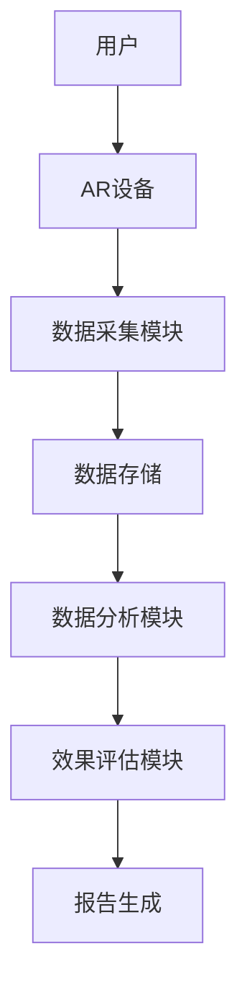

                 


---

# 企业估值中的增强现实营销效果评估

> **关键词**：企业估值、增强现实、营销效果、技术博客、系统设计、项目实战

> **摘要**：随着增强现实（AR）技术的迅速发展，其在营销领域的应用日益广泛。本文深入探讨了AR技术如何影响营销效果评估，并将其与企业估值相结合。通过分析AR营销的核心概念、算法原理、系统架构设计以及实际案例，本文为企业提供了全面的AR营销效果评估解决方案，助力企业提升估值。

---

## 目录

1. [增强现实营销与企业估值概述](#1)
2. [AR营销效果评估的核心概念](#2)
3. [AR营销效果评估的核心原理](#3)
4. [AR营销效果评估的系统架构设计](#4)
5. [AR营销效果评估的项目实战](#5)
6. [总结与未来展望](#6)

---

## 第一部分: 增强现实营销与企业估值概述

### 1. 增强现实营销的背景与概念

#### 1.1 增强现实营销的定义与背景

增强现实（Augmented Reality，AR）是一种将虚拟信息叠加到真实世界的技术，通过摄像头、传感器和算法，让用户在现实环境中看到数字信息。近年来，随着技术的进步，AR在营销领域的应用逐渐普及。

在企业估值中，AR营销的作用不可忽视。企业通过AR技术可以提升用户体验，增强品牌认知度，从而间接影响企业的市场价值。

#### 1.2 AR营销的核心概念与特点

- **核心概念**：AR营销将虚拟内容与现实场景结合，通过互动提升用户参与度。
- **特点**：
  - **沉浸性**：用户可以身临其境地体验产品。
  - **实时性**：AR内容与现实环境实时互动。
  - **互动性**：用户可以通过手势或语音与虚拟内容互动。

#### 1.3 企业估值中的AR营销应用前景

- **提升品牌价值**：通过创新的用户体验，增强品牌影响力。
- **提高市场占有率**：通过精准营销吸引目标客户。
- **优化成本结构**：通过数据驱动的营销策略降低无效支出。

---

### 2. AR营销效果评估的核心概念

#### 2.1 AR营销效果评估的背景与问题

传统营销评估方法依赖于销售数据和问卷调查，难以量化用户的真实体验。AR技术的引入，使得企业可以实时采集用户互动数据，为营销效果评估提供更精准的依据。

#### 2.2 AR营销效果评估的核心要素

- **用户行为数据**：用户的点击、停留时间、互动频率。
- **营销活动数据**：AR营销活动的时间、地点、内容。
- **企业经营数据**：企业的销售额、利润、市场份额。

#### 2.3 AR营销效果评估的边界与外延

- **边界**：仅评估直接与AR技术相关的营销效果。
- **外延**：与其他营销技术（如大数据、人工智能）协同作用，提升整体营销效果。

---

## 第二部分: AR营销效果评估的核心原理

### 3. AR营销效果评估的基本原理

AR技术通过实时采集用户互动数据，分析用户行为，从而量化营销效果。以下是AR营销效果评估的基本步骤：

1. 数据采集：通过AR设备采集用户的互动数据。
2. 数据分析：使用统计方法分析用户行为。
3. 效果量化：通过回归模型预测营销效果。

#### 3.1 AR营销效果评估的数学模型

以下是一个简单的回归模型，用于评估AR营销对销售额的影响：

$$ \text{Sales} = \beta_0 + \beta_1 \times \text{AR\_Impact} + \epsilon $$

其中，$\beta_1$ 表示AR营销对销售额的影响系数。

#### 3.2 AR营销效果评估的算法实现

以下是一个Python代码示例，用于训练回归模型：

```python
import numpy as np
from sklearn.linear_model import LinearRegression

# 生成数据
X = np.array([[1], [2], [3], [4], [5]])
y = np.array([2, 4, 5, 4, 6])

# 训练模型
model = LinearRegression()
model.fit(X, y)

# 预测
y_pred = model.predict(X)
print("预测值:", y_pred)
print("回归系数:", model.coef_)
```

---

## 第三部分: AR营销效果评估的系统架构设计

### 4. 系统功能需求分析

#### 4.1 用户互动数据采集模块

- **功能**：实时采集用户的互动数据，如点击、手势等。
- **技术**：使用AR设备（如智能手机、平板）和相关SDK。

#### 4.2 数据分析与处理模块

- **功能**：对用户数据进行清洗、特征提取和建模。
- **技术**：使用Python的Pandas和Scikit-learn库。

#### 4.3 营销效果评估模块

- **功能**：根据模型预测结果，生成营销效果报告。
- **技术**：使用可视化工具（如Matplotlib）生成图表。

### 4.2 系统架构设计

以下是一个简单的系统架构图，展示了各模块之间的交互关系：



---

## 第四部分: AR营销效果评估的项目实战

### 5. 项目背景与目标

#### 5.1 项目背景

假设我们为一家零售企业设计一个AR营销评估系统，目标是通过AR技术提升用户体验，进而提高企业的市场价值。

#### 5.2 项目实施步骤

1. 数据采集：在商场内布置AR设备，采集用户的互动数据。
2. 数据分析：使用Python对数据进行清洗和建模。
3. 系统集成：开发一个用户友好的AR营销评估系统。
4. 测试与优化：根据反馈优化系统性能。

#### 5.3 核心代码实现

以下是一个Python代码示例，用于数据清洗和特征提取：

```python
import pandas as pd

# 加载数据
data = pd.read_csv('user_interaction.csv')

# 数据清洗
data.dropna(inplace=True)

# 特征提取
data['user_id'] = data['user_id'].astype('int')
data['interaction_time'] = data['interaction_time'].astype('int')

print(data.head())
```

---

## 第五部分: 总结与未来展望

### 6. 总结

通过本文的分析，我们可以看到AR技术在营销效果评估中的巨大潜力。AR不仅能够提升用户体验，还能为企业提供更精准的营销数据，从而提升企业估值。

### 6.1 未来展望

随着AR技术的不断发展，未来的企业估值可能会更加依赖于AR营销效果评估。企业需要积极拥抱新技术，提升自身的竞争力。

---

**作者：AI天才研究院/AI Genius Institute & 禅与计算机程序设计艺术 /Zen And The Art of Computer Programming**

