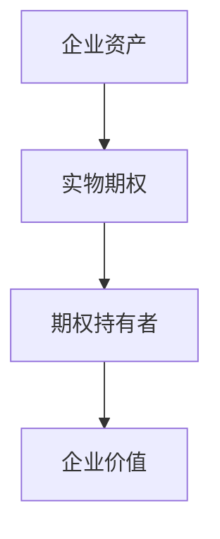
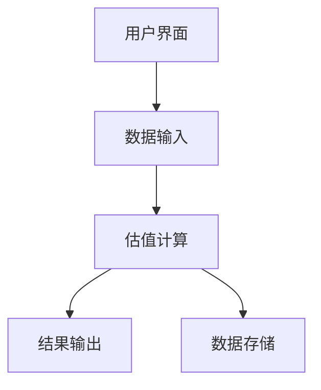
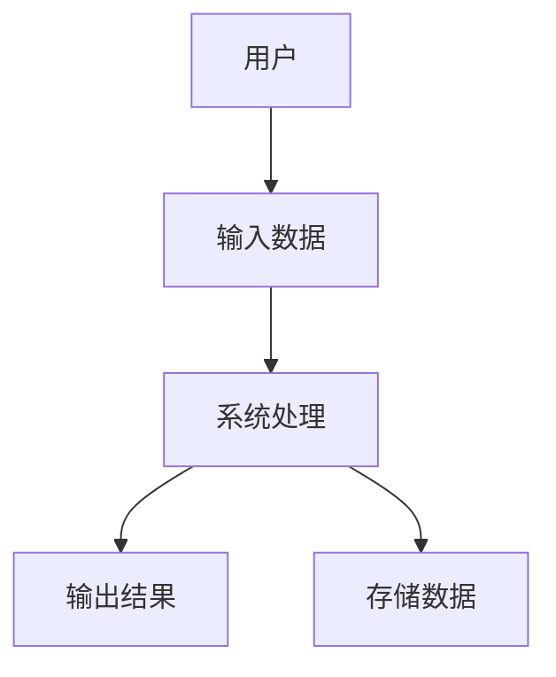
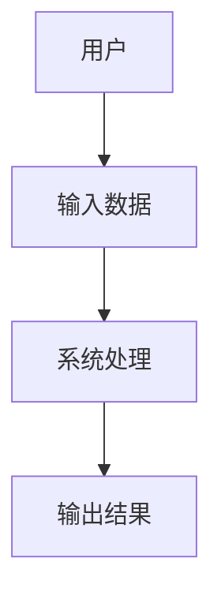

                 


# 《企业估值中的实物期权法》

---

## 关键词：企业估值、实物期权、期权定价、Black-Scholes模型、系统架构

---

## 摘要：  
本文系统介绍了实物期权法在企业估值中的应用，从理论基础到实际案例，详细解析了实物期权法的核心概念、数学模型、系统架构和项目实战。通过对比分析和案例研究，揭示了实物期权法在企业并购、投资决策中的独特价值，并结合实际项目，展示了如何将实物期权法应用于企业估值系统中。本文旨在为企业管理者和金融分析师提供一种全新的视角，帮助他们在复杂多变的商业环境中做出更明智的决策。

---

## 第1章: 实物期权法概述

### 1.1 实物期权的基本概念  
实物期权是一种基于企业资产的期权，其核心思想是将企业的一部分资产视为期权，从而评估其价值。与传统金融期权不同，实物期权的标的资产是企业的实际资产，而非金融资产。  

#### 1.1.1 什么是实物期权  
实物期权可以看作是企业对未来的不确定性资产的期权。例如，一家企业可能拥有一种新产品开发的期权，这种期权的价值取决于未来市场的需求变化。  

#### 1.1.2 实物期权与传统期权的区别  
| 属性 | 实物期权 | 传统期权 |
|------|----------|----------|
| 标的资产 | 企业资产（如新产品、技术） | 金融资产（如股票、债券） |
| 行权方式 | 可以选择行权或不行权 | 必须在特定时间行权或放弃 |
| 风险特征 | 与企业经营风险相关 | 与市场波动相关 |
| 适用场景 | 企业并购、投资决策 | 金融投资、风险管理 |

#### 1.1.3 实物期权法在企业估值中的作用  
实物期权法可以帮助企业在并购和投资决策中量化不确定性，从而更准确地评估企业价值。例如，在企业并购中，实物期权可以用来评估目标企业未来增长的潜力。

### 1.2 实物期权法的理论基础  
实物期权法的理论基础主要来源于期权定价理论，尤其是Black-Scholes模型。该模型通过数学公式计算期权的价值，考虑了标的资产的波动性和时间因素。

### 1.3 实物期权法的应用范围  
实物期权法广泛应用于企业并购、新项目投资和企业生命周期管理中。例如，在企业并购中，实物期权可以用来评估目标企业未来增长的潜力，从而确定合理的并购价格。

---

## 第2章: 实物期权法的核心概念与原理

### 2.1 实物期权的属性特征对比  
实物期权与传统期权的对比可以通过表格清晰展示：

| 属性 | 实物期权 | 传统期权 |
|------|----------|----------|
| 标的资产 | 企业资产（如新产品、技术） | 金融资产（如股票、债券） |
| 行权方式 | 可以选择行权或不行权 | 必须在特定时间行权或放弃 |
| 风险特征 | 与企业经营风险相关 | 与市场波动相关 |
| 适用场景 | 企业并购、投资决策 | 金融投资、风险管理 |

### 2.2 实物期权的ER实体关系图  
以下是实物期权的ER实体关系图：



### 2.3 实物期权法的数学模型  
实物期权法的核心数学模型是Black-Scholes模型，公式如下：

$$ C = S_0 \cdot N(d_1) - K \cdot e^{-rT} \cdot N(d_2) $$

其中：
- $S_0$ 是标的资产当前价格
- $K$ 是行权价
- $r$ 是无风险利率
- $T$ 是时间至到期的年数
- $N(d)$ 是标准正态分布的累积分布函数
- $d_1 = \frac{\ln(S_0/K) + (r + \sigma^2/2)T}{\sigma \sqrt{T}}$
- $d_2 = d_1 - \sigma \sqrt{T}$

---

## 第3章: 实物期权法的系统分析与架构设计

### 3.1 系统架构设计  
以下是实物期权法的系统架构设计：



### 3.2 数据流图  
以下是系统数据流图：



### 3.3 系统功能设计  
系统功能包括：
1. 数据输入与处理
2. 期权估值计算
3. 结果输出与存储

### 3.4 系统接口设计  
系统接口包括：
1. 用户输入接口
2. 数据存储接口
3. 结果输出接口

### 3.5 系统交互设计  
以下是系统交互设计：



---

## 第4章: 项目实战

### 4.1 环境安装  
需要安装以下环境：
1. Python 3.x
2. Mermaid工具
3. Latex编辑器

### 4.2 核心实现源代码  
以下是核心实现源代码：

```python
import numpy as np
from scipy.stats import norm

def black_scholes(S, K, r, T, sigma):
    d1 = (np.log(S/K) + (r + sigma**2/2)*T) / (sigma * np.sqrt(T))
    d2 = d1 - sigma * np.sqrt(T)
    C = S * norm.cdf(d1) - K * np.exp(-r*T) * norm.cdf(d2)
    return C

# 示例计算
S = 100
K = 105
r = 0.05
T = 1
sigma = 0.2

result = black_scholes(S, K, r, T, sigma)
print("期权价值为:", result)
```

### 4.3 案例分析  
以某企业并购为例，假设目标企业价值为100万元，行权价为105万元，无风险利率为5%，时间跨度为1年，波动率为20%。根据Black-Scholes模型，期权价值为：

$$ C = 100 \cdot N(d_1) - 105 \cdot e^{-0.05 \cdot 1} \cdot N(d_2) $$

计算结果为：

$$ C = 100 \cdot N(0.8) - 105 \cdot e^{-0.05} \cdot N(0.6) $$

最终结果为：

$$ C = 100 \cdot 0.7881 - 105 \cdot 0.9512 \cdot 0.7324 = 78.81 - 71.83 = 6.98 $$

因此，目标企业期权价值为6.98万元。

---

## 第5章: 总结与展望

### 5.1 总结  
实物期权法是一种强大的企业估值工具，可以帮助企业在并购和投资决策中量化不确定性，从而更准确地评估企业价值。

### 5.2 展望  
未来，随着人工智能和大数据技术的发展，实物期权法将更加智能化和精准化，为企业估值提供更强大的支持。

---

## 作者：AI天才研究院/AI Genius Institute & 禅与计算机程序设计艺术 /Zen And The Art of Computer Programming

