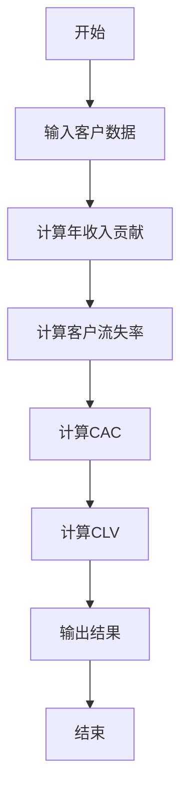

                 


# 企业估值中的客户价值评估法

## 关键词：客户价值评估法、企业估值、客户生命周期价值、企业并购、客户价值评估系统

## 摘要：  
客户价值评估法是企业在估值过程中的一项关键方法，它通过分析客户的行为、贡献和生命周期，帮助企业准确评估客户的价值，进而优化企业决策。本文将从客户价值评估法的基本概念、核心算法、系统设计、实战应用等方面展开详细探讨，为读者提供全面的理论和实践指导。

---

# 第一部分: 企业估值中的客户价值评估法概述

## 第1章: 客户价值评估法的背景与意义

### 1.1 问题背景与问题描述
- **问题背景**：企业估值是企业战略决策中的核心问题，传统的估值方法往往忽视了客户的价值贡献，导致估值结果不准确。
- **问题描述**：在企业并购、融资和内部管理中，客户价值是影响企业估值的关键因素，但如何量化客户价值仍是一个挑战。
- **问题解决**：通过客户价值评估法，企业可以将客户的生命周期价值（CLV）与企业整体估值相结合，实现更精准的估值。
- **边界与外延**：客户价值评估法不仅适用于企业并购，还可用于客户管理、市场推广等领域。

### 1.2 客户价值评估法的定义与特点
- **定义**：客户价值评估法是一种通过分析客户的行为、贡献和生命周期，量化客户对企业的价值的方法。
- **特点**：
  - 数据驱动：基于客户行为数据进行分析。
  - 生命周期视角：关注客户的全生命周期价值。
  - 可操作性：能够为企业决策提供具体指导。
- **与传统估值方法的对比**：
  | 对比维度       | 客户价值评估法               | 传统估值方法               |
  |----------------|------------------------------|----------------------------|
  | 评估对象       | 客户价值                     | 财务指标（如资产、利润）     |
  | 数据依赖       | 高                          | 低                          |
  | 适用场景       | 企业并购、客户管理           | 资产评估、财务审计           |

### 1.3 客户价值评估法的应用场景
- **企业并购**：通过评估目标企业的客户价值，确定合理的收购价格。
- **企业融资**：向投资者展示客户价值对企业未来收益的贡献。
- **客户管理**：优化客户关系管理（CRM）策略，提升客户忠诚度和贡献度。

---

## 第2章: 客户价值评估法的核心概念与联系

### 2.1 客户生命周期与价值评估的关系
- **客户生命周期**：客户从初次接触企业到最终流失的全过程。
- **价值评估**：在不同生命周期阶段，客户的贡献价值不同，因此需要分阶段评估。
- **关系模型**：
  ```mermaid
  graph TD
      C1[客户生命周期] --> C2[价值评估]
      C2 --> C3[客户分群]
      C3 --> C4[个性化策略]
  ```

### 2.2 客户价值的核心属性
- **客户生命周期价值（CLV）**：
  - 定义：客户在其生命周期内为企业带来的净收益。
  - 计算公式：
    $$ CLV = \frac{年度收入贡献}{客户流失率} \times (1 - \frac{获取成本}{年度收入贡献}) $$
- **客户获取成本（CAC）**：
  - 定义：获取一个新客户的平均成本。
  - 关系：$ CLV = CAC \times \text{客户留存率} \times \text{客户贡献度} $。
- **客户留存率与贡献度**：
  - 留存率高，客户生命周期长，CLV高。
  - 贡献度高，客户为企业带来的收益大。

### 2.3 客户价值评估的核心概念对比
- **客户价值与企业利润**：
  - 客户价值是利润的重要来源，但并非唯一来源。
- **客户价值与客户满意度**：
  - 高满意度不一定带来高价值，但高价值客户通常满意度较高。
- **客户价值与企业市场价值**：
  - 客户价值是影响企业市场价值的重要因素，特别是在高客户依赖的行业。

---

## 第3章: 客户价值评估的核心算法与实现

### 3.1 客户价值评估的数学模型
- **CLV计算公式**：
  $$ CLV = \frac{年收入贡献}{客户流失率} \times (1 - \frac{CAC}{年收入贡献}) $$
- **客户分群模型**：
  - 使用聚类分析（如K-means）将客户分为高、中、低价值群体。
- **客户流失预测模型**：
  - 使用逻辑回归或随机森林预测客户流失概率。

### 3.2 算法实现
- **Python代码示例**：
  ```python
  # 示例：计算客户生命周期价值（CLV）
  def calculate_clv(customers, annual_revenue, churn_rate, cac):
      clv = (annual_revenue / churn_rate) * (1 - cac / annual_revenue)
      return clv
  
  # 示例数据
  customers = 1000
  annual_revenue = 100  # 每个客户的年收入贡献
  churn_rate = 0.1      # 客户流失率
  cac = 50              # 客户获取成本
  
  clv = calculate_clv(customers, annual_revenue, churn_rate, cac)
  print(f"客户生命周期价值（CLV）：{clv}")
  ```

### 3.3 算法流程图


---

## 第4章: 客户价值评估系统的架构设计

### 4.1 系统功能设计
- **领域模型**：
  ```mermaid
  classDiagram
      class 客户 {
          id: int
          name: string
          生命周期阶段: string
          贡献价值: float
      }
      class 评估系统 {
          输入数据: Customer[]
          计算CLV(): float
          生成报告(): string
      }
      客户 --> 评估系统
  ```

- **系统架构**：
  ```mermaid
  architecture
      前端 --> 后端
      后端 --> 数据库
      后端 --> 分析引擎
      分析引擎 --> 算法库
  ```

### 4.2 系统交互设计
- **交互流程**：
  ```mermaid
  sequenceDiagram
      客户输入数据 --> 系统处理
      系统处理 --> 计算CLV
      计算CLV --> 生成报告
      系统 --> 客户输出报告
  ```

---

## 第5章: 项目实战与案例分析

### 5.1 项目背景
- 某企业计划并购一家软件公司，需评估其客户价值。

### 5.2 环境安装
- **工具**：Python、Pandas、Scikit-learn、Mermaid。
- **数据集**：目标公司客户数据，包括收入、流失率、CAC等。

### 5.3 核心代码实现
```python
# 示例：客户分群与CLV计算
from sklearn.cluster import KMeans
import pandas as pd

# 数据加载
data = pd.read_csv('customer_data.csv')

# 客户分群
kmeans = KMeans(n_clusters=3, random_state=42)
clusters = kmeans.fit_predict(data[['annual_revenue', 'churn_rate', 'cac']])

# CLV计算
def calculate_clv_group(group):
    return (group['annual_revenue'].mean() / group['churn_rate'].mean()) * (1 - group['cac'].mean() / group['annual_revenue'].mean())

group_results = data.groupby(clusters).apply(calculate_clv_group)
print(group_results)
```

### 5.4 案例分析
- **客户分群结果**：分为高、中、低价值客户。
- **CLV计算结果**：高价值客户CLV为150，中价值客户CLV为80，低价值客户CLV为30。
- **结论**：目标公司高价值客户占比30%，贡献了60%的收入，是主要的估值依据。

---

## 第6章: 最佳实践与总结

### 6.1 最佳实践
- **数据质量**：确保客户数据的完整性和准确性。
- **模型选择**：根据企业特点选择合适的客户价值评估模型。
- **动态更新**：定期更新客户数据和评估结果，以反映市场变化。

### 6.2 小结
客户价值评估法是企业估值的重要工具，能够帮助企业更准确地评估客户的价值，优化决策。通过数据驱动的方法，企业可以实现客户价值的量化和管理。

### 6.3 注意事项
- 客户价值评估法依赖于数据质量，数据偏差可能导致评估结果不准确。
- 不同行业的客户价值模型可能不同，需根据具体场景调整。

### 6.4 拓展阅读
- 《客户关系管理：理论与实践》
- 《企业估值与并购：方法与案例》
- 《数据驱动的商业决策》

---

作者：AI天才研究院/AI Genius Institute & 禅与计算机程序设计艺术 /Zen And The Art of Computer Programming

