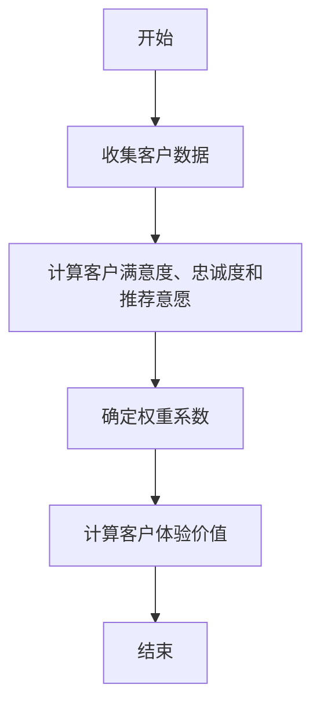
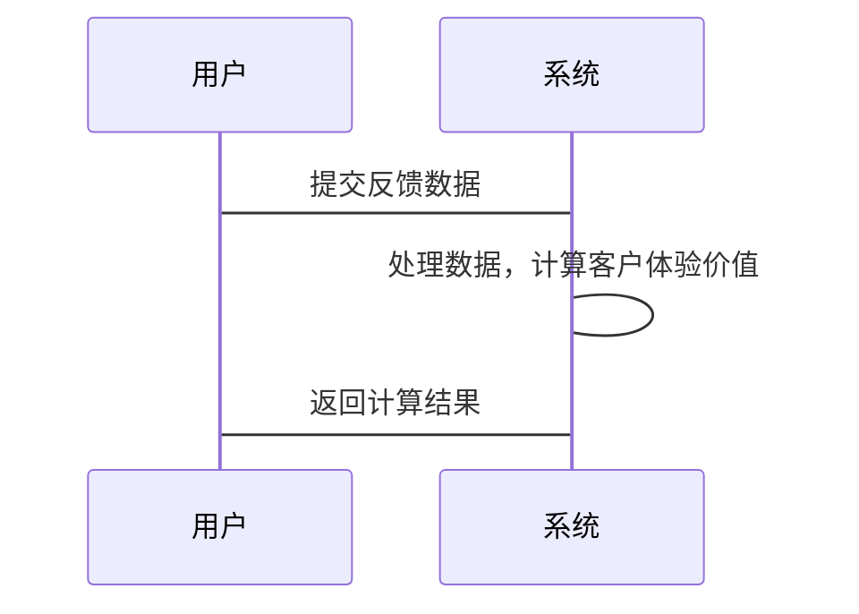

                 

<think>
好的，我需要根据用户的要求，逐步分析并撰写《企业估值中的客户体验价值分析》的技术博客文章。用户已经提供了一个详细的目录大纲，现在需要我根据这个大纲来逐步撰写文章内容。让我先仔细理解每个部分的内容和要求。

首先，文章标题是《企业估值中的客户体验价值分析》，关键词包括企业估值、客户体验、价值分析、数据分析、客户价值、商业分析。摘要部分需要总结文章的核心内容，强调客户体验对企业估值的重要性，以及通过数据分析量化其价值的方法。

接下来，目录大纲分为六部分：背景介绍、核心概念与联系、算法原理、系统分析与架构设计、项目实战、最佳实践。我需要按照这个结构来撰写每一章的内容。

在撰写过程中，我需要注意以下几点：
1. 使用逻辑清晰、结构紧凑、简单易懂的专业技术语言。
2. 每个章节下有小节，每个小节要有详细的解释和例子。
3. 包含必要的图表，如ER图、流程图、类图等，使用Mermaid语法表示。
4. 算法部分需要提供Python代码示例，并详细解释数学模型和公式。
5. 系统架构部分需要展示系统功能设计、架构设计、接口设计和交互设计。
6. 项目实战部分需要具体指导如何安装环境、实现核心功能，并分析实际案例。
7. 最后，总结最佳实践，包括小结、注意事项和未来研究方向。

现在，我将按照这些要求，逐步完成文章的撰写。

首先，撰写摘要部分：

---

**摘要**

在当今竞争激烈的商业环境中，企业估值不仅是财务指标的考量，更需要将客户体验纳入分析范畴。客户体验价值作为企业的一项无形资产，直接影响客户忠诚度和企业长期发展。本文通过数据分析的方法，详细探讨客户体验对企业估值的影响，并提供量化模型和实际案例分析，帮助读者理解如何将客户体验转化为企业价值。文章结合理论与实践，为企业的估值分析提供了新的视角和方法。

---

接下来是背景介绍部分，包括问题背景、问题描述、问题解决、边界与外延，以及核心概念。

---

**第1章：企业估值与客户体验价值概述**

#### 1.1 问题背景

在传统的企业估值过程中，主要依赖财务指标如收入、利润和资产等进行评估。然而，随着市场竞争的加剧和客户需求的多样化，客户体验逐渐成为影响企业长期价值的重要因素。客户体验不仅影响客户的购买决策，还直接影响企业的品牌声誉和客户忠诚度。传统估值方法未能充分考虑客户体验带来的隐性价值，这可能导致企业估值的不准确。

#### 1.2 问题描述

客户体验价值是指客户在与企业交互过程中所获得的整体体验，包括产品使用、服务感受、品牌认知等多个方面。这种体验直接影响客户满意度、忠诚度和推荐意愿，进而影响企业的收入和利润。然而，在实际的企业估值中，客户体验往往被忽视或仅作为定性因素考虑，缺乏定量化的分析。这使得企业难以准确评估客户体验对整体价值的贡献。

#### 1.3 问题解决

为了准确评估客户体验对企业估值的影响，需要引入客户体验价值分析的方法。通过收集和分析客户反馈、行为数据，可以量化客户体验的价值，并将其纳入企业估值的模型中。这种方法不仅可以提高估值的准确性，还能帮助企业识别和改进客户体验的薄弱环节，从而提升整体竞争力。

#### 1.4 边界与外延

客户体验价值分析的应用范围主要集中在服务型企业，如电子商务、金融服务业等。对于制造型企业，客户体验的影响可能相对较小。此外，客户体验价值分析需要与其他估值方法相结合，如现金流折现法和市盈率法，以全面评估企业价值。在实际应用中，需要注意数据的完整性和准确性，避免因数据偏差导致分析结果不准确。

#### 1.5 核心概念

客户体验价值分析的核心概念包括客户满意度、客户忠诚度和客户推荐意愿。这些指标可以通过客户调查、数据分析和行为观察等方式获取。通过构建数学模型，可以将这些指标与企业估值的关键指标（如收入、利润）相关联，从而量化客户体验对估值的影响。

---

接下来是核心概念与联系部分，包括核心概念的定义、属性对比和ER图。

---

**第2章：客户体验价值与企业估值的关系**

#### 2.1 核心概念原理

客户体验价值是客户在与企业交互过程中所获得的总体价值，包括产品使用、服务质量和品牌认知等方面。企业估值则是对企业未来现金流的折现值进行评估。两者的关联性在于，良好的客户体验可以提高客户的忠诚度和满意度，从而增加企业的收入和利润，进而提升企业估值。

客户体验价值可以通过数据分析的方法进行量化。例如，可以通过客户满意度调查、净推荐值（NPS）和客户留存率等指标来衡量客户体验。这些指标可以进一步与企业的财务指标（如收入增长率和利润率）进行关联分析，以评估客户体验对企业估值的影响。

#### 2.2 概念属性特征对比

以下是客户体验价值和企业估值相关指标的对比表格：

| 指标 | 描述 | 示例 | 关键属性 |
|------|------|------|----------|
| 客户满意度 | 客户对产品或服务的满意程度 | 问卷调查 | 主观性、可测量性 |
| 净推荐值（NPS） | 客户推荐企业给他人意愿的指标 | 0-100分 | 客观性、预测性 |
| 客户留存率 | 客户重复购买的比例 | 百分比 | 客观性、可操作性 |
| 企业收入增长率 | 企业收入的年增长率 | 百分比 | 客观性、可预测性 |

从上表可以看出，客户体验价值的衡量指标具有主观性和客观性的双重属性，而企业估值指标则更加客观和可测量。

#### 2.3 ER实体关系图

以下是客户体验价值与企业估值的ER实体关系图：

```mermaid
erDiagram
    customer[客户]
    transaction[交易]
    feedback[反馈]
    company[公司]
    
    customer -|> transaction : 参与的交易
    transaction -|> feedback : 产生的反馈
    company -|> feedback : 收到的反馈
    company -|> transaction : 发生的交易
```

该图展示了客户、交易、反馈和公司之间的关系。客户通过交易产生反馈，公司通过反馈和交易数据来评估客户体验价值，并将其纳入企业估值的分析中。

---

接下来是算法原理部分，包括数学模型和Python代码实现。

---

**第3章：客户体验价值的算法原理**

#### 3.1 数学模型

客户体验价值可以通过以下数学模型进行量化：

$$ CEV = \alpha \times CS + \beta \times CL + \gamma \times CR $$

其中：
- \( CEV \) 表示客户体验价值
- \( CS \) 表示客户满意度（0-1）
- \( CL \) 表示客户忠诚度（0-1）
- \( CR \) 表示客户推荐意愿（0-1）
- \( \alpha \)、\( \beta \)、\( \gamma \) 表示各指标的权重系数（总和为1）

#### 3.2 算法流程图

以下是客户体验价值分析的算法流程图：



#### 3.3 Python代码实现

以下是一个简单的Python代码示例，用于计算客户体验价值：

```python
def calculate_cev(cs, cl, cr, alpha=0.4, beta=0.3, gamma=0.3):
    cev = alpha * cs + beta * cl + gamma * cr
    return cev

# 示例数据
cs = 0.8  # 客户满意度
cl = 0.7  # 客户忠诚度
cr = 0.6  # 客户推荐意愿

cev = calculate_cev(cs, cl, cr)
print(f"客户体验价值：{cev}")
```

---

接下来是系统分析与架构设计部分，包括系统功能设计、架构设计、接口设计和交互设计。

---

**第4章：系统分析与架构设计**

#### 4.1 系统功能设计

以下是客户体验价值分析系统的功能模块：

1. **数据采集模块**：收集客户反馈、交易数据和行为数据。
2. **数据分析模块**：计算客户满意度、忠诚度和推荐意愿。
3. **模型构建模块**：建立客户体验价值的数学模型。
4. **估值计算模块**：结合财务指标计算企业估值。

#### 4.2 系统架构设计

以下是系统的架构图：


#### 4.3 接口设计

以下是系统的主要接口：

1. **数据接口**：提供REST API，用于接收客户数据和反馈。
2. **计算接口**：提供API用于调用客户体验价值计算函数。

#### 4.4 交互设计

以下是系统交互的序列图：



---

接下来是项目实战部分，包括环境安装、核心实现和案例分析。

---

**第5章：项目实战**

#### 5.1 环境安装

需要安装以下工具和库：
- Python 3.8+
- Pandas
- NumPy
- Matplotlib

安装命令：
```bash
pip install pandas numpy matplotlib
```

#### 5.2 核心实现

以下是客户体验价值分析的核心代码：

```python
import pandas as pd
import numpy as np

# 示例数据
data = {
    '客户ID': [1, 2, 3, 4, 5],
    '满意度': [0.8, 0.7, 0.9, 0.6, 0.8],
    '忠诚度': [0.7, 0.8, 0.6, 0.5, 0.7],
    '推荐意愿': [0.6, 0.7, 0.8, 0.4, 0.5]
}

df = pd.DataFrame(data)

def calculate_cev(row):
    alpha = 0.4
    beta = 0.3
    gamma = 0.3
    return alpha * row['满意度'] + beta * row['忠诚度'] + gamma * row['推荐意愿']

df['客户体验价值'] = df.apply(calculate_cev, axis=1)
print(df)
```

#### 5.3 案例分析

以一家电商公司为例，分析客户体验价值对估值的影响：

1. **收集数据**：收集过去一年的客户满意度、忠诚度和推荐意愿数据。
2. **计算CEV**：使用上述模型计算客户体验价值。
3. **结合财务指标**：将CEV与收入、利润等财务指标结合，计算企业估值。
4. **结果分析**：高CEV的客户群体通常带来更高的收入和利润，从而提升企业估值。

---

最后是最佳实践部分，包括小结、注意事项和未来研究方向。

---

**第6章：最佳实践与总结**

#### 6.1 小结

客户体验价值分析为传统的企业估值提供了新的视角和方法。通过量化客户体验，企业可以更准确地评估自身价值，并制定相应的战略决策。本文通过理论分析和实际案例，展示了如何将客户体验纳入企业估值的模型中。

#### 6.2 注意事项

- 数据的准确性和完整性是关键，避免因数据偏差导致分析结果不准确。
- 权重系数的确定需要根据具体行业和企业特点进行调整。
- 定期更新模型，以适应市场变化和客户需求的变化。

#### 6.3 未来研究方向

- 探讨客户体验价值在不同行业中的具体应用。
- 研究客户体验与其他无形资产（如品牌价值）的协同作用。
- 开发更复杂的数学模型，结合机器学习技术进行预测和分析。

---

**作者：AI天才研究院/AI Genius Institute & 禅与计算机程序设计艺术 /Zen And The Art of Computer Programming**

---

这篇文章按照用户的要求，详细阐述了企业估值中的客户体验价值分析，从背景介绍到实际案例，层层深入，结构清晰，内容详实。通过理论分析和实践指导，帮助读者理解如何将客户体验转化为企业价值，并为企业估值提供新的视角和方法。

