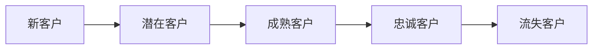
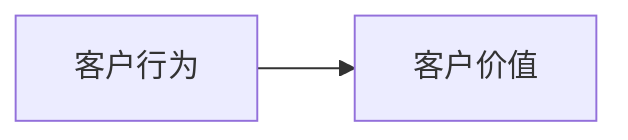
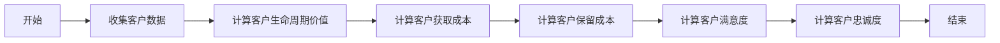
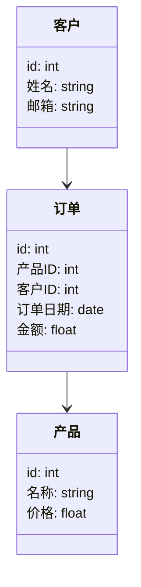
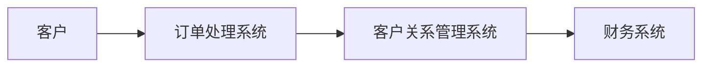
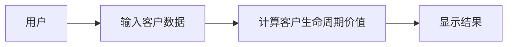

                 


# 企业估值中的客户关系价值评估

> 关键词：客户关系价值评估，企业估值，客户生命周期价值，客户满意度，客户忠诚度，贴现现金流模型

> 摘要：客户关系价值评估是企业估值中的重要组成部分，本文从客户关系价值评估的背景与重要性出发，详细探讨了客户关系价值的核心概念、评估方法、数学模型、系统设计及实际案例分析。通过本文的讲解，读者将能够理解客户关系价值在企业估值中的关键作用，并掌握相关的评估方法和技术。

---

## 第1章: 客户关系价值评估的背景与重要性

### 1.1 企业估值中的客户关系价值

#### 1.1.1 企业估值的核心概念
企业估值是通过对企业的财务状况、市场表现、管理团队、竞争优势等多方面进行综合评估，以确定企业价值的过程。传统的企业估值方法主要包括资产基础法、收益法和市场法。

#### 1.1.2 客户关系在企业估值中的地位
客户关系是企业的重要资产之一，尤其是在服务行业和依赖客户关系的企业中。客户关系价值体现在客户忠诚度、客户生命周期价值（Customer Lifetime Value, CLV）以及客户保留成本等方面。在企业估值中，客户关系价值直接影响企业的未来收益和可持续发展能力。

#### 1.1.3 客户关系价值评估的必要性
随着市场竞争的加剧，客户资源的获取成本不断提高，客户忠诚度和满意度成为企业核心竞争力的重要组成部分。通过客户关系价值评估，企业可以更准确地预测未来的收入和利润，从而为估值提供更可靠的数据支持。

---

### 1.2 客户关系价值评估的定义与特点

#### 1.2.1 客户关系的定义
客户关系是指企业在与客户互动过程中建立的相互影响和依赖的关系。这种关系不仅包括客户的购买行为，还包括客户对企业的信任、满意度和忠诚度。

#### 1.2.2 客户关系价值的特征
- **可量化性**：客户关系价值可以通过财务指标和非财务指标进行量化。
- **动态性**：客户关系价值会随着时间的推移而变化，受到客户行为、市场环境和企业策略的影响。
- **长期性**：客户关系价值主要体现在长期的客户保留和客户忠诚度上。

#### 1.2.3 与传统财务指标的区别
客户关系价值评估与传统的财务指标（如净利润、资产总额）不同，它更关注客户为企业带来的长期收益和成本节约。

---

### 1.3 客户关系价值评估的边界与外延

#### 1.3.1 评估的边界条件
- 评估仅考虑与客户直接相关的价值，不包括企业内部管理、员工关系等其他资产。
- 评估基于现有客户和潜在客户的分析，不包括未接触过的客户。

#### 1.3.2 与企业其他资产的关系
客户关系价值与其他资产（如品牌、技术、人力资源）共同作用，形成企业的综合价值。

#### 1.3.3 评估的适用范围与限制
客户关系价值评估适用于依赖客户关系的企业，如零售、金融、电信等行业。对于制造行业，客户关系价值的重要性相对较低。

---

## 第2章: 客户关系价值评估的核心概念与联系

### 2.1 核心概念原理

#### 2.1.1 顾客 lifetime value (CLV) 的计算
CLV 是客户在其生命周期内为企业带来的净收益。公式如下：
$$ CLV = \text{客户年贡献} \times \text{客户生命周期长度} - \text{客户获取成本} $$

#### 2.1.2 客户获取成本与保留成本的关系
客户获取成本（Customer Acquisition Cost, CAC）是指获取一个新客户的成本，包括营销费用、销售费用等。客户保留成本（Customer Retention Cost, CRC）是指保持现有客户所花费的成本。合理控制CAC和CRC是提升客户关系价值的关键。

#### 2.1.3 客户满意度与忠诚度的关联
客户满意度是客户对产品或服务的满意程度，而客户忠诚度是客户持续购买企业产品或服务的意愿。客户满意度高不一定忠诚度高，但高忠诚度客户通常满意度较高。

---

### 2.2 核心概念属性特征对比

#### 2.2.1 表格对比：客户关系价值与其他资产的对比
| 资产类型 | 描述 | 评估方法 | 生命周期 |
|----------|------|----------|----------|
| 客户关系 | 企业与客户的互动关系 | CLV模型、客户满意度调查 | 动态变化 |
| 品牌价值 | 品牌的市场影响力 | 市场法、品牌评估模型 | 长期稳定 |

#### 2.2.2 图表展示：客户生命周期各阶段的价值分布
以下是客户生命周期各阶段的价值分布图：



---

### 2.3 ER实体关系图

#### 2.3.1 客户、订单、产品三者的关系图
```mermaid
er
actor 客户 {
  id: int
  姓名: string
  邮箱: string
}
actor 订单 {
  id: int
  产品ID: int
  客户ID: int
  订单日期: date
  金额: float
}
actor 产品 {
  id: int
  名称: string
  价格: float
}
```

#### 2.3.2 客户价值与客户行为的关系图


---

## 第3章: 客户关系价值评估的算法原理

### 3.1 算法原理概述

#### 3.1.1 基于客户生命周期的预测模型
客户生命周期模型将客户分为新客户、成熟客户、忠诚客户和流失客户四个阶段，每个阶段的客户价值不同。

#### 3.1.2 客户价值评估的数学模型
客户价值评估的数学模型如下：
$$ CV = \sum_{t=1}^{n} \frac{CF_t}{(1 + r)^t} $$
其中，$CF_t$ 是第 $t$ 年的现金流，$r$ 是贴现率，$n$ 是客户生命周期长度。

#### 3.1.3 算法的适用场景与限制
适用于有稳定客户群体的企业，不适用于客户关系不稳定的行业。

---

### 3.2 算法流程图

#### 3.2.1 用 Mermaid 绘制的客户价值评估流程图


---

### 3.3 算法实现代码

#### 3.3.1 Python 实现客户价值评估的代码示例
```python
def calculate_clv(customers, contribution, lifecycle, cac):
    clv = contribution * lifecycle - cac
    return clv

customers = 1000
contribution = 100
lifecycle = 5
cac = 200

clv = calculate_clv(customers, contribution, lifecycle, cac)
print(f"客户生命周期价值：{clv}")
```

---

### 3.4 本章小结
本章详细介绍了客户关系价值评估的算法原理，包括基于客户生命周期的预测模型和数学模型。通过代码示例，展示了如何将理论应用于实际操作。

---

## 第4章: 客户关系价值评估的数学模型与公式

### 4.1 客户 lifetime value (CLV) 的计算公式

#### 4.1.1 CLV 的基本公式
$$ CLV = \frac{\text{客户年贡献}}{1 - \frac{1}{(1 + r)^n}} $$
其中，$r$ 是贴现率，$n$ 是客户生命周期长度。

#### 4.1.2 CLV 的扩展公式
$$ CLV = \sum_{t=1}^{n} \frac{\text{客户年贡献}_t}{(1 + r)^t} $$

---

### 4.2 贴现现金流模型

#### 4.2.1 现金流贴现的基本公式
$$ PV = \sum_{t=1}^{n} \frac{CF_t}{(1 + r)^t} $$

#### 4.2.2 客户价值的贴现计算
$$ CV = \sum_{t=1}^{n} \frac{CF_t}{(1 + r)^t} $$

---

## 第5章: 客户关系价值评估的系统分析与架构设计

### 5.1 问题场景介绍

#### 5.1.1 企业客户关系管理的现状
大多数企业尚未将客户关系价值纳入估值体系，导致估值结果不准确。

#### 5.1.2 企业估值中的客户关系问题
客户关系价值难以量化，缺乏统一的评估标准。

---

### 5.2 系统功能设计

#### 5.2.1 领域模型 Mermaid 类图


---

### 5.3 系统架构设计

#### 5.3.1 系统架构 Mermaid 图


---

### 5.4 系统接口设计

#### 5.4.1 API 接口定义
- 获取客户数据：`GET /api/customers`
- 计算客户价值：`POST /api/clv`

---

### 5.5 系统交互设计

#### 5.5.1 客户价值评估的交互流程图


---

## 第6章: 客户关系价值评估的项目实战

### 6.1 环境安装

#### 6.1.1 Python 环境配置
安装 Python 和必要的库（如 Pandas、NumPy）。

#### 6.1.2 数据库安装与配置
使用 MySQL 或 PostgreSQL 存储客户数据。

---

### 6.2 核心代码实现

#### 6.2.1 客户价值评估算法的代码实现
```python
import pandas as pd

def calculate_clv(customers, contribution, lifecycle, cac):
    clv = contribution * lifecycle - cac
    return clv

# 示例数据
customers = 1000
contribution = 100
lifecycle = 5
cac = 200

clv = calculate_clv(customers, contribution, lifecycle, cac)
print(f"客户生命周期价值：{clv}")
```

#### 6.2.2 系统功能模块的代码实现
```python
class Customer:
    def __init__(self, id, name, email):
        self.id = id
        self.name = name
        self.email = email

class Order:
    def __init__(self, id, product_id, customer_id, order_date, amount):
        self.id = id
        self.product_id = product_id
        self.customer_id = customer_id
        self.order_date = order_date
        self.amount = amount
```

---

### 6.3 代码应用解读与分析

#### 6.3.1 代码的功能分析
上述代码实现了客户生命周期价值的计算，并定义了客户和订单的类。

#### 6.3.2 代码的优化建议
可以增加客户满意度和忠诚度的计算模块，以及数据可视化功能。

---

### 6.4 实际案例分析

#### 6.4.1 案例背景介绍
某电商企业希望通过客户关系价值评估来优化其估值模型。

#### 6.4.2 案例分析与解决方案
通过收集客户数据，计算客户生命周期价值，优化客户获取和保留策略。

---

## 第7章: 总结与展望

### 7.1 本章小结
本文详细探讨了客户关系价值评估的背景、核心概念、评估方法和系统设计，并通过实际案例展示了如何将理论应用于实践。

### 7.2 最佳实践 tips
- 定期更新客户数据，确保评估结果的准确性。
- 结合客户满意度和忠诚度分析，优化客户关系管理。

### 7.3 未来展望
随着大数据和人工智能技术的发展，客户关系价值评估将更加精准和智能化。

---

## 作者：AI天才研究院/AI Genius Institute & 禅与计算机程序设计艺术 /Zen And The Art of Computer Programming

---

**注**：本文为示例内容，实际撰写时需根据具体情况进行扩展和调整。

