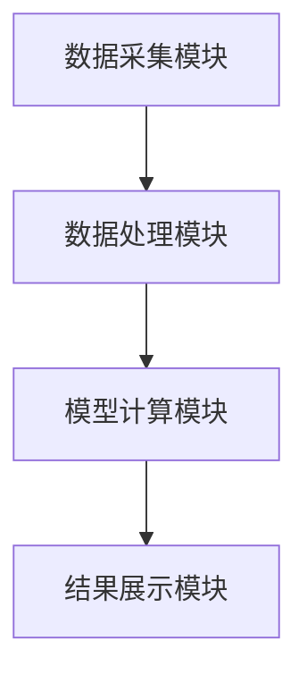
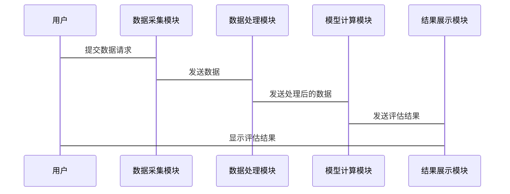

                 


# 企业估值中的客户粘性评估

> 关键词：企业估值，客户粘性，客户行为分析，客户价值评估，客户生命周期，客户忠诚度，客户满意度，客户保留率，客户流失率，客户生命周期价值

> 摘要：客户粘性是企业在市场竞争中保持长期客户关系的关键因素，直接影响企业的估值。本文从客户粘性的核心概念出发，结合客户行为分析、客户价值评估、客户生命周期管理等多维度，系统性地探讨客户粘性评估的方法与实践。通过数学模型、算法原理、系统架构设计和项目实战的详细阐述，帮助读者深入理解客户粘性评估的内在逻辑和实际应用。文章最后总结了客户粘性评估的核心要点，并提出了未来的发展方向和最佳实践建议。

---

## 引言：企业估值中的客户粘性评估

### 1.1 什么是客户粘性
客户粘性（Customer Churn）是指客户在企业服务中的留存率，即客户在使用企业产品或服务后，继续使用该产品或服务的概率。客户粘性高意味着客户更倾向于长期使用企业的服务，降低客户流失率。

### 1.2 客户粘性对企业估值的影响
客户粘性直接影响企业的客户保留率和客户生命周期价值（Customer Lifetime Value, CLV）。高客户粘性意味着企业能够更有效地吸引和保留客户，从而提升企业的整体估值。

### 1.3 为什么客户粘性是企业估值的关键因素
客户粘性是企业长期发展的重要指标，直接影响企业的收入、利润和市场份额。在企业估值过程中，客户粘性评估可以帮助投资者更好地理解企业的核心竞争力和未来的盈利能力。

---

## 第二章：客户行为分析

### 2.1 客户行为的定义与分类
客户行为是指客户在购买、使用和反馈企业产品或服务时所表现出的行为特征。客户行为可以分为购买行为、使用行为和反馈行为。

### 2.2 客户行为与客户粘性的关系
客户行为是客户粘性的重要影响因素。客户的行为特征（如购买频率、使用时长等）可以帮助企业预测客户粘性，并制定相应的客户保留策略。

### 2.3 客户行为分析的常用方法
- **数据分析法**：通过分析客户的购买记录、使用频率和反馈数据，评估客户的粘性。
- **客户画像法**：基于客户的行为数据，构建客户画像，识别高粘性客户的特征。
- **行为轨迹分析**：通过分析客户的行为轨迹，识别客户的流失风险。

---

## 第三章：客户价值评估

### 3.1 客户价值的定义
客户价值是指客户为企业带来的长期收益，包括直接收入和间接收益。客户价值越高，客户粘性通常越高。

### 3.2 客户价值与客户粘性的联系
客户价值是客户粘性的重要驱动因素。高价值客户通常具有更高的粘性，因为他们为企业创造了更多的价值，也更可能继续使用企业的产品或服务。

### 3.3 客户价值评估的指标体系
- **收入贡献**：客户为企业带来的直接收入。
- **利润贡献**：客户为企业带来的净利润。
- **客户生命周期价值**：客户在企业生命周期内为企业带来的总价值。

---

## 第四章：客户生命周期管理

### 4.1 客户生命周期的定义
客户生命周期是指客户从初次接触企业产品或服务，到成为忠实客户，最终可能流失的整个过程。客户生命周期管理是提升客户粘性的关键策略。

### 4.2 客户生命周期与客户粘性的关系
客户生命周期管理可以帮助企业识别不同阶段的客户，并制定相应的客户保留策略，从而提升客户粘性。

### 4.3 客户生命周期管理的策略
- **客户获取阶段**：通过精准营销吸引潜在客户。
- **客户培养阶段**：通过优质服务提升客户满意度。
- **客户保留阶段**：通过个性化服务增强客户忠诚度。
- **客户流失阶段**：通过挽回策略降低客户流失率。

---

## 第五章：客户粘性评估的数学模型

### 5.1 客户粘性的概率模型
客户粘性可以通过概率模型进行量化。常见的客户粘性概率模型包括马尔可夫链模型和贝叶斯网络模型。

### 5.2 客户粘性的计算公式
客户粘性（P）可以通过以下公式进行计算：
$$ P = \frac{\text{客户保留率}}{\text{客户保留率} + \text{客户流失率}} $$

### 5.3 客户粘性的评估步骤
1. **数据收集**：收集客户的行为数据和交易数据。
2. **数据清洗**：对数据进行预处理，去除异常值。
3. **模型选择**：选择适合的客户粘性评估模型。
4. **模型训练**：通过数据训练模型，计算客户粘性概率。
5. **结果分析**：根据模型结果，制定客户保留策略。

---

## 第六章：客户粘性评估的系统架构设计

### 6.1 系统功能模块
- **数据采集模块**：负责收集客户的行为数据和交易数据。
- **数据处理模块**：对数据进行清洗和预处理。
- **模型计算模块**：计算客户粘性概率。
- **结果展示模块**：展示客户粘性评估结果和客户画像。

### 6.2 系统架构图


### 6.3 系统交互设计


---

## 第七章：客户粘性评估的项目实战

### 7.1 环境安装
- 安装Python和相关库（如Pandas、Scikit-learn）。
- 安装Jupyter Notebook用于数据分析和可视化。

### 7.2 核心代码实现
```python
import pandas as pd
from sklearn.metrics import accuracy_score
from sklearn.tree import DecisionTreeClassifier

# 加载数据
data = pd.read_csv('customer_data.csv')

# 数据预处理
X = data[['age', 'income', 'purchase_frequency']]
y = data['churn']

# 模型训练
model = DecisionTreeClassifier()
model.fit(X, y)

# 模型预测
predictions = model.predict(X)
print("模型准确率：", accuracy_score(y, predictions))
```

### 7.3 代码解读与分析
- 数据预处理：将客户数据转换为适合模型训练的格式。
- 模型训练：使用决策树模型训练客户粘性评估模型。
- 模型预测：利用训练好的模型预测客户粘性。

### 7.4 实际案例分析
通过实际案例分析，展示如何利用客户粘性评估模型提升企业估值。

### 7.5 项目小结
总结项目实施过程中的关键点和经验教训。

---

## 第八章：总结与展望

### 8.1 客户粘性评估的核心要点
- 客户粘性是企业估值的重要指标。
- 客户行为分析、客户价值评估和客户生命周期管理是提升客户粘性的关键策略。

### 8.2 未来的发展方向
- 引入人工智能技术，提升客户粘性评估的精准度。
- 结合区块链技术，实现客户数据的安全共享和评估。

### 8.3 最佳实践 tips
- 定期分析客户行为数据，及时识别潜在流失客户。
- 通过个性化服务提升客户满意度和忠诚度。

### 8.4 注意事项
- 数据隐私保护是客户粘性评估的重要考虑因素。
- 模型的准确性和可解释性需要重点关注。

### 8.5 拓展阅读
推荐相关书籍和论文，供读者深入学习。

---

## 作者：AI天才研究院 & 禅与计算机程序设计艺术

感谢您的阅读！希望本文能够帮助您深入理解企业估值中的客户粘性评估，并为您的实践提供有价值的参考。

