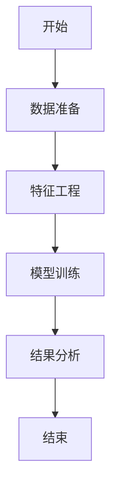

                 


# 《企业估值中的客户终身价值计算》

---

## 关键词：客户终身价值（CLV）、企业估值、客户价值模型、客户生命周期、商业数据分析

---

## 摘要：  
客户终身价值（Customer Lifetime Value，CLV）是企业估值中的核心指标之一，它反映了客户在企业生命周期中为企业带来的总收入减去相关成本。本文将从理论基础、算法实现、系统架构、项目实战等多个维度，详细分析客户终身价值的计算方法及其在企业估值中的应用。通过结合实际案例和代码实现，帮助读者深入理解CLV的计算原理，并为企业制定更精准的客户管理策略提供参考。

---

## 第一部分：客户终身价值（CLV）概述

### 第1章：CLV的定义与背景

#### 1.1 什么是客户终身价值  
客户终身价值（CLV）是衡量客户对企业长期贡献的核心指标，它综合考虑了客户在企业生命周期中带来的收入和成本。CLV不仅帮助企业评估客户的经济价值，还能为企业的市场策略、客户管理和服务优化提供数据支持。

#### 1.2 CLV在企业估值中的重要性  
- **客户保留成本降低**：通过CLV，企业可以识别高价值客户，优化客户保留策略，降低客户流失率。  
- **精准营销**：CLV帮助企业根据客户的价值进行分层营销，提升营销效率。  
- **长期利润预测**：CLV是企业预测未来收益的重要依据，有助于制定更科学的财务规划。  

#### 1.3 CLV与其他估值方法的区别  
传统的估值方法通常基于企业整体表现，而CLV则从客户视角出发，将客户价值与企业利润直接关联。CLV更注重客户个体的贡献，能够帮助企业更精准地制定客户策略。

---

### 第2章：CLV的核心概念与联系

#### 2.1 CLV的核心概念原理  
- **客户生命周期模型**：客户从初次接触、购买、忠诚到流失，每个阶段的贡献价值不同。  
- **客户价值的构成要素**：包括客户收入贡献、客户保留概率、客户获取成本等。  
- **CLV的数学模型**：CLV = (收入贡献 - 成本) × 客户生命周期长度。  

#### 2.2 CLV核心概念的属性特征对比  
以下是不同行业和客户群体的CLV差异对比：  

| 行业         | 高CLV客户特征                     | 低CLV客户特征                     |
|--------------|----------------------------------|----------------------------------|
| 零售业       | 高频购买、高客单价                | 低频购买、低客单价                |
| 金融行业     | 高信用评分、长期贷款贡献          | 低信用评分、短期贷款贡献          |
| 科技行业     | 高使用频率、高订阅续订率          | 低使用频率、低订阅续订率          |

#### 2.3 CLV的ER实体关系图  
以下是CLV的实体关系图：  

```mermaid
er
  Customer
  --
  id: int
  name: string
  purchase_history: int
  Customer_Lifetime_Value
  --
  customer_id: int
  clv_value: float
  timestamp: date
```

---

## 第二部分：客户终身价值（CLV）的算法原理

### 第3章：CLV计算的数学模型

#### 3.1 基于客户保留概率的CLV计算  
客户保留概率是CLV计算的关键因素之一。假设客户在每个阶段被保留的概率为p，则CLV的计算公式为：  
$$CLV = \frac{收入贡献}{1 - 保留概率}$$  

#### 3.2 基于收入贡献的CLV计算  
收入贡献是客户在生命周期中为企业带来的总收入。假设客户每年贡献的收入为R，成本为C，则CLV的计算公式为：  
$$CLV = \frac{R - C}{1 - 保留概率}$$  

#### 3.3 基于成本模型的CLV计算  
CLV的计算还可以结合客户获取成本（CAC）和客户生命周期长度（L）。公式如下：  
$$CLV = (收入贡献 - 成本) \times L$$  

---

### 第4章：CLV算法的流程图



以下是CLV算法的Python实现示例：  

```python
import numpy as np
import pandas as pd

# 示例数据
data = {
    '客户ID': [1, 2, 3, 4, 5],
    '收入贡献': [100, 150, 200, 120, 180],
    '成本': [50, 60, 70, 40, 50],
    '保留概率': [0.8, 0.7, 0.9, 0.6, 0.8]
}

df = pd.DataFrame(data)

# 计算CLV
df['CLV'] = (df['收入贡献'] - df['成本']) / (1 - df['保留概率'])

print(df)
```

---

## 第三部分：客户终身价值（CLV）的系统分析与架构设计

### 第5章：CLV计算系统的设计与实现

#### 5.1 问题场景介绍  
我们以电商行业为例，设计一个CLV计算系统。目标是通过客户的历史数据，预测客户的终身价值，并为企业制定客户管理策略提供支持。

#### 5.2 系统功能设计  
- **数据采集**：从数据库中获取客户交易记录、行为数据等。  
- **特征工程**：提取客户的基本信息、购买频率、购买金额等特征。  
- **模型计算**：基于CLV公式，计算客户的终身价值。  
- **结果展示**：将计算结果可视化，便于企业决策。

#### 5.3 系统架构设计  
以下是CLV计算系统的架构图：  


#### 5.4 系统接口设计  
以下是CLV计算系统的接口设计：  

```mermaid
sequence
    用户 --> API接口：获取客户数据
    API接口 --> 数据库：查询客户信息
    数据库 --> API接口：返回数据
    API接口 --> 算法模块：计算CLV
    算法模块 --> API接口：返回结果
    用户 <-- API接口：展示CLV结果
```

---

## 第四部分：客户终身价值（CLV）的项目实战

### 第6章：电商行业中的CLV计算

#### 6.1 环境安装  
- 安装Python和必要的库：`numpy`, `pandas`, `scikit-learn`。  

#### 6.2 数据准备  
以下是一个电商行业的客户数据示例：  

```python
import pandas as pd

data = {
    '客户ID': [1, 2, 3, 4, 5],
    '购买次数': [5, 3, 7, 2, 4],
    '客单价': [200, 150, 300, 100, 250],
    '购买间隔天数': [30, 45, 20, 60, 25],
    '客户保留概率': [0.8, 0.7, 0.9, 0.6, 0.8]
}

df = pd.DataFrame(data)
```

#### 6.3 特征工程  
提取客户的购买频率、客单价等特征，并计算CLV。  

#### 6.4 模型训练  
使用历史数据训练CLV预测模型，并对新客户进行预测。  

#### 6.5 结果分析  
分析高CLV客户的特点，并制定针对性的客户管理策略。  

---

## 第五部分：客户终身价值（CLV）的高级内容与最佳实践

### 第7章：CLV的高级应用与注意事项

#### 7.1 CLV的动态调整  
根据市场变化和客户行为，定期更新CLV计算模型，确保结果的准确性。  

#### 7.2 CLV与客户细分  
结合客户分层，制定个性化的客户管理策略，提升高CLV客户的满意度和忠诚度。  

#### 7.3 CLV与企业战略  
将CLV作为企业战略的重要组成部分，优化资源配置，提升整体竞争力。  

---

## 小结  

客户终身价值（CLV）是企业估值中的核心指标，通过科学的计算方法和系统架构设计，企业可以更好地理解客户价值，制定更精准的市场策略。本文通过理论分析、算法实现和项目实战，全面展示了CLV的计算过程及其在实际应用中的重要性。希望读者能够通过本文，掌握CLV的核心概念和计算方法，并在实际工作中灵活运用。

---

## 作者：AI天才研究院/AI Genius Institute & 禅与计算机程序设计艺术 /Zen And The Art of Computer Programming

