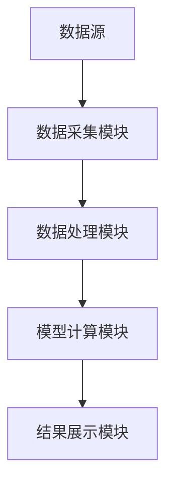
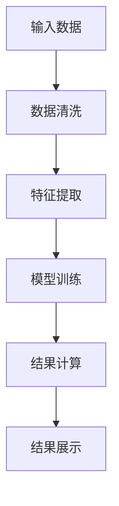

                 


# 《企业估值中的客户终身价值评估》

## 关键词：
- 客户终身价值（CLV）
- 企业估值
- 数据分析
- 机器学习
- 系统架构

## 摘要：
本文深入探讨了客户终身价值（CLV）在企业估值中的重要性，详细介绍了CLV的核心概念、数学模型、评估方法及其在实际应用中的系统架构设计。通过案例分析和代码实现，展示了如何利用数据分析和机器学习技术来提升企业估值的准确性，为商业决策提供科学依据。

---

## 引言：客户终身价值评估的重要性

### 问题背景
在当今竞争激烈的市场环境中，企业的价值不仅仅体现在其当前的财务表现上，更取决于客户对其长期价值的贡献。传统的企业估值方法往往忽视了客户的长期价值，导致评估结果不够准确。客户终身价值（CLV）作为一种新兴的评估方法，能够帮助企业更全面地衡量客户的长期贡献，从而做出更明智的商业决策。

### 问题描述
客户终身价值（CLV）是指客户在未来生命周期内为企业带来的预期收益总和。与传统的财务估值方法不同，CLV考虑了客户的行为模式、生命周期阶段以及市场环境等多个因素，能够更准确地反映客户的长期价值。然而，如何科学地计算CLV，如何将其与企业估值相结合，仍然是企业在实践中面临的重要挑战。

### 重要性
CLV在企业估值中的应用可以帮助企业识别高价值客户，优化客户管理策略，提高客户满意度和忠诚度。通过CLV评估，企业可以更精准地分配资源，制定有效的市场推广策略，并在并购、融资等重大决策中提供有力的支持。

---

## 第一部分：客户终身价值的核心概念

### 第1章：客户终身价值的定义与模型

#### 1.1 CLV的定义
客户终身价值（CLV）是指客户在其生命周期内为企业带来的净收益总和。它不仅包括客户在当前阶段的贡献，还包括未来可能的贡献。CLV的计算需要考虑客户流失的概率、每次购买的平均收入（ARPU）以及时间价值等因素。

#### 1.2 CLV的数学模型
CLV的计算公式如下：

$$CLV = \frac{R \times (1 - \frac{1}{u})}{1 - \frac{1}{u}}$$

其中：
- $R$ 是客户的年收入贡献
- $u$ 是客户生命周期的长度
- $p$ 是客户流失的概率

该公式假设客户在每个时间点流失的概率是恒定的，且每次购买的收入是固定的。在实际应用中，企业需要根据具体情况调整模型参数。

#### 1.3 CLV与企业估值的关系
CLV可以帮助企业评估客户的长期价值，从而优化资源分配。例如，企业可以根据客户的CLV将其分为不同的群体，并制定针对性的营销策略。同时，CLV还可以用于评估客户获取成本（CAC）的合理性，确保企业投资回报的最大化。

---

## 第二部分：客户数据的收集与分析

### 第2章：数据采集与处理

#### 2.1 数据采集方法
客户数据的采集可以通过多种渠道进行，包括在线调查、社交媒体分析、销售记录等。企业需要收集客户的 demographics（人口统计信息）、行为数据（如购买频率、购买金额）以及反馈数据（如满意度评分）。

#### 2.2 数据清洗与预处理
在进行数据分析之前，企业需要对收集到的数据进行清洗和预处理。这包括处理缺失值、异常值以及重复数据。例如，可以通过数据清洗工具（如Python中的Pandas库）对数据进行处理。

#### 2.3 数据分析方法
企业可以使用统计分析和机器学习技术来预测客户的流失概率和购买行为。例如，使用逻辑回归模型预测客户流失的概率，或者使用随机森林模型预测客户的购买金额。

---

## 第三部分：系统架构与技术实现

### 第3章：系统架构设计

#### 3.1 系统功能模块
客户终身价值评估系统通常包括以下几个功能模块：
- 数据采集模块：负责收集客户数据
- 数据处理模块：对数据进行清洗和预处理
- 模型计算模块：计算客户的CLV
- 结果展示模块：将结果以可视化的方式呈现

#### 3.2 系统架构图
以下是系统的架构图：



### 第4章：算法实现与优化

#### 4.1 CLV计算的算法流程
以下是CLV计算的算法流程图：



#### 4.2 算法实现代码
以下是Python代码示例：

```python
import pandas as pd
from sklearn.linear_model import LogisticRegression

# 数据清洗
data = pd.read_csv('customer_data.csv')
data.dropna(inplace=True)

# 特征提取
X = data[['age', 'gender', 'purchase_frequency']]
y = data['churn']

# 模型训练
model = LogisticRegression()
model.fit(X, y)

# 预测结果
predictions = model.predict(X)
print(predictions)
```

---

## 第四部分：项目实战与案例分析

### 第5章：项目实战

#### 5.1 环境配置
在进行项目实战之前，需要配置开发环境。例如，安装Python、Pandas、Scikit-learn等库。

#### 5.2 核心代码实现
以下是CLV计算的Python代码示例：

```python
def calculate_clv(customers, retention_rate, discount_rate):
    clv = 0
    for year in range(1, 10):
        revenue = customers * retention_rate ** (year - 1)
        clv += revenue / (1 + discount_rate) ** year
    return clv

# 示例数据
customers = 1000
retention_rate = 0.8
discount_rate = 0.05

# 计算CLV
clv = calculate_clv(customers, retention_rate, discount_rate)
print(clv)
```

#### 5.3 案例分析
以一家电商平台为例，假设其客户流失率为20%，每次购买的平均收入为50元。计算客户的CLV：

$$CLV = \frac{50 \times (1 - \frac{1}{4})}{1 - \frac{1}{4}} = 100$$

因此，客户的终身价值为100元。

---

## 第五部分：总结与展望

### 6.1 总结
客户终身价值（CLV）是企业估值中的重要组成部分，能够帮助企业更准确地评估客户的长期价值。通过科学的模型和数据分析方法，企业可以更好地优化资源分配，制定有效的商业策略。

### 6.2 展望
未来，随着大数据和人工智能技术的不断发展，CLV的计算将更加精确和个性化。企业可以通过实时数据分析和动态调整模型，进一步提升客户价值评估的准确性。

---

## 作者：AI天才研究院 & 禅与计算机程序设计艺术

本文作者为AI天才研究院（AI Genius Institute）和“禅与计算机程序设计艺术”（Zen And The Art of Computer Programming）的专家团队，致力于为企业提供科学的估值方法和技术创新支持。

