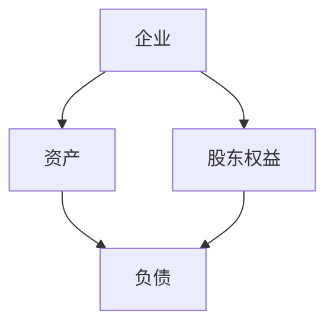
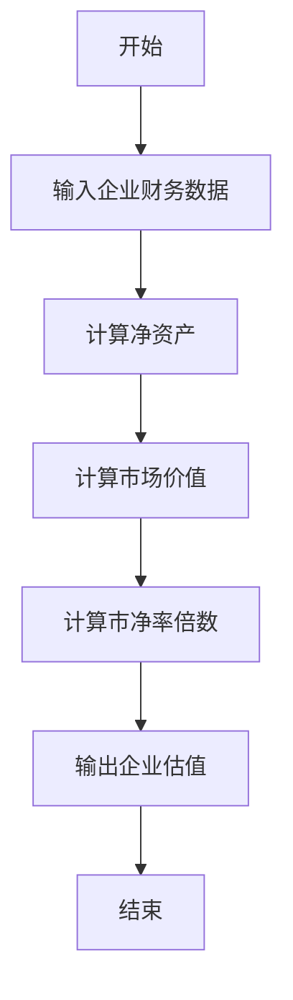
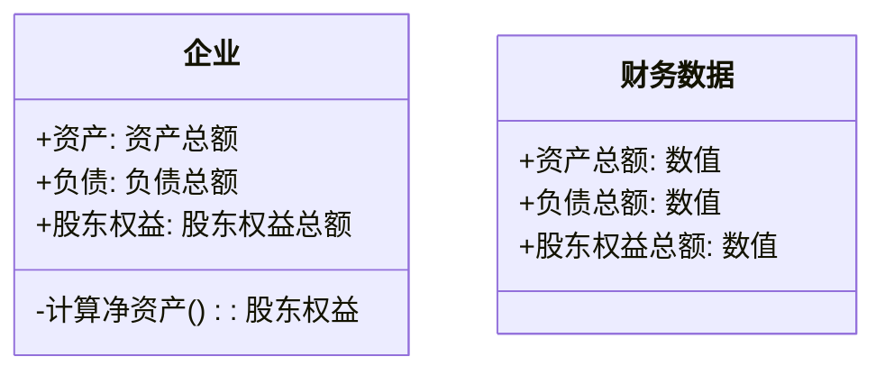
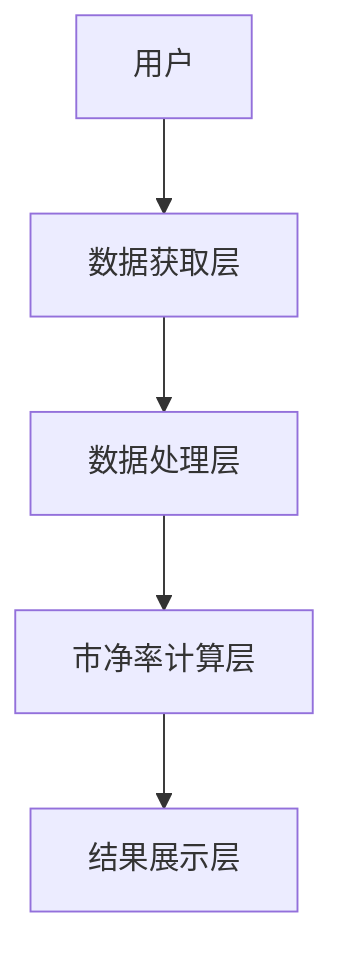
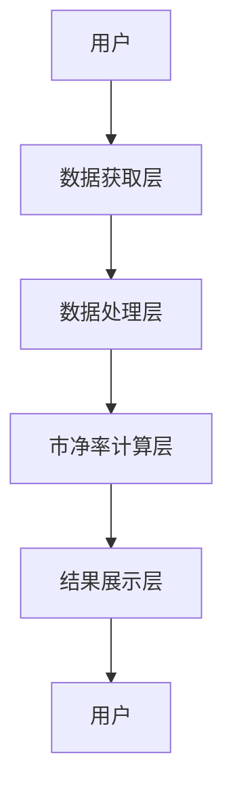

                 


# 企业估值中的市净率法详解

## 关键词：市净率，企业估值，资产重估，投资分析，金融工具

## 摘要：  
市净率（Price-to-Book Ratio，简称PB）是企业估值中常用的一种方法，尤其适用于金融、房地产等资产密集型行业。本文将从市净率的基本概念出发，深入探讨其算法原理、应用场景，并通过系统架构设计和实际案例分析，全面解析市净率法在企业估值中的应用。文章还结合了系统设计与实战分析，帮助读者掌握市净率法的核心原理与实际操作技巧。

---

## 第一部分: 企业估值中的市净率法背景介绍

### 第1章: 市净率法的核心概念

#### 1.1 什么是市净率
##### 1.1.1 市净率的定义与意义
市净率是企业的市场价值与其账面价值（即股东权益）的比率，公式为：
$$ PB = \frac{Market\ Value}{Book\ Value\ of\ Equity} $$
市净率反映了市场对公司资产的认可程度，是衡量企业投资价值的重要指标之一。

##### 1.1.2 市净率与企业估值的关系
市净率通过比较市场价值与账面价值，帮助投资者判断企业是否被高估或低估。当市净率低于1时，通常认为企业被低估，具有投资价值。

##### 1.1.3 市净率法的应用场景
市净率法适用于资产密集型行业（如银行、房地产）和周期性行业，因为这些行业的资产价值相对稳定，易于评估。

#### 1.2 市净率法的背景与现状
##### 1.2.1 企业估值的基本问题
企业估值需要考虑财务状况、市场环境、行业特点等因素，传统的方法如市盈率法（基于利润）和现金流折现法（基于未来收益）各有局限性。

##### 1.2.2 市净率法的起源与发展
市净率法起源于20世纪70年代，随着金融市场的发展，逐渐成为企业估值的重要工具之一。

##### 1.2.3 当前市净率法的应用现状
市净率法在投资分析、资产定价等领域广泛应用，但也面临数据获取困难和行业差异的问题。

### 第2章: 市净率法的核心概念与联系

#### 2.1 市净率法的核心原理
##### 2.1.1 市净率法的基本公式
市净率法的基本公式为：
$$ PB = \frac{Market\ Capitalization}{Total\ Book\ Value} $$
其中，市场资本化价值为企业的总市值，账面价值为企业资产负债表上的净资产。

##### 2.1.2 市净率法的核心要素
- 市场价值：企业的总市值。
- 账面价值：企业的净资产，即资产减去负债。
- 市净率倍数：市场价值与账面价值的比率。

##### 2.1.3 市净率法与其他估值方法的联系
- 与市盈率法的联系：市盈率法基于利润，而市净率法基于资产，两者结合可以更全面地评估企业价值。
- 与现金流折现法的联系：市净率法适用于资产密集型行业，而现金流折现法适用于成长型企业。

#### 2.2 市净率法的属性特征对比
表1：市净率法与其他估值方法的对比

| 方法       | 基础指标 | 适用场景 | 优点 | 缺点 |
|------------|-----------|----------|------|------|
| 市净率法   | 账面价值   | 资产密集型行业 | 数据易获取 | 行业差异大 |
| 市盈率法   | 净利润     | 成长型企业 | 反映盈利能力 | 数据波动大 |
| 现金流折现法 | 自由现金流 | 任何行业 | 精确性高 | 计算复杂 |

#### 2.3 市净率法的ER实体关系图


---

## 第二部分: 市净率法的算法原理

### 第3章: 市净率法的算法原理

#### 3.1 市净率法的基本流程
##### 3.1.1 确定企业净资产
计算企业的账面价值，即资产减去负债。

##### 3.1.2 计算市净率倍数
通过比较市场价值与账面价值，计算市净率倍数。

##### 3.1.3 评估企业价值
根据市净率倍数，评估企业的市场价值是否合理。

#### 3.2 市净率法的数学模型
##### 3.2.1 市净率公式
$$ PB = \frac{Market\ Value}{Book\ Value\ of\ Equity} $$

##### 3.2.2 市净率倍数计算
$$ PB\ Multiple = \frac{Market\ Capitalization}{Total\ Book\ Value} $$

#### 3.3 市净率法的算法流程图


---

## 第三部分: 市净率法的系统分析与架构设计

### 第4章: 市净率法的系统分析

#### 4.1 问题场景介绍
##### 4.1.1 企业估值的基本问题
如何准确评估企业的市场价值，尤其是在资产密集型行业中。

##### 4.1.2 市净率法的应用场景
适用于银行、房地产等行业的企业估值。

##### 4.1.3 系统需求分析
- 数据采集：获取企业的财务数据。
- 计算市净率：基于财务数据计算市净率。
- 可视化结果：将结果以图表形式展示。

### 第5章: 市净率法的系统架构设计

#### 5.1 系统功能设计
##### 5.1.1 领域模型类图


##### 5.1.2 系统架构设计


##### 5.1.3 系统接口设计
- 数据接口：从数据库中获取企业的财务数据。
- 计算接口：计算市净率倍数。
- 展示接口：将结果以图表形式展示。

#### 5.2 系统交互设计
##### 5.2.1 系统交互流程图


---

## 第六部分: 项目实战

### 第6章: 项目实战

#### 6.1 环境安装
##### 6.1.1 工具安装
- Python 3.8+
- Pandas库
- Matplotlib库

#### 6.2 系统核心实现源代码
##### 6.2.1 数据获取
```python
import pandas as pd

# 从数据库获取企业财务数据
def get_financial_data(ticker):
    # 示例代码，实际需要连接数据库或API
    return pd.DataFrame({
        '资产总额': [10000],
        '负债总额': [6000],
        '股东权益总额': [4000]
    })
```

##### 6.2.2 计算市净率
```python
def calculate_pb_ratio(market_cap, book_value):
    return market_cap / book_value

# 示例计算
market_cap = 8000  # 总市值
book_value = 4000   # 股东权益总额
pb_ratio = calculate_pb_ratio(market_cap, book_value)
print(f"市净率倍数为：{pb_ratio}")
```

##### 6.2.3 可视化结果
```python
import matplotlib.pyplot as plt

# 示例图表
plt.figure(figsize=(10,6))
plt.plot(pb_ratio, 'b-')
plt.title('市净率倍数')
plt.xlabel('时间')
plt.ylabel('市净率倍数')
plt.show()
```

#### 6.3 案例分析
##### 6.3.1 案例介绍
以某银行为例，假设其总市值为80亿元，股东权益总额为40亿元，计算其市净率倍数。

##### 6.3.2 数据分析
```python
# 计算市净率
market_cap = 8000000000  # 总市值，单位：元
book_value = 4000000000   # 股东权益总额，单位：元
pb_ratio = market_cap / book_value
print(f"市净率倍数为：{pb_ratio:.2f}")
```

##### 6.3.3 结果解读
市净率倍数为2.0，说明该银行的市场价值是其账面价值的2倍，属于合理估值范围。

---

## 第七部分: 最佳实践、小结与注意事项

### 7.1 最佳实践
- 在使用市净率法时，应结合行业特点和企业具体情况。
- 注意数据的准确性和完整性。

### 7.2 小结
市净率法是一种简单有效的估值方法，尤其适用于资产密集型行业。通过本文的系统分析和实战案例，读者可以掌握市净率法的核心原理和实际应用技巧。

### 7.3 注意事项
- 数据质量：确保财务数据的准确性和完整性。
- 行业差异：不同行业的市净率法应用可能存在差异。

### 7.4 拓展阅读
- 《投资学基础》
- 《企业估值方法与实践》

---

## 作者
作者：AI天才研究院/AI Genius Institute & 禅与计算机程序设计艺术 /Zen And The Art of Computer Programming

---

通过以上详细分析和实战案例，希望读者能够全面理解市净率法的理论与实践应用，掌握企业估值的核心技巧。

