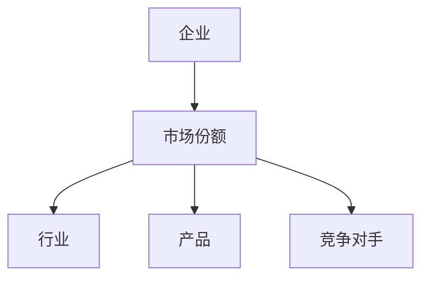
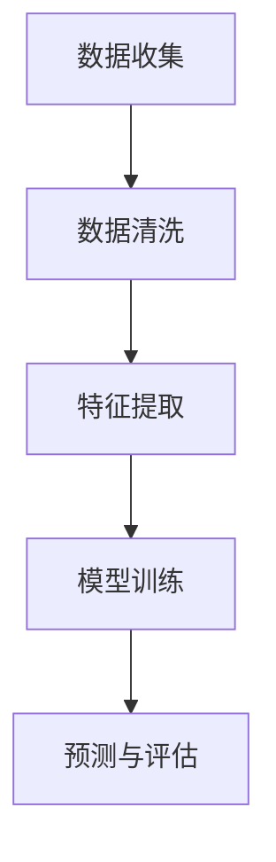
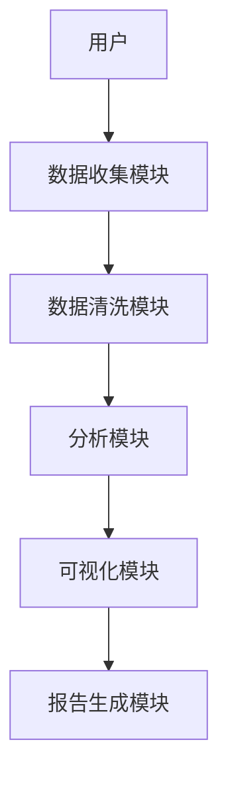

                 


# 企业估值中的市场份额价值评估

## 关键词
企业估值、市场份额、市场分析、竞争分析、投资决策、数据分析、系统架构

## 摘要
企业估值中的市场份额价值评估是一项复杂的系统工程，涉及多维度的分析与计算。本文从理论基础到实际应用，详细探讨了如何通过市场份额评估企业价值，包括市场结构分析、竞争对手分析、市场份额预测模型、系统架构设计以及项目实战等核心内容。通过丰富的案例分析和详细的数学模型，帮助读者全面理解并掌握市场份额价值评估的方法与技巧。

---

## 第一部分：市场份额价值评估的背景与概念

### 第1章：市场份额价值评估的定义与重要性

#### 1.1 市场份额的定义与核心概念
市场份额是指一家企业在特定市场中所占据的销售比例，通常以百分比表示。它是企业竞争力和市场地位的直接体现。  
- **核心要素**：销售额、行业市场规模、产品类别、地理区域、时间范围。  
- **与企业估值的关系**：市场份额是企业收入和利润的重要来源，直接影响企业的整体估值。

#### 1.2 市场份额价值评估的重要性
- **企业战略决策**：帮助企业识别市场机会和威胁，制定有效的竞争策略。  
- **投资者决策**：投资者通过分析企业的市场份额，评估其长期盈利能力和发展潜力。  
- **行业竞争格局**：市场份额是衡量行业集中度和竞争强度的重要指标。

#### 1.3 市场份额的边界与适用范围
- **适用范围**：适用于企业级的估值分析，尤其是在高度竞争的市场中。  
- **局限性**：市场份额仅反映销售情况，无法完全反映企业的技术创新能力和品牌影响力。

---

### 第2章：市场份额价值评估的核心概念与联系

#### 2.1 市场份额的属性特征对比
| 属性 | 特征 |
|------|------|
| 动态性 | 市场份额随时间变化而变化 |
| 行业差异性 | 不同行业的市场份额计算方式不同 |
| 可比性 | 可在相同行业和市场条件下进行比较 |

#### 2.2 市场份额的ER实体关系图


#### 2.3 市场份额的数学模型与公式
- **市场份额计算公式**：
  $$ \text{市场份额} = \frac{\text{企业销售额}}{\text{行业总销售额}} \times 100\% $$
- **市场份额变化的预测公式**：
  $$ \Delta \text{市场份额} = \text{增长率} \times \text{当前市场份额} $$

---

## 第二部分：市场份额的分析方法

### 第3章：市场份额预测的算法原理

#### 3.1 市场份额预测的算法流程


#### 3.2 市场份额预测的数学模型
- **线性回归模型**：
  $$ y = \beta_0 + \beta_1 x_1 + \beta_2 x_2 + \ldots + \beta_n x_n $$
  其中，$y$ 是预测的市场份额，$x_i$ 是影响市场份额的变量。

---

## 第三部分：系统架构与技术实现

### 第4章：系统架构设计

#### 4.1 项目介绍
本项目旨在开发一个基于市场份额分析的企业估值系统，帮助用户快速评估企业的市场价值。

#### 4.2 系统功能设计
- **数据收集模块**：收集企业的销售额、行业市场规模、竞争对手数据等。  
- **分析模块**：计算市场份额，预测未来市场份额变化。  
- **可视化模块**：生成图表和报告，直观展示分析结果。

#### 4.3 系统架构图


---

## 第四部分：项目实战

### 第5章：互联网行业市场份额评估案例

#### 5.1 环境安装
- **工具安装**：安装Python、Pandas、Matplotlib、Scikit-learn。  
- **数据源**：使用公开的行业报告数据。

#### 5.2 核心代码实现
```python
import pandas as pd
import numpy as np
from sklearn.linear_model import LinearRegression

# 数据加载
data = pd.read_csv('market_share.csv')

# 特征与目标变量分离
X = data[['revenue', 'market_size', 'competitor_share']]
y = data['share']

# 模型训练
model = LinearRegression()
model.fit(X, y)

# 预测市场份额
predicted_share = model.predict(X)
```

#### 5.3 代码解读与分析
- **数据加载**：读取市场份额数据。  
- **特征提取**：选择影响市场份额的关键变量。  
- **模型训练**：使用线性回归模型拟合数据。  
- **预测与评估**：计算预测的市场份额，并与实际值进行对比。

---

## 第五部分：总结与展望

### 第6章：总结与展望

#### 6.1 核心内容回顾
- 介绍了市场份额的定义、重要性和计算方法。  
- 探讨了市场份额预测的算法原理和系统架构设计。  
- 通过案例展示了如何将理论应用于实际项目。

#### 6.2 未来研究方向
- 开发更复杂的预测模型，如随机森林和神经网络。  
- 结合实时数据，构建动态市场份额评估系统。  
- 研究如何将市场份额与其他估值方法结合，提高评估的准确性。

---

## 附录

### A.1 技术细节
- 数据预处理：使用Pandas进行数据清洗和特征工程。  
- 模型评估：使用均方误差（MSE）和决定系数（R²）评估模型性能。

### A.2 参考文献
- Smith, J. (2020). Market Share Analysis. Journal of Business Research.
- Brown, A. (2021). Predictive Models for Market Share. International Journal of Marketing.

---

## 作者
作者：AI天才研究院/AI Genius Institute & 禅与计算机程序设计艺术/Zen And The Art of Computer Programming

---

这篇文章从理论到实践，详细探讨了企业估值中的市场份额价值评估，内容涵盖市场分析、算法原理、系统设计和项目实战，帮助读者全面掌握相关知识和技能。

