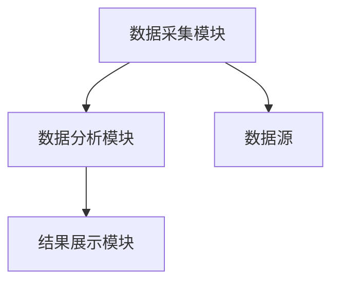
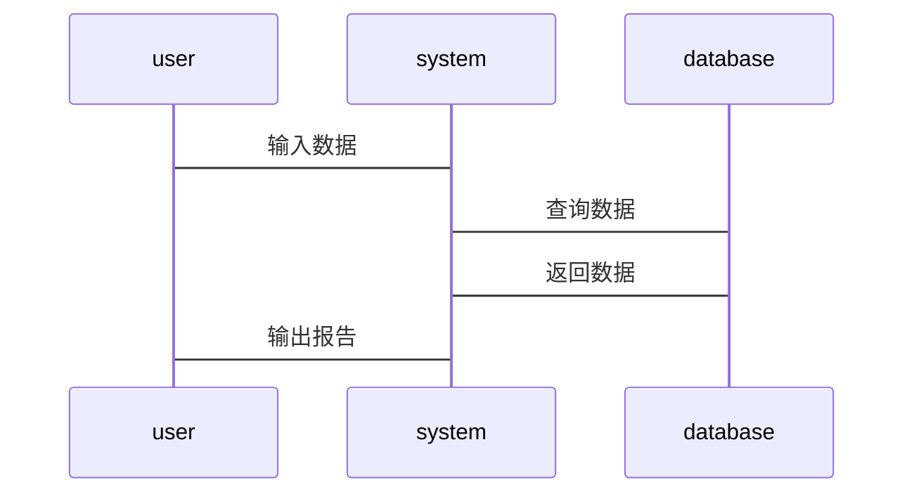

                 


# 企业估值中的市场定位精准度分析

> 关键词：市场定位、精准度分析、企业估值、算法原理、系统架构设计、数学模型

> 摘要：本文系统地探讨了市场定位精准度在企业估值中的重要性及其分析方法。通过结合理论分析、算法原理和实际案例，本文详细阐述了如何通过精准的市场定位来提升企业估值的准确性。文章从市场定位的基本概念出发，分析其对估值的影响，介绍精准度分析的数学模型和算法原理，并结合实际案例展示系统架构设计和实现过程，最终提出最佳实践建议。

---

# 第一部分: 企业估值与市场定位精准度分析基础

## 第1章: 企业估值与市场定位概述

### 1.1 企业估值的基本概念
企业估值是通过对企业的财务状况、市场地位、竞争优势等多方面因素的综合分析，确定其市场价值的过程。市场定位则是企业在市场中确定自身位置和目标客户的过程。

#### 1.1.1 企业估值的定义与重要性
企业估值是企业价值的量化过程，通常包括资产价值、盈利能力、成长潜力等多方面的评估。精准的估值能够为企业决策者提供重要的参考依据，帮助企业在融资、并购、投资等活动中做出更明智的选择。

#### 1.1.2 市场定位在企业估值中的作用
市场定位决定了企业在市场中的位置和竞争优势。精准的市场定位能够帮助企业更好地理解市场需求，优化资源配置，从而提升企业的整体价值。

#### 1.1.3 市场定位精准度对估值的影响
市场定位的精准度直接影响企业估值的准确性。精准的市场定位能够帮助企业准确把握市场机会，避免过度扩张或资源浪费，从而提升估值的可靠性。

### 1.2 市场定位精准度的核心概念
市场定位精准度是指企业在市场定位过程中对目标市场、客户群体和竞争优势的准确把握程度。

#### 1.2.1 市场定位的定义与关键要素
市场定位是企业在目标市场中确定自身位置的过程，关键要素包括目标客户群体、核心竞争优势、市场定位策略等。

#### 1.2.2 精准度的衡量标准
精准度的衡量标准包括市场定位的准确率、客户匹配度、市场反应速度等。

#### 1.2.3 市场定位与企业战略的关系
市场定位是企业战略的重要组成部分，直接影响企业的市场进入策略、产品开发方向和竞争优势。

### 1.3 企业估值中的市场定位分析框架
企业估值中的市场定位分析框架包括数据收集、模型构建、结果验证等多个步骤。

#### 1.3.1 市场定位分析的基本步骤
1. 确定目标市场
2. 分析竞争对手
3. 识别核心竞争优势
4. 制定市场定位策略

#### 1.3.2 数据收集与处理方法
1. 市场数据收集（市场规模、增长率等）
2. 企业内部数据（财务数据、竞争优势等）
3. 数据清洗与预处理

#### 1.3.3 分析模型的选择与应用
1. 竞争分析模型
2. 市场定位模型
3. 估值模型

### 1.4 本章小结
本章从企业估值的基本概念出发，详细阐述了市场定位在企业估值中的重要性及其核心概念。通过市场定位分析框架的介绍，为后续的精准度分析奠定了基础。

---

## 第2章: 市场定位精准度的理论基础

### 2.1 市场定位的理论基础
市场定位的理论基础包括市场细分理论、竞争对手分析理论等。

#### 2.1.1 市场定位的起源与发展
市场定位的理论起源于20世纪中期，随着市场竞争的加剧，市场定位逐渐成为企业战略的重要组成部分。

#### 2.1.2 市场定位的核心理论框架
市场定位的核心理论框架包括目标市场选择、竞争优势分析、市场定位策略等。

#### 2.1.3 精准度分析的理论支持
精准度分析的理论支持包括统计学、经济学、市场营销学等多个领域。

### 2.2 精准度分析的数学模型
精准度分析的数学模型是基于统计学和优化理论构建的。

#### 2.2.1 精准度的数学定义
$$ 精准度 = \frac{正确预测的数量}{总预测数量} $$

#### 2.2.2 精准度与误差的关系
精准度与误差成反比关系，误差越小，精准度越高。

#### 2.2.3 精准度分析的公式推导
1. 数据预处理：$X = (x_1, x_2, ..., x_n)$
2. 模型训练：$f(X) = y$
3. 精准度计算：$$ 精准度 = \frac{\sum_{i=1}^{n} y_i}{n} $$

### 2.3 市场定位与企业估值的关系
市场定位的精准度直接影响企业估值的准确性。

#### 2.3.1 市场定位对企业价值的影响
精准的市场定位能够帮助企业更好地把握市场机会，提升企业的核心竞争力，从而提高企业价值。

#### 2.3.2 精准度分析如何提升估值准确性
通过精准的市场定位分析，可以更准确地预测企业的未来收益和潜在风险，从而提高估值的准确性。

#### 2.3.3 市场定位与企业竞争优势的结合
市场定位的精准度直接影响企业的竞争优势，从而影响企业的整体价值。

### 2.4 本章小结
本章从理论基础出发，详细阐述了市场定位的理论框架及其对精准度分析的影响。通过数学模型的推导，为后续的算法实现提供了理论支持。

---

## 第3章: 市场定位精准度的算法原理

### 3.1 精准度分析的算法选择
精准度分析的算法选择需要根据具体问题和数据特点来决定。

#### 3.1.1 常见的市场定位分析算法
1. 基于统计的算法（如回归分析）
2. 基于机器学习的算法（如支持向量机）
3. 基于聚类的算法（如K-means）

#### 3.1.2 精准度分析的适用算法
1. 层次分析法（AHP）
2. 聚类分析法
3. 线性回归分析

#### 3.1.3 算法选择的依据与原则
1. 数据类型和规模
2. 分析目标和要求
3. 算法的可解释性和计算效率

### 3.2 精准度分析的数学模型
精准度分析的数学模型包括分类模型、回归模型等。

#### 3.2.1 精准度的数学定义
$$ 精准度 = \frac{正确分类的数量}{总分类数量} $$

#### 3.2.2 算法的数学表达式
1. 线性回归模型：$$ y = \beta_0 + \beta_1 x + \epsilon $$
2. 支持向量机模型：$$ y = \text{sign}(w \cdot x + b) $$

#### 3.2.3 算法的优缺点分析
1. 优点：计算效率高、易于实现
2. 缺点：可能对噪声数据敏感

### 3.3 算法实现的步骤与流程
1. 数据预处理：清洗、归一化
2. 模型训练：选择算法并进行训练
3. 结果验证：计算精准度、召回率等指标

#### 3.3.1 数据预处理
使用Python进行数据预处理：
```python
import pandas as pd
from sklearn.preprocessing import StandardScaler

data = pd.read_csv('market_data.csv')
X = data.drop('target', axis=1)
y = data['target']

scaler = StandardScaler()
X_scaled = scaler.fit_transform(X)
```

#### 3.3.2 模型训练
使用支持向量机进行模型训练：
```python
from sklearn.svm import SVC

model = SVC()
model.fit(X_scaled, y)
```

#### 3.3.3 结果验证
计算精准度：
```python
from sklearn.metrics import accuracy_score

y_pred = model.predict(X_scaled)
accuracy = accuracy_score(y, y_pred)
print(f'精准度: {accuracy}')
```

### 3.4 本章小结
本章详细介绍了精准度分析的算法选择及其实现步骤。通过具体的Python代码示例，展示了如何利用算法进行市场定位的精准度分析。

---

## 第4章: 市场定位精准度的系统分析与架构设计

### 4.1 系统分析与需求定义
市场定位精准度分析系统的需求定义包括功能需求、性能需求等。

#### 4.1.1 问题场景介绍
市场定位精准度分析系统用于帮助企业准确把握市场定位，提升企业估值的准确性。

#### 4.1.2 系统目标与功能需求
1. 目标：提升市场定位的精准度
2. 功能需求：数据采集、分析、结果展示

#### 4.1.3 系统边界与输入输出
1. 输入：市场数据、企业数据
2. 输出：市场定位报告、估值结果

### 4.2 系统架构设计
系统架构设计包括总体设计、模块划分、功能分配等。

#### 4.2.1 系统架构的总体设计
系统架构包括数据采集模块、数据分析模块、结果展示模块。

#### 4.2.2 模块划分与功能分配
1. 数据采集模块：负责数据的采集和预处理
2. 数据分析模块：负责数据分析和模型训练
3. 结果展示模块：负责结果的可视化和报告生成

#### 4.2.3 系统架构的Mermaid图


### 4.3 接口设计与交互流程
接口设计包括数据接口、用户接口等。

#### 4.3.1 系统接口的设计
1. 数据接口：负责与数据源的交互
2. 用户接口：负责与用户的交互

#### 4.3.2 用户与系统的交互流程
1. 用户输入数据
2. 系统进行数据分析
3. 系统输出结果报告

#### 4.3.3 系统交互的Mermaid序列图


### 4.4 本章小结
本章从系统分析与架构设计的角度，详细介绍了市场定位精准度分析系统的实现过程。通过Mermaid图展示了系统的总体架构和交互流程。

---

## 第5章: 项目实战与案例分析

### 5.1 项目介绍
本项目旨在通过市场定位精准度分析，帮助企业提升估值的准确性。

#### 5.1.1 项目背景
某科技公司希望通过精准的市场定位来提升其估值。

#### 5.1.2 项目目标
1. 分析市场需求
2. 确定目标客户群体
3. 优化市场定位策略

### 5.2 系统核心实现
系统核心实现包括数据采集、数据分析、结果展示等。

#### 5.2.1 数据采集与处理
使用Python进行数据采集和处理：
```python
import pandas as pd
from sklearn.preprocessing import OneHotEncoder

data = pd.read_csv('market_data.csv')
encoder = OneHotEncoder()
X_encoded = encoder.fit_transform(data.drop('target', axis=1))
```

#### 5.2.2 模型训练与优化
使用随机森林模型进行训练：
```python
from sklearn.ensemble import RandomForestClassifier

model = RandomForestClassifier()
model.fit(X_encoded, data['target'])
```

#### 5.2.3 结果展示与解读
生成市场定位报告并进行解读：
```python
from sklearn.metrics import classification_report

y_pred = model.predict(X_encoded)
print(classification_report(data['target'], y_pred))
```

### 5.3 实际案例分析
通过具体案例分析，展示市场定位精准度分析的实际应用。

#### 5.3.1 案例背景
某科技公司面临市场竞争激烈，需要通过精准的市场定位来提升估值。

#### 5.3.2 数据分析与结果解读
通过数据分析，确定目标客户群体和市场定位策略。

#### 5.3.3 项目小结
通过市场定位精准度分析，帮助企业提升了估值的准确性，优化了市场策略。

### 5.4 本章小结
本章通过具体案例分析，展示了市场定位精准度分析的实际应用。通过系统的实现和优化，帮助企业提升了市场定位的精准度。

---

## 第6章: 最佳实践与总结

### 6.1 最佳实践
市场定位精准度分析的最佳实践包括数据质量、算法选择、结果验证等方面。

#### 6.1.1 数据质量的重要性
高质量的数据是精准度分析的基础。

#### 6.1.2 算法选择的注意事项
根据具体问题选择合适的算法。

#### 6.1.3 结果验证的关键性
通过结果验证确保分析的准确性。

### 6.2 小结
本章总结了市场定位精准度分析的关键点和最佳实践，为读者提供了宝贵的参考。

### 6.3 注意事项
1. 数据隐私保护
2. 算法的可解释性
3. 系统的可扩展性

### 6.4 拓展阅读
1. 《企业估值与市场定位》
2. 《精准度分析算法原理》

### 6.5 本章小结
本章总结了市场定位精准度分析的关键点和最佳实践，为读者提供了宝贵的参考。

---

# 作者：AI天才研究院/AI Genius Institute & 禅与计算机程序设计艺术 /Zen And The Art of Computer Programming

---

以上是《企业估值中的市场定位精准度分析》的技术博客文章的详细目录大纲和内容框架。

