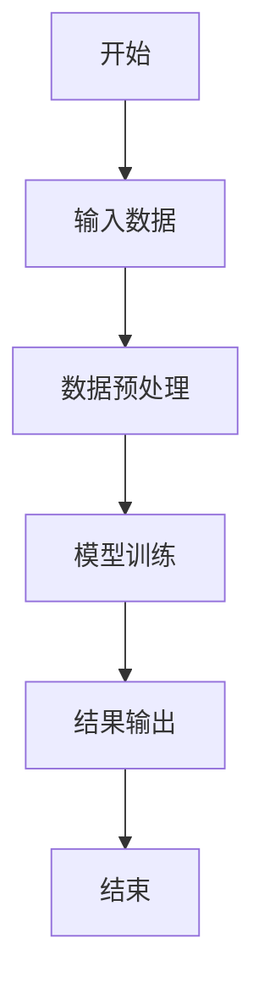

                 


# 《企业估值中的平台经济效应分析》

> 关键词：平台经济、企业估值、网络效应、双边市场、马太效应、数字化转型

> 摘要：本文将深入探讨平台经济效应对企业估值的影响，分析平台经济的核心概念、数学模型、系统架构设计以及实际案例，为企业估值提供理论支持和实践指导。

---

# 第一部分: 平台经济效应分析基础

## 第1章: 平台经济效应的背景与概念

### 1.1 平台经济的定义与特征

平台经济是指通过数字化技术构建的虚拟市场，连接多个参与者（如消费者、供应商、开发者等），并提供撮合交易、信息匹配等服务的经济模式。其核心特征包括：

- **双边市场效应**：平台同时服务两个或多个群体，通过网络效应实现价值。
- **零边际成本**：数字技术使得边际成本趋近于零，扩大规模成本递减。
- **长尾效应**：通过平台连接 niche 市场，创造新的价值空间。

### 1.2 平台经济效应的背景

随着数字化转型的推进，平台经济在全球范围内迅速崛起，成为新的经济增长点。平台经济的出现改变了传统的价值创造和分配模式，其对企业估值的影响主要体现在：

- **网络效应的放大效应**：用户数量的增加带来价值的指数级增长。
- **数据资产的杠杆效应**：数据作为生产要素，成为企业估值的重要组成部分。
- **平台生态的协同效应**：平台通过构建生态系统，实现多边利益的最大化。

### 1.3 平台经济效应的分析框架

平台经济效应的分析框架包括以下三个维度：

- **双边市场分析**：分析平台连接的双边或多边市场的特征，包括用户的规模、活跃度、交易频率等。
- **网络效应分析**：评估用户增长对平台价值的影响，包括直接网络效应和间接网络效应。
- **马太效应分析**：研究市场集中度对平台估值的影响，包括头部平台的垄断优势。

---

## 第2章: 平台经济效应的核心概念与联系

### 2.1 平台经济效应的核心概念

- **双边市场效应**：平台通过连接两个或多个市场，创造新的交易机会。例如，滴滴平台连接司机和乘客，形成了双边市场效应。
- **网络效应**：随着用户数量的增加，平台的价值呈指数级增长。例如，微信的用户越多，其社交网络的价值越大。
- **马太效应**：平台市场的赢家通吃现象，头部平台通过规模效应进一步巩固市场地位。

### 2.2 平台经济效应的属性特征对比

| 特征      | 双边市场效应 | 网络效应 | 马太效应 |
|-----------|--------------|----------|----------|
| 核心驱动  | 市场匹配效率 | 用户规模 | 市场集中 |
| 影响因素  | 双边用户数、交易频率 | 用户增长、数据积累 | 市场份额、用户粘性 |
| 价值表现  | 提高交易效率，降低交易成本 | 平台价值随用户增长呈指数级上升 | 头部平台占据主导地位，尾部平台难以竞争 |

### 2.3 平台经济效应的ER实体关系图

```mermaid
erDiagram
    user {
        +userId : int
        +userName : string
        +userRole : string
    }
    platform {
        +platformId : int
        +platformName : string
        +platformType : string
    }
    relationship {
        +relationshipId : int
        +userId : int
        +platformId : int
        +relationshipType : string
    }
    user -|{ n } relationship
    platform -|{ n } relationship
```

---

## 第3章: 平台经济效应的数学模型与公式

### 3.1 平台经济效应的数学模型

- **双边市场定价模型**：平台通过双边定价策略实现利润最大化。公式为：
  $$ P = \frac{a + b}{c} $$
  其中，$a$ 和 $b$ 分别代表双边市场的定价参数，$c$ 为市场匹配效率系数。

- **网络效应模型**：网络效应的价值可以用以下公式表示：
  $$ N = k \cdot n^{m} $$
  其中，$k$ 是基础价值系数，$n$ 是用户数量，$m$ 是网络效应的指数系数。

- **马太效应模型**：马太效应可以通过市场份额分布模型表示：
  $$ M = \frac{P}{Q} $$
  其中，$P$ 是头部平台的市场份额，$Q$ 是整个市场的总规模。

### 3.2 平台经济效应的算法流程图



### 3.3 平台经济效应的Python实现示例

```python
def calculate_platform_value(users, network_effect):
    """
    计算平台价值
    Args:
        users (int): 用户数量
        network_effect (float): 网络效应系数
    Returns:
        float: 平台价值
    """
    return users ** network_effect

# 示例计算
users = 1000000
network_effect = 0.8
platform_value = calculate_platform_value(users, network_effect)
print(f"平台价值为: {platform_value}")
```

---

## 第4章: 平台经济效应的系统分析与架构设计

### 4.1 平台经济效应分析的系统架构

- **系统功能模块划分**：
  - 数据采集模块：收集用户行为数据、市场数据等。
  - 数据处理模块：对数据进行清洗、转换和分析。
  - 模型训练模块：基于数据构建数学模型，计算平台经济效应。
  - 结果输出模块：生成可视化报告和分析结果。

- **系统架构设计**：
  ```mermaid
  graph TD
  A[数据采集] --> B[数据处理]
  B --> C[模型训练]
  C --> D[结果输出]
  ```

---

## 第5章: 平台经济效应分析的未来展望

平台经济效应分析将朝着以下几个方向发展：

1. **数据驱动的精准估值**：通过大数据技术，实现对企业估值的精准预测。
2. **人工智能的深度应用**：利用AI技术优化平台经济效应的分析模型。
3. **生态系统协同效应**：平台经济将更加注重生态系统的协同效应，构建更加复杂的多边市场。

---

# 作者：AI天才研究院/AI Genius Institute & 禅与计算机程序设计艺术 /Zen And The Art of Computer Programming

