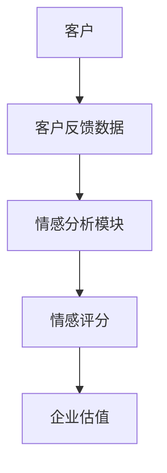
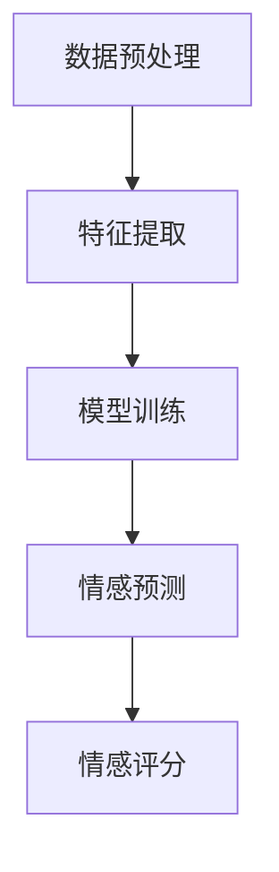
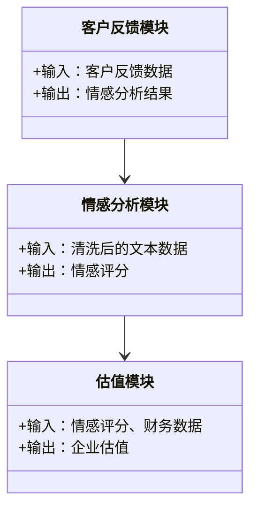
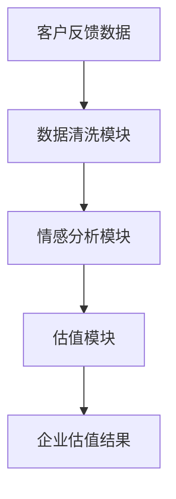
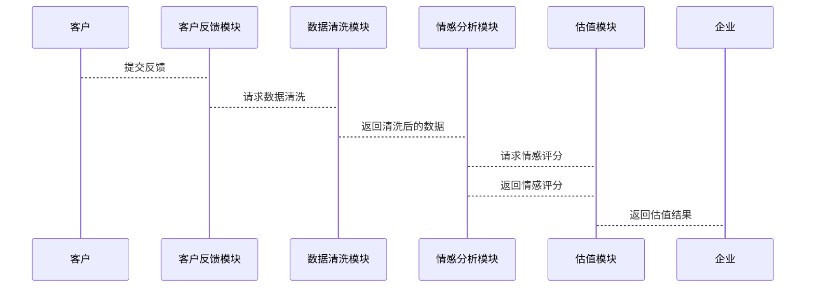

                 


# 企业估值中的情感AI客户服务平台评估

> 关键词：企业估值，情感AI，客户服务平台，情感分析，机器学习

> 摘要：情感AI客户服务平台通过分析客户情感数据，评估客户满意度和服务质量，从而影响企业估值。本文详细探讨了情感AI的核心原理、算法实现、系统架构设计及实际应用案例，为企业估值提供新的视角和方法。

---

# 第1章: 情感AI客户服务平台的背景与概念

## 1.1 问题背景与描述

### 1.1.1 传统企业估值方法的局限性
传统企业估值主要依赖于财务数据和市场表现，但忽略了客户情感和体验的重要性。客户的情感反馈是企业价值的重要组成部分，尤其是在客户关系管理中，情感数据能够揭示客户忠诚度和满意度，进而影响企业的长期发展。

### 1.1.2 情感AI在客户关系管理中的作用
情感AI通过自然语言处理和机器学习技术，分析客户反馈（如评论、邮件、社交媒体帖子）中的情感倾向，帮助企业识别客户满意度、品牌声誉和潜在风险。这种分析能够提供实时反馈，帮助企业在早期发现问题并采取改进措施。

### 1.1.3 情感AI客户服务平台的核心目标
情感AI客户服务平台的核心目标是通过自动化情感分析，帮助企业量化客户情感数据，将其纳入企业估值模型中，提供更全面的估值依据。

## 1.2 情感AI客户服务平台的核心要素

### 1.2.1 情感计算的基本原理
情感计算涉及从文本中提取情感信息，通常包括以下步骤：
1. 数据预处理：清洗和标准化文本数据。
2. 特征提取：识别文本中的情感关键词和语调。
3. 情感分类：使用机器学习模型预测情感倾向（正面、中性、负面）。

### 1.2.2 客户情感数据的采集与分析
客户情感数据可以通过多种渠道采集，包括客服对话、社交媒体评论、调查问卷等。这些数据需要经过清洗、标注和分析，提取出有价值的情感信息。

### 1.2.3 情感评分与企业估值的关系
情感评分是客户情感数据的量化表示，通常以分数形式呈现（如1到5分）。企业可以根据客户群体的平均情感评分，评估客户满意度和品牌忠诚度，从而调整估值策略。

## 1.3 问题解决与边界

### 1.3.1 情感AI如何提升企业估值
情感AI能够帮助企业识别客户情感趋势，及时发现潜在问题，优化客户服务策略，从而提升客户满意度和企业声誉，最终提高企业估值。

### 1.3.2 情感AI客户服务平台的边界与外延
情感AI客户服务平台的边界包括数据采集范围、情感分析的深度和粒度。外延则涉及与其他系统的集成，如CRM系统、财务系统等。

### 1.3.3 情感AI与传统估值方法的结合
情感AI可以作为传统估值方法的补充，提供情感维度的数据支持，使企业估值更加全面和动态。

---

# 第2章: 情感AI客户服务平台的核心概念与联系

## 2.1 情感AI的核心原理

### 2.1.1 情感计算的基本流程
情感计算的基本流程包括：
1. 数据预处理：去除停用词、分词。
2. 特征提取：提取情感相关特征（如关键词、句法结构）。
3. 模型训练：使用有监督学习方法训练情感分类器。

### 2.1.2 情感分析的关键技术
情感分析的关键技术包括：
- **自然语言处理（NLP）**：用于文本理解和语义分析。
- **机器学习**：用于情感分类和预测。
- **深度学习**：用于更复杂的语义理解和情感推理。

### 2.1.3 情感评分的数学模型
情感评分可以通过加权平均的方法计算，公式如下：
$$
\text{情感评分} = \sum_{i=1}^{n} w_i \cdot s_i
$$
其中，\( w_i \) 是第 \( i \) 个情感特征的权重，\( s_i \) 是情感特征的评分。

## 2.2 情感分析方法对比

### 2.2.1 基于规则的情感分析方法
基于规则的方法依赖预定义的情感词典和规则，适用于简单的情感分类任务。

### 2.2.2 基于机器学习的情感分析方法
基于机器学习的方法通过训练数据学习情感特征，适用于复杂的情感分类任务。

### 2.2.3 深度学习在情感分析中的应用
深度学习方法（如LSTM、BERT）能够捕捉文本的上下文信息，提高情感分析的准确率。

### 2.2.4 情感分析方法对比表
| 方法         | 优点               | 缺点               |
|--------------|--------------------|--------------------|
| 基于规则     | 实现简单           | 需要大量人工干预   |
| 机器学习     | 高准确性           | 需要大量标注数据   |
| 深度学习     | 高准确性           | 计算资源消耗大     |

## 2.3 情感AI系统实体关系图



---

# 第3章: 情感AI客户服务平台的算法原理

## 3.1 情感分析算法流程图



## 3.2 情感分析算法实现

### 3.2.1 数据预处理
数据预处理包括去除停用词、分词和词干提取。

### 3.2.2 特征提取
使用TF-IDF方法提取文本特征：
$$
\text{TF-IDF}(i, j) = \text{TF}(i, j) \times \text{IDF}(j)
$$
其中，\( \text{TF}(i, j) \) 是第 \( i \) 个文档中第 \( j \) 个词的词频，\( \text{IDF}(j) \) 是第 \( j \) 个词的逆文档频率。

### 3.2.3 模型训练
使用支持向量机（SVM）训练情感分类器：
```python
from sklearn.feature_extraction.text import TfidfVectorizer
from sklearn.svm import SVC

# 数据预处理
corpus = ["这是一个好产品", "服务很糟糕"]
labels = [1, 0]

# 特征提取
vectorizer = TfidfVectorizer()
X = vectorizer.fit_transform(corpus)

# 模型训练
model = SVC()
model.fit(X, labels)
```

### 3.2.4 情感预测
使用训练好的模型进行情感预测：
```python
# 预测情感
new_text = ["客服非常热情"]
X_new = vectorizer.transform([new_text])
prediction = model.predict(X_new)
print(prediction)  # 输出：[1]
```

---

# 第4章: 情感AI客户服务平台的系统分析与架构设计

## 4.1 问题场景介绍
企业需要实时监控客户情感数据，评估客户满意度，并将其纳入企业估值模型。

## 4.2 系统功能设计

### 4.2.1 领域模型


### 4.2.2 系统架构设计


### 4.2.3 系统接口设计
系统接口包括：
1. 数据接口：接收客户反馈数据。
2. 情感分析接口：提供情感评分查询。
3. 估值接口：提供企业估值结果。

### 4.2.4 系统交互流程图


---

# 第5章: 情感AI客户服务平台的项目实战

## 5.1 环境安装
安装Python和必要的库：
```bash
pip install numpy scikit-learn tensorflow
```

## 5.2 系统核心实现

### 5.2.1 核心代码实现
```python
from sklearn.feature_extraction.text import TfidfVectorizer
from sklearn.svm import SVC
from sklearn.metrics import accuracy_score

# 数据准备
corpus = [
    "This is a good product",  # 正面情感
    "The service is terrible"  # 负面情感
]
labels = [1, 0]

# 特征提取
vectorizer = TfidfVectorizer()
X = vectorizer.fit_transform(corpus)

# 模型训练
model = SVC()
model.fit(X, labels)

# 模型预测
new_text = ["客服非常热情"]
X_new = vectorizer.transform([new_text])
prediction = model.predict(X_new)
print("情感评分：", prediction[0])  # 输出：1
```

### 5.2.2 情感分析结果展示
模型预测结果可以通过可视化工具展示，例如使用Matplotlib绘制情感评分分布图。

## 5.3 实际案例分析
以某电商平台为例，分析客户评论的情感倾向，计算客户满意度，并评估其对企业估值的影响。

## 5.4 项目小结
本项目通过情感AI技术，实现了客户情感数据的自动化分析和企业估值的动态调整，为企业提供了新的估值视角。

---

# 第6章: 情感AI客户服务平台的最佳实践

## 6.1 小结
情感AI客户服务平台能够有效提升企业估值的准确性，帮助企业更好地管理客户关系。

## 6.2 注意事项
- 数据隐私保护
- 模型的可解释性
- 情感分析的准确性

## 6.3 拓展阅读
推荐阅读相关领域的书籍和论文，深入理解情感计算和机器学习的技术细节。

---

# 作者信息

作者：AI天才研究院/AI Genius Institute & 禅与计算机程序设计艺术 /Zen And The Art of Computer Programming

---

# 结语

情感AI客户服务平台通过分析客户情感数据，为企业估值提供了新的视角和方法。随着技术的不断发展，情感AI将在企业管理和估值中发挥越来越重要的作用。

