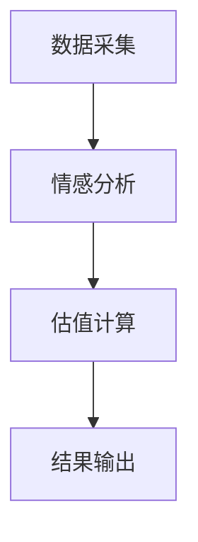

                 


# 企业估值中的情感AI应用价值评估

**关键词**：企业估值、情感AI、人工智能、金融分析、投资决策、数据驱动

**摘要**：  
本文探讨了情感人工智能（AI）在企业估值中的应用价值。企业估值传统上依赖于财务指标和市场数据，但情感因素在市场波动和投资者情绪中的作用日益重要。情感AI通过分析文本数据中的情感倾向，帮助企业更好地评估市场情绪、消费者反馈和竞争对手动态，从而为估值提供更全面的视角。本文从情感AI的基本原理、算法实现、系统架构到实际案例，全面分析了其在企业估值中的应用，并探讨了其对投资决策的潜在影响。

---

# 第1章: 情感AI与企业估值的背景

## 1.1 情感AI的定义与核心概念

### 1.1.1 情感AI的基本定义  
情感AI（Emotion AI）是一种结合自然语言处理（NLP）、机器学习和情感计算的技术，用于分析文本、语音或图像中的情感倾向。其核心目标是理解人类情感、态度和意图。

### 1.1.2 情感AI的核心要素  
- **情感分析**：判断文本的情感倾向（正面、负面、中性）。  
- **情感强度**：量化情感的强烈程度。  
- **情感上下文**：识别情感的背景和语境。  

### 1.1.3 情感AI与企业估值的关系  
情感AI通过分析市场情绪、消费者反馈和管理层沟通，为企业的内在价值评估提供额外信息。

---

## 1.2 企业估值的基本概念

### 1.2.1 企业估值的定义  
企业估值是对企业未来现金流的折现，以确定其市场价值。常用方法包括DCF模型、可比公司分析和 precedent transactions。

### 1.2.2 传统企业估值方法  
- **DCF模型**：基于自由现金流折现。  
- **可比公司法**：比较类似公司的估值。  
- ** precedent transactions**：参考类似交易的估值。  

### 1.2.3 情感因素在企业估值中的作用  
情感因素影响市场参与者的决策，进而影响企业估值的波动性。

---

## 1.3 情感AI在企业估值中的应用背景

### 1.3.1 当前企业估值面临的挑战  
- 数据依赖性高。  
- 市场情绪难以量化。  
- 竞争对手和消费者的动态难以预测。  

### 1.3.2 情感AI技术的发展与成熟  
- 自然语言处理技术的进步。  
- 深度学习模型的广泛应用。  

### 1.3.3 情感AI在企业估值中的潜在价值  
- 提供情感数据支持决策。  
- 改善估值模型的准确性。  

---

# 第2章: 情感AI的核心原理

## 2.1 情感AI的基本原理

### 2.1.1 情感分析的基本概念  
情感分析是通过文本挖掘技术，判断文本的情感倾向。  

### 2.1.2 情感分析的实现方法  
- **基于规则的方法**：使用预定义的规则匹配情感关键词。  
- **基于机器学习的方法**：使用训练好的模型分类情感。  

### 2.1.3 情感AI与自然语言处理的关系  
情感AI是NLP的一个重要应用领域。

---

## 2.2 情感AI的核心算法

### 2.2.1 基于规则的情感分析  
- 通过关键词匹配判断情感倾向。  
- 示例：使用情感词典（如AFINN、Sentiment Lexicons）。

### 2.2.2 基于机器学习的情感分析  
- 使用训练数据训练分类模型（如SVM、随机森林）。  

### 2.2.3 基于深度学习的情感分析  
- 使用预训练的大型语言模型（如BERT、GPT）。  

---

## 2.3 情感AI与企业估值的核心联系

### 2.3.1 情感数据的收集与处理  
- 数据来源：社交媒体、新闻报道、投资者评论。  

### 2.3.2 情感数据对估值模型的影响  
- 情感数据可以作为估值模型的输入变量。  

### 2.3.3 情感AI在企业估值中的具体应用  
- 分析市场情绪对股价的影响。  
- 评估消费者对产品的反馈。  

---

# 第3章: 情感AI的算法原理与数学模型

## 3.1 情感分析的算法流程

### 3.1.1 数据预处理  
- 分词、去停用词、词干提取。  

### 3.1.2 特征提取  
- 使用TF-IDF、词嵌入（如Word2Vec）。  

### 3.1.3 模型训练与评估  
- 使用准确率、召回率、F1值评估模型性能。  

---

## 3.2 常见情感AI算法的实现

### 3.2.1 基于支持向量机（SVM）的情感分析  
- 示例代码：  
```python
from sklearn.svm import SVC  
model = SVC()  
model.fit(X_train, y_train)  
```

### 3.2.2 基于深度学习的情感分析  
- 示例代码：  
```python
import tensorflow as tf  
model = tf.keras.Sequential([  
    tf.keras.layers.Embedding(vocab_size, 16),  
    tf.keras.layers.GlobalAveragePooling1D(),  
    tf.keras.layers.Dense(1, activation='sigmoid')  
])  
```

---

## 3.3 情感AI的数学模型与公式

### 3.3.1 基于SVM的情感分类模型  
- 模型目标：最小化 hinge loss。  
- 公式：  
$$ \text{loss} = \sum_{i=1}^{n} \max(0, 1 - y_i \cdot w \cdot x_i - b) $$  

### 3.3.2 基于神经网络的情感分类模型  
- 模型目标：最小化交叉熵损失。  
- 公式：  
$$ \text{loss} = -\sum_{i=1}^{n} y_i \log(p_i) + (1-y_i)\log(1-p_i) $$  

---

# 第4章: 情感AI的系统架构与项目实战

## 4.1 系统功能设计

### 4.1.1 系统功能模块  
- 数据采集模块：收集社交媒体、新闻数据。  
- 情感分析模块：处理和分析情感数据。  
- 估值计算模块：结合情感数据和财务数据计算估值。  

### 4.1.2 系统功能流程图  


---

## 4.2 系统架构设计

### 4.2.1 系统架构图  


### 4.2.2 系统接口设计  
- 输入接口：文本数据、财务数据。  
- 输出接口：情感得分、估值结果。  

---

## 4.3 项目实战

### 4.3.1 项目背景  
分析社交媒体上的公司新闻，评估其对股价的影响。

### 4.3.2 数据处理与特征工程  
- 使用Python进行文本清洗和特征提取。

### 4.3.3 模型实现与评估  
- 使用训练好的情感分析模型评估文本情感。  
- 结合财务数据进行最终估值。

---

# 第5章: 总结与展望

## 5.1 最佳实践与小结  
- 情感AI可以显著提升企业估值的准确性。  
- 需要注意数据质量和模型调优。

## 5.2 未来展望  
- 情感AI与更多领域结合（如实时交易信号）。  
- 更复杂的情感模型（如多模态情感分析）。  

---

# 作者：AI天才研究院/AI Genius Institute & 禅与计算机程序设计艺术 /Zen And The Art of Computer Programming

---

**参考文献**：  
1. 教育部学位论文: 《自然语言处理与情感分析》  
2. 《人工智能: 一种现代方法》  
3. 《情感计算与应用》

