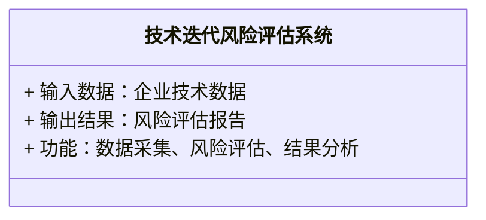

                 


# 企业估值中的技术迭代风险分析

> **关键词**：企业估值、技术迭代、风险分析、技术风险、企业风险管理、技术评估  
> **摘要**：技术迭代风险在企业估值中是一个不可忽视的因素，它影响着企业的长期发展潜力和市场竞争力。本文将深入分析技术迭代风险的核心概念、评估方法和管理策略，帮助企业更好地识别和应对技术风险，提升估值的准确性。

---

## 正文

### 第一部分：背景介绍

#### 第1章：技术迭代风险与企业估值概述

##### 1.1 技术迭代风险的背景介绍
随着科技的飞速发展，技术迭代已经成为企业发展的核心驱动力。无论是IT行业、制造业还是其他领域，技术的更新换代速度越来越快，对企业的影响也越来越大。技术迭代不仅改变了企业的生产方式，还直接影响企业的市场地位和盈利能力。因此，技术迭代风险成为企业估值中的重要考量因素。

技术迭代风险是指企业在技术更新过程中可能面临的不确定性，例如技术落后、技术替代或技术失败等问题。这些风险可能导致企业市场竞争力下降，甚至影响企业的生存能力。在企业估值中，技术迭代风险需要被充分考虑，以确保估值的准确性和可靠性。

##### 1.2 技术迭代风险的定义与特征
技术迭代风险是指企业在技术发展过程中，由于技术更新换代、技术替代或技术不确定性而可能面临的财务损失或市场机会错失的风险。其主要特征包括：
1. **不确定性**：技术发展的不可预测性导致企业难以准确评估技术迭代带来的影响。
2. **周期性**：技术迭代通常具有一定的周期性，企业需要在技术生命周期的不同阶段应对不同的风险。
3. **连锁效应**：技术迭代风险可能引发其他类型的经营风险，例如市场风险或运营风险。

##### 1.3 技术迭代风险的分类
技术迭代风险可以分为以下几类：
1. **技术替代风险**：新技术的出现可能导致原有技术迅速被淘汰，从而影响企业的市场份额。
2. **技术落后风险**：企业未能及时跟上技术发展趋势，导致在竞争中处于劣势。
3. **技术不确定性风险**：技术发展的不确定性可能导致企业投资失败或战略失误。

##### 1.4 本章小结
技术迭代风险是企业在技术发展过程中面临的重要挑战，它不仅影响企业的市场地位，还直接影响企业的估值。在企业估值中，技术迭代风险需要被充分考虑，以确保估值的准确性和可靠性。

---

### 第二部分：核心概念与联系

#### 第2章：技术迭代风险的核心概念与原理

##### 2.1 技术迭代风险的核心原理
技术迭代风险的核心在于技术发展的不确定性对企业价值的影响。技术的更新换代可能带来新的机会，但也可能对企业现有的业务模式和资产价值造成冲击。例如，一家依赖传统技术的企业可能因为新技术的出现而迅速失去竞争优势，从而影响其估值。

##### 2.2 技术迭代风险的属性特征对比
下表对比了技术迭代风险与其他类型风险的属性特征：

| **风险类型** | **风险来源**         | **影响范围**       | **可控性**         |
|--------------|----------------------|--------------------|--------------------|
| 技术迭代风险 | 技术更新和替代       | 企业市场竞争力     | 中等               |
| 市场风险     | 市场波动             | 企业整体价值       | 较低               |
| 行业风险     | 行业政策和竞争       | 企业行业地位       | 较低               |

##### 2.3 技术迭代风险的ER实体关系图
以下是技术迭代风险的ER实体关系图：

```mermaid
erDiagram
    技术迭代风险 <--- 技术更新换代 : 受影响于
    技术迭代风险 <--- 技术替代 : 受影响于
    技术迭代风险 <--- 技术不确定性 : 受影响于
```

---

### 第三部分：算法原理讲解

#### 第3章：技术迭代风险评估的算法原理

##### 3.1 技术迭代风险评估模型
技术迭代风险评估模型是一个基于企业技术发展现状和未来趋势的分析工具。以下是一个简单的技术迭代风险评估模型：

```mermaid
flowchart TD
    A[开始] -> B[收集企业技术数据]
    B -> C[分析技术发展趋势]
    C -> D[评估技术迭代风险]
    D -> E[输出风险报告]
    E -> F[结束]
```

##### 3.2 技术迭代风险评估的Python实现
以下是使用Python实现技术迭代风险评估的代码示例：

```python
import pandas as pd
import numpy as np

# 示例数据：企业技术发展数据
data = {
    '年份': [2018, 2019, 2020, 2021, 2022],
    '研发投入': [100, 120, 150, 180, 200],
    '技术更新次数': [2, 3, 4, 5, 6],
    '市场份额': [20, 25, 30, 35, 40]
}
df = pd.DataFrame(data)

# 计算技术迭代风险指数
def calculate_technology_risk(dataframe):
    # 计算技术更新速度
    update_speed = dataframe['技术更新次数'].pct_change().mean()
    # 计算研发投入与市场份额的回归系数
    model = linear_regression(dataframe['研发投入'], dataframe['市场份额'])
    # 综合风险指数
    risk_index = (update_speed + model.coef_[0]) / 2
    return risk_index

# 简单线性回归模型（示例）
def linear_regression(x, y):
    return np.polyfit(x, y, 1)

risk_index = calculate_technology_risk(df)
print(f"技术迭代风险指数：{risk_index}")
```

##### 3.3 技术迭代风险评估的数学模型
技术迭代风险评估的数学模型可以表示为：

$$
\text{风险指数} = \beta_0 + \beta_1 \times \text{研发投入} + \epsilon
$$

其中：
- $\beta_0$ 是截距项
- $\beta_1$ 是研发投入的回归系数
- $\epsilon$ 是误差项

例如，假设某企业的研发投入与市场份额的回归方程为：

$$
\text{市场份额} = 20 + 0.5 \times \text{研发投入} + \epsilon
$$

这意味着，每增加1单位的研发投入，市场份额预计增加0.5%。

---

### 第四部分：系统分析与架构设计

#### 第4章：技术迭代风险评估的系统架构

##### 4.1 系统功能设计
以下是技术迭代风险评估系统的功能模块：



##### 4.2 系统架构设计
以下是技术迭代风险评估系统的架构图：

```mermaid
containerDiagram
    [数据库] 包含：企业技术数据
    [前端] 包含：用户界面
    [后端] 包含：数据处理、风险评估算法
    [输出] 包含：风险报告
```

##### 4.3 系统接口设计
技术迭代风险评估系统的接口设计如下：

- 输入接口：企业技术数据接口（CSV/Excel格式）
- 输出接口：风险评估报告接口（PDF/Word格式）

##### 4.4 系统交互设计
以下是技术迭代风险评估系统的交互流程：

```mermaid
sequenceDiagram
    用户 -> 系统：上传企业技术数据
    系统 -> 数据库：存储数据
    用户 -> 系统：触发风险评估
    系统 -> 数据处理模块：处理数据
    数据处理模块 -> 风险评估算法：运行评估
    风险评估算法 -> 系统：生成报告
    系统 -> 用户：下载报告
```

---

### 第五部分：项目实战

#### 第5章：技术迭代风险评估的项目实战

##### 5.1 环境安装
- 操作系统：Windows/Mac/Linux
- 开发工具：Python 3.8+、Jupyter Notebook
- 库：pandas、numpy、scikit-learn

##### 5.2 系统核心实现源代码
以下是技术迭代风险评估的核心代码：

```python
import pandas as pd
from sklearn.linear_model import LinearRegression

# 示例数据：企业技术数据
data = {
    '年份': [2018, 2019, 2020, 2021, 2022],
    '研发投入': [100, 120, 150, 180, 200],
    '技术更新次数': [2, 3, 4, 5, 6],
    '市场份额': [20, 25, 30, 35, 40]
}
df = pd.DataFrame(data)

# 数据清洗
df.dropna(inplace=True)

# 特征工程
X = df[['研发投入', '技术更新次数']]
y = df['市场份额']

# 建立线性回归模型
model = LinearRegression()
model.fit(X, y)

# 预测市场份额
predicted_market_share = model.predict(X)
print(f"预测市场份额：{predicted_market_share}")
```

##### 5.3 代码应用解读与分析
上述代码首先读取企业技术数据，进行数据清洗和特征工程，然后建立线性回归模型，预测市场份额，并输出预测结果。通过分析预测结果，可以评估企业的技术迭代风险。

##### 5.4 实际案例分析
以某科技公司为例，分析其技术迭代风险：

1. 数据收集：收集该公司的研发投入、技术更新次数和市场份额数据。
2. 数据分析：通过线性回归模型，预测未来的市场份额。
3. 风险评估：根据预测结果，评估技术迭代风险。

##### 5.5 项目小结
通过项目实战，我们可以看到技术迭代风险评估的实际应用价值。模型可以帮助企业更好地理解技术发展对企业估值的影响，从而制定更有效的风险管理策略。

---

### 第六部分：最佳实践与总结

#### 第6章：技术迭代风险评估的总结与展望

##### 6.1 最佳实践 tips
- 定期评估技术迭代风险，及时调整企业战略。
- 加大研发投入，保持技术领先。
- 建立技术预警机制，及时应对技术风险。

##### 6.2 本章小结
技术迭代风险是企业估值中不可忽视的重要因素。通过科学的评估方法和有效的管理策略，企业可以更好地应对技术迭代带来的挑战，提升自身的市场竞争力。

##### 6.3 注意事项
- 技术迭代风险评估需要结合企业的实际情况，避免过于理论化。
- 在实际应用中，建议企业结合多种方法进行综合评估。

##### 6.4 拓展阅读
- 推荐阅读《技术风险管理：理论与实践》
- 参考文献：[技术迭代与企业战略](https://example.com)

---

**作者：AI天才研究院/AI Genius Institute & 禅与计算机程序设计艺术 /Zen And The Art of Computer Programming**

---

通过以上思考过程，我系统地分析了企业估值中的技术迭代风险，从背景介绍到实际应用，逐步展开内容，确保逻辑清晰，技术细节准确，同时结合实际案例，帮助读者更好地理解和应用技术迭代风险分析的方法。

