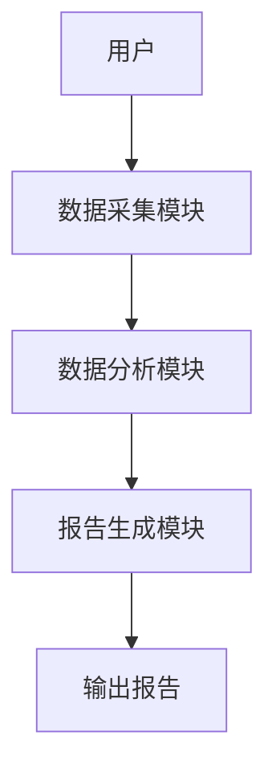
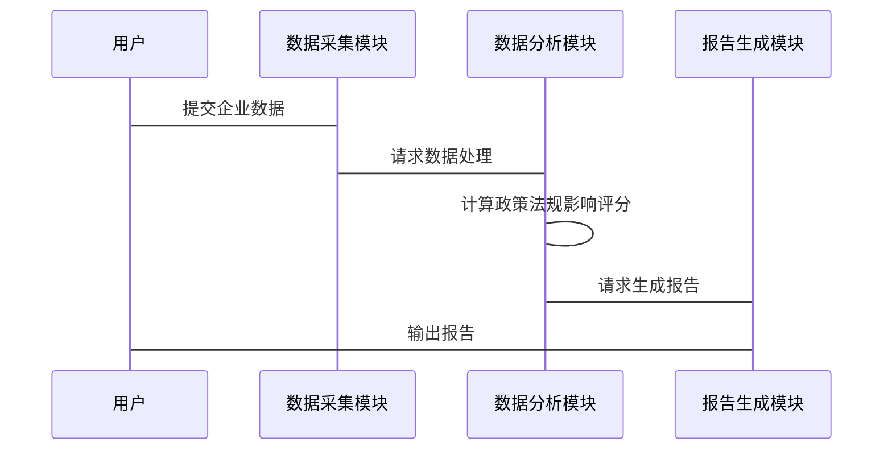

                 


# 企业估值中的政策法规影响分析

---

## 关键词：企业估值、政策法规、合规性评估、风险评估、竞争优势、数学建模、系统架构

---

## 摘要：  
本文深入探讨了政策法规对企业估值的核心影响，结合技术与法律的双重视角，分析了政策法规如何通过合规性评估、风险评估和竞争优势分析等多维度影响企业价值。通过构建数学模型和系统架构，本文为读者提供了从理论到实践的完整解决方案，帮助投资者和企业管理者更好地应对政策法规对企业估值的复杂影响。

---

# 第一部分: 企业估值中的政策法规影响分析基础

---

## 第1章: 企业估值与政策法规概述

### 1.1 企业估值的基本概念

#### 1.1.1 企业估值的定义与意义  
企业估值是指对企业整体价值的评估，通常包括资产、收入、利润、市场地位等多方面的综合考量。其意义在于帮助企业制定战略规划、吸引投资、并购重组等重大决策提供数据支持。  

#### 1.1.2 企业估值的核心要素  
- 财务表现：收入、利润、资产等财务指标。  
- 市场地位：市场份额、品牌影响力。  
- 经营风险：行业竞争、政策法规风险等。  
- 发展潜力：技术储备、管理团队等。  

#### 1.1.3 政策法规在企业估值中的作用  
政策法规是影响企业经营环境的重要因素，通过影响企业的合规性、经营风险和竞争优势，间接影响企业估值。  

---

### 1.2 政策法规对企业的影响

#### 1.2.1 政策法规的定义与分类  
政策法规是指由政府制定的规范企业行为的法律、法规和政策。分类包括行业政策、税收政策、环保政策等。  

#### 1.2.2 政策法规对企业经营的影响  
- 合规性要求：企业需遵守法律法规，否则可能面临罚款或业务中断。  
- 市场准入：某些行业需要许可证或资质，影响企业的进入门槛。  
- 经营成本：税收政策、环保要求等可能增加企业的运营成本。  

#### 1.2.3 政策法规与企业估值的关系  
政策法规通过影响企业的合规性、经营风险和竞争优势，直接影响企业的估值。  

---

### 1.3 本章小结  
本章从企业估值的基本概念出发，分析了政策法规对企业经营和估值的双重影响，为后续分析奠定了基础。

---

## 第2章: 政策法规对企业估值的多维度分析

### 2.1 合规性评估

#### 2.1.1 企业合规性评估的基本框架  
企业合规性评估包括对企业是否符合相关法律法规的全面检查，通常分为内部合规和外部合规两个方面。  

#### 2.1.2 合规性对企业估值的影响  
合规性良好的企业通常具有更低的经营风险，从而获得更高的估值。  

#### 2.1.3 合规性评估的指标体系  
- 法律合规性：企业是否遵守相关法律法规。  
- 财务合规性：财务报表是否真实、准确。  
- 知识产权合规性：专利、商标是否合法。  

---

### 2.2 风险评估

#### 2.2.1 政策法规对企业经营风险的影响  
政策法规的变动可能带来新的风险，例如税收政策的变化可能增加企业的税负。  

#### 2.2.2 风险评估的数学模型  
风险评分模型：  
$$ 风险评分 = \alpha \times 税收政策风险 + \beta \times 环保政策风险 + \gamma \times 行业政策风险 $$  
其中，$\alpha$、$\beta$、$\gamma$为权重系数，需根据具体行业调整。  

#### 2.2.3 风险对估值的具体影响  
高风险行业的企业估值通常较低，因为投资者会要求更高的风险溢价。  

---

### 2.3 竞争优势分析

#### 2.3.1 政策法规对企业竞争优势的影响  
政策法规可能为企业创造竞争优势，例如税收优惠、行业准入政策等。  

#### 2.3.2 竞争优势的评估方法  
- 比较优势：企业在行业中的独特优势。  
- 政策支持：政府政策对企业发展的支持程度。  
- 创新能力：企业是否能在政策变化中保持竞争优势。  

#### 2.3.3 竞争优势对估值的提升作用  
竞争优势显著的企业通常具有更高的估值，因为它们的市场地位和盈利能力更强。  

---

### 2.4 本章小结  
本章从合规性、风险和竞争优势三个维度，详细分析了政策法规对企业估值的影响，为后续的数学建模奠定了基础。

---

# 第二部分: 政策法规影响分析的数学模型与算法

---

## 第3章: 政策法规影响的数学建模

### 3.1 政策法规影响的评分模型

#### 3.1.1 模型的构建逻辑  
政策法规影响评分模型通过对企业合规性、风险和竞争优势的综合评估，量化政策法规对企业估值的影响。  

#### 3.1.2 模型的数学表达式  
$$ 影响评分 = \alpha \times 合规性评分 + \beta \times 风险评分 + \gamma \times 竞争优势评分 $$  
其中，$\alpha$、$\beta$、$\gamma$为权重系数，$\alpha + \beta + \gamma = 1$。  

#### 3.1.3 模型的实现步骤  
1. 收集企业相关数据，包括合规性、风险和竞争优势指标。  
2. 对各指标进行标准化处理。  
3. 计算影响评分，权重系数根据行业特点调整。  

---

### 3.2 风险评估的数学模型

#### 3.2.1 风险评估模型的构建  
风险评估模型基于政策法规对企业经营风险的影响，通过量化风险系数来调整企业估值。  

#### 3.2.2 风险评估模型的实现  
$$ 风险调整后估值 = 估值 \times (1 - 风险系数) $$  
其中，风险系数由政策法规对企业的影响程度决定。  

---

### 3.3 竞争优势分析的数学模型

#### 3.3.1 竞争优势评估模型的构建  
竞争优势评估模型通过对企业在行业中的相对优势进行量化，调整企业估值。  

#### 3.3.2 竞争优势评估模型的实现  
$$ 竞争优势调整后估值 = 估值 \times (1 + 竞争优势系数) $$  
其中，竞争优势系数由企业的市场地位和政策支持决定。  

---

## 第4章: 企业估值中的政策法规影响分析系统实现

### 4.1 系统架构设计

#### 4.1.1 系统功能模块  
- 数据采集模块：收集企业合规性、风险和竞争优势数据。  
- 数据分析模块：对数据进行处理和建模，计算政策法规影响评分。  
- 报告生成模块：输出企业估值分析报告。  

#### 4.1.2 系统架构图  


---

### 4.2 系统接口设计

#### 4.2.1 系统接口说明  
- 数据采集接口：接收企业的合规性、风险和竞争优势数据。  
- 数据分析接口：调用数学模型进行计算，返回政策法规影响评分。  
- 报告生成接口：生成企业估值分析报告。  

#### 4.2.2 系统交互流程图  


---

### 4.3 项目实战

#### 4.3.1 环境安装  
- 安装Python和相关库（如NumPy、Pandas、Matplotlib）。  
- 安装Mermaid和系统设计工具。  

#### 4.3.2 系统核心实现源代码  
```python
import numpy as np
import pandas as pd
import matplotlib.pyplot as plt

# 定义政策法规影响评分模型
def policy_impact_score(compliance_score, risk_score, competitive_score):
    alpha = 0.4
    beta = 0.3
    gamma = 0.3
    return alpha * compliance_score + beta * risk_score + gamma * competitive_score

# 示例数据
compliance_scores = np.array([0.8, 0.7, 0.9])
risk_scores = np.array([0.6, 0.8, 0.5])
competitive_scores = np.array([0.7, 0.6, 0.8])

# 计算政策法规影响评分
scores = policy_impact_score(compliance_scores, risk_scores, competitive_scores)

# 可视化结果
plt.bar(range(len(scores)), scores)
plt.title("Policy Impact Scores")
plt.xlabel("企业编号")
plt.ylabel("评分")
plt.show()
```

#### 4.3.3 实际案例分析  
以某互联网企业为例，分析政策法规对企业估值的具体影响。通过数据建模和系统实现，得出政策法规对企业估值的影响系数，并提出相应的优化建议。  

---

### 4.4 项目总结  
本项目通过构建数学模型和系统架构，实现了政策法规对企业估值的影响分析，为投资者和企业管理者提供了科学的决策支持。

---

# 第三部分: 企业估值中的政策法规影响分析系统实现

---

## 第5章: 政策法规影响分析的最佳实践

### 5.1 小结  
本文从理论到实践，详细分析了政策法规对企业估值的影响，构建了数学模型，并实现了系统架构。

### 5.2 注意事项  
- 数据采集需确保真实性和准确性。  
- 模型权重系数需根据行业特点调整。  
- 系统设计需考虑可扩展性和可维护性。  

### 5.3 拓展阅读  
- 《企业估值与金融建模》  
- 《政策法规与企业风险管理》  

---

## 作者：AI天才研究院/AI Genius Institute & 禅与计算机程序设计艺术/Zen And The Art of Computer Programming

