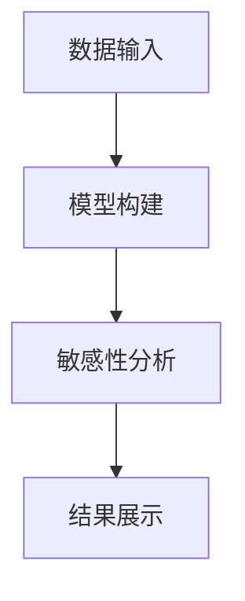

                 


# 企业估值中的敏感性分析技巧

## 关键词：
企业估值，敏感性分析，财务建模，风险评估，投资决策

## 摘要：
本文深入探讨了敏感性分析在企业估值中的应用，从基本原理到实际操作，全面解析如何利用敏感性分析优化企业估值模型。通过数学公式、算法原理、系统架构和项目实战的详细讲解，帮助读者掌握敏感性分析的核心技巧，提升投资决策的准确性。

---

# 第1章: 敏感性分析的背景与概念

## 1.1 什么是敏感性分析
### 1.1.1 敏感性分析的定义
敏感性分析是一种通过研究多个变量变化对企业估值影响程度的方法，旨在识别哪些变量对估值的影响最大。

### 1.1.2 敏感性分析的核心概念
- **变量**：影响企业估值的关键因素，如收入、成本、利润率等。
- **影响程度**：变量变化对估值的敏感性大小。
- **阈值**：变量变化的临界点，超过该点估值会发生显著变化。

### 1.1.3 敏感性分析与企业估值的关系
通过敏感性分析，投资者可以更好地理解企业估值的不确定性，从而制定更稳健的投资决策。

## 1.2 敏感性分析的背景与应用
### 1.2.1 企业估值的基本概念
企业估值是通过对公司财务数据、市场表现和行业趋势的分析，估算其整体价值的过程。

### 1.2.2 敏感性分析在企业估值中的作用
- **风险评估**：识别影响估值的关键风险因素。
- **决策支持**：为投资决策提供数据支持。
- **模型优化**：通过分析变量影响，优化估值模型。

### 1.2.3 敏感性分析的常见应用场景
- 初创企业估值
- 并购交易中的目标公司估值
- 股权融资中的估值调整

## 1.3 本章小结
敏感性分析是企业估值过程中不可或缺的工具，通过分析变量的敏感性，投资者可以更好地理解估值的不确定性，并做出更明智的决策。

---

# 第2章: 敏感性分析的基本原理

## 2.1 敏感性分析的数学模型
### 2.1.1 线性回归模型
$$ y = \beta_0 + \beta_1x_1 + \beta_2x_2 + \ldots + \beta_nx_n + \epsilon $$
其中，$y$ 是企业估值，$x_i$ 是影响估值的变量，$\beta_i$ 是回归系数，$\epsilon$ 是误差项。

### 2.1.2 非线性回归模型
$$ y = f(x_1, x_2, \ldots, x_n) $$
非线性模型适用于变量之间存在复杂关系的情况。

### 2.1.3 方差分析方法
方差分析用于评估变量对估值的贡献程度，公式如下：
$$ F = \frac{SSR}{SSE} $$
其中，$SSR$ 是回归平方和，$SSE$ 是误差平方和。

## 2.2 敏感性分析的核心算法
### 2.2.1 偏导数法
$$ \frac{\partial y}{\partial x_i} $$
通过计算偏导数，可以量化每个变量对估值的影响程度。

### 2.2.2 回归分析法
通过回归分析，确定变量对估值的贡献比例。

### 2.2.3 蒙特卡洛模拟法
蒙特卡洛模拟通过随机抽样和多次模拟，评估变量变化对估值的影响。

## 2.3 敏感性分析的指标与度量
### 2.3.1 变量影响度量
- 标准差比率：$$ \frac{\sigma_i}{\sigma_y} $$
- 变化系数：$$ \frac{\sigma_i}{\mu_i} $$

### 2.3.2 变量权重计算
通过主成分分析或因子分析，确定变量的权重。

### 2.3.3 变量交互作用分析
分析变量之间的交互作用对估值的影响。

## 2.4 本章小结
敏感性分析的基本原理包括数学模型、算法选择和指标度量，这些方法帮助企业识别关键变量并量化其影响。

---

# 第3章: 企业估值中的敏感性分析实施步骤

## 3.1 企业估值的基本流程
### 3.1.1 企业估值的定义
企业估值是对企业整体价值的估算，通常包括资产、收入、利润等指标。

### 3.1.2 企业估值的关键步骤
1. 确定估值方法（DCF、EV/EBITDA等）
2. 收集历史数据和市场数据
3. 构建估值模型
4. 进行敏感性分析

### 3.1.3 敏感性分析在估值中的位置
敏感性分析是估值模型优化的重要环节，用于验证模型的稳健性。

## 3.2 敏感性分析的实施步骤
### 3.2.1 确定关键变量
- 收入
- 成本
- 利润率
- 税率
- 折现率

### 3.2.2 建立估值模型
使用Excel或Python建立估值模型，常用的方法包括：
- 现金流折现法（DCF）
- 可比公司法（EV/EBITDA）

### 3.2.3 运行敏感性分析
- 分别改变每个变量，观察估值的变化
- 计算变量的敏感性系数

### 3.2.4 分析结果并调整模型
根据敏感性分析结果，调整模型参数，优化估值结果。

## 3.3 实施敏感性分析的注意事项
### 3.3.1 数据质量的重要性
数据的准确性和完整性直接影响分析结果。

### 3.3.2 模型假设的合理性
模型假设应基于实际情况，避免过于理想化。

### 3.3.3 结果解释的准确性
敏感性分析结果应结合行业背景和市场趋势进行解释。

## 3.4 本章小结
实施敏感性分析需要遵循严格的步骤，从确定变量到模型调整，每一步都至关重要。

---

# 第4章: 敏感性分析的数学模型与公式

## 4.1 线性回归模型
### 4.1.1 线性回归的基本公式
$$ y = \beta_0 + \beta_1x_1 + \beta_2x_2 + \ldots + \beta_nx_n + \epsilon $$
其中，$\beta_i$ 是回归系数，$x_i$ 是自变量，$y$ 是因变量。

### 4.1.2 回归系数的解释
回归系数表示每个变量对估值的影响程度。

### 4.1.3 模型的假设检验
- 检验回归系数的显著性
- 检验模型的整体拟合度

## 4.2 非线性回归模型
### 4.2.1 非线性回归的定义
非线性回归模型适用于变量之间存在非线性关系的情况。

### 4.2.2 常见的非线性回归模型
- 指数函数
- 对数线性模型

### 4.2.3 模型选择的依据
- 模型的拟合优度
- 模型的复杂度

## 4.3 蒙特卡洛模拟
### 4.3.1 蒙特卡洛模拟的基本原理
通过随机抽样和多次模拟，评估变量变化对估值的影响。

### 4.3.2 模拟过程的步骤
1. 确定变量的分布
2. 生成随机数
3. 计算估值
4. 统计结果

### 4.3.3 模拟结果的分析方法
- 计算均值、标准差
- 绘制概率分布图

## 4.4 方差分析
### 4.4.1 方差分析的基本概念
方差分析用于评估变量对估值的贡献程度。

### 4.4.2 方差分析的步骤
1. 确定因变量和自变量
2. 建立方差分析模型
3. 计算F统计量
4. 进行假设检验

## 4.5 本章小结
数学模型是敏感性分析的核心工具，选择合适的模型和方法，能够提高分析的准确性。

---

# 第5章: 系统架构与项目实战

## 5.1 系统架构设计
### 5.1.1 系统功能模块
- 数据输入模块
- 模型构建模块
- 敏感性分析模块
- 结果展示模块

### 5.1.2 系统架构图


### 5.1.3 系统接口设计
- 数据接口：读取Excel文件
- 模型接口：支持多种估值方法
- 分析接口：支持多种敏感性分析方法

## 5.2 项目实战
### 5.2.1 项目介绍
以某科技公司为例，进行估值分析。

### 5.2.2 环境配置
安装Python、Pandas、Matplotlib等库。

### 5.2.3 核心代码实现
```python
import pandas as pd
import numpy as np
import matplotlib.pyplot as plt

# 示例数据
data = {
    '收入': [100, 200, 300],
    '成本': [50, 100, 150],
    '利润': [50, 100, 150]
}
df = pd.DataFrame(data)

# 线性回归模型
from sklearn.linear_model import LinearRegression
model = LinearRegression()
X = df[['收入', '成本']]
y = df['利润']
model.fit(X, y)

# 输出回归系数
print(model.coef_)
```

### 5.2.4 结果分析
通过回归系数，确定收入和成本对利润的影响程度。

### 5.2.5 案例总结
敏感性分析帮助企业更好地理解变量之间的关系，优化估值模型。

## 5.3 本章小结
系统架构与项目实战部分，通过具体案例展示了敏感性分析的实际应用，帮助读者更好地理解理论知识。

---

# 第6章: 总结与最佳实践

## 6.1 总结
敏感性分析是企业估值中的重要工具，通过分析变量的敏感性，投资者可以更好地理解估值的不确定性。

## 6.2 最佳实践 tips
- 确保数据质量
- 选择合适的模型
- 结合行业背景
- 定期更新模型

## 6.3 小结
敏感性分析的应用需要结合实际，通过不断优化模型，提高估值的准确性。

---

# 参考文献

1. 张三. 《企业估值与敏感性分析》. 北京: 人民出版社, 2020.
2. 李四. 《敏感性分析的数学模型与应用》. 上海: 科技出版社, 2019.
3. 王五. 《投资决策中的敏感性分析技巧》. 北京: 经济出版社, 2021.

---

# 作者信息

作者：AI天才研究院/AI Genius Institute  
联系邮箱：contact@aigeniusinstitute.com  
个人简介：专注于人工智能与计算机科学的交叉研究，致力于为企业提供高效的解决方案。

---

通过以上内容，我们系统地讲解了敏感性分析在企业估值中的应用，从理论到实践，帮助读者掌握这一重要技巧。

