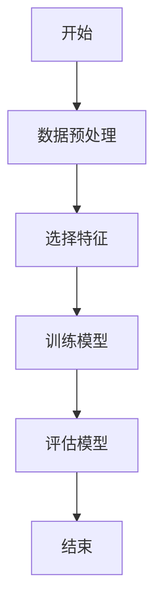
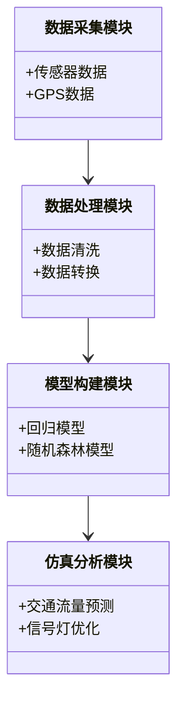

                 


# 企业估值中的数字孪生城市项目评估

> 关键词：数字孪生城市、企业估值、城市项目评估、数据驱动、机器学习、系统架构

> 摘要：数字孪生城市是一种基于虚拟映射和实时反馈的新兴技术，能够为城市项目提供精确的估值支持。本文从数字孪生城市的定义、技术背景、核心概念、算法原理、系统架构到实际案例，全面探讨数字孪生技术在企业估值中的应用。通过详细分析数据驱动的建模方法、机器学习算法以及系统架构设计，本文为企业在城市项目评估中提供了一套完整的技术方案，帮助企业在复杂的城市环境中做出更明智的投资决策。

---

## 第一部分：数字孪生城市项目评估的背景与意义

### 第1章：数字孪生城市项目评估的背景与意义

#### 1.1 数字孪生城市的定义与特点
数字孪生城市（Digital Twin City）是通过物理模型、传感器、数据和计算模型的虚拟映射，实时反映城市动态的数字化系统。其特点包括：

- **实时性**：基于实时数据的动态更新，确保模型与实际城市运行保持一致。
- **数据驱动**：依赖多源数据（如物联网、GIS、传感器等）进行建模和分析。
- **可扩展性**：能够覆盖城市规划、交通管理、环境保护等多个领域。
- **交互性**：用户可以通过虚拟界面与模型进行交互，实现模拟和预测。

#### 1.2 企业估值中的数字孪生技术应用背景
在传统城市项目评估中，企业通常依赖历史数据和经验判断，这种方法存在以下问题：

- **数据不足**：传统方法依赖历史数据，难以捕捉城市发展的动态变化。
- **预测精度低**：基于统计模型的预测方法缺乏实时性和准确性。
- **决策风险高**：由于缺乏实时反馈，企业在投资决策中面临较大风险。

数字孪生技术通过实时数据和动态仿真，为企业提供更精确的估值依据，从而优化资源配置和降低投资风险。

#### 1.3 数字孪生城市项目评估的核心目标
数字孪生城市项目评估的核心目标包括：

1. 提供精确的城市项目估值依据，帮助企业在投资决策中减少不确定性。
2. 优化城市资源配置效率，通过实时数据分析和模拟优化资源配置。
3. 降低城市项目投资风险，通过动态仿真提前识别和规避潜在风险。

---

## 第2章：数字孪生城市项目的评估框架

### 2.1 数字孪生城市项目的评估维度
数字孪生城市项目评估可以从以下几个维度进行：

- **数据维度**：包括数据的完整性、准确性和实时性。
- **模型维度**：包括模型的精度、复杂性和可解释性。
- **仿真维度**：包括仿真的实时性、交互性和可扩展性。

### 2.2 数字孪生城市项目的评估流程
数字孪生城市项目评估流程通常包括以下步骤：

1. **数据采集与处理**：收集城市相关的多源数据（如地理数据、交通数据、环境数据等），并进行清洗和预处理。
2. **模型构建与验证**：基于数据构建数字孪生模型，并通过实际数据进行验证和优化。
3. **仿真分析与评估**：通过仿真分析模型的性能，并根据结果进行项目评估。

### 2.3 数字孪生城市项目评估的指标体系
数字孪生城市项目评估的指标体系可以从以下几个方面进行设计：

1. **数据质量评估指标**：包括数据完整性、准确性、实时性等。
2. **模型准确性评估指标**：包括模型预测精度、误差率等。
3. **仿真效果评估指标**：包括仿真结果的可解释性、实时性等。

---

## 第3章：数字孪生城市项目评估的核心概念与联系

### 3.1 数字孪生的核心原理
数字孪生的核心原理包括：

- **数据驱动**：通过多源数据构建虚拟模型，实时反映物理世界的动态。
- **实时反馈**：通过传感器和物联网技术，实现模型与实际系统的实时交互。
- **动态仿真**：通过仿真技术，预测系统在未来的变化趋势。

### 3.2 数字孪生与传统建模方法的对比
数字孪生与传统建模方法在以下几个方面存在差异：

| 对比维度 | 数字孪生 | 传统建模 |
|----------|----------|----------|
| 数据来源 | 多源实时数据 | 历史数据 |
| 模型更新 | 动态更新 | 定期更新 |
| 应用场景 | 实时仿真与优化 | 预测与模拟 |

### 3.3 数字孪生系统的ER实体关系图

```mermaid
er
actor: 城市规划师 {
  <用户>
}

system: 数字孪生系统 {
  <系统>
}

project: 项目 {
  <项目>
}

actor --> system: 使用系统
system --> project: 进行评估
```

---

## 第4章：数字孪生城市项目评估的算法原理

### 4.1 常用算法及其应用
数字孪生城市项目评估中常用的算法包括：

1. **线性回归**：用于预测城市项目的价值。
2. **随机森林**：用于分类和回归分析。
3. **时间序列分析**：用于预测城市发展的趋势。

### 4.2 线性回归算法的数学模型
线性回归模型可以表示为：

$$ y = \beta_0 + \beta_1 x + \epsilon $$

其中，$y$ 是目标变量，$x$ 是自变量，$\beta_0$ 和 $\beta_1$ 是回归系数，$\epsilon$ 是误差项。

### 4.3 线性回归算法的流程图



### 4.4 线性回归算法的Python实现

```python
import numpy as np
from sklearn.linear_model import LinearRegression

# 示例数据
X = np.array([[1], [2], [3], [4], [5]])
y = np.array([2, 4, 5, 4, 6])

# 训练模型
model = LinearRegression()
model.fit(X, y)

# 预测结果
print(model.predict(X))
```

---

## 第5章：数字孪生城市项目评估的系统分析与架构设计

### 5.1 项目场景介绍
以智慧交通项目为例，数字孪生系统需要实时监控交通流量、预测交通拥堵并优化交通信号灯配置。

### 5.2 系统功能设计
系统功能模块包括：

- 数据采集模块：负责采集交通流量、车辆位置等数据。
- 数据处理模块：对采集的数据进行清洗和预处理。
- 模型构建模块：基于数据构建数字孪生模型。
- 仿真分析模块：通过仿真预测交通流量并优化信号灯配置。

### 5.3 系统架构设计



---

## 第6章：数字孪生城市项目评估的项目实战

### 6.1 环境安装与配置
需要安装以下工具和库：

- Python 3.8+
- NumPy、Pandas、Scikit-learn、Matplotlib
- Mermaid图生成工具（可选）

### 6.2 核心实现代码
以下是智慧交通项目评估的Python代码示例：

```python
import numpy as np
import pandas as pd
from sklearn.linear_model import LinearRegression
from sklearn.metrics import mean_squared_error

# 加载数据
data = pd.read_csv('traffic_data.csv')

# 特征选择
X = data[['hour', 'day_of_week', 'weather']]
y = data['traffic_volume']

# 训练模型
model = LinearRegression()
model.fit(X, y)

# 预测结果
y_pred = model.predict(X)

# 评估模型
mse = mean_squared_error(y, y_pred)
print(f"均方误差: {mse}")
print(f"回归系数: {model.coef_}")
print(f"截距: {model.intercept_}")
```

### 6.3 实际案例分析
以某城市智慧交通项目为例，通过数据采集、模型训练和仿真分析，评估交通流量的变化趋势，并优化信号灯配置。

### 6.4 项目小结
通过本案例，我们展示了数字孪生技术在智慧交通项目评估中的应用，验证了其在提高交通效率和降低拥堵方面的有效性。

---

## 第7章：数字孪生城市项目评估的最佳实践与小结

### 7.1 最佳实践
1. 数据质量是模型准确性的关键，需确保数据的完整性和实时性。
2. 根据具体场景选择合适的算法，避免过度复杂化模型。
3. 定期更新模型和数据，保持系统的实时性和准确性。

### 7.2 小结
数字孪生技术为企业估值中的城市项目评估提供了全新的思路和方法。通过实时数据和动态仿真，企业可以更精准地评估项目价值，优化资源配置，降低投资风险。

### 7.3 注意事项
1. 数据隐私和安全问题需高度重视。
2. 系统的实时性和稳定性是确保评估准确性的关键。
3. 团队协作和跨领域知识的整合是成功实施的关键。

### 7.4 拓展阅读
1. 《Digital Twin: A Real-Time Virtual Model for City Planning》
2. 《Machine Learning for Urban Planning and Management》

---

作者：AI天才研究院/AI Genius Institute & 禅与计算机程序设计艺术/Zen And The Art of Computer Programming

