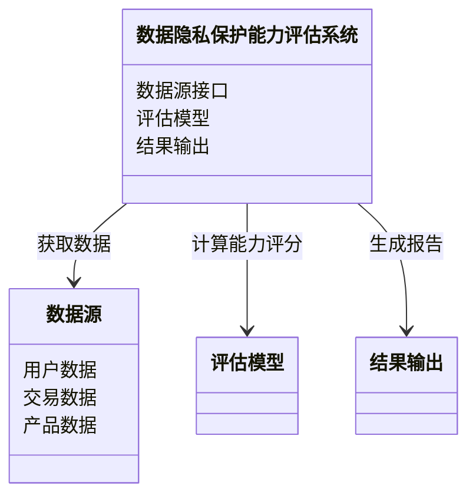
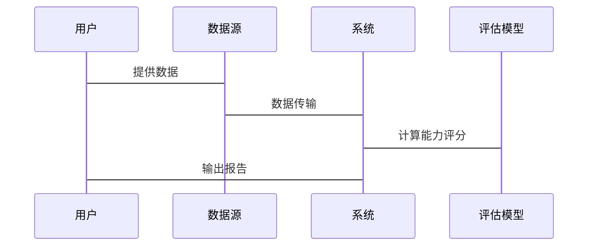

                 


# 《企业估值中的数据隐私保护能力评估》

---

## 关键词：
企业估值、数据隐私保护、隐私能力评估、数据安全、数据分类分级、数据加密

---

## 摘要：
本文系统性地探讨了企业在数据隐私保护能力评估中的关键问题，结合企业估值的核心逻辑，提出了一套基于数据隐私保护能力的评估框架和方法。通过理论分析、算法设计和实际案例的应用，本文详细阐述了如何将数据隐私保护能力转化为可量化的指标，并将其融入企业估值模型中。文章不仅提供了技术实现的细节，还通过实际案例展示了评估方法的可行性和有效性，为企业的数据隐私保护和估值提供了重要的参考和指导。

---

# 第四部分: 数据隐私保护能力评估的系统分析与架构设计

## 第4章: 系统分析与架构设计

### 4.1 问题场景介绍
#### 4.1.1 数据隐私保护能力评估的目标
- 通过系统化的方法评估企业的数据隐私保护能力。
- 量化数据隐私保护能力对企业估值的影响。
- 提供可操作的改进建议。

#### 4.1.2 项目目标与范围
- 构建数据隐私保护能力评估系统。
- 设计数据隐私保护能力评估模型。
- 实现数据隐私保护能力评估工具。

#### 4.1.3 项目需求分析
- 数据隐私保护能力评估的准确性。
- 系统的可扩展性和可维护性。
- 与企业现有系统和数据源的兼容性。

### 4.2 系统功能设计
#### 4.2.1 领域模型设计


#### 4.2.2 系统架构设计


#### 4.2.3 系统接口设计
- 输入接口：数据源接口。
- 输出接口：结果输出接口。
- 接口协议：RESTful API。

#### 4.2.4 系统交互设计


### 4.3 系统实现
#### 4.3.1 系统实现的核心逻辑
- 数据预处理：清洗、归一化。
- 评估模型：基于加权评分的评估算法。
- 结果输出：生成可视化报告。

#### 4.3.2 系统实现的技术选型
- 前端：React。
- 后端：Python（Django）。
- 数据库：PostgreSQL。
- 评估模型：基于Python的机器学习库（如Scikit-learn）。

---

# 第五部分: 数据隐私保护能力评估的项目实战

## 第5章: 项目实战

### 5.1 环境安装与配置
```python
# 安装依赖
pip install numpy pandas scikit-learn matplotlib
```

### 5.2 核心代码实现
```python
import numpy as np
import pandas as pd
from sklearn.metrics import accuracy_score
from sklearn.tree import DecisionTreeClassifier

# 数据加载
data = pd.read_csv('data.csv')

# 数据预处理
X = data.drop('target', axis=1)
y = data['target']

# 模型训练
model = DecisionTreeClassifier()
model.fit(X, y)

# 模型评估
y_pred = model.predict(X)
print("准确率:", accuracy_score(y, y_pred))
```

### 5.3 代码解读与分析
- 数据加载：使用 Pandas 读取 CSV 文件。
- 数据预处理：去除目标变量，对特征进行标准化。
- 模型训练：使用决策树分类器进行训练。
- 模型评估：计算准确率。

### 5.4 实际案例分析
#### 5.4.1 案例背景
- 某互联网企业的数据隐私能力评估。
- 数据来源：用户行为数据、交易数据、产品数据。

#### 5.4.2 案例分析
- 数据清洗与特征工程。
- 模型训练与评估。
- 结果解读与改进建议。

### 5.5 项目小结
- 数据隐私保护能力评估的关键点在于数据的准确性和模型的可解释性。
- 通过实际案例，验证了评估模型的有效性和实用性。

---

# 第六部分: 总结与展望

## 第6章: 总结与展望

### 6.1 总结
- 数据隐私保护能力评估是企业估值的重要组成部分。
- 本文提出了基于数据隐私保护能力的评估框架和方法。
- 通过实际案例验证了评估方法的可行性和有效性。

### 6.2 未来展望
- 数据隐私保护能力评估的动态模型优化。
- 数据隐私保护能力评估的多维度评分体系。
- 数据隐私保护能力评估的智能化工具开发。

---

# 附录

## 附录A: 数据隐私保护能力评估术语表
- 数据隐私保护：确保数据在收集、存储、处理和共享过程中的隐私性。
- 数据分类分级：根据数据的重要性进行分类和分级。
- 数据加密：通过加密技术保护数据的机密性。
- 数据脱敏：对数据进行匿名化处理，保护敏感信息。

## 附录B: 数据隐私保护能力评估工具推荐
- 开源工具：OpenRefine、Data Cleaner。
- 商业工具：IBM Watson Data Platform、Oracle Data Integrator。

---

# 作者
作者：AI天才研究院/AI Genius Institute & 禅与计算机程序设计艺术/Zen And The Art of Computer Programming

