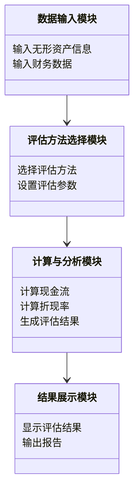
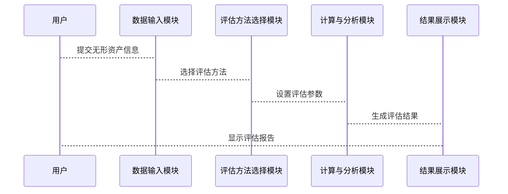

                 


# 企业估值中的无形资产评估

## 关键词：企业估值、无形资产、资产评估、收益法、市场法、成本法

## 摘要：本文系统地探讨了企业估值中的无形资产评估问题，从基本概念到具体方法，再到系统架构和实际案例，全面解析了无形资产评估的核心内容和应用实践。文章结合实际案例，详细讲解了收益法、市场法和成本法的原理和应用，帮助读者掌握无形资产评估的关键技术和方法。

---

## 第1章 无形资产评估的背景与概念

### 1.1 无形资产评估的基本概念

#### 1.1.1 无形资产的定义与分类

- **无形资产**是指企业拥有或控制的，没有实物形态的长期资产。它们通常包括专利权、商标权、版权、商誉、客户关系、技术秘密等。
- **分类**：
  - **知识产权类**：如专利权、商标权、版权。
  - **技术类**：如技术秘密、专有技术。
  - **商誉类**：如品牌价值、客户忠诚度。
  - **其他**：如合同权益、特许经营权。

#### 1.1.2 无形资产评估的必要性

- 无形资产在企业价值中的占比越来越大，尤其是在科技企业和创新型公司。
- 无形资产的价值往往难以直接观察，需要通过评估方法间接估算。
- 正确评估无形资产有助于企业做出合理的投资决策和并购定价。

#### 1.1.3 无形资产评估的范围与边界

- **范围**：包括所有类型的无形资产，从单项资产到整体商誉。
- **边界**：需要明确评估的范围，避免将有形资产或负债纳入评估范围。

### 1.2 无形资产评估的现状与挑战

#### 1.2.1 无形资产评估的历史发展

- 从早期的简单评估到现在的复杂模型，无形资产评估方法不断进步。
- 随着技术的发展，无形资产评估逐渐成为企业估值的核心部分。

#### 1.2.2 当前无形资产评估的主要挑战

- 数据获取困难：无形资产的价值往往依赖于未来现金流的预测，数据的准确性和完整性是关键。
- 方法选择复杂：不同类型的无形资产适合不同的评估方法，选择合适的模型是难点。
- 市场波动影响：无形资产的价值可能受市场环境的影响较大，评估结果需要动态调整。

#### 1.2.3 数字化转型对企业估值的影响

- 数字化转型使得无形资产的重要性更加突出，尤其是数据资产和数字技术相关的无形资产。
- 数据的估值成为新的挑战，需要新的评估方法和模型。

### 1.3 无形资产评估的意义与价值

#### 1.3.1 无形资产评估对企业价值的影响

- 正确评估无形资产可以提高企业估值的准确性。
- 无形资产的价值波动可能影响企业的市场表现。

#### 1.3.2 无形资产评估对投资决策的作用

- 投资者需要通过无形资产评估了解企业的潜在价值。
- 评估结果有助于制定合理的投资策略。

#### 1.3.3 无形资产评估的法律与经济意义

- 法律层面：无形资产评估有助于确定企业并购中的资产价值。
- 经济层面：无形资产评估是资源配置的重要依据。

### 1.4 本章小结

- 无形资产评估是企业估值中的重要部分，其准确性和科学性直接影响企业的价值判断和投资决策。
- 需要结合企业的实际情况，选择合适的评估方法和模型。

---

## 第2章 无形资产的分类与评估方法

### 2.1 无形资产的分类

- **知识产权类**：如专利权、商标权。
- **技术类**：如专有技术、技术秘密。
- **商誉类**：如品牌价值、客户关系。
- **其他**：如合同权益、特许经营权。

### 2.2 无形资产评估的主要方法

#### 2.2.1 收益法

- **定义**：通过预测无形资产带来的未来收益，折现后计算其现值。
- **适用场景**：适用于能够产生稳定现金流的无形资产，如专利权、版权。

#### 2.2.2 市场法

- **定义**：通过比较类似无形资产的市场交易价格，确定评估对象的价值。
- **适用场景**：适用于有活跃交易市场的无形资产，如商标权、品牌价值。

#### 2.2.3 成本法

- **定义**：通过计算无形资产的重置成本，调整后确定其价值。
- **适用场景**：适用于技术较为成熟，且有明确成本数据的无形资产。

### 2.3 不同方法的对比分析

#### 2.3.1 收益法与市场法的对比

| 对比维度 | 收益法 | 市场法 |
|----------|--------|--------|
| 数据依赖性 | 高 | 中 |
| 适用性 | 稳定现金流 | 活跃市场 |
| 精度 | 较高 | 较高 |

#### 2.3.2 成本法与收益法的对比

| 对比维度 | 成本法 | 收益法 |
|----------|--------|--------|
| 数据依赖性 | 中 | 高 |
| 适用性 | 成本明确 | 现金流稳定 |
| 精度 | 中 | 高 |

#### 2.3.3 合适方法的选择依据

- 无形资产类型
- 数据的可获得性
- 市场环境

### 2.4 本章小结

- 不同的无形资产类型适合不同的评估方法，选择合适的评估方法是提高评估准确性的关键。

---

## 第3章 收益法的原理与应用

### 3.1 收益法的基本原理

- **定义**：通过预测无形资产在未来期间内的净收益，采用适当的折现率，将其折现为现值，以确定其价值。
- **数学模型**：
  $$ V = \frac{CF}{r} $$
  其中，\( V \) 是评估价值，\( CF \) 是未来现金流，\( r \) 是折现率。

### 3.2 收益法的步骤与流程

#### 3.2.1 确定评估对象

- 明确无形资产的类型和范围。

#### 3.2.2 确定收益期与折现率

- 收益期：资产能够产生收益的时间长度。
- 折现率：根据市场利率和风险因素确定。

#### 3.2.3 计算未来现金流

- 预测无形资产在未来期间内的收益情况。

#### 3.2.4 应用数学模型进行评估

- 使用收益法公式计算现值。

### 3.3 收益法的案例分析

#### 3.3.1 案例背景介绍

- 某公司拥有一项专利技术，预计在未来5年内每年带来额外收益100万元。

#### 3.3.2 数据收集与处理

- 确定折现率为8%。

#### 3.3.3 计算过程与结果分析

$$ V = \frac{100}{0.08} = 1250 \text{万元} $$

### 3.4 本章小结

- 收益法适用于有稳定现金流的无形资产，计算过程需要准确的数据和合理的假设。

---

## 第4章 无形资产评估的系统分析与架构设计

### 4.1 系统功能模块划分

#### 4.1.1 数据输入模块

- 收集无形资产信息和财务数据。

#### 4.1.2 评估方法选择模块

- 根据资产类型选择合适的评估方法。

#### 4.1.3 计算与分析模块

- 执行数学模型计算，生成评估结果。

#### 4.1.4 结果展示模块

- 可视化展示评估结果。

### 4.2 系统功能设计的领域模型



### 4.3 本章小结

- 系统设计需要模块化，确保各部分协同工作，提高评估效率和准确性。

---

## 第5章 无形资产评估的系统架构设计

### 5.1 系统架构设计


### 5.2 接口设计

- 数据输入接口：接收无形资产信息和财务数据。
- 评估方法选择接口：根据资产类型选择合适的评估方法。
- 计算与分析接口：执行数学模型计算，返回评估结果。

### 5.3 交互流程图



### 5.4 本章小结

- 系统架构设计需要考虑模块之间的交互和数据流，确保系统的高效运行。

---

## 第6章 项目实战

### 6.1 环境安装

- 安装Python和相关库（如numpy、pandas）。
- 安装Mermaid图表工具。

### 6.2 核心代码实现

```python
import numpy as np

def calculate_value(cf, r):
    return cf / (1 + r)

cf = 100  # 未来现金流
r = 0.08  # 折现率
value = calculate_value(cf, r)
print(f"评估价值: {value} 万元")
```

### 6.3 代码解读与分析

- 代码实现收益法的计算，输入未来现金流和折现率，输出评估价值。
- 使用numpy库进行数值计算，确保结果的准确性。

### 6.4 案例分析

- 以某公司专利技术为例，计算其评估价值。

### 6.5 本章小结

- 通过实际案例和代码实现，帮助读者理解无形资产评估的实际操作。

---

## 第7章 最佳实践与总结

### 7.1 最佳实践 tips

- 数据收集要准确，避免偏差。
- 选择合适的评估方法，根据资产类型和市场环境调整模型。
- 结果分析要结合行业背景和企业实际情况。

### 7.2 小结

- 无形资产评估是企业估值中的关键部分，需要结合理论和实践，选择合适的评估方法和模型。

### 7.3 注意事项

- 数据的准确性和完整性是评估的关键。
- 模型的选择要根据实际情况，避免过于复杂。
- 结果要结合市场环境和企业战略进行调整。

### 7.4 拓展阅读

- 推荐阅读《企业价值评估：方法与实践》。
- 参考相关资产评估准则和法规。

---

## 作者

作者：AI天才研究院/AI Genius Institute  
联系邮箱：contact@AIGenius.com  
博客地址：https://www.AIGenius.com

