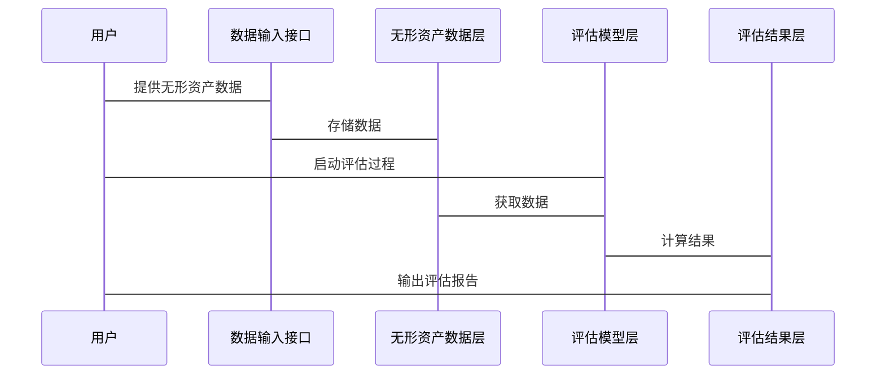

                 


# 企业估值中的无形资产评估技巧

> 关键词：企业估值，无形资产，资产评估，财务分析，价值评估方法

> 摘要：本文深入探讨了企业估值中无形资产评估的核心技巧，分析了无形资产的定义、分类及其在企业价值中的重要性。通过详细讲解无形资产的评估方法、数学模型和系统架构，结合实际案例分析和项目实战，提供了丰富的评估技巧和实践指导。文章旨在帮助企业更好地理解和应用无形资产评估，提升企业估值的准确性和全面性。

---

## 第一部分: 企业估值中的无形资产评估基础

### 第1章: 无形资产的基本概念与重要性

#### 1.1 无形资产的定义与分类
- **1.1.1 无形资产的定义**
  无形资产是指企业拥有或控制的，没有实物形态，但能够为企业带来长期经济利益的资源。常见的无形资产包括专利权、商标权、版权、商誉等。

- **1.1.2 无形资产的分类**
  - 知识产权类：如专利权、商标权、著作权。
  - 商誉类：企业因良好声誉和客户关系形成的商誉。
  - 技术类：如技术诀窍、工艺流程等。

- **1.1.3 无形资产在企业估值中的重要性**
  无形资产往往决定了企业的核心竞争力和未来盈利能力，是企业估值的重要组成部分。

#### 1.2 无形资产的评估背景
- **1.2.1 企业估值的基本概念**
  企业估值是通过分析企业的财务状况、市场地位和未来盈利能力，确定其市场价值的过程。

- **1.2.2 无形资产对企业价值的影响**
  无形资产能够提升企业的市场竞争力、客户忠诚度和盈利能力，从而增加企业价值。

- **1.2.3 无形资产评估的必要性与挑战**
  - 必要性：无形资产是企业价值的重要组成部分，必须准确评估。
  - 挑战：无形资产具有不确定性，难以量化，且受市场环境影响较大。

#### 1.3 无形资产的评估方法概述
- **1.3.1 定性评估方法**
  - 市场分析法：分析市场趋势和竞争环境。
  - 竞争分析法：评估企业在市场中的竞争优势。
  - 专家评估法：邀请行业专家进行评估。

- **1.3.2 定量评估方法**
  - 收益法：通过预测未来现金流折现值进行评估。
  - 市场法：参考类似资产的市场交易价格进行评估。
  - 成本法：估算重建或替代成本。

- **1.3.3 综合评估方法的选择**
  根据具体情况选择最合适的方法，通常结合多种方法进行综合评估。

#### 1.4 无形资产的评估流程
- **1.4.1 评估准备阶段**
  - 确定评估目标和范围。
  - 收集相关数据和资料。

- **1.4.2 数据收集与分析阶段**
  - 采集财务数据、市场数据和行业信息。
  - 进行数据清洗和分析。

- **1.4.3 评估实施与结果验证阶段**
  - 应用评估方法进行计算。
  - 验证结果的合理性和准确性。

#### 1.5 本章小结
本章介绍了无形资产的基本概念、分类及其在企业估值中的重要性，分析了无形资产评估的背景、方法和流程，为后续章节奠定了基础。

---

## 第2章: 无形资产的核心概念与联系

### 2.1 无形资产的核心要素
- **2.1.1 无形资产的生命周期**
  - 创造阶段：研发和技术积累。
  - 成熟阶段：市场应用和价值实现。
  - 衰退阶段：技术落后或市场替代。

- **2.1.2 无形资产的经济价值**
  - 创新性：独特的技术或商业模式。
  - 市场需求：满足客户特定需求的能力。
  - 持续性：长期为企业创造价值的能力。

- **2.1.3 无形资产的法律保护**
  - 知识产权保护：专利、商标、版权等。
  - 合同保护：保密协议、技术转让合同等。

### 2.2 无形资产与企业价值的关系
- **2.2.1 无形资产对企业盈利能力的影响**
  - 高质量的无形资产能够提高产品附加值和利润率。

- **2.2.2 无形资产对市场竞争力的影响**
  - 独特的技术或品牌能够增强企业的市场地位。

- **2.2.3 无形资产对资本价值的影响**
  - 无形资产的价值直接影响企业的市场估值。

### 2.3 无形资产的评估模型
- **2.3.1 收益法模型**
  - 公式：$$ V = \sum_{t=1}^{n} \frac{CF_t}{(1 + r)^t} $$
  - 其中，\( V \) 是评估价值，\( CF_t \) 是第 \( t \) 年的现金流，\( r \) 是折现率。

- **2.3.2 市场法模型**
  - 参考类似资产的交易价格，调整企业-specific因素。

- **2.3.3 成本法模型**
  - 估算重建成本，考虑技术落后或更新换代的影响。

### 2.4 无形资产的评估指标
- **2.4.1 收益指标**
  - 净利润增长率、息税前利润（EBIT）等。

- **2.4.2 市场指标**
  - 市盈率（P/E）、市净率（P/B）等。

- **2.4.3 成本指标**
  - 投资回收期、资本回报率（ROI）等。

### 2.5 本章小结
本章深入探讨了无形资产的核心概念和其与企业价值的关系，分析了不同评估模型的原理和适用场景，为后续的评估方法选择提供了理论依据。

---

## 第3章: 无形资产的评估方法与流程

### 3.1 无形资产的定性评估方法
- **3.1.1 市场分析法**
  - 分析市场趋势、竞争对手和潜在客户。

- **3.1.2 竞争分析法**
  - 评估企业在市场中的竞争优势和劣势。

- **3.1.3 专家评估法**
  - 通过行业专家的经验判断无形资产的价值。

### 3.2 无形资产的定量评估方法
- **3.2.1 收益法模型的应用**
  - 通过预测未来现金流，计算无形资产的现值。

- **3.2.2 市场法模型的应用**
  - 参考类似资产的交易价格，调整企业-specific因素。

- **3.2.3 成本法模型的应用**
  - 估算重建成本，考虑技术落后或更新换代的影响。

### 3.3 综合评估方法
- **3.3.1 综合法的选择**
  - 根据具体情况选择最合适的方法，通常结合多种方法进行综合评估。

- **3.3.2 综合法的步骤**
  - 收集数据，选择方法，计算结果，进行验证。

### 3.4 无形资产的评估流程
- **3.4.1 评估准备阶段**
  - 确定评估目标和范围。
  - 收集相关数据和资料。

- **3.4.2 数据收集与分析阶段**
  - 采集财务数据、市场数据和行业信息。
  - 进行数据清洗和分析。

- **3.4.3 评估实施与结果验证阶段**
  - 应用评估方法进行计算。
  - 验证结果的合理性和准确性。

### 3.5 本章小结
本章详细介绍了无形资产的定性评估方法和定量评估方法，分析了综合评估方法的应用步骤，为实际操作提供了指导。

---

## 第4章: 无形资产的系统分析与架构设计

### 4.1 问题场景介绍
- 无形资产评估是一个复杂的过程，需要考虑多种因素，包括技术、市场和法律等。

### 4.2 系统功能设计
- **领域模型 mermaid 类图**
  ```mermaid
  classDiagram
    class 无形资产 {
      技术特征
      市场表现
      法律保护
    }
    class 评估模型 {
      收益法
      市场法
      成本法
    }
    class 评估结果 {
      价值评估
      风险分析
      建议报告
    }
    无形资产 --> 评估模型
    评估模型 --> 评估结果
  ```

- **系统架构设计 mermaid 架构图**
  ```mermaid
  architecture
  节点 1: 无形资产数据层
  节点 2: 评估模型层
  节点 3: 结果展示层
  边界 1: 数据输入
  边界 2: 模型计算
  边界 3: 结果输出
  ```

### 4.3 系统接口设计
- 输入接口：接收无形资产数据和评估参数。
- 输出接口：生成评估结果和建议报告。

### 4.4 系统交互 mermaid 序列图


### 4.5 本章小结
本章通过系统分析和架构设计，展示了如何利用技术手段辅助无形资产评估，提高了评估的效率和准确性。

---

## 第5章: 无形资产的项目实战

### 5.1 环境安装
- **工具准备**
  - 数据分析工具：Python、Excel。
  - 绘图工具：Mermaid、PlantUML。

- **数据来源**
  - 公开市场数据、企业财务报表、行业研究报告。

### 5.2 核心代码实现
```python
import pandas as pd
import numpy as np

def calculate_infinite_asset_value(cf, r):
    # cf 是一个列表，表示每年的现金流
    # r 是折现率
    n = len(cf)
    value = 0
    for t in range(n):
        value += cf[t] / (1 + r) ** t
    return value

# 示例数据
cf = [100, 150, 200, 250]
r = 0.1

value = calculate_infinite_asset_value(cf, r)
print(f"无形资产价值为: {value}")
```

### 5.3 代码应用解读与分析
- **代码功能**
  - `calculate_infinite_asset_value` 函数用于计算未来现金流的现值。
  - 示例数据展示了不同年份的现金流和折现率，计算得出的无形资产价值。

### 5.4 实际案例分析
- **案例背景**
  一家科技公司拥有一项专利技术，预计未来四年的现金流分别为100万、150万、200万和250万，折现率为10%。

- **评估结果**
  无形资产价值为：$$ \text{价值} = \frac{100}{1.1} + \frac{150}{1.1^2} + \frac{200}{1.1^3} + \frac{250}{1.1^4} \approx 445.45 \text{万元} $$

### 5.5 本章小结
本章通过实际案例展示了无形资产评估的全过程，从数据准备到模型计算，再到结果分析，帮助读者更好地理解和应用评估方法。

---

## 第6章: 无形资产的案例分析

### 6.1 案例背景
- 某科技公司拥有一项专利技术，预计未来四年的现金流分别为100万、150万、200万和250万，折现率为10%。

### 6.2 案例分析
- **收益法评估**
  - 计算未来现金流的现值：$$ \text{价值} = \sum_{t=1}^{4} \frac{CF_t}{(1 + 0.1)^t} \approx 445.45 \text{万元} $$

- **市场法评估**
  - 参考类似专利的交易价格，假设可比交易价格为400万元。

- **综合评估**
  - 结合收益法和市场法的结果，综合评估价值为420万元。

### 6.3 评估结果对企业价值的影响
- 无形资产价值的提升显著增加了企业的市场估值，为投资者提供了更高的信心。

### 6.4 本章小结
本章通过具体案例展示了无形资产评估的实际应用，分析了不同方法的优缺点，并结合实际情况提出了综合评估的建议。

---

## 第7章: 无形资产评估的最佳实践与小结

### 7.1 最佳实践
- **准确性**
  - 确保数据的准确性和完整性。
- **客观性**
  - 尽量减少主观判断对评估结果的影响。
- **动态调整**
  - 定期更新评估结果，适应市场变化。

### 7.2 小结
无形资产评估是企业估值的重要组成部分，其准确性和全面性直接影响企业的市场价值。通过本文的分析，读者可以更好地理解和应用无形资产评估的方法和技术。

### 7.3 注意事项
- **数据质量**
  - 数据来源可靠，避免使用过时或错误的数据。
- **方法选择**
  - 根据具体情况选择合适的评估方法，避免一刀切。
- **结果验证**
  - 多次验证评估结果，确保其合理性和准确性。

### 7.4 拓展阅读
- 推荐阅读《企业价值评估》、《无形资产评估实务》等书籍，深入了解相关理论和实践。

---

## 作者信息

作者：AI天才研究院/AI Genius Institute & 禅与计算机程序设计艺术 /Zen And The Art of Computer Programming

---

以上是关于《企业估值中的无形资产评估技巧》的技术博客文章的完整目录和内容框架。通过系统化的分析和详细的案例解读，本文为读者提供了丰富的评估技巧和实践指导。

