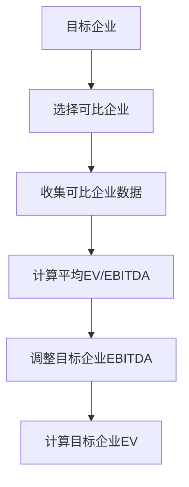
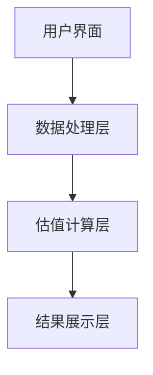

                 


# 企业估值中的比较法：优势与局限

> **关键词**：企业估值、比较法、相对估值法、可比公司分析、数学模型  
> **摘要**：比较法在企业估值中是一种常用方法，本文详细探讨其背景、原理、应用案例及与其他方法的结合，分析其优势与局限，并总结最佳实践。

---

## 第1章：比较法在企业估值中的背景与概念

### 1.1 企业估值的基本概念

企业估值是评估企业整体价值的过程，旨在确定其在市场上的合理价格。常见的估值方法包括市场法、收益法和资产法。比较法属于市场法，基于可比企业的数据进行分析。

### 1.2 比较法的定义与特点

比较法通过分析可比企业的财务指标和市场数据，推导目标企业的价值。其特点包括直观、依赖市场数据和适用性强。

### 1.3 比较法的应用范围

比较法适用于多种企业类型，尤其在数据充足的情况下。但其局限性在于依赖可比企业数据的可比性和市场波动的影响。

---

## 第2章：比较法的核心原理与数学模型

### 2.1 比较法的基本原理

比较法基于“相似企业相似价值”的假设，通过分析可比企业的财务和市场指标，调整目标企业的估值。

### 2.2 比较法的数学模型

比较法的核心公式包括EV/EBITDA倍数法，用于计算企业价值。公式如下：

$$ EV = \text{可比企业EV/EBITDA平均值} \times \text{目标企业EBITDA} $$

### 2.3 比较法的流程图



---

## 第3章：比较法在企业估值中的应用案例

### 3.1 案例分析：行业龙头企业的估值

以某科技公司为例，分析其财务数据和行业地位，选择可比企业，计算EV/EBITDA倍数，并调整得出目标企业价值。

### 3.2 案例分析：中小企业的估值

针对中小企业，分析其财务数据和市场地位，选择可比企业，计算EV/EBITDA倍数，得出估值。

### 3.3 案例分析：初创企业的估值

分析初创企业的收入增长率和市场潜力，选择可比企业，计算EV/EBITDA倍数，调整得出目标企业价值。

---

## 第4章：比较法与其他估值方法的结合

### 4.1 比较法与相对估值法的结合

结合相对估值法，通过可比企业分析和市场数据，优化估值结果。

### 4.2 比较法与收益法的结合

利用收益法预测未来现金流，结合比较法调整倍数，得出更准确的估值。

### 4.3 比较法与资产法的结合

通过资产法评估企业资产价值，结合比较法调整市场倍数，得出综合估值。

---

## 第5章：比较法的系统架构与实现

### 5.1 系统功能设计

系统功能包括数据输入、可比企业筛选、指标计算和结果展示。

### 5.2 系统架构图



---

## 第6章：比较法的项目实战与代码实现

### 6.1 环境安装

安装Python和相关库（如Pandas、NumPy）。

### 6.2 核心代码实现

```python
import pandas as pd

# 加载可比企业数据
df = pd.read_csv('comparable_companies.csv')

# 计算平均EV/EBITDA
average_evd = df['EV/EBITDA'].mean()

# 调整目标企业EBITDA
target_ebitda = 1000000
target_ev = average_evd * target_ebitda

print(f"目标企业EV: {target_ev}")
```

### 6.3 实际案例分析

分析某初创企业的数据，应用上述代码计算其EV，并讨论结果的合理性。

---

## 第7章：总结与展望

### 7.1 总结

比较法在企业估值中具有直观和高效的优势，但也存在数据依赖和可比性问题。结合其他方法可优化结果。

### 7.2 展望

未来，比较法将结合AI和大数据技术，提升估值的准确性和效率。

---

## 附录

### 附录A：比较法的数学公式

$$ EV = \text{平均EV/EBITDA} \times \text{目标企业EBITDA} $$

### 附录B：比较法的流程图


---

## 作者

作者：AI天才研究院/AI Genius Institute  
禅与计算机程序设计艺术/Zen And The Art of Computer Programming

---

这篇文章详细探讨了比较法在企业估值中的应用，结合理论与实践，为读者提供了全面的视角和深入的分析。

