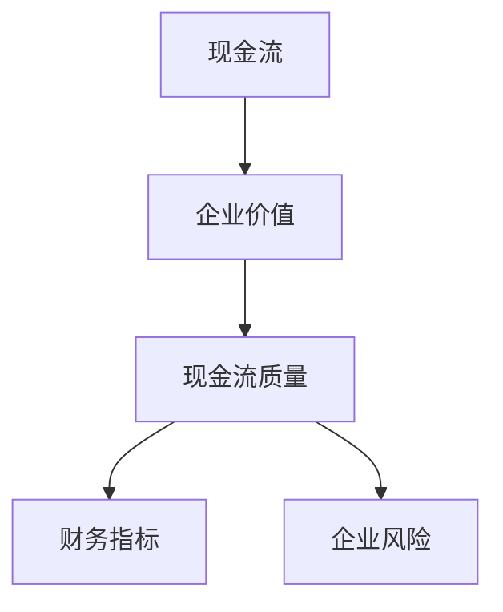
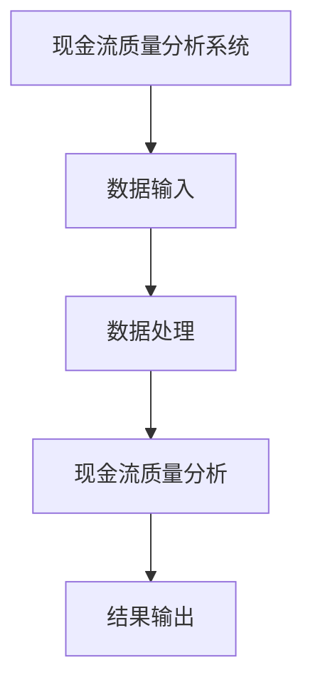
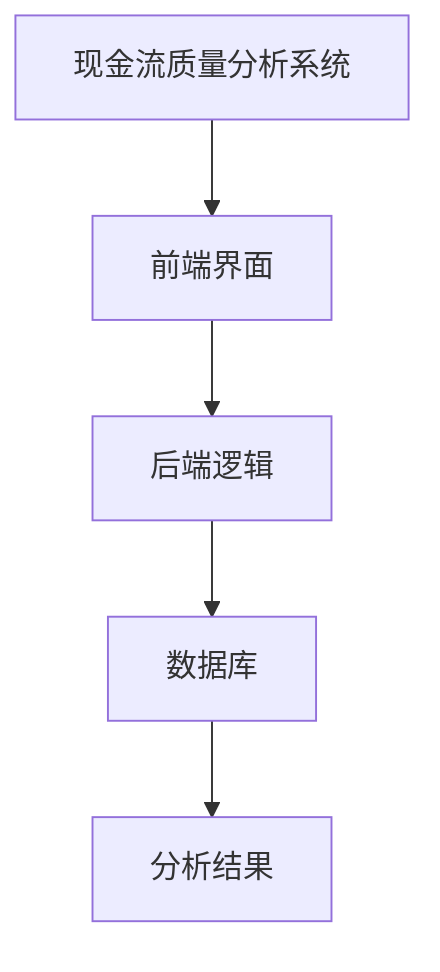
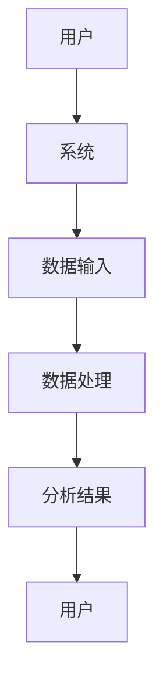

                 


# 《企业估值中的现金流质量分析》

---

## 关键词：
企业估值，现金流质量，财务指标，净现值，内部收益率，企业风险

---

## 摘要：
现金流质量分析是企业估值中的核心内容，通过对现金流的深度分析，评估企业的财务健康状况和未来盈利能力。本文系统地介绍了现金流质量分析的背景、核心概念、数学模型、系统架构、实战案例以及最佳实践，帮助读者全面理解现金流质量分析在企业估值中的应用。

---

# 第一部分: 现金流质量分析的背景与重要性

## 第1章: 现金流质量分析的背景与重要性

### 1.1 现金流质量分析的定义与核心概念
- **现金流质量分析的定义**：现金流质量分析是指通过对企业产生的现金流进行深入分析，评估其质量、可持续性和对企业发展的影响。
- **现金流质量分析的核心要素**：
  - 现金流来源：经营活动、投资活动、筹资活动的现金流。
  - 现金流稳定性：现金流的波动性、可持续性。
  - 现金流增长性：现金流的增长趋势。
- **现金流质量分析的边界与外延**：现金流质量分析不仅关注过去的数据，还需预测未来现金流的变化趋势。

### 1.2 现金流质量分析的背景与问题背景
- **传统企业估值方法的局限性**：
  - 过度依赖会计利润，忽视现金流的真实情况。
  - 无法准确反映企业的财务健康状况和未来的盈利能力。
- **现金流质量分析的提出与解决**：
  - 强调现金流的质量，而非仅仅关注现金流的数量。
  - 通过分析现金流的质量，评估企业的财务健康状况和未来盈利能力。
- **现金流质量分析在企业估值中的作用**：
  - 提供更准确的企业估值依据。
  - 帮助投资者做出更明智的投资决策。

### 1.3 现金流质量分析与传统财务指标的对比
- **传统财务指标的局限性**：
  - 利润指标容易受到会计政策的影响，无法反映企业的实际盈利能力。
  - 股东权益指标无法反映企业的偿债能力。
- **现金流质量分析的优势与特点**：
  - 现金流质量分析更加客观，不受会计政策的影响。
  - 能够更准确地反映企业的财务健康状况和未来盈利能力。
- **现金流质量分析与传统指标的结合**：
  - 将现金流质量分析与传统财务指标结合，可以更全面地评估企业的财务状况。

### 1.4 现金流质量分析的适用范围与应用场景
- **不同行业中的应用差异**：
  - 制造业：关注经营活动现金流的质量。
  - 服务业：关注经营活动现金流的质量。
  - 高科技行业：关注投资活动现金流的质量。
- **不同规模企业的适用性分析**：
  - 大型企业：需要更加复杂的现金流质量分析。
  - 中小型企业：可以采用相对简单的现金流质量分析方法。
- **现金流质量分析的未来发展趋势**：
  - 随着大数据和人工智能技术的发展，现金流质量分析将更加智能化和精准化。

### 1.5 本章小结
本章通过介绍现金流质量分析的背景、核心概念、与传统财务指标的对比以及适用范围，为后续章节的深入分析奠定了基础。

---

## 第2章: 现金流质量分析的核心概念与联系

### 2.1 现金流质量分析的核心概念
- **现金流的分类与特征**：
  - 经营活动现金流：企业日常经营活动中产生的现金流。
  - 投资活动现金流：企业投资活动产生的现金流。
  - 筹资活动现金流：企业筹资活动产生的现金流。
- **现金流质量的核心维度**：
  - 稳定性：现金流的波动性。
  - 可持续性：现金流的持续性。
  - 增长性：现金流的增长趋势。
- **现金流质量的评估标准**：
  - 现金流质量指数：衡量现金流质量的综合指标。
  - 现金流质量评分：对现金流质量进行评分。

### 2.2 现金流质量分析与企业价值的关系
- **现金流对企业价值的影响**：
  - 现金流是企业价值的核心驱动力。
  - 高质量的现金流能够提升企业价值。
- **现金流质量分析与企业估值模型的结合**：
  - 净现值模型：将现金流质量分析应用于净现值计算。
  - 内部收益率模型：将现金流质量分析应用于内部收益率计算。
- **现金流质量分析在企业并购中的应用**：
  - 并购前的现金流质量分析：评估目标企业的财务状况。
  - 并购后的现金流质量分析：监控并购后的财务表现。

### 2.3 现金流质量分析的ER实体关系图


### 2.4 本章小结
本章通过介绍现金流质量分析的核心概念及其与企业价值的关系，进一步加深了读者对现金流质量分析的理解。

---

## 第3章: 现金流质量分析的数学模型与算法原理

### 3.1 现金流质量分析的数学模型
- **现金流质量指数的计算公式**：
  $$ QCF = \frac{CF_{\text{自由现金流}}}{\text{EBITDA}} $$
  其中，$CF_{\text{自由现金流}}$ 是自由现金流，$\text{EBITDA}$ 是息税折旧及摊销前利润。
- **现金流质量的加权评分模型**：
  $$ QCF_{\text{加权}} = \sum_{i=1}^{n} w_i \cdot CF_i $$
  其中，$w_i$ 是第$i$个现金流指标的权重，$CF_i$ 是第$i$个现金流指标的值。

### 3.2 现金流质量分析的算法原理
- **净现值（NPV）算法原理**：
  净现值是指将未来现金流按照一定的折现率折现到现值，再减去初始投资的现值。
  $$ NPV = \sum_{t=0}^{n} \frac{CF_t}{(1 + r)^t} $$
  其中，$CF_t$ 是第$t$期的现金流，$r$ 是折现率，$n$ 是现金流的期限。

- **内部收益率（IRR）算法原理**：
  内部收益率是指使得净现值为零的折现率。
  $$ IRR = r \text{ 满足 } NPV = 0 $$

### 3.3 现金流质量分析的系统架构设计


### 3.4 本章小结
本章通过介绍现金流质量分析的数学模型和算法原理，为后续章节的系统架构设计和项目实战奠定了基础。

---

## 第4章: 现金流质量分析的系统架构设计

### 4.1 现金流质量分析的系统功能设计
- **系统功能模块**：
  - 数据输入模块：接收企业的财务数据。
  - 数据处理模块：对财务数据进行清洗和转换。
  - 现金流质量分析模块：对现金流进行质量分析。
  - 结果输出模块：输出分析结果。

### 4.2 现金流质量分析的系统架构设计


### 4.3 现金流质量分析的接口设计
- **数据输入接口**：
  - 输入企业财务数据。
  - 数据格式：CSV、Excel等。
- **结果输出接口**：
  - 输出现金流质量分析报告。
  - 报告格式：PDF、Word等。

### 4.4 现金流质量分析的交互流程


### 4.5 本章小结
本章通过介绍现金流质量分析的系统架构设计，展示了如何将现金流质量分析应用于实际的企业估值过程中。

---

## 第5章: 现金流质量分析的项目实战

### 5.1 现金流质量分析的环境安装
- **安装Python环境**：
  - 安装Python 3.x。
  - 安装必要的库：numpy、pandas、scikit-learn等。

### 5.2 现金流质量分析的核心代码实现
```python
import pandas as pd
import numpy as np

def calculate_cash_flow_quality(cf):
    ebitda = cf['EBITDA'].sum()
    free_cash_flow = cf['Free Cash Flow'].sum()
    qcf = free_cash_flow / ebitda
    return qcf

# 示例数据
data = {
    'Year': [2020, 2021, 2022],
    'EBITDA': [100, 150, 200],
    'Free Cash Flow': [50, 75, 100]
}
cf = pd.DataFrame(data)

qcf = calculate_cash_flow_quality(cf)
print(f"现金流质量指数：{qcf}")
```

### 5.3 现金流质量分析的案例分析
- **案例背景**：
  某企业过去三年的财务数据如下：
  - 2020年：EBITDA=100，Free Cash Flow=50。
  - 2021年：EBITDA=150，Free Cash Flow=75。
  - 2022年：EBITDA=200，Free Cash Flow=100。
- **计算现金流质量指数**：
  $$ QCF = \frac{50 + 75 + 100}{100 + 150 + 200} = \frac{225}{450} = 0.5 $$
- **分析结果**：
  现金流质量指数为0.5，说明企业的现金流质量较为一般，需要进一步优化。

### 5.4 本章小结
本章通过实际案例分析，展示了如何将现金流质量分析应用于企业估值中，并提供了具体的代码实现。

---

## 第6章: 现金流质量分析的最佳实践与小结

### 6.1 最佳实践
- **数据质量**：
  - 确保数据的准确性和完整性。
  - 数据清洗和预处理。
- **模型选择**：
  - 根据企业的具体情况选择合适的现金流质量分析模型。
  - 结合净现值和内部收益率进行综合评估。

### 6.2 小结
现金流质量分析是企业估值中的重要组成部分，通过对现金流的深度分析，可以更准确地评估企业的财务健康状况和未来盈利能力。

### 6.3 注意事项
- **数据的准确性**：现金流质量分析依赖于准确的财务数据。
- **模型的适用性**：选择合适的模型进行现金流质量分析。
- **持续监测**：定期更新和调整现金流质量分析模型。

### 6.4 未来研究方向
- **大数据技术的应用**：利用大数据技术进行更精准的现金流质量分析。
- **人工智能的应用**：利用机器学习技术进行现金流预测和质量分析。

### 6.5 拓展阅读
- 推荐书籍：《企业估值实战：现金流分析与应用》。
- 推荐博客：https://www.value investors.com

### 6.6 本章小结
本章总结了现金流质量分析的关键点，并提供了未来的研究方向和拓展阅读建议。

---

## 作者：AI天才研究院/AI Genius Institute & 禅与计算机程序设计艺术 /Zen And The Art of Computer Programming

---

以上是《企业估值中的现金流质量分析》的完整目录和部分章节内容。

