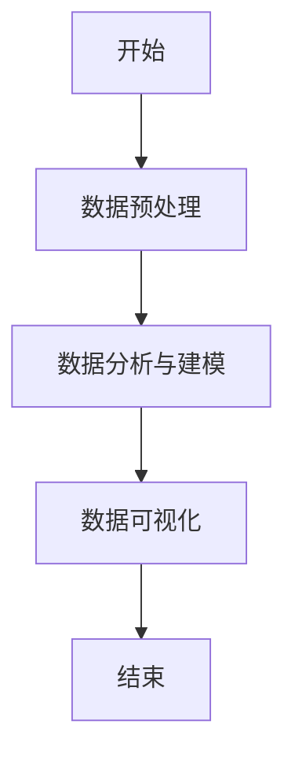
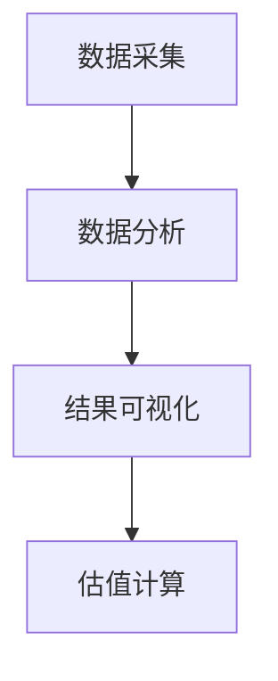

                 


# 企业估值中的生物计算技术潜力评估

> 关键词：企业估值，生物计算，潜力评估，基因数据，机器学习，人工智能

> 摘要：生物计算技术作为一种新兴的跨学科技术，正在逐渐影响企业估值的传统方法。通过分析基因数据、蛋白质相互作用和生物标志物筛选等生物信息，结合机器学习和人工智能算法，生物计算技术为企业估值提供了全新的视角和方法。本文将详细探讨生物计算技术在企业估值中的应用潜力，分析其在不同行业中的具体应用场景，并通过案例分析和系统架构设计，展示生物计算技术如何帮助企业和投资者更准确地评估企业价值。

---

# 第一部分: 生物计算技术与企业估值的背景与基础

## 第1章: 生物计算技术概述

### 1.1 生物计算技术的基本概念

#### 1.1.1 生物计算的定义与核心概念
生物计算（Biocomputing）是结合生物学和计算科学的新兴领域，旨在通过计算机技术和生物数据的分析，揭示生命的本质和规律。其核心概念包括基因组学、蛋白质组学、代谢组学等。

#### 1.1.2 生物计算技术的起源与发展
生物计算技术起源于20世纪末，随着基因测序技术的发展而迅速崛起。近年来，人工智能和大数据技术的进步进一步推动了生物计算技术的发展。

#### 1.1.3 生物计算技术的分类与特点
生物计算技术主要分为基因组计算、蛋白质计算和系统生物学计算。其特点包括数据密集性、计算复杂性和跨学科性。

### 1.2 企业估值的基本原理

#### 1.2.1 企业估值的定义与方法
企业估值是通过对企业的财务数据、市场地位和未来盈利能力进行分析，确定其市场价值的过程。常用方法包括DCF模型和可比公司法。

#### 1.2.2 传统企业估值模型的局限性
传统估值模型主要依赖财务数据，难以捕捉企业的创新能力和技术优势，尤其是对于生物技术企业来说，这种方法往往低估其潜在价值。

#### 1.2.3 新兴技术对企业估值的影响
随着生物计算技术的发展，企业估值需要考虑更多的非财务因素，如生物数据的价值和技术创新潜力。

### 1.3 生物计算技术在企业估值中的潜力

#### 1.3.1 生物计算技术对企业价值的影响
生物计算技术可以帮助企业优化研发流程、降低生产成本，从而提升企业的整体价值。

#### 1.3.2 生物计算技术在企业估值中的应用场景
在医疗、制药和农业等领域，生物计算技术可以通过分析生物数据，为企业的估值提供更准确的依据。

#### 1.3.3 生物计算技术的未来发展趋势
随着人工智能和大数据技术的进一步发展，生物计算技术将在企业估值中发挥越来越重要的作用。

---

## 第2章: 生物计算技术的核心概念与联系

### 2.1 生物计算技术的核心原理

#### 2.1.1 生物数据的处理与分析
生物数据的处理包括数据清洗、标准化和整合。分析则涉及基因表达分析、蛋白质相互作用网络构建等。

#### 2.1.2 生物信息学的基本原理
生物信息学是研究生物数据的结构、功能和应用的学科。其核心包括序列分析、结构预测和功能注释。

#### 2.1.3 生物计算技术的数学模型
生物计算技术的数学模型包括基因表达数据分析模型和蛋白质相互作用网络模型。

### 2.2 生物计算技术与企业估值的关系

#### 2.2.1 生物计算技术在企业估值中的作用
生物计算技术可以通过分析生物数据，揭示企业的技术优势和市场潜力，从而提升其估值。

#### 2.2.2 生物计算技术与企业价值的关联性
生物数据的价值直接影响企业的创新能力和市场竞争力，进而影响其估值。

#### 2.2.3 生物计算技术对企业估值的影响机制
通过分析生物数据，生物计算技术可以帮助企业优化研发流程、降低生产成本，从而提升其整体价值。

### 2.3 生物计算技术的核心要素对比

#### 2.3.1 生物计算技术的核心要素
生物计算技术的核心要素包括生物数据、计算模型和分析算法。

#### 2.3.2 不同技术的对比分析
通过对比不同生物计算技术的特点和应用场景，可以更好地理解其在企业估值中的潜力。

#### 2.3.3 生物计算技术的ER实体关系图

```mermaid
erDiagram
    customer[客户] {
        id : integer
        name : string
        email : string
    }
    gene_data[基因数据] {
        id : integer
        gene_id : string
        expression_level : float
    }
    protein_data[蛋白质数据] {
        id : integer
        protein_id : string
        interaction_network : string
    }
    company[企业] {
        id : integer
        name : string
        industry : string
    }
    valuation[估值] {
        id : integer
        value : float
        date : date
    }
    customer --|> company : "投资的公司"
    gene_data --|> company : "公司的基因数据"
    protein_data --|> company : "公司的蛋白质数据"
    company --|> valuation : "企业的估值结果"
```

---

## 第3章: 生物计算技术的算法原理

### 3.1 生物数据处理的算法流程

#### 3.1.1 数据预处理
数据预处理包括数据清洗、标准化和整合。

#### 3.1.2 数据分析与建模
数据分析与建模涉及基因表达分析、蛋白质相互作用网络构建等。

#### 3.1.3 数据可视化
数据可视化通过图表展示生物数据的特征和规律。

### 3.2 生物计算技术的数学模型

#### 3.2.1 基因表达数据分析模型
基因表达数据分析模型用于分析基因表达水平与疾病的关系。

#### 3.2.2 蛋白质相互作用网络模型
蛋白质相互作用网络模型用于研究蛋白质之间的相互作用关系。

#### 3.2.3 生物标志物筛选算法
生物标志物筛选算法用于识别具有潜在诊断或治疗价值的生物标志物。

### 3.3 生物计算技术的算法实现

#### 3.3.1 算法流程图



#### 3.3.2 算法代码实现

```python
import pandas as pd
import numpy as np

# 数据预处理
data = pd.read_csv('gene_expression.csv')
data = data.dropna()
data = (data - data.mean()) / data.std()

# 数据分析与建模
from sklearn.cluster import KMeans
model = KMeans(n_clusters=3, random_state=0)
model.fit(data)

# 数据可视化
import matplotlib.pyplot as plt
plt.scatter(data['gene1'], data['gene2'], c=model.labels_)
plt.show()
```

#### 3.3.3 算法的数学公式

基因表达数据分析模型的公式为：
$$
\text{表达水平} = \beta_0 + \beta_1 \times \text{基因型} + \epsilon
$$

---

## 第4章: 生物计算技术在企业估值中的应用

### 4.1 生物计算技术在医疗行业的应用

#### 4.1.1 医疗企业估值的生物计算方法
医疗企业的估值可以通过分析基因数据和蛋白质相互作用网络来评估其技术优势。

#### 4.1.2 医疗数据对企业估值的影响
医疗数据可以帮助投资者更准确地评估医疗企业的市场潜力和创新能力。

#### 4.1.3 医疗企业的生物计算技术案例
通过分析某医疗企业的基因数据，揭示其在疾病治疗领域的优势，从而提升其估值。

### 4.2 生物计算技术在农业行业的应用

#### 4.2.1 农业企业估值的生物计算方法
农业企业的估值可以通过分析作物基因数据和环境数据来评估其生产效率和抗病能力。

#### 4.2.2 农业数据对企业估值的影响
农业数据可以帮助投资者更准确地评估农业企业的生产潜力和市场竞争力。

#### 4.2.3 农业企业的生物计算技术案例
通过分析某农业企业的作物基因数据，揭示其在抗病品种研发领域的优势，从而提升其估值。

### 4.3 生物计算技术在制药行业的应用

#### 4.3.1 制药企业估值的生物计算方法
制药企业的估值可以通过分析药物分子结构和生物标志物数据来评估其研发能力和市场潜力。

#### 4.3.2 制药数据对企业估值的影响
制药数据可以帮助投资者更准确地评估制药企业的创新能力和技术优势。

#### 4.3.3 制药企业的生物计算技术案例
通过分析某制药企业的药物分子结构数据，揭示其在新药研发领域的优势，从而提升其估值。

---

## 第5章: 生物计算技术的系统架构与设计

### 5.1 系统架构设计

#### 5.1.1 系统功能模块划分
生物计算技术的系统架构包括数据采集、数据分析、结果可视化和估值计算模块。

#### 5.1.2 系统架构图



#### 5.1.3 系统架构设计的数学模型
系统的整体架构可以通过以下公式表示：
$$
\text{估值} = f(\text{基因数据}, \text{蛋白质数据}, \text{环境数据})
$$

---

## 第6章: 项目实战

### 6.1 环境安装

#### 6.1.1 安装Python和相关库
需要安装Python 3.8及以上版本，并安装pandas、numpy、scikit-learn等库。

### 6.2 系统核心实现源代码

#### 6.2.1 数据预处理代码

```python
import pandas as pd
import numpy as np

data = pd.read_csv('gene_expression.csv')
data = data.dropna()
data = (data - data.mean()) / data.std()
```

#### 6.2.2 数据分析与建模代码

```python
from sklearn.cluster import KMeans
model = KMeans(n_clusters=3, random_state=0)
model.fit(data)
```

#### 6.2.3 数据可视化代码

```python
import matplotlib.pyplot as plt
plt.scatter(data['gene1'], data['gene2'], c=model.labels_)
plt.show()
```

### 6.3 代码应用解读与分析

#### 6.3.1 代码实现的功能
上述代码实现了基因表达数据的预处理、聚类分析和可视化。

#### 6.3.2 代码与生物计算技术的联系
通过分析基因表达数据，可以帮助企业评估其在疾病治疗领域的技术优势。

### 6.4 实际案例分析

#### 6.4.1 案例背景介绍
以某医疗企业为例，分析其基因数据以评估其技术优势。

#### 6.4.2 数据分析与建模
通过聚类分析揭示基因表达的模式和潜在的疾病相关性。

#### 6.4.3 结果解读与估值计算
基于分析结果，评估企业的技术优势和市场潜力，从而提升其估值。

### 6.5 项目小结

#### 6.5.1 项目总结
通过生物计算技术分析基因数据，可以帮助企业优化研发流程、降低生产成本，从而提升其整体价值。

#### 6.5.2 项目经验与教训
在项目实施过程中，需要注意数据质量和算法选择，确保分析结果的准确性和可靠性。

---

## 第7章: 总结与展望

### 7.1 总结

生物计算技术作为一种新兴的跨学科技术，正在逐渐影响企业估值的传统方法。通过分析基因数据、蛋白质相互作用和生物标志物筛选等生物信息，结合机器学习和人工智能算法，生物计算技术为企业估值提供了全新的视角和方法。

### 7.2 展望

随着人工智能和大数据技术的进一步发展，生物计算技术将在企业估值中发挥越来越重要的作用。未来的研究方向包括开发更高效的生物数据分析算法、拓展生物计算技术在更多行业中的应用，以及探索生物计算技术与传统估值方法的结合。

---

作者：AI天才研究院/AI Genius Institute & 禅与计算机程序设计艺术 /Zen And The Art of Computer Programming

