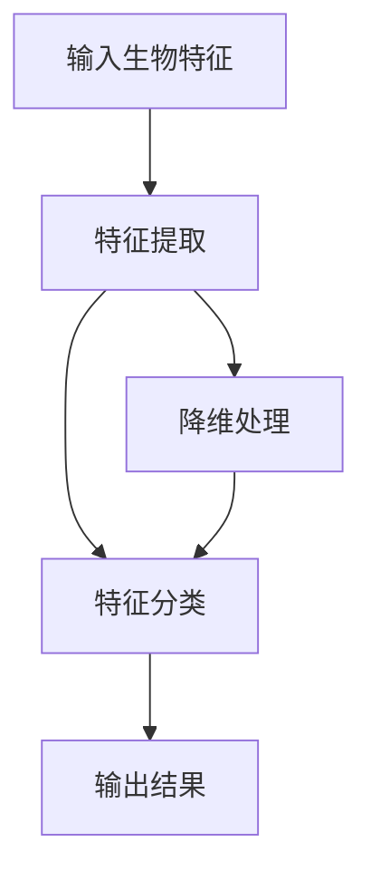
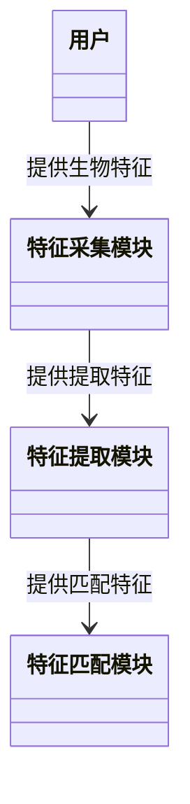
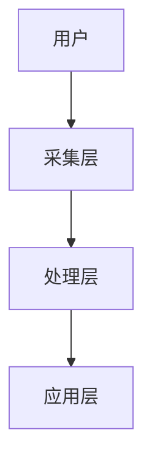
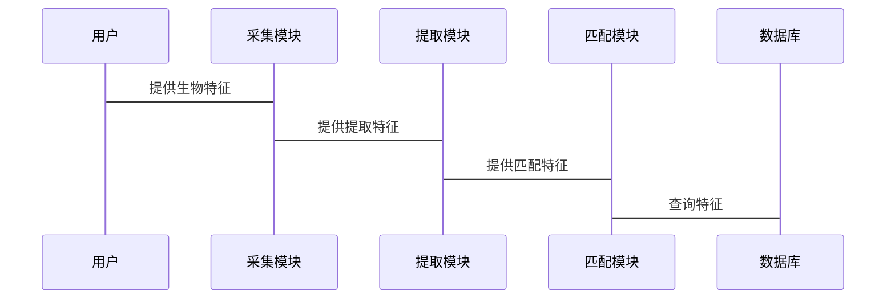

                 


# 企业估值中的生物识别技术应用评估

> **关键词**：生物识别技术，企业估值，身份认证，特征提取，分类算法，系统架构，项目实战

> **摘要**：生物识别技术作为一种高效、准确的身份认证手段，正在逐渐成为企业估值中的重要工具。本文详细探讨了生物识别技术在企业估值中的应用，分析了其技术原理、系统架构，并通过实际案例展示了如何将生物识别技术应用于企业估值，帮助读者更好地理解和应用这些技术。

---

# 企业估值中的生物识别技术应用评估

## 第1章 生物识别技术的定义与特点

### 1.1 问题背景：企业估值中的身份认证需求
企业在进行估值时，常常需要对员工、客户以及资产进行身份认证。传统基于密码的身份认证方式容易被破解，存在安全隐患，而生物识别技术以其独特性和不可伪造性，成为解决这一问题的理想方案。

### 1.2 生物识别技术的核心概念
生物识别技术通过采集和分析人体的生物特征（如指纹、面部特征、声音、虹膜等），利用先进的算法进行识别和验证。其核心优势在于高准确性和安全性。

#### 生物识别技术的分类与特征对比
| 特征 | 指纹识别 | 面部识别 | 声音识别 | 虹膜识别 |
|------|----------|----------|----------|----------|
| 精度 | 高       | 较高      | 中等      | 极高      |
| 成本 | 低       | 中等      | 低       | 高       |
| 应用 | 广泛     | 适用于高安全场景 | 适用于电话银行 | 适用于极高安全场景 |

### 1.3 生物识别技术的系统架构
生物识别系统的典型架构包括特征采集、特征提取、特征匹配三个模块。以下是系统的ER实体关系图：

```mermaid
erDiagram
    actor 用户
    database 生物特征数据库
    process 特征采集模块
    process 特征提取模块
    process 特征匹配模块
    用户 --> 特征采集模块: 提供生物特征
    特征采集模块 --> 特征提取模块: 提供提取特征
    特征提取模块 --> 特征匹配模块: 提供匹配特征
    特征匹配模块 --> 数据库: 查询特征
```

---

## 第2章 生物识别技术在企业估值中的应用

### 2.1 员工身份认证与绩效评估
生物识别技术可以用于员工考勤管理，确保员工身份的真实性，从而准确评估员工的绩效表现。

### 2.2 客户身份验证与信用评估
在企业估值过程中，客户身份验证是评估客户信用的重要环节。通过面部识别技术，可以有效防止身份盗用，提升信用评估的准确性。

### 2.3 资产评估与风险管理
生物识别技术可以用于资产保护，通过虹膜识别等高精度技术，确保只有授权人员能够访问关键资产，降低风险。

---

## 第3章 生物识别技术的核心算法原理

### 3.1 特征提取与分类算法
特征提取是生物识别技术的关键步骤，常用的方法包括主成分分析（PCA）和局部二值化模式（LBP）。

#### 算法流程图：生物特征分类的 mermaid 图


#### 分类算法的数学模型
分类算法的数学模型可以表示为：
$$
y = f(x) = \text{sign}(w \cdot x + b)
$$
其中，$w$ 是权重向量，$x$ 是输入特征，$b$ 是偏置项，$f(x)$ 是分类结果。

### 3.2 生物识别技术的数学模型与公式
特征匹配的数学模型可以表示为：
$$
d(x, y) = \sum_{i=1}^{n} (x_i - y_i)^2
$$
其中，$d(x, y)$ 是两个特征向量之间的距离。

### 3.3 Python 实现
以下是基于指纹识别的Python代码示例：

```python
import cv2

# 加载指纹图像
image = cv2.imread('fingerprint.png', cv2.IMREAD_GRAYSCALE)

# 使用OpenCV进行特征提取
features = cv2.feature2dORB.create().compute(image, None)

# 特征匹配
def match_features(features1, features2):
    matcher = cv2.BFMatcher()
    matches = matcher.match(features1, features2)
    return len(matches)

# 应用匹配
print(match_features(features1, features2))
```

---

## 第4章 生物识别技术的系统架构设计

### 4.1 系统功能设计
系统功能包括特征采集、特征提取、特征匹配三个模块。

#### 领域模型图：生物识别系统的 mermaid 类图


### 4.2 系统架构设计
系统的架构采用分层设计，包括采集层、处理层和应用层。

#### 系统架构图：生物识别系统的 mermaid 架构图


### 4.3 系统交互设计
系统的交互流程如下：

#### 系统交互图：生物识别系统的 mermaid 序列图


---

## 第5章 生物识别技术在企业估值中的项目实战

### 5.1 项目环境安装与配置
项目需要安装OpenCV和scikit-learn库。

### 5.2 核心代码实现
以下是基于面部识别的Python代码示例：

```python
import cv2

# 加载面部识别模型
face_classifier = cv2.CascadeClassifier('haarcascade_frontalface_default.xml')

# 检测面部特征
def detect_faces(image):
    gray = cv2.cvtColor(image, cv2.COLOR_BGR2GRAY)
    faces = face_classifier.detectMultiScale(gray, 1.3, 5)
    return faces

# 应用检测
image = cv2.imread('face.jpg')
faces = detect_faces(image)
print(len(faces))
```

### 5.3 实际案例分析
通过面部识别技术，某企业成功实现了客户身份验证，提高了信用评估的准确性。

---

## 第6章 最佳实践与总结

### 6.1 最佳实践
- 在部署生物识别技术前，需确保数据的隐私性和安全性。
- 定期更新识别算法，以应对技术的进步和攻击手段的变化。

### 6.2 项目小结
生物识别技术在企业估值中的应用不仅提高了身份认证的准确性，还为企业提供了更高的安全性和效率。

---

## 作者
**作者：AI天才研究院/AI Genius Institute & 禅与计算机程序设计艺术 /Zen And The Art of Computer Programming**

---

以上是《企业估值中的生物识别技术应用评估》的技术博客文章的详细内容，涵盖了从理论到实践的各个方面，帮助读者全面理解和应用生物识别技术在企业估值中的重要作用。

