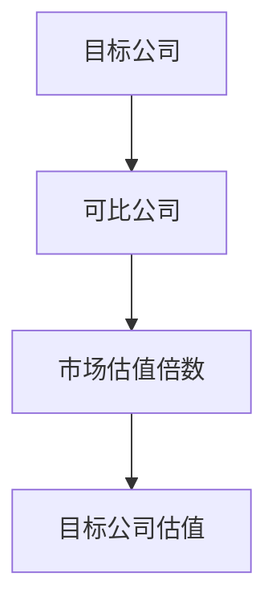
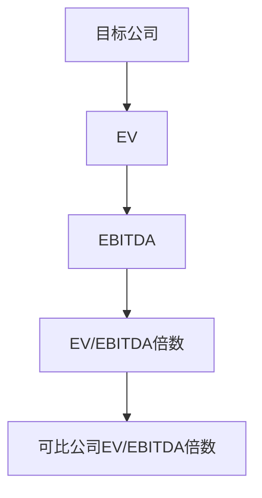
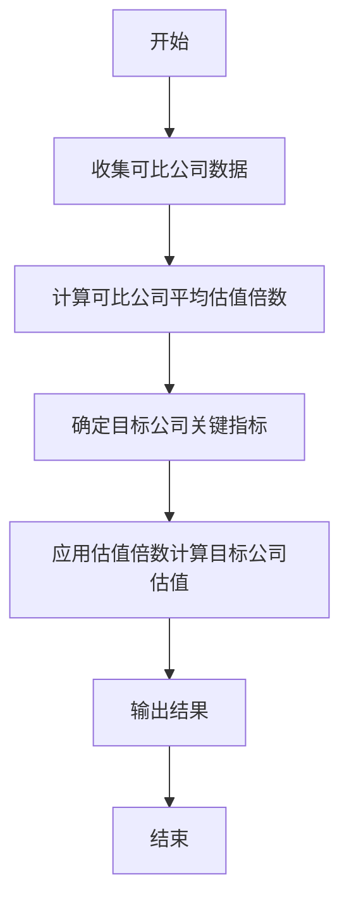
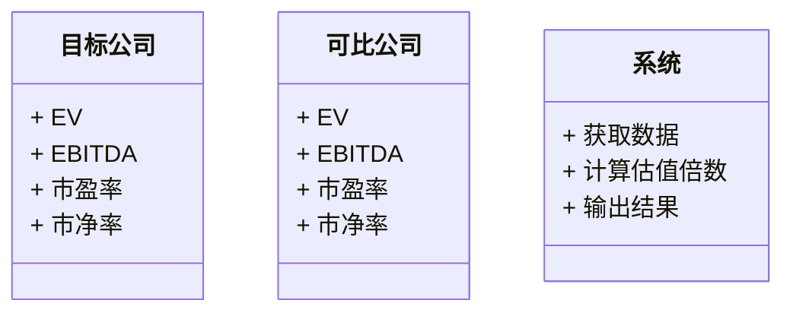
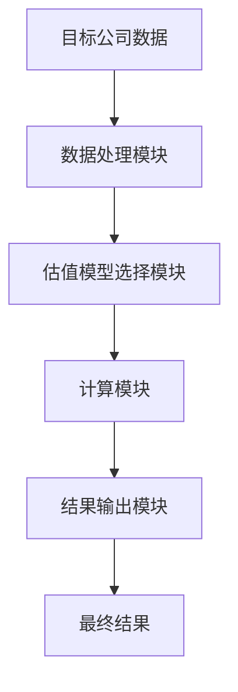
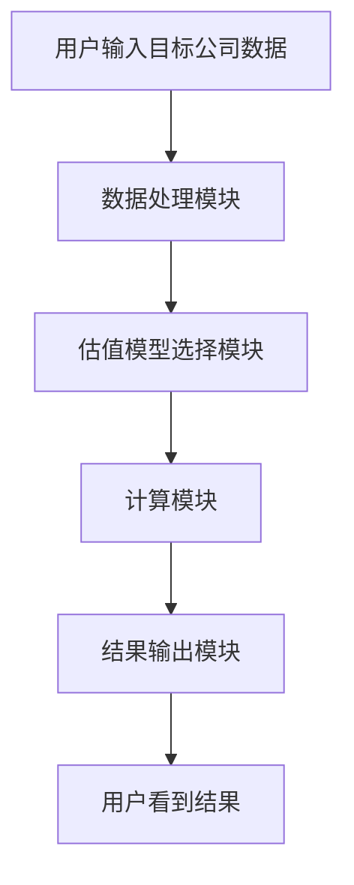

                 


# 企业估值中的相对估值法

> 关键词：企业估值、相对估值法、EV/EBITDA、市盈率、市净率、企业价值模型、相对估值模型

> 摘要：相对估值法是一种基于可比公司数据分析的企业估值方法，通过比较企业之间的相对估值倍数来确定目标企业的价值。本文从相对估值法的核心概念、数学模型、算法原理、系统架构、项目实战等多个角度，全面解析相对估值法在企业估值中的应用。通过详细讲解EV/EBITDA、市盈率、市净率等常用模型，结合实际案例和代码实现，帮助读者掌握相对估值法的理论与实践。

---

# 第一部分: 相对估值法的背景与核心概念

## 第1章: 企业估值与相对估值法的背景

### 1.1 企业估值的基本概念

#### 1.1.1 企业估值的定义与意义
企业估值是指对企业整体价值的评估，通常用于企业并购、融资、上市等场景。企业估值的核心在于确定企业的内在价值，以便做出合理的交易决策。

#### 1.1.2 企业估值的主要方法
企业估值的主要方法包括：

1. **绝对估值法**：基于企业未来现金流的折现模型，如DCF模型。
2. **相对估值法**：基于可比公司或可比资产的估值倍数，如EV/EBITDA、P/E、P/B等。
3. **混合估值法**：结合绝对估值法和相对估值法的结果进行综合判断。

#### 1.1.3 相对估值法的起源与发展
相对估值法起源于金融市场中的可比公司分析，通过比较同类企业的估值倍数，推断目标企业的合理价值。随着金融市场的快速发展，相对估值法因其简单易用、数据获取便捷的特点，逐渐成为企业估值的重要方法之一。

---

### 1.2 相对估值法的定义与特点

#### 1.2.1 相对估值法的核心概念
相对估值法是一种基于相对性分析的企业估值方法。通过比较目标企业与可比企业在某些关键财务指标上的差异，推断目标企业的合理估值倍数。

#### 1.2.2 相对估值法与绝对估值法的区别
- **数据依赖性**：相对估值法依赖于可比公司的数据，而绝对估值法基于企业自身的未来现金流。
- **计算复杂性**：相对估值法简单易用，而绝对估值法需要复杂的财务模型和假设。
- **适用场景**：相对估值法适用于数据丰富的市场环境，而绝对估值法适用于缺乏市场数据的场景。

#### 1.2.3 相对估值法的适用场景
- 企业并购与收购
- 企业融资与上市
- 投资分析与资产配置
- 行业比较与趋势分析

---

### 1.3 相对估值法在企业估值中的作用

#### 1.3.1 相对估值法的优势
- **数据获取便捷**：相对估值法依赖公开的市场数据，易于获取。
- **计算简单**：相对估值法的计算过程相对简单，适合快速估值。
- **市场敏感性**：能够反映市场的整体估值水平和趋势。

#### 1.3.2 相对估值法的局限性
- **假设风险**：假设目标企业和可比企业具有相似的风险和回报特征。
- **数据偏差**：可比公司数据可能受到行业周期、企业规模等因素的影响。
- **缺乏个性化**：相对估值法难以充分考虑目标企业的独特性。

#### 1.3.3 相对估值法与其他估值方法的结合
通过结合绝对估值法和相对估值法，可以实现对企业的全面估值。例如，首先使用DCF模型计算企业的内在价值，然后通过相对估值法验证市场的合理估值区间。

---

## 第2章: 相对估值法的核心概念

### 2.1 相对估值法的理论基础

#### 2.1.1 市盈率（P/E）模型
市盈率是企业市值与每股收益（EPS）的比率：
$$ P/E = \frac{P}{E} $$
其中，P为股票价格，E为每股收益。

#### 2.1.2 市净率（P/B）模型
市净率是企业市值与每股净资产（BPS）的比率：
$$ P/B = \frac{P}{B} $$
其中，P为股票价格，B为每股净资产。

#### 2.1.3 企业价值倍数（EV/EBITDA）模型
企业价值倍数是企业整体价值（EV）与息税折旧及摊销前利润（EBITDA）的比率：
$$ EV/EBITDA = \frac{EV}{EBITDA} $$

---

### 2.2 相对估值法的公式与计算

#### 2.2.1 常用相对估值公式的推导
相对估值法的核心是通过可比公司的平均估值倍数，推导目标公司的合理估值。例如，假设可比公司的平均EV/EBITDA倍数为10倍，目标公司的EBITDA为1000万元，则目标公司的EV为：
$$ EV = 10 \times 1000 = 10000 \text{万元} $$

#### 2.2.2 相对估值法的数学模型
相对估值法的数学模型可以表示为：
$$ EV = \frac{EV}{\text{指标}} \times \text{目标公司指标} $$
其中，$$EV$$为目标公司的整体价值，$$\text{指标}$$为可比公司的平均估值倍数。

#### 2.2.3 相对估值法的比较分析
通过比较不同相对估值模型的结果，可以确定目标公司的合理估值区间。

---

### 2.3 相对估值法的实体关系图

#### 2.3.1 企业价值实体关系图


#### 2.3.2 相对估值模型的ER图


---

## 第3章: 相对估值法的算法原理

### 3.1 相对估值法的算法流程

#### 3.1.1 数据收集与清洗
- 收集目标公司和可比公司的财务数据。
- 清洗数据，剔除异常值和缺失值。

#### 3.1.2 估值模型的选择与应用
- 根据目标公司的行业和规模选择合适的相对估值模型，例如EV/EBITDA、P/E或P/B模型。

#### 3.1.3 结果分析与调整
- 比较目标公司与可比公司的估值倍数。
- 调整目标公司估值，以反映其独特性。

---

### 3.2 相对估值法的数学模型

#### 3.2.1 EV/EBITDA模型的数学公式
$$ EV = \frac{EV}{EBITDA} \times EBITDA $$

#### 3.2.2 市盈率模型的数学公式
$$ P = \frac{P}{E} \times E $$

#### 3.2.3 市净率模型的数学公式
$$ P = \frac{P}{B} \times B $$

---

### 3.3 相对估值法的算法流程图



---

### 3.4 代码实现与案例分析

#### 3.4.1 Python代码实现
```python
import pandas as pd
import numpy as np

# 示例数据：可比公司EV/EBITDA倍数
comparable_evens = [10, 12, 8, 11]
comparable_ebitdas = [1000, 1200, 800, 1100]

# 计算可比公司平均EV/EBITDA倍数
average_ev_ebitda = np.mean(comparable_evens)

# 目标公司EBITDA
target_ebitda = 1000

# 计算目标公司EV
target_ev = average_ev_ebitda * target_ebitda
print(f"目标公司EV：{target_ev}")
```

---

## 第4章: 相对估值法的系统分析与架构设计

### 4.1 问题场景介绍
在企业估值中，相对估值法需要结合多个数据源和模型，因此需要设计一个高效的系统架构。

---

### 4.2 系统功能设计

#### 4.2.1 领域模型


---

### 4.3 系统架构设计

#### 4.3.1 系统架构图


---

### 4.4 系统接口设计
- 数据输入接口：接收目标公司和可比公司的财务数据。
- 数据处理接口：清洗和整理数据。
- 估值计算接口：选择合适的模型进行估值。
- 结果输出接口：展示估值结果。

---

### 4.5 系统交互流程

#### 4.5.1 交互流程图


---

## 第5章: 项目实战

### 5.1 环境安装
安装必要的Python库：
```bash
pip install pandas numpy matplotlib
```

---

### 5.2 核心代码实现

#### 5.2.1 数据处理
```python
import pandas as pd

# 加载可比公司数据
df_comparable = pd.read_csv('comparable_companies.csv')

# 计算平均EV/EBITDA倍数
average_ev_ebitda = df_comparable['EV/EBITDA'].mean()

# 目标公司数据
target_ebitda = 1000

# 计算目标公司EV
target_ev = average_ev_ebitda * target_ebitda
print(f"目标公司EV：{target_ev}")
```

---

### 5.3 案例分析
假设目标公司的EBITDA为1000万元，可比公司的平均EV/EBITDA倍数为10倍，则目标公司的EV为：
$$ EV = 10 \times 1000 = 10000 \text{万元} $$

---

## 第6章: 最佳实践与小结

### 6.1 最佳实践
- 确保数据的准确性和完整性。
- 结合多个相对估值模型进行综合判断。
- 定期更新数据和模型，以反映市场变化。

### 6.2 小结
相对估值法是一种简单而有效的企业估值方法，通过比较目标公司与可比公司的估值倍数，可以帮助投资者快速确定企业的合理价值。然而，相对估值法也存在一定的局限性，因此在实际应用中，需要结合绝对估值法和其他方法进行综合分析。

---

## 附录: 工具与资源

### 附录1: 相关术语表
- EV：企业价值（Enterprise Value）
- EBITDA：息税折旧及摊销前利润
- P/E：市盈率
- P/B：市净率

### 附录2: 推荐工具
- **Python**：用于数据处理和模型计算。
- **Pandas**：数据处理库。
- **Matplotlib**：数据可视化库。

### 附录3: 扩展阅读
- 《企业估值方法与实践》
- 《相对估值法的理论与应用》

---

作者：AI天才研究院/AI Genius Institute & 禅与计算机程序设计艺术/Zen And The Art of Computer Programming

