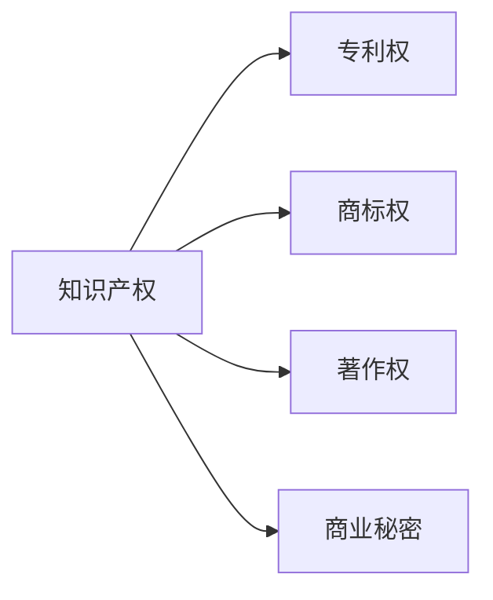

                 


---

# 企业估值中的知识产权价值法

> 关键词：企业估值，知识产权，价值评估，贴现现金流模型，知识产权系统架构

> 摘要：本文将深入探讨企业在估值过程中知识产权的价值评估方法，结合实际案例和系统设计，详细分析知识产权价值评估的核心概念、算法原理、系统架构及项目实战，为企业提供切实可行的知识产权价值评估方案。

---

# 第一部分: 知识产权与企业估值基础

## 第1章: 知识产权的基本概念

### 1.1 知识产权的定义与类型

#### 1.1.1 知识产权的定义
知识产权（Intellectual Property，IP）是指人们在智力活动领域中创造的成果，通常包括专利权、商标权、著作权、商业秘密等。这些权利的共同特点是具有无形性、可复制性和可交易性。



#### 1.1.2 知识产权的主要类型
知识产权主要分为以下几类：

1. **专利权**：保护发明的独占权。
2. **商标权**：保护商品或服务的标识。
3. **著作权**：保护文学、艺术和科学作品的作者权。
4. **商业秘密**：保护未公开的商业信息和技术。

#### 1.1.3 知识产权的保护机制
知识产权的保护机制主要包括法律保护和市场保护两种方式。法律保护主要通过专利法、版权法和商标法等实现，而市场保护则依赖于市场竞争和商业信誉。

### 1.2 知识产权在企业中的作用

#### 1.2.1 知识产权对企业价值的影响
知识产权是企业的核心资产之一，其价值直接影响企业的市场估值。例如，一家拥有大量发明专利的企业，其估值往往远高于同类企业。

#### 1.2.2 知识产权在企业竞争中的地位
在现代商业竞争中，知识产权是企业核心竞争力的体现。拥有强大的知识产权储备，可以帮助企业在市场竞争中占据优势地位。

#### 1.2.3 知识产权对企业创新的推动作用
知识产权保护为创新者提供了法律保障，激励企业不断投入研发，推动技术创新和产品升级。

---

## 第2章: 企业估值中的知识产权价值法

### 2.1 企业估值的基本概念

#### 2.1.1 企业估值的定义
企业估值是指对企业的整体价值进行评估，通常包括企业的资产、负债、收益能力等多个方面。

#### 2.1.2 企业估值的主要方法
企业估值的主要方法包括市场法、收益法和资产法三种。其中，收益法最为常用，因为它能够将企业的未来收益折现，反映其市场价值。

#### 2.1.3 知识产权在企业估值中的特殊性
知识产权作为一种无形资产，其价值评估具有特殊性。由于其无形性，其价值往往难以直接量化，需要借助多种评估方法。

### 2.2 知识产权价值法的核心原理

#### 2.2.1 知识产权价值法的定义
知识产权价值法是一种通过评估知识产权的经济价值，进而确定其对整体企业价值贡献的方法。

#### 2.2.2 知识产权价值法的理论基础
知识产权价值法的理论基础主要来源于资产定价理论和期权定价理论。通过将知识产权视为一种特殊的资产，可以使用贴现现金流模型对其进行估值。

#### 2.2.3 知识产权价值法的应用范围
知识产权价值法主要应用于高科技企业、知识产权密集型企业以及涉及专利、商标等知识产权交易的企业。

---

## 第3章: 知识产权价值评估的现状与挑战

### 3.1 知识产权价值评估的现状

#### 3.1.1 当前知识产权价值评估的主要方法
目前，知识产权价值评估的主要方法包括成本法、市场法和收益法。其中，收益法最为常用，因为它能够将知识产权的未来收益折现。

#### 3.1.2 知识产权价值评估的市场环境
随着全球知识产权保护意识的增强，知识产权交易市场逐渐成熟，为知识产权价值评估提供了良好的环境。

#### 3.1.3 知识产权价值评估的行业应用
知识产权价值评估在高科技、制药、软件开发等领域得到了广泛应用。

### 3.2 知识产权价值评估的主要挑战

#### 3.2.1 知识产权无形性带来的评估难题
由于知识产权的无形性，其价值往往难以直接量化，需要借助多种评估方法。

#### 3.2.2 知识产权价值波动性的影响
知识产权的价值受市场环境和技术发展的影响较大，具有较高的波动性。

#### 3.2.3 知识产权评估中的法律与技术问题
知识产权评估需要结合法律和技术创新情况，这增加了评估的复杂性。

---

# 第二部分: 知识产权价值评估的核心概念与方法

## 第4章: 知识产权价值评估的核心概念

### 4.1 知识产权价值评估的基本要素

#### 4.1.1 知识产权的生命周期
知识产权的生命周期包括创造、使用、保护和终止四个阶段。


#### 4.1.2 知识产权的经济寿命
知识产权的经济寿命是指其在市场中产生经济效益的时间跨度。

#### 4.1.3 知识产权的市场价值
知识产权的市场价值是指其在市场中的交易价格，受市场需求和供给的影响。

### 4.2 知识产权价值评估的原理

#### 4.2.1 知识产权价值的形成机制
知识产权的价值主要由其创新性和市场竞争力决定。

#### 4.2.2 知识产权价值的驱动因素
知识产权价值的驱动因素包括市场需求、技术先进性、法律保护等因素。

#### 4.2.3 知识产权价值的动态变化
知识产权价值会随着市场环境和技术发展发生变化，需要定期进行评估。

---

## 第5章: 知识产权价值评估的主要方法

### 5.1 成本法

#### 5.1.1 成本法的基本原理
成本法是通过估算知识产权的开发成本，确定其价值。

#### 5.1.2 成本法的适用场景
成本法适用于知识产权开发成本较低且易于量化的场景。

#### 5.1.3 成本法的优缺点
**优点**：简单易行，成本低。  
**缺点**：忽视了知识产权的市场价值和创新性。

### 5.2 市场法

#### 5.2.1 市场法的基本原理
市场法是通过比较类似知识产权的市场交易价格，确定其价值。

#### 5.2.2 市场法的适用场景
市场法适用于知识产权市场较为成熟且交易活跃的场景。

#### 5.2.3 市场法的优缺点
**优点**：能够反映市场真实价值。  
**缺点**：需要大量的市场交易数据。

### 5.3 收益法

#### 5.3.1 收益法的基本原理
收益法是通过估算知识产权在未来产生的收益，折现后确定其价值。

#### 5.3.2 收益法的适用场景
收益法适用于知识产权能够为企业带来稳定收益的场景。

#### 5.3.3 收益法的优缺点
**优点**：能够反映知识产权的未来价值。  
**缺点**：需要预测未来的收益，具有较高的不确定性。

---

## 第6章: 知识产权价值评估的数学模型

### 6.1 贴现现金流模型

#### 6.1.1 模型介绍
贴现现金流模型（Discounted Cash Flow，DCF）是收益法的核心模型，用于估算知识产权未来现金流的现值。

#### 6.1.2 模型公式
$$ V = \sum_{t=1}^{n} \frac{CF_t}{(1 + r)^t} $$

其中，$V$ 是知识产权的价值，$CF_t$ 是第 $t$ 年的现金流，$r$ 是折现率，$n$ 是知识产权的经济寿命。

#### 6.1.3 案例分析
假设某专利预计在未来5年内的现金流分别为100万、120万、150万、180万和200万，折现率为10%。则其价值计算如下：

$$ V = \frac{100}{1.1} + \frac{120}{1.1^2} + \frac{150}{1.1^3} + \frac{180}{1.1^4} + \frac{200}{1.1^5} $$

---

## 第7章: 知识产权价值评估系统架构

### 7.1 系统功能设计

#### 7.1.1 系统功能模块
$$
\text{知识产权评估系统} \rightarrow \text{数据输入} \rightarrow \text{模型计算} \rightarrow \text{结果输出}
$$

#### 7.1.2 系统功能流程
1. 数据输入：用户输入知识产权的基本信息和相关数据。
2. 模型计算：系统根据输入数据，选择合适的评估方法进行计算。
3. 结果输出：系统输出知识产权的价值评估结果。

### 7.2 系统架构设计


---

## 第8章: 知识产权价值评估的项目实战

### 8.1 环境安装

#### 8.1.1 安装Python
```bash
# 安装Python
brew install python
```

#### 8.1.2 安装依赖库
```bash
pip install numpy pandas matplotlib
```

### 8.2 核心代码实现

#### 8.2.1 贴现现金流模型实现
```python
import numpy as np

def discounted_cash_flow(cash_flows, discount_rate):
    return np.npv(discount_rate, cash_flows)

# 示例数据
cash_flows = [100, 120, 150, 180, 200]
discount_rate = 0.1

# 计算价值
value = discounted_cash_flow(cash_flows, discount_rate)
print(f"知识产权价值为: {value:.2f}")
```

### 8.3 案例分析

#### 8.3.1 案例背景
某科技公司拥有一项专利技术，预计未来5年的现金流分别为100万、120万、150万、180万和200万，折现率为10%。

#### 8.3.2 代码实现
```python
import numpy as np

def discounted_cash_flow(cash_flows, discount_rate):
    return np.npv(discount_rate, cash_flows)

cash_flows = [100, 120, 150, 180, 200]
discount_rate = 0.1

value = discounted_cash_flow(cash_flows, discount_rate)
print(f"知识产权价值为: {value:.2f}")
```

#### 8.3.3 结果分析
计算结果表明，该专利的价值约为 $481.79$ 万元。

---

## 第9章: 知识产权价值评估的最佳实践

### 9.1 小结

#### 9.1.1 核心要点总结
1. 知识产权价值评估需要结合多种方法，灵活运用。
2. 贴现现金流模型是收益法的核心工具。
3. 系统化的方法能够提高评估的准确性和效率。

#### 9.1.2 本文创新点
1. 提出了基于贴现现金流模型的知识产

